# Ajuste fino de Phi-3 con Azure AI Foundry

Vamos a explorar cómo ajustar el modelo de lenguaje Phi-3 Mini de Microsoft utilizando Azure AI Foundry. El ajuste fino te permite adaptar Phi-3 Mini a tareas específicas, haciéndolo aún más poderoso y consciente del contexto.

## Consideraciones

- **Capacidades:** ¿Qué modelos se pueden ajustar? ¿Qué puede hacer el modelo base después de ser ajustado?
- **Costo:** ¿Cuál es el modelo de precios para el ajuste fino?
**Personalización:** ¿Cuánto puedo modificar el modelo base y de qué maneras?
- **Conveniencia:** ¿Cómo se realiza el ajuste fino? ¿Necesito escribir código personalizado? ¿Necesito aportar mi propio cómputo?
- **Seguridad:** Los modelos ajustados son conocidos por tener riesgos de seguridad. ¿Existen medidas de protección para evitar daños no intencionados?

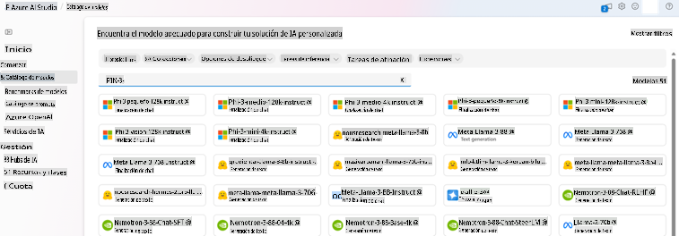

## Preparación para el ajuste fino

### Requisitos previos

> [!NOTE]
> Para los modelos de la familia Phi-3, la oferta de ajuste fino de pago por uso solo está disponible con hubs creados en las regiones de **East US 2**.

- Una suscripción de Azure. Si no tienes una suscripción de Azure, crea una [cuenta de Azure de pago](https://azure.microsoft.com/pricing/purchase-options/pay-as-you-go) para comenzar.

- Un [proyecto de AI Foundry](https://ai.azure.com?WT.mc_id=aiml-138114-kinfeylo).
- Los controles de acceso basados en roles de Azure (Azure RBAC) se utilizan para otorgar acceso a operaciones en Azure AI Foundry. Para realizar los pasos en este artículo, tu cuenta de usuario debe tener asignado el __rol de desarrollador de Azure AI__ en el grupo de recursos.

### Registro del proveedor de suscripción

Verifica que la suscripción esté registrada en el proveedor de recursos `Microsoft.Network`.

1. Inicia sesión en el [portal de Azure](https://portal.azure.com).
1. Selecciona **Suscripciones** en el menú de la izquierda.
1. Selecciona la suscripción que deseas usar.
1. Selecciona **Configuraciones del proyecto AI** > **Proveedores de recursos** en el menú de la izquierda.
1. Confirma que **Microsoft.Network** esté en la lista de proveedores de recursos. De lo contrario, añádelo.

### Preparación de datos

Prepara tus datos de entrenamiento y validación para ajustar tu modelo. Tus conjuntos de datos de entrenamiento y validación consisten en ejemplos de entrada y salida de cómo te gustaría que el modelo se desempeñara.

Asegúrate de que todos tus ejemplos de entrenamiento sigan el formato esperado para la inferencia. Para ajustar modelos de manera efectiva, asegúrate de tener un conjunto de datos equilibrado y diverso.

Esto implica mantener el equilibrio de los datos, incluir varios escenarios y refinar periódicamente los datos de entrenamiento para alinearlos con las expectativas del mundo real, lo que lleva a respuestas del modelo más precisas y equilibradas.

Diferentes tipos de modelos requieren un formato diferente de datos de entrenamiento.

### Chat Completion

Los datos de entrenamiento y validación que uses **deben** estar formateados como un documento JSON Lines (JSONL). Para `Phi-3-mini-128k-instruct` el conjunto de datos de ajuste fino debe estar formateado en el formato conversacional que utiliza la API de Chat completions.

### Formato de archivo de ejemplo

```json
    {"messages": [{"role": "system", "content": "You are an Xbox customer support agent whose primary goal is to help users with issues they are experiencing with their Xbox devices. You are friendly and concise. You only provide factual answers to queries, and do not provide answers that are not related to Xbox."}, {"role": "user", "content": "Is Xbox better than PlayStation?"}, {"role": "assistant", "content": "I apologize, but I cannot provide personal opinions. My primary job is to assist you with any issues related to your Xbox device. Do you have any Xbox-related issues that need addressing?"}]}
    {"messages": [{"role": "system", "content": "You are an Xbox customer support agent whose primary goal is to help users with issues they are experiencing with their Xbox devices. You are friendly and concise. You only provide factual answers to queries, and do not provide answers that are not related to Xbox."}, {"role": "user", "content": "Can I play PC games on my Xbox?"}, {"role": "assistant", "content": "While Xbox consoles don't natively support PC games, they can play an array of Xbox games, many of which are also available on PC. Can I assist you with finding games compatible with your Xbox device?"}]}
    {"messages": [{"role": "system", "content": "You are an Xbox customer support agent whose primary goal is to help users with issues they are experiencing with their Xbox devices. You are friendly and concise. You only provide factual answers to queries, and do not provide answers that are not related to Xbox."}, {"role": "user", "content": "I'm having trouble connecting my Xbox to the Wi-Fi."}, {"role": "assistant", "content": "No worries, let's go through the network settings on your Xbox. Can you please tell me what happens when you try to connect it to the Wi-Fi?"}]}
```

El tipo de archivo compatible es JSON Lines. Los archivos se suben al datastore predeterminado y están disponibles en tu proyecto.

## Ajuste fino de Phi-3 con Azure AI Foundry

Azure AI Foundry te permite personalizar modelos de lenguaje grandes a tus propios conjuntos de datos mediante un proceso conocido como ajuste fino. El ajuste fino proporciona un valor significativo al permitir la personalización y optimización para tareas y aplicaciones específicas. Conduce a un mejor rendimiento, eficiencia de costos, menor latencia y resultados personalizados.

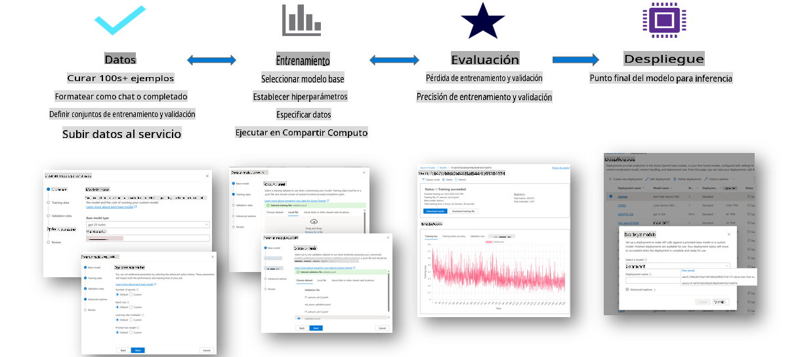

### Crear un nuevo proyecto

1. Inicia sesión en [Azure AI Foundry](https://ai.azure.com).

1. Selecciona **+Nuevo proyecto** para crear un nuevo proyecto en Azure AI Foundry.

    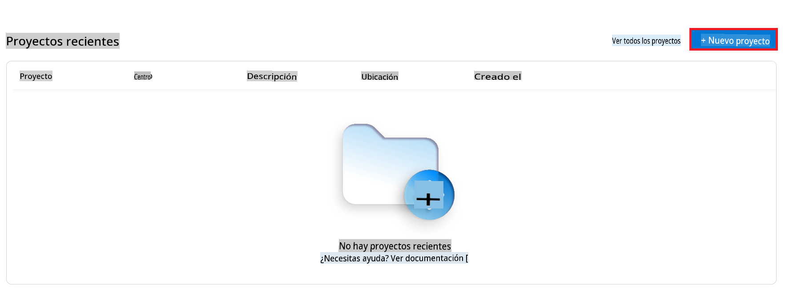

1. Realiza las siguientes tareas:

    - Nombre del **Hub del proyecto**. Debe ser un valor único.
    - Selecciona el **Hub** a utilizar (crea uno nuevo si es necesario).

    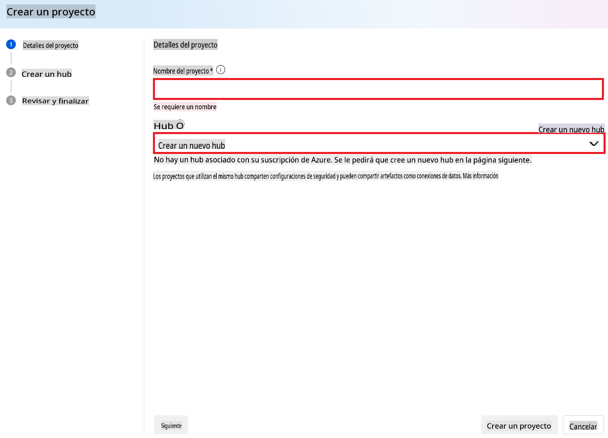

1. Realiza las siguientes tareas para crear un nuevo hub:

    - Introduce el **Nombre del hub**. Debe ser un valor único.
    - Selecciona tu **Suscripción de Azure**.
    - Selecciona el **Grupo de recursos** a utilizar (crea uno nuevo si es necesario).
    - Selecciona la **Ubicación** que deseas usar.
    - Selecciona **Conectar servicios de Azure AI** a utilizar (crea uno nuevo si es necesario).
    - Selecciona **Conectar Azure AI Search** para **Omitir conexión**.

    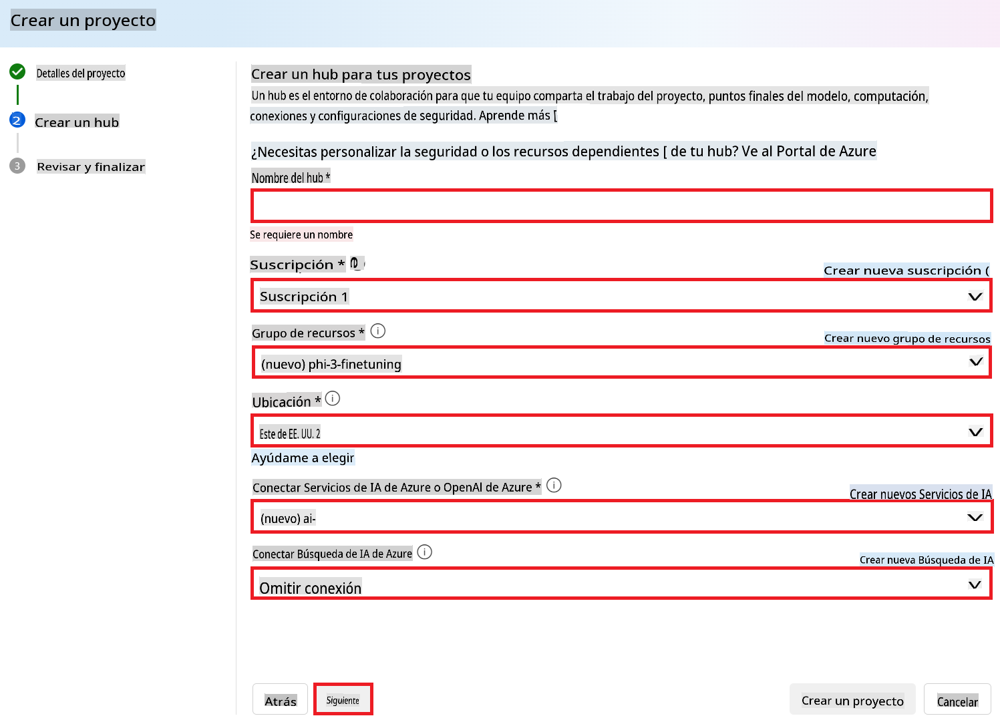

1. Selecciona **Siguiente**.
1. Selecciona **Crear un proyecto**.

### Preparación de datos

Antes del ajuste fino, reúne o crea un conjunto de datos relevante para tu tarea, como instrucciones de chat, pares de preguntas y respuestas, o cualquier otro dato textual pertinente. Limpia y preprocesa estos datos eliminando ruido, manejando valores faltantes y tokenizando el texto.

### Ajustar modelos Phi-3 en Azure AI Foundry

> [!NOTE]
> El ajuste fino de los modelos Phi-3 es compatible actualmente en proyectos ubicados en East US 2.

1. Selecciona **Catálogo de modelos** en la pestaña lateral izquierda.

1. Escribe *phi-3* en la **barra de búsqueda** y selecciona el modelo phi-3 que deseas usar.

    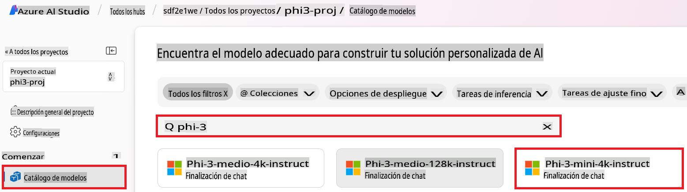

1. Selecciona **Ajuste fino**.

    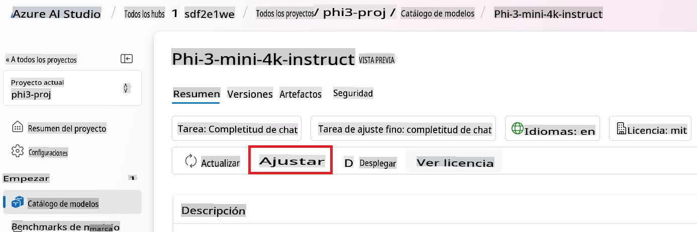

1. Introduce el **Nombre del modelo ajustado**.

    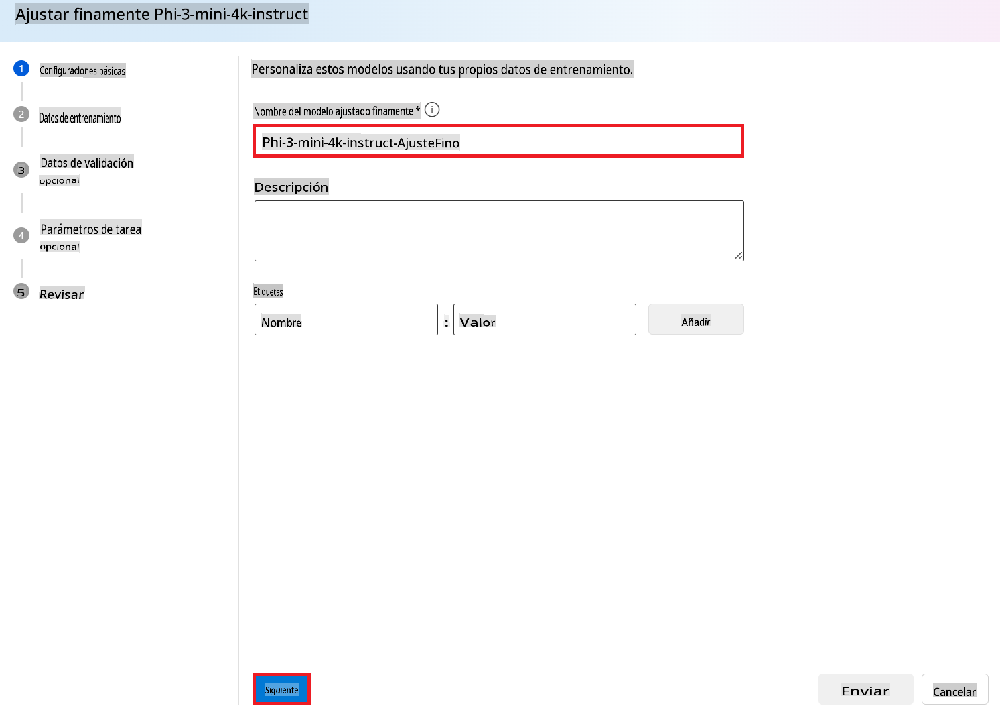

1. Selecciona **Siguiente**.

1. Realiza las siguientes tareas:

    - Selecciona el **tipo de tarea** como **Chat completion**.
    - Selecciona los **Datos de entrenamiento** que deseas usar. Puedes subirlos a través de los datos de Azure AI Foundry o desde tu entorno local.

    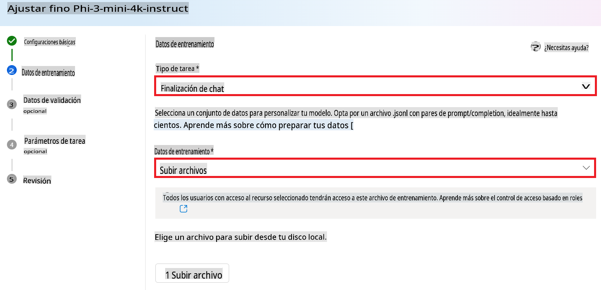

1. Selecciona **Siguiente**.

1. Sube los **Datos de validación** que deseas usar, o puedes seleccionar **División automática de datos de entrenamiento**.

    

1. Selecciona **Siguiente**.

1. Realiza las siguientes tareas:

    - Selecciona el **Multiplicador del tamaño del lote** que deseas usar.
    - Selecciona la **Tasa de aprendizaje** que deseas usar.
    - Selecciona las **Épocas** que deseas usar.

    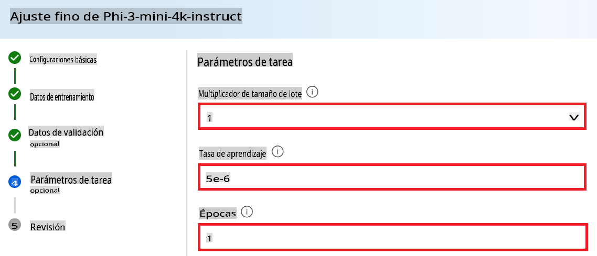

1. Selecciona **Enviar** para iniciar el proceso de ajuste fino.

    

1. Una vez que tu modelo esté ajustado, el estado se mostrará como **Completado**, como se muestra en la imagen a continuación. Ahora puedes desplegar el modelo y usarlo en tu propia aplicación, en el playground o en el flujo de prompt. Para más información, consulta [Cómo desplegar la familia de modelos de lenguaje pequeños Phi-3 con Azure AI Foundry](https://learn.microsoft.com/azure/ai-studio/how-to/deploy-models-phi-3?tabs=phi-3-5&pivots=programming-language-python).

    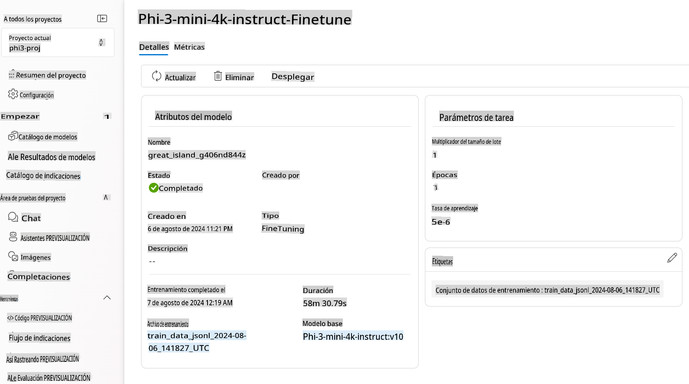

> [!NOTE]
> Para obtener información más detallada sobre el ajuste fino de Phi-3, visita [Ajuste fino de modelos Phi-3 en Azure AI Foundry](https://learn.microsoft.com/azure/ai-studio/how-to/fine-tune-phi-3?tabs=phi-3-mini).

## Limpieza de tus modelos ajustados

Puedes eliminar un modelo ajustado de la lista de modelos de ajuste fino en [Azure AI Foundry](https://ai.azure.com) o desde la página de detalles del modelo. Selecciona el modelo ajustado que deseas eliminar de la página de ajuste fino y luego selecciona el botón Eliminar para eliminar el modelo ajustado.

> [!NOTE]
> No puedes eliminar un modelo personalizado si tiene un despliegue existente. Primero debes eliminar el despliegue de tu modelo antes de poder eliminar tu modelo personalizado.

## Costos y cuotas

### Consideraciones de costos y cuotas para modelos Phi-3 ajustados como servicio

Los modelos Phi ajustados como servicio son ofrecidos por Microsoft e integrados con Azure AI Foundry para su uso. Puedes encontrar los precios al [desplegar](https://learn.microsoft.com/azure/ai-studio/how-to/deploy-models-phi-3?tabs=phi-3-5&pivots=programming-language-python) o ajustar los modelos en la pestaña de Precios y términos en el asistente de despliegue.

## Filtrado de contenido

Los modelos desplegados como servicio con pago por uso están protegidos por Azure AI Content Safety. Cuando se despliegan en puntos finales en tiempo real, puedes optar por no utilizar esta capacidad. Con Azure AI content safety habilitado, tanto el prompt como la completación pasan por un conjunto de modelos de clasificación destinados a detectar y prevenir la salida de contenido dañino. El sistema de filtrado de contenido detecta y toma medidas sobre categorías específicas de contenido potencialmente dañino tanto en los prompts de entrada como en las completaciones de salida. Aprende más sobre [Azure AI Content Safety](https://learn.microsoft.com/azure/ai-studio/concepts/content-filtering).

**Configuración de ajuste fino**

Hiperparámetros: Define hiperparámetros como la tasa de aprendizaje, el tamaño del lote y el número de épocas de entrenamiento.

**Función de pérdida**

Elige una función de pérdida apropiada para tu tarea (por ejemplo, entropía cruzada).

**Optimizador**

Selecciona un optimizador (por ejemplo, Adam) para las actualizaciones de gradiente durante el entrenamiento.

**Proceso de ajuste fino**

- Cargar modelo preentrenado: Carga el punto de control de Phi-3 Mini.
- Añadir capas personalizadas: Añade capas específicas de la tarea (por ejemplo, una cabeza de clasificación para instrucciones de chat).

**Entrenar el modelo**
Ajusta el modelo utilizando tu conjunto de datos preparado. Monitorea el progreso del entrenamiento y ajusta los hiperparámetros según sea necesario.

**Evaluación y validación**

Conjunto de validación: Divide tus datos en conjuntos de entrenamiento y validación.

**Evaluar rendimiento**

Utiliza métricas como precisión, F1-score o perplejidad para evaluar el rendimiento del modelo.

## Guardar modelo ajustado

**Punto de control**
Guarda el punto de control del modelo ajustado para uso futuro.

## Despliegue

- Desplegar como un servicio web: Despliega tu modelo ajustado como un servicio web en Azure AI Foundry.
- Probar el punto final: Envía consultas de prueba al punto final desplegado para verificar su funcionalidad.

## Iterar y mejorar

Iterar: Si el rendimiento no es satisfactorio, itera ajustando los hiperparámetros, añadiendo más datos o ajustando durante más épocas.

## Monitorear y refinar

Monitorea continuamente el comportamiento del modelo y refina según sea necesario.

## Personalizar y extender

Tareas personalizadas: Phi-3 Mini puede ajustarse para varias tareas más allá de las instrucciones de chat. ¡Explora otros casos de uso!
Experimentar: Prueba diferentes arquitecturas, combinaciones de capas y técnicas para mejorar el rendimiento.

> [!NOTE]
> El ajuste fino es un proceso iterativo. ¡Experimenta, aprende y adapta tu modelo para lograr los mejores resultados para tu tarea específica!

**Descargo de responsabilidad**:
Este documento ha sido traducido utilizando servicios de traducción automática basados en IA. Aunque nos esforzamos por lograr precisión, tenga en cuenta que las traducciones automatizadas pueden contener errores o imprecisiones. El documento original en su idioma nativo debe considerarse la fuente autorizada. Para información crítica, se recomienda una traducción humana profesional. No somos responsables de ningún malentendido o interpretación errónea que surja del uso de esta traducción.