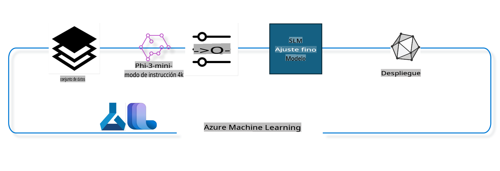

## Cómo usar componentes de chat-completion del registro del sistema Azure ML para ajustar un modelo

En este ejemplo, realizaremos el ajuste fino del modelo Phi-3-mini-4k-instruct para completar una conversación entre 2 personas utilizando el conjunto de datos ultrachat_200k.



El ejemplo te mostrará cómo realizar el ajuste fino utilizando el SDK de Azure ML y Python, y luego desplegar el modelo ajustado a un endpoint en línea para inferencia en tiempo real.

### Datos de entrenamiento
Usaremos el conjunto de datos ultrachat_200k. Esta es una versión fuertemente filtrada del conjunto de datos UltraChat y se utilizó para entrenar Zephyr-7B-β, un modelo de chat de última generación con 7 mil millones de parámetros.

### Modelo
Usaremos el modelo Phi-3-mini-4k-instruct para mostrar cómo el usuario puede ajustar un modelo para la tarea de chat-completion. Si abriste este notebook desde una tarjeta de modelo específica, recuerda reemplazar el nombre del modelo específico.

### Tareas 
- Elegir un modelo para ajustar.
- Elegir y explorar los datos de entrenamiento.
- Configurar el trabajo de ajuste fino.
- Ejecutar el trabajo de ajuste fino.
- Revisar las métricas de entrenamiento y evaluación.
- Registrar el modelo ajustado.
- Desplegar el modelo ajustado para inferencia en tiempo real.
- Limpiar los recursos.

## 1. Configuración de pre-requisitos
- Instalar dependencias
- Conectarse al Workspace de AzureML. Aprende más en configurar la autenticación del SDK. Reemplaza <WORKSPACE_NAME>, <RESOURCE_GROUP> y <SUBSCRIPTION_ID> a continuación.
- Conectarse al registro del sistema de azureml
- Establecer un nombre de experimento opcional
- Verificar o crear el cómputo.

Requisitos: un solo nodo GPU puede tener múltiples tarjetas GPU. Por ejemplo, en un nodo de Standard_NC24rs_v3 hay 4 GPUs NVIDIA V100, mientras que en Standard_NC12s_v3, hay 2 GPUs NVIDIA V100. Consulta la documentación para esta información. El número de tarjetas GPU por nodo se establece en el parámetro gpus_per_node a continuación. Establecer este valor correctamente garantizará la utilización de todas las GPUs en el nodo. Las SKU de cómputo GPU recomendadas se pueden encontrar aquí y aquí.

### Bibliotecas de Python

Instala las dependencias ejecutando la celda a continuación. Este no es un paso opcional si se ejecuta en un nuevo entorno.

```
pip install azure-ai-ml
pip install azure-identity
pip install datasets==2.9.0
pip install mlflow
pip install azureml-mlflow
```
### Interactuando con Azure ML 

Este script de Python se utiliza para interactuar con el servicio de Azure Machine Learning (Azure ML). Aquí hay un desglose de lo que hace:

Importa los módulos necesarios de los paquetes azure.ai.ml, azure.identity y azure.ai.ml.entities. También importa el módulo time.

Intenta autenticar usando DefaultAzureCredential(), lo que proporciona una experiencia de autenticación simplificada para comenzar rápidamente a desarrollar aplicaciones en la nube de Azure. Si esto falla, utiliza InteractiveBrowserCredential(), que proporciona un aviso de inicio de sesión interactivo.

Luego intenta crear una instancia de MLClient usando el método from_config, que lee la configuración del archivo de configuración predeterminado (config.json). Si esto falla, crea una instancia de MLClient proporcionando manualmente el subscription_id, resource_group_name y workspace_name.

Crea otra instancia de MLClient, esta vez para el registro de Azure ML llamado "azureml". Este registro es donde se almacenan los modelos, pipelines de ajuste fino y entornos.

Establece el experiment_name en "chat_completion_Phi-3-mini-4k-instruct".

Genera una marca de tiempo única convirtiendo el tiempo actual (en segundos desde la época, como un número de punto flotante) a un entero y luego a una cadena. Esta marca de tiempo se puede usar para crear nombres y versiones únicos.

```
# Importar los módulos necesarios de Azure ML y Azure Identity
from azure.ai.ml import MLClient
from azure.identity import (
    DefaultAzureCredential,
    InteractiveBrowserCredential,
)
from azure.ai.ml.entities import AmlCompute
import time  # Importar el módulo time

# Intentar autenticar usando DefaultAzureCredential
try:
    credential = DefaultAzureCredential()
    credential.get_token("https://management.azure.com/.default")
except Exception as ex:  # Si DefaultAzureCredential falla, usar InteractiveBrowserCredential
    credential = InteractiveBrowserCredential()

# Intentar crear una instancia de MLClient usando el archivo de configuración predeterminado
try:
    workspace_ml_client = MLClient.from_config(credential=credential)
except:  # Si eso falla, crear una instancia de MLClient proporcionando manualmente los detalles
    workspace_ml_client = MLClient(
        credential,
        subscription_id="<SUBSCRIPTION_ID>",
        resource_group_name="<RESOURCE_GROUP>",
        workspace_name="<WORKSPACE_NAME>",
    )

# Crear otra instancia de MLClient para el registro de Azure ML llamado "azureml"
# Este registro es donde se almacenan los modelos, pipelines de ajuste fino y entornos
registry_ml_client = MLClient(credential, registry_name="azureml")

# Establecer el nombre del experimento
experiment_name = "chat_completion_Phi-3-mini-4k-instruct"

# Generar una marca de tiempo única que se puede usar para nombres y versiones que necesitan ser únicos
timestamp = str(int(time.time()))
```
## 2. Elegir un modelo base para ajustar
Phi-3-mini-4k-instruct es un modelo abierto de última generación con 3.8 mil millones de parámetros, ligero, construido sobre conjuntos de datos utilizados para Phi-2. El modelo pertenece a la familia de modelos Phi-3, y la versión Mini viene en dos variantes: 4K y 128K, que es la longitud del contexto (en tokens) que puede soportar. Necesitamos ajustar el modelo para nuestro propósito específico para poder usarlo. Puedes explorar estos modelos en el Catálogo de Modelos en AzureML Studio, filtrando por la tarea de chat-completion. En este ejemplo, usamos el modelo Phi-3-mini-4k-instruct. Si has abierto este notebook para un modelo diferente, reemplaza el nombre y la versión del modelo en consecuencia.

Nota la propiedad model id del modelo. Esto se pasará como entrada al trabajo de ajuste fino. Esto también está disponible como el campo Asset ID en la página de detalles del modelo en el Catálogo de Modelos de AzureML Studio.

Este script de Python está interactuando con el servicio de Azure Machine Learning (Azure ML). Aquí hay un desglose de lo que hace:

Establece el model_name en "Phi-3-mini-4k-instruct".

Utiliza el método get de la propiedad models del objeto registry_ml_client para recuperar la última versión del modelo con el nombre especificado del registro de Azure ML. El método get se llama con dos argumentos: el nombre del modelo y una etiqueta que especifica que se debe recuperar la última versión del modelo.

Imprime un mensaje en la consola indicando el nombre, versión e id del modelo que se usará para el ajuste fino. El método format de la cadena se utiliza para insertar el nombre, versión e id del modelo en el mensaje. El nombre, versión e id del modelo se acceden como propiedades del objeto foundation_model.

```
# Establecer el nombre del modelo
model_name = "Phi-3-mini-4k-instruct"

# Obtener la última versión del modelo del registro de Azure ML
foundation_model = registry_ml_client.models.get(model_name, label="latest")

# Imprimir el nombre del modelo, versión e id
# Esta información es útil para el seguimiento y la depuración
print(
    "\n\nUsando el nombre del modelo: {0}, versión: {1}, id: {2} para el ajuste fino".format(
        foundation_model.name, foundation_model.version, foundation_model.id
    )
)
```
## 3. Crear un cómputo para usar con el trabajo
El trabajo de ajuste fino funciona SOLO con cómputo GPU. El tamaño del cómputo depende de lo grande que sea el modelo y en la mayoría de los casos se vuelve complicado identificar el cómputo adecuado para el trabajo. En esta celda, guiamos al usuario para seleccionar el cómputo adecuado para el trabajo.

**NOTA1** Los cómputos listados a continuación funcionan con la configuración más optimizada. Cualquier cambio en la configuración podría llevar a un error de Cuda Out Of Memory. En tales casos, intenta actualizar el cómputo a un tamaño de cómputo mayor.

**NOTA2** Al seleccionar el compute_cluster_size a continuación, asegúrate de que el cómputo esté disponible en tu grupo de recursos. Si un cómputo en particular no está disponible, puedes hacer una solicitud para obtener acceso a los recursos de cómputo.

### Verificando el Modelo para Soporte de Ajuste Fino
Este script de Python está interactuando con un modelo de Azure Machine Learning (Azure ML). Aquí hay un desglose de lo que hace:

Importa el módulo ast, que proporciona funciones para procesar árboles de la gramática de sintaxis abstracta de Python.

Verifica si el objeto foundation_model (que representa un modelo en Azure ML) tiene una etiqueta llamada finetune_compute_allow_list. Las etiquetas en Azure ML son pares clave-valor que puedes crear y usar para filtrar y ordenar modelos.

Si la etiqueta finetune_compute_allow_list está presente, utiliza la función ast.literal_eval para analizar de manera segura el valor de la etiqueta (una cadena) en una lista de Python. Esta lista se asigna luego a la variable computes_allow_list. Luego imprime un mensaje indicando que se debe crear un cómputo a partir de la lista.

Si la etiqueta finetune_compute_allow_list no está presente, establece computes_allow_list en None y imprime un mensaje indicando que la etiqueta finetune_compute_allow_list no es parte de las etiquetas del modelo.

En resumen, este script está verificando una etiqueta específica en los metadatos del modelo, convirtiendo el valor de la etiqueta en una lista si existe y proporcionando retroalimentación al usuario en consecuencia.

```
# Importar el módulo ast, que proporciona funciones para procesar árboles de la gramática de sintaxis abstracta de Python
import ast

# Verificar si la etiqueta 'finetune_compute_allow_list' está presente en las etiquetas del modelo
if "finetune_compute_allow_list" in foundation_model.tags:
    # Si la etiqueta está presente, usar ast.literal_eval para analizar de manera segura el valor de la etiqueta (una cadena) en una lista de Python
    computes_allow_list = ast.literal_eval(
        foundation_model.tags["finetune_compute_allow_list"]
    )  # convertir cadena a lista de Python
    # Imprimir un mensaje indicando que se debe crear un cómputo a partir de la lista
    print(f"Por favor crea un cómputo de la lista anterior - {computes_allow_list}")
else:
    # Si la etiqueta no está presente, establecer computes_allow_list en None
    computes_allow_list = None
    # Imprimir un mensaje indicando que la etiqueta 'finetune_compute_allow_list' no es parte de las etiquetas del modelo
    print("`finetune_compute_allow_list` no es parte de las etiquetas del modelo")
```
### Verificando la Instancia de Cómputo

Este script de Python está interactuando con el servicio de Azure Machine Learning (Azure ML) y realizando varias verificaciones en una instancia de cómputo. Aquí hay un desglose de lo que hace:

Intenta recuperar la instancia de cómputo con el nombre almacenado en compute_cluster desde el workspace de Azure ML. Si el estado de aprovisionamiento de la instancia de cómputo es "failed", lanza un ValueError.

Verifica si computes_allow_list no es None. Si no lo es, convierte todos los tamaños de cómputo en la lista a minúsculas y verifica si el tamaño de la instancia de cómputo actual está en la lista. Si no lo está, lanza un ValueError.

Si computes_allow_list es None, verifica si el tamaño de la instancia de cómputo está en una lista de tamaños de VM GPU no compatibles. Si lo está, lanza un ValueError.

Recupera una lista de todos los tamaños de cómputo disponibles en el workspace. Luego itera sobre esta lista y, para cada tamaño de cómputo, verifica si su nombre coincide con el tamaño de la instancia de cómputo actual. Si lo hace, recupera el número de GPUs para ese tamaño de cómputo y establece gpu_count_found en True.

Si gpu_count_found es True, imprime el número de GPUs en la instancia de cómputo. Si gpu_count_found es False, lanza un ValueError.

En resumen, este script está realizando varias verificaciones en una instancia de cómputo en un workspace de Azure ML, incluyendo verificar su estado de aprovisionamiento, su tamaño contra una lista de permitidos o una lista de denegados, y el número de GPUs que tiene.

```
# Imprimir el mensaje de excepción
print(e)
# Lanzar un ValueError si el tamaño del cómputo no está disponible en el workspace
raise ValueError(
    f"¡ADVERTENCIA! El tamaño del cómputo {compute_cluster_size} no está disponible en el workspace"
)

# Recuperar la instancia de cómputo del workspace de Azure ML
compute = workspace_ml_client.compute.get(compute_cluster)
# Verificar si el estado de aprovisionamiento de la instancia de cómputo es "failed"
if compute.provisioning_state.lower() == "failed":
    # Lanzar un ValueError si el estado de aprovisionamiento es "failed"
    raise ValueError(
        f"El aprovisionamiento falló, el cómputo '{compute_cluster}' está en estado fallido. "
        f"por favor intenta crear un cómputo diferente"
    )

# Verificar si computes_allow_list no es None
if computes_allow_list is not None:
    # Convertir todos los tamaños de cómputo en computes_allow_list a minúsculas
    computes_allow_list_lower_case = [x.lower() for x in computes_allow_list]
    # Verificar si el tamaño de la instancia de cómputo está en computes_allow_list_lower_case
    if compute.size.lower() not in computes_allow_list_lower_case:
        # Lanzar un ValueError si el tamaño de la instancia de cómputo no está en computes_allow_list_lower_case
        raise ValueError(
            f"El tamaño de VM {compute.size} no está en la lista de cómputos permitidos para el ajuste fino"
        )
else:
    # Definir una lista de tamaños de VM GPU no compatibles
    unsupported_gpu_vm_list = [
        "standard_nc6",
        "standard_nc12",
        "standard_nc24",
        "standard_nc24r",
    ]
    # Verificar si el tamaño de la instancia de cómputo está en unsupported_gpu_vm_list
    if compute.size.lower() in unsupported_gpu_vm_list:
        # Lanzar un ValueError si el tamaño de la instancia de cómputo está en unsupported_gpu_vm_list
        raise ValueError(
            f"El tamaño de VM {compute.size} actualmente no es compatible para el ajuste fino"
        )

# Inicializar una bandera para verificar si se ha encontrado el número de GPUs en la instancia de cómputo
gpu_count_found = False
# Recuperar una lista de todos los tamaños de cómputo disponibles en el workspace
workspace_compute_sku_list = workspace_ml_client.compute.list_sizes()
available_sku_sizes = []
# Iterar sobre la lista de tamaños de cómputo disponibles
for compute_sku in workspace_compute_sku_list:
    available_sku_sizes.append(compute_sku.name)
    # Verificar si el nombre del tamaño de cómputo coincide con el tamaño de la instancia de cómputo
    if compute_sku.name.lower() == compute.size.lower():
        # Si es así, recuperar el número de GPUs para ese tamaño de cómputo y establecer gpu_count_found en True
        gpus_per_node = compute_sku.gpus
        gpu_count_found = True
# Si gpu_count_found es True, imprimir el número de GPUs en la instancia de cómputo
if gpu_count_found:
    print(f"Número de GPUs en el cómputo {compute.size}: {gpus_per_node}")
else:
    # Si gpu_count_found es False, lanzar un ValueError
    raise ValueError(
        f"No se encontró el número de GPUs en el cómputo {compute.size}. Las SKU disponibles son: {available_sku_sizes}."
        f"Esto no debería suceder. Por favor, verifica el clúster de cómputo seleccionado: {compute_cluster} e intenta nuevamente."
    )
```

## 4. Elegir el conjunto de datos para ajustar el modelo

Usamos el conjunto de datos ultrachat_200k. El conjunto de datos tiene cuatro divisiones, adecuadas para:

Ajuste fino supervisado (sft).
Ranking de generación (gen). El número de ejemplos por división se muestra a continuación:
train_sft	test_sft	train_gen	test_gen
207865	23110	256032	28304
Las próximas celdas muestran la preparación básica de datos para el ajuste fino:

Visualizar algunas filas de datos
Queremos que esta muestra se ejecute rápidamente, así que guardamos los archivos train_sft, test_sft que contienen el 5% de las filas ya recortadas. Esto significa que el modelo ajustado tendrá una precisión menor, por lo tanto, no debe ser utilizado en el mundo real.
El script download-dataset.py se usa para descargar el conjunto de datos ultrachat_200k y transformar el conjunto de datos en un formato consumible por el componente de pipeline de ajuste fino. Además, como el conjunto de datos es grande, aquí solo tenemos parte del conjunto de datos.

Ejecutar el script a continuación solo descarga el 5% de los datos. Esto se puede aumentar cambiando el parámetro dataset_split_pc al porcentaje deseado.

**Nota:** Algunos modelos de lenguaje tienen diferentes códigos de lenguaje y, por lo tanto, los nombres de las columnas en el conjunto de datos deben reflejar lo mismo.

Aquí hay un ejemplo de cómo deberían verse los datos
El conjunto de datos de chat-completion se almacena en formato parquet con cada entrada utilizando el siguiente esquema:

Este es un documento JSON (JavaScript Object Notation), que es un formato popular de intercambio de datos. No es código ejecutable, sino una forma de almacenar y transportar datos. Aquí hay un desglose de su estructura:

"prompt": Esta clave contiene un valor de cadena que representa una tarea o pregunta planteada a un asistente de IA.

"messages": Esta clave contiene una matriz de objetos. Cada objeto representa un mensaje en una conversación entre un usuario y un asistente de IA. Cada objeto de mensaje tiene dos claves:

"content": Esta clave contiene un valor de cadena que representa el contenido del mensaje
Importa el módulo os, que proporciona una forma portátil de usar la funcionalidad dependiente del sistema operativo. Utiliza la función os.system para ejecutar el script download-dataset.py en la terminal con argumentos específicos de línea de comandos. Los argumentos especifican el conjunto de datos a descargar (HuggingFaceH4/ultrachat_200k), el directorio donde descargarlo (ultrachat_200k_dataset) y el porcentaje del conjunto de datos a dividir (5). La función os.system devuelve el estado de salida del comando que ejecutó; este estado se almacena en la variable exit_status. Verifica si exit_status no es 0. En sistemas operativos similares a Unix, un estado de salida de 0 generalmente indica que un comando ha tenido éxito, mientras que cualquier otro número indica un error. Si exit_status no es 0, lanza una excepción con un mensaje que indica que hubo un error al descargar el conjunto de datos. En resumen, este script ejecuta un comando para descargar un conjunto de datos usando un script auxiliar, y lanza una excepción si el comando falla.
```
# Importa el módulo os, que proporciona una forma de usar la funcionalidad dependiente del sistema operativo
import os

# Usa la función os.system para ejecutar el script download-dataset.py en la terminal con argumentos específicos de línea de comandos
# Los argumentos especifican el conjunto de datos a descargar (HuggingFaceH4/ultrachat_200k), el directorio donde descargarlo (ultrachat_200k_dataset) y el porcentaje del conjunto de datos a dividir (5)
# La función os.system devuelve el estado de salida del comando que ejecutó; este estado se almacena en la variable exit_status
exit_status = os.system(
    "python ./download-dataset.py --dataset HuggingFaceH4/ultrachat_200k --download_dir ultrachat_200k_dataset --dataset_split_pc 5"
)

# Verifica si exit_status no es 0
# En sistemas operativos similares a Unix, un estado de salida de 0 generalmente indica que un comando ha tenido éxito, mientras que cualquier otro número indica un error
# Si exit_status no es 0, lanza una excepción con un mensaje que indica que hubo un error al descargar el conjunto de datos
if exit_status != 0:
    raise Exception("Error downloading dataset")
```

### Cargar Datos en un DataFrame
Este script de Python carga un archivo JSON Lines en un DataFrame de pandas y muestra las primeras 5 filas. Aquí tienes un desglose de lo que hace:

Importa la biblioteca pandas, que es una poderosa biblioteca de manipulación y análisis de datos.

Establece el ancho máximo de columna para las opciones de visualización de pandas a 0. Esto significa que el texto completo de cada columna se mostrará sin truncar cuando se imprima el DataFrame.

Utiliza la función pd.read_json para cargar el archivo train_sft.jsonl desde el directorio ultrachat_200k_dataset en un DataFrame. El argumento lines=True indica que el archivo está en formato JSON Lines, donde cada línea es un objeto JSON separado.

Utiliza el método head para mostrar las primeras 5 filas del DataFrame. Si el DataFrame tiene menos de 5 filas, mostrará todas.

En resumen, este script carga un archivo JSON Lines en un DataFrame y muestra las primeras 5 filas con el texto completo de las columnas.

```
# Importa la biblioteca pandas, que es una poderosa biblioteca de manipulación y análisis de datos
import pandas as pd

# Establece el ancho máximo de columna para las opciones de visualización de pandas a 0
# Esto significa que el texto completo de cada columna se mostrará sin truncar cuando se imprima el DataFrame
pd.set_option("display.max_colwidth", 0)

# Usa la función pd.read_json para cargar el archivo train_sft.jsonl desde el directorio ultrachat_200k_dataset en un DataFrame
# El argumento lines=True indica que el archivo está en formato JSON Lines, donde cada línea es un objeto JSON separado
df = pd.read_json("./ultrachat_200k_dataset/train_sft.jsonl", lines=True)

# Usa el método head para mostrar las primeras 5 filas del DataFrame
# Si el DataFrame tiene menos de 5 filas, mostrará todas
df.head()
```

## 5. Enviar el trabajo de ajuste fino usando el modelo y los datos como entradas
Crea el trabajo que utiliza el componente de pipeline de chat-completion. Aprende más sobre todos los parámetros compatibles para el ajuste fino.

### Definir parámetros de ajuste fino

Los parámetros de ajuste fino se pueden agrupar en 2 categorías: parámetros de entrenamiento, parámetros de optimización.

Los parámetros de entrenamiento definen aspectos del entrenamiento como:

- El optimizador, scheduler a usar
- La métrica para optimizar el ajuste fino
- Número de pasos de entrenamiento y el tamaño del lote, etc.
- Los parámetros de optimización ayudan a optimizar la memoria GPU y usar eficazmente los recursos de cómputo.

A continuación se presentan algunos de los parámetros que pertenecen a esta categoría. Los parámetros de optimización difieren para cada modelo y se empaquetan con el modelo para manejar estas variaciones.

- Habilitar deepspeed y LoRA
- Habilitar entrenamiento de precisión mixta
- Habilitar entrenamiento multi-nodo

**Nota:** El ajuste fino supervisado puede resultar en la pérdida de alineación o en un olvido catastrófico. Recomendamos verificar este problema y ejecutar una etapa de alineación después de realizar el ajuste fino.

### Parámetros de Ajuste Fino

Este script de Python está configurando parámetros para el ajuste fino de un modelo de aprendizaje automático. Aquí tienes un desglose de lo que hace:

Configura parámetros de entrenamiento predeterminados como el número de épocas de entrenamiento, tamaños de lote para entrenamiento y evaluación, tasa de aprendizaje y tipo de scheduler de la tasa de aprendizaje.

Configura parámetros de optimización predeterminados como si se debe aplicar la Propagación de Relevancia por Capas (LoRa) y DeepSpeed, y la etapa de DeepSpeed.

Combina los parámetros de entrenamiento y optimización en un único diccionario llamado finetune_parameters.

Verifica si el foundation_model tiene algún parámetro predeterminado específico del modelo. Si es así, imprime un mensaje de advertencia y actualiza el diccionario finetune_parameters con estos valores predeterminados específicos del modelo. La función ast.literal_eval se utiliza para convertir los valores predeterminados específicos del modelo de una cadena a un diccionario de Python.

Imprime el conjunto final de parámetros de ajuste fino que se utilizarán para la ejecución.

En resumen, este script configura y muestra los parámetros para el ajuste fino de un modelo de aprendizaje automático, con la capacidad de sobrescribir los parámetros predeterminados con los específicos del modelo.

```
# Configura parámetros de entrenamiento predeterminados como el número de épocas de entrenamiento, tamaños de lote para entrenamiento y evaluación, tasa de aprendizaje y tipo de scheduler de la tasa de aprendizaje
training_parameters = dict(
    num_train_epochs=3,
    per_device_train_batch_size=1,
    per_device_eval_batch_size=1,
    learning_rate=5e-6,
    lr_scheduler_type="cosine",
)

# Configura parámetros de optimización predeterminados como si se debe aplicar la Propagación de Relevancia por Capas (LoRa) y DeepSpeed, y la etapa de DeepSpeed
optimization_parameters = dict(
    apply_lora="true",
    apply_deepspeed="true",
    deepspeed_stage=2,
)

# Combina los parámetros de entrenamiento y optimización en un único diccionario llamado finetune_parameters
finetune_parameters = {**training_parameters, **optimization_parameters}

# Verifica si el foundation_model tiene algún parámetro predeterminado específico del modelo
# Si es así, imprime un mensaje de advertencia y actualiza el diccionario finetune_parameters con estos valores predeterminados específicos del modelo
# La función ast.literal_eval se utiliza para convertir los valores predeterminados específicos del modelo de una cadena a un diccionario de Python
if "model_specific_defaults" in foundation_model.tags:
    print("Warning! Model specific defaults exist. The defaults could be overridden.")
    finetune_parameters.update(
        ast.literal_eval(  # convierte la cadena a un diccionario de Python
            foundation_model.tags["model_specific_defaults"]
        )
    )

# Imprime el conjunto final de parámetros de ajuste fino que se utilizarán para la ejecución
print(
    f"The following finetune parameters are going to be set for the run: {finetune_parameters}"
)
```

### Pipeline de Entrenamiento
Este script de Python define una función para generar un nombre de visualización para un pipeline de entrenamiento de aprendizaje automático, y luego llama a esta función para generar e imprimir el nombre de visualización. Aquí tienes un desglose de lo que hace:

Se define la función get_pipeline_display_name. Esta función genera un nombre de visualización basado en varios parámetros relacionados con el pipeline de entrenamiento.

Dentro de la función, calcula el tamaño total del lote multiplicando el tamaño del lote por dispositivo, el número de pasos de acumulación de gradientes, el número de GPUs por nodo y el número de nodos utilizados para el ajuste fino.

Recupera varios otros parámetros como el tipo de scheduler de la tasa de aprendizaje, si se aplica DeepSpeed, la etapa de DeepSpeed, si se aplica la Propagación de Relevancia por Capas (LoRa), el límite en el número de checkpoints del modelo a mantener y la longitud máxima de la secuencia.

Construye una cadena que incluye todos estos parámetros, separados por guiones. Si se aplica DeepSpeed o LoRa, la cadena incluye "ds" seguido de la etapa de DeepSpeed, o "lora", respectivamente. Si no, incluye "nods" o "nolora", respectivamente.

La función devuelve esta cadena, que sirve como nombre de visualización para el pipeline de entrenamiento.

Después de definir la función, se llama para generar el nombre de visualización, que luego se imprime.

En resumen, este script genera un nombre de visualización para un pipeline de entrenamiento de aprendizaje automático basado en varios parámetros, y luego imprime este nombre de visualización.

```
# Define una función para generar un nombre de visualización para el pipeline de entrenamiento
def get_pipeline_display_name():
    # Calcula el tamaño total del lote multiplicando el tamaño del lote por dispositivo, el número de pasos de acumulación de gradientes, el número de GPUs por nodo y el número de nodos utilizados para el ajuste fino
    batch_size = (
        int(finetune_parameters.get("per_device_train_batch_size", 1))
        * int(finetune_parameters.get("gradient_accumulation_steps", 1))
        * int(gpus_per_node)
        * int(finetune_parameters.get("num_nodes_finetune", 1))
    )
    # Recupera el tipo de scheduler de la tasa de aprendizaje
    scheduler = finetune_parameters.get("lr_scheduler_type", "linear")
    # Recupera si se aplica DeepSpeed
    deepspeed = finetune_parameters.get("apply_deepspeed", "false")
    # Recupera la etapa de DeepSpeed
    ds_stage = finetune_parameters.get("deepspeed_stage", "2")
    # Si se aplica DeepSpeed, incluye "ds" seguido de la etapa de DeepSpeed en el nombre de visualización; si no, incluye "nods"
    if deepspeed == "true":
        ds_string = f"ds{ds_stage}"
    else:
        ds_string = "nods"
    # Recupera si se aplica la Propagación de Relevancia por Capas (LoRa)
    lora = finetune_parameters.get("apply_lora", "false")
    # Si se aplica LoRa, incluye "lora" en el nombre de visualización; si no, incluye "nolora"
    if lora == "true":
        lora_string = "lora"
    else:
        lora_string = "nolora"
    # Recupera el límite en el número de checkpoints del modelo a mantener
    save_limit = finetune_parameters.get("save_total_limit", -1)
    # Recupera la longitud máxima de la secuencia
    seq_len = finetune_parameters.get("max_seq_length", -1)
    # Construye el nombre de visualización concatenando todos estos parámetros, separados por guiones
    return (
        model_name
        + "-"
        + "ultrachat"
        + "-"
        + f"bs{batch_size}"
        + "-"
        + f"{scheduler}"
        + "-"
        + ds_string
        + "-"
        + lora_string
        + f"-save_limit{save_limit}"
        + f"-seqlen{seq_len}"
    )

# Llama a la función para generar el nombre de visualización
pipeline_display_name = get_pipeline_display_name()
# Imprime el nombre de visualización
print(f"Display name used for the run: {pipeline_display_name}")
```

### Configuración del Pipeline

Este script de Python define y configura un pipeline de aprendizaje automático usando el SDK de Azure Machine Learning. Aquí tienes un desglose de lo que hace:

1. Importa los módulos necesarios del SDK de Azure AI ML.

2. Obtiene un componente de pipeline llamado "chat_completion_pipeline" del registro.

3. Define un trabajo de pipeline usando el decorador `@pipeline` y la función `create_pipeline`. El nombre del pipeline se establece en `pipeline_display_name`.

4. Dentro de la función `create_pipeline`, inicializa el componente de pipeline obtenido con varios parámetros, incluyendo la ruta del modelo, clústeres de cómputo para diferentes etapas, divisiones del conjunto de datos para entrenamiento y prueba, el número de GPUs a usar para el ajuste fino y otros parámetros de ajuste fino.

5. Mapea la salida del trabajo de ajuste fino a la salida del trabajo de pipeline. Esto se hace para que el modelo ajustado se pueda registrar fácilmente, lo cual es necesario para desplegar el modelo en un endpoint en línea o por lotes.

6. Crea una instancia del pipeline llamando a la función `create_pipeline`.

7. Establece la configuración `force_rerun` del pipeline en `True`, lo que significa que no se usarán resultados en caché de trabajos anteriores.

8. Establece la configuración `continue_on_step_failure` del pipeline en `False`, lo que significa que el pipeline se detendrá si falla algún paso.

En resumen, este script define y configura un pipeline de aprendizaje automático para una tarea de finalización de chat usando el SDK de Azure Machine Learning.

```
# Importa los módulos necesarios del SDK de Azure AI ML
from azure.ai.ml.dsl import pipeline
from azure.ai.ml import Input

# Obtén el componente de pipeline llamado "chat_completion_pipeline" del registro
pipeline_component_func = registry_ml_client.components.get(
    name="chat_completion_pipeline", label="latest"
)

# Define el trabajo de pipeline usando el decorador @pipeline y la función create_pipeline
# El nombre del pipeline se establece en pipeline_display_name
@pipeline(name=pipeline_display_name)
def create_pipeline():
    # Inicializa el componente de pipeline obtenido con varios parámetros
    # Estos incluyen la ruta del modelo, clústeres de cómputo para diferentes etapas, divisiones del conjunto de datos para entrenamiento y prueba, el número de GPUs a usar para el ajuste fino y otros parámetros de ajuste fino
    chat_completion_pipeline = pipeline_component_func(
        mlflow_model_path=foundation_model.id,
        compute_model_import=compute_cluster,
        compute_preprocess=compute_cluster,
        compute_finetune=compute_cluster,
        compute_model_evaluation=compute_cluster,
        # Mapea las divisiones del conjunto de datos a los parámetros
        train_file_path=Input(
            type="uri_file", path="./ultrachat_200k_dataset/train_sft.jsonl"
        ),
        test_file_path=Input(
            type="uri_file", path="./ultrachat_200k_dataset/test_sft.jsonl"
        ),
        # Configuraciones de entrenamiento
        number_of_gpu_to_use_finetuning=gpus_per_node,  # Establecer al número de GPUs disponibles en el cómputo
        **finetune_parameters
    )
    return {
        # Mapea la salida del trabajo de ajuste fino a la salida del trabajo de pipeline
        # Esto se hace para que podamos registrar fácilmente el modelo ajustado
        # Registrar el modelo es necesario para desplegar el modelo en un endpoint en línea o por lotes
        "trained_model": chat_completion_pipeline.outputs.mlflow_model_folder
    }

# Crea una instancia del pipeline llamando a la función create_pipeline
pipeline_object = create_pipeline()

# No uses resultados en caché de trabajos anteriores
pipeline_object.settings.force_rerun = True

# Establece continuar en caso de fallo de paso en False
# Esto significa que el pipeline se detendrá si falla algún paso
pipeline_object.settings.continue_on_step_failure = False
```

### Enviar el Trabajo

Este script de Python envía un trabajo de pipeline de aprendizaje automático a un espacio de trabajo de Azure Machine Learning y luego espera a que el trabajo se complete. Aquí tienes un desglose de lo que hace:

Llama al método create_or_update del objeto jobs en el workspace_ml_client para enviar el trabajo de pipeline. El pipeline a ejecutar se especifica mediante pipeline_object, y el experimento bajo el cual se ejecuta el trabajo se especifica mediante experiment_name.

Luego llama al método stream del objeto jobs en el workspace_ml_client para esperar a que se complete el trabajo de pipeline. El trabajo a esperar se especifica mediante el atributo name del objeto pipeline_job.

En resumen, este script envía un trabajo de pipeline de aprendizaje automático a un espacio de trabajo de Azure Machine Learning y luego espera a que se complete el trabajo.

```
# Envía el trabajo de pipeline al espacio de trabajo de Azure Machine Learning
# El pipeline a ejecutar se especifica mediante pipeline_object
# El experimento bajo el cual se ejecuta el trabajo se especifica mediante experiment_name
pipeline_job = workspace_ml_client.jobs.create_or_update(
    pipeline_object, experiment_name=experiment_name
)

# Espera a que se complete el trabajo de pipeline
# El trabajo a esperar se especifica mediante el atributo name del objeto pipeline_job
workspace_ml_client.jobs.stream(pipeline_job.name)
```

## 6. Registrar el modelo ajustado con el espacio de trabajo
Registraremos el modelo desde la salida del trabajo de ajuste fino. Esto rastreará la línea de tiempo entre el modelo ajustado y el trabajo de ajuste fino. El trabajo de ajuste fino, además, rastrea la línea de tiempo hasta el modelo base, los datos y el código de entrenamiento.

### Registro del Modelo de ML
Este script de Python está registrando un modelo de aprendizaje automático que se entrenó en un pipeline de Azure Machine Learning. Aquí tienes un desglose de lo que hace:

Importa los módulos necesarios del SDK de Azure AI ML.

Verifica si la salida trained_model está disponible desde el trabajo de pipeline llamando al método get del objeto jobs en el workspace_ml_client y accediendo a su atributo outputs.

Construye una ruta al modelo entrenado formateando una cadena con el nombre del trabajo de pipeline y el nombre de la salida ("trained_model").

Define un nombre para el modelo ajustado agregando "-ultrachat-200k" al nombre original del modelo y reempl
```
# Importar los módulos necesarios del SDK de Azure AI ML
from azure.ai.ml.entities import Model
from azure.ai.ml.constants import AssetTypes

# Verificar si la salida `trained_model` está disponible desde el trabajo de la tubería
print("salidas del trabajo de la tubería: ", workspace_ml_client.jobs.get(pipeline_job.name).outputs)

# Construir una ruta al modelo entrenado formateando una cadena con el nombre del trabajo de la tubería y el nombre de la salida ("trained_model")
model_path_from_job = "azureml://jobs/{0}/outputs/{1}".format(
    pipeline_job.name, "trained_model"
)

# Definir un nombre para el modelo ajustado agregando "-ultrachat-200k" al nombre original del modelo y reemplazando cualquier barra con guiones
finetuned_model_name = model_name + "-ultrachat-200k"
finetuned_model_name = finetuned_model_name.replace("/", "-")

print("ruta para registrar el modelo: ", model_path_from_job)

# Preparar para registrar el modelo creando un objeto Model con varios parámetros
# Estos incluyen la ruta al modelo, el tipo de modelo (modelo MLflow), el nombre y la versión del modelo, y una descripción del modelo
prepare_to_register_model = Model(
    path=model_path_from_job,
    type=AssetTypes.MLFLOW_MODEL,
    name=finetuned_model_name,
    version=timestamp,  # Usar timestamp como versión para evitar conflicto de versiones
    description=model_name + " modelo ajustado para ultrachat 200k chat-completion",
)

print("preparar para registrar el modelo: \n", prepare_to_register_model)

# Registrar el modelo llamando al método create_or_update del objeto models en el workspace_ml_client con el objeto Model como argumento
registered_model = workspace_ml_client.models.create_or_update(
    prepare_to_register_model
)

# Imprimir el modelo registrado
print("modelo registrado: \n", registered_model)
```
## 7. Desplegar el modelo afinado a un endpoint en línea
Los endpoints en línea proporcionan una API REST duradera que se puede usar para integrar con aplicaciones que necesitan utilizar el modelo.

### Administrar el Endpoint
Este script de Python está creando un endpoint en línea administrado en Azure Machine Learning para un modelo registrado. Aquí hay un desglose de lo que hace:

Importa los módulos necesarios del SDK de Azure AI ML.

Define un nombre único para el endpoint en línea añadiendo una marca de tiempo a la cadena "ultrachat-completion-".

Se prepara para crear el endpoint en línea creando un objeto ManagedOnlineEndpoint con varios parámetros, incluyendo el nombre del endpoint, una descripción del endpoint y el modo de autenticación ("key").

Crea el endpoint en línea llamando al método begin_create_or_update del workspace_ml_client con el objeto ManagedOnlineEndpoint como argumento. Luego espera a que se complete la operación de creación llamando al método wait.

En resumen, este script está creando un endpoint en línea administrado en Azure Machine Learning para un modelo registrado.

```
# Importar los módulos necesarios del SDK de Azure AI ML
from azure.ai.ml.entities import (
    ManagedOnlineEndpoint,
    ManagedOnlineDeployment,
    ProbeSettings,
    OnlineRequestSettings,
)

# Definir un nombre único para el endpoint en línea añadiendo una marca de tiempo a la cadena "ultrachat-completion-"
online_endpoint_name = "ultrachat-completion-" + timestamp

# Preparar para crear el endpoint en línea creando un objeto ManagedOnlineEndpoint con varios parámetros
# Estos incluyen el nombre del endpoint, una descripción del endpoint y el modo de autenticación ("key")
endpoint = ManagedOnlineEndpoint(
    name=online_endpoint_name,
    description="Online endpoint for "
    + registered_model.name
    + ", fine tuned model for ultrachat-200k-chat-completion",
    auth_mode="key",
)

# Crear el endpoint en línea llamando al método begin_create_or_update del workspace_ml_client con el objeto ManagedOnlineEndpoint como argumento
# Luego esperar a que se complete la operación de creación llamando al método wait
workspace_ml_client.begin_create_or_update(endpoint).wait()
```
Puedes encontrar aquí la lista de SKU's soportados para despliegue - [Managed online endpoints SKU list](https://learn.microsoft.com/azure/machine-learning/reference-managed-online-endpoints-vm-sku-list)

### Desplegando el Modelo de ML

Este script de Python está desplegando un modelo de aprendizaje automático registrado a un endpoint en línea administrado en Azure Machine Learning. Aquí hay un desglose de lo que hace:

Importa el módulo ast, que proporciona funciones para procesar árboles de la gramática de sintaxis abstracta de Python.

Establece el tipo de instancia para el despliegue en "Standard_NC6s_v3".

Verifica si la etiqueta inference_compute_allow_list está presente en el modelo base. Si está presente, convierte el valor de la etiqueta de una cadena a una lista de Python y la asigna a inference_computes_allow_list. Si no está, establece inference_computes_allow_list en None.

Verifica si el tipo de instancia especificado está en la lista permitida. Si no está, imprime un mensaje pidiendo al usuario que seleccione un tipo de instancia de la lista permitida.

Se prepara para crear el despliegue creando un objeto ManagedOnlineDeployment con varios parámetros, incluyendo el nombre del despliegue, el nombre del endpoint, el ID del modelo, el tipo y la cantidad de instancias, las configuraciones de sondeo de vitalidad y las configuraciones de solicitud.

Crea el despliegue llamando al método begin_create_or_update del workspace_ml_client con el objeto ManagedOnlineDeployment como argumento. Luego espera a que se complete la operación de creación llamando al método wait.

Establece el tráfico del endpoint para dirigir el 100% del tráfico al despliegue "demo".

Actualiza el endpoint llamando al método begin_create_or_update del workspace_ml_client con el objeto endpoint como argumento. Luego espera a que se complete la operación de actualización llamando al método result.

En resumen, este script está desplegando un modelo de aprendizaje automático registrado a un endpoint en línea administrado en Azure Machine Learning.

```
# Importar el módulo ast, que proporciona funciones para procesar árboles de la gramática de sintaxis abstracta de Python
import ast

# Establecer el tipo de instancia para el despliegue
instance_type = "Standard_NC6s_v3"

# Verificar si la etiqueta `inference_compute_allow_list` está presente en el modelo base
if "inference_compute_allow_list" in foundation_model.tags:
    # Si está presente, convertir el valor de la etiqueta de una cadena a una lista de Python y asignarla a `inference_computes_allow_list`
    inference_computes_allow_list = ast.literal_eval(
        foundation_model.tags["inference_compute_allow_list"]
    )
    print(f"Please create a compute from the above list - {computes_allow_list}")
else:
    # Si no está, establecer `inference_computes_allow_list` en `None`
    inference_computes_allow_list = None
    print("`inference_compute_allow_list` is not part of model tags")

# Verificar si el tipo de instancia especificado está en la lista permitida
if (
    inference_computes_allow_list is not None
    and instance_type not in inference_computes_allow_list
):
    print(
        f"`instance_type` is not in the allow listed compute. Please select a value from {inference_computes_allow_list}"
    )

# Preparar para crear el despliegue creando un objeto `ManagedOnlineDeployment` con varios parámetros
demo_deployment = ManagedOnlineDeployment(
    name="demo",
    endpoint_name=online_endpoint_name,
    model=registered_model.id,
    instance_type=instance_type,
    instance_count=1,
    liveness_probe=ProbeSettings(initial_delay=600),
    request_settings=OnlineRequestSettings(request_timeout_ms=90000),
)

# Crear el despliegue llamando al método `begin_create_or_update` del `workspace_ml_client` con el objeto `ManagedOnlineDeployment` como argumento
# Luego esperar a que se complete la operación de creación llamando al método `wait`
workspace_ml_client.online_deployments.begin_create_or_update(demo_deployment).wait()

# Establecer el tráfico del endpoint para dirigir el 100% del tráfico al despliegue "demo"
endpoint.traffic = {"demo": 100}

# Actualizar el endpoint llamando al método `begin_create_or_update` del `workspace_ml_client` con el objeto `endpoint` como argumento
# Luego esperar a que se complete la operación de actualización llamando al método `result`
workspace_ml_client.begin_create_or_update(endpoint).result()
```
## 8. Probar el endpoint con datos de muestra
Vamos a obtener algunos datos de muestra del conjunto de datos de prueba y enviarlos al endpoint en línea para inferencia. Luego mostraremos las etiquetas evaluadas junto a las etiquetas de verdad de terreno.

### Leyendo los resultados
Este script de Python está leyendo un archivo JSON Lines en un DataFrame de pandas, tomando una muestra aleatoria y restableciendo el índice. Aquí hay un desglose de lo que hace:

Lee el archivo ./ultrachat_200k_dataset/test_gen.jsonl en un DataFrame de pandas. La función read_json se usa con el argumento lines=True porque el archivo está en formato JSON Lines, donde cada línea es un objeto JSON separado.

Toma una muestra aleatoria de 1 fila del DataFrame. La función sample se usa con el argumento n=1 para especificar el número de filas aleatorias a seleccionar.

Restablece el índice del DataFrame. La función reset_index se usa con el argumento drop=True para eliminar el índice original y reemplazarlo con un nuevo índice de valores enteros predeterminados.

Muestra las primeras 2 filas del DataFrame usando la función head con el argumento 2. Sin embargo, dado que el DataFrame solo contiene una fila después del muestreo, esto solo mostrará esa fila.

En resumen, este script está leyendo un archivo JSON Lines en un DataFrame de pandas, tomando una muestra aleatoria de 1 fila, restableciendo el índice y mostrando la primera fila.

```
# Importar la biblioteca pandas
import pandas as pd

# Leer el archivo JSON Lines './ultrachat_200k_dataset/test_gen.jsonl' en un DataFrame de pandas
# El argumento 'lines=True' indica que el archivo está en formato JSON Lines, donde cada línea es un objeto JSON separado
test_df = pd.read_json("./ultrachat_200k_dataset/test_gen.jsonl", lines=True)

# Tomar una muestra aleatoria de 1 fila del DataFrame
# El argumento 'n=1' especifica el número de filas aleatorias a seleccionar
test_df = test_df.sample(n=1)

# Restablecer el índice del DataFrame
# El argumento 'drop=True' indica que el índice original debe ser eliminado y reemplazado con un nuevo índice de valores enteros predeterminados
# El argumento 'inplace=True' indica que el DataFrame debe ser modificado en lugar (sin crear un nuevo objeto)
test_df.reset_index(drop=True, inplace=True)

# Mostrar las primeras 2 filas del DataFrame
# Sin embargo, dado que el DataFrame solo contiene una fila después del muestreo, esto solo mostrará esa fila
test_df.head(2)
```
### Crear Objeto JSON

Este script de Python está creando un objeto JSON con parámetros específicos y guardándolo en un archivo. Aquí hay un desglose de lo que hace:

Importa el módulo json, que proporciona funciones para trabajar con datos JSON.

Crea un diccionario parameters con claves y valores que representan parámetros para un modelo de aprendizaje automático. Las claves son "temperature", "top_p", "do_sample" y "max_new_tokens", y sus valores correspondientes son 0.6, 0.9, True y 200 respectivamente.

Crea otro diccionario test_json con dos claves: "input_data" y "params". El valor de "input_data" es otro diccionario con claves "input_string" y "parameters". El valor de "input_string" es una lista que contiene el primer mensaje del DataFrame test_df. El valor de "parameters" es el diccionario parameters creado anteriormente. El valor de "params" es un diccionario vacío.

Abre un archivo llamado sample_score.json

```
# Importar el módulo json, que proporciona funciones para trabajar con datos JSON
import json

# Crear un diccionario `parameters` con claves y valores que representan parámetros para un modelo de aprendizaje automático
# Las claves son "temperature", "top_p", "do_sample" y "max_new_tokens", y sus valores correspondientes son 0.6, 0.9, True y 200 respectivamente
parameters = {
    "temperature": 0.6,
    "top_p": 0.9,
    "do_sample": True,
    "max_new_tokens": 200,
}

# Crear otro diccionario `test_json` con dos claves: "input_data" y "params"
# El valor de "input_data" es otro diccionario con claves "input_string" y "parameters"
# El valor de "input_string" es una lista que contiene el primer mensaje del DataFrame `test_df`
# El valor de "parameters" es el diccionario `parameters` creado anteriormente
# El valor de "params" es un diccionario vacío
test_json = {
    "input_data": {
        "input_string": [test_df["messages"][0]],
        "parameters": parameters,
    },
    "params": {},
}

# Abrir un archivo llamado `sample_score.json` en el directorio `./ultrachat_200k_dataset` en modo de escritura
with open("./ultrachat_200k_dataset/sample_score.json", "w") as f:
    # Escribir el diccionario `test_json` en el archivo en formato JSON usando la función `json.dump`
    json.dump(test_json, f)
```
### Invocando el Endpoint

Este script de Python está invocando un endpoint en línea en Azure Machine Learning para evaluar un archivo JSON. Aquí hay un desglose de lo que hace:

Llama al método invoke de la propiedad online_endpoints del objeto workspace_ml_client. Este método se usa para enviar una solicitud a un endpoint en línea y obtener una respuesta.

Especifica el nombre del endpoint y el despliegue con los argumentos endpoint_name y deployment_name. En este caso, el nombre del endpoint se almacena en la variable online_endpoint_name y el nombre del despliegue es "demo".

Especifica la ruta al archivo JSON a evaluar con el argumento request_file. En este caso, el archivo es ./ultrachat_200k_dataset/sample_score.json.

Almacena la respuesta del endpoint en la variable response.

Imprime la respuesta sin procesar.

En resumen, este script está invocando un endpoint en línea en Azure Machine Learning para evaluar un archivo JSON e imprimir la respuesta.

```
# Invocar el endpoint en línea en Azure Machine Learning para evaluar el archivo `sample_score.json`
# El método `invoke` de la propiedad `online_endpoints` del objeto `workspace_ml_client` se usa para enviar una solicitud a un endpoint en línea y obtener una respuesta
# El argumento `endpoint_name` especifica el nombre del endpoint, que se almacena en la variable `online_endpoint_name`
# El argumento `deployment_name` especifica el nombre del despliegue, que es "demo"
# El argumento `request_file` especifica la ruta al archivo JSON a evaluar, que es `./ultrachat_200k_dataset/sample_score.json`
response = workspace_ml_client.online_endpoints.invoke(
    endpoint_name=online_endpoint_name,
    deployment_name="demo",
    request_file="./ultrachat_200k_dataset/sample_score.json",
)

# Imprimir la respuesta sin procesar del endpoint
print("raw response: \n", response, "\n")
```
## 9. Eliminar el endpoint en línea
No olvides eliminar el endpoint en línea, de lo contrario, dejarás el medidor de facturación en funcionamiento para el cómputo utilizado por el endpoint. Esta línea de código en Python está eliminando un endpoint en línea en Azure Machine Learning. Aquí hay un desglose de lo que hace:

Llama al método begin_delete de la propiedad online_endpoints del objeto workspace_ml_client. Este método se usa para iniciar la eliminación de un endpoint en línea.

Especifica el nombre del endpoint a eliminar con el argumento name. En este caso, el nombre del endpoint se almacena en la variable online_endpoint_name.

Llama al método wait para esperar a que se complete la operación de eliminación. Esta es una operación bloqueante, lo que significa que impedirá que el script continúe hasta que la eliminación haya finalizado.

En resumen, esta línea de código está iniciando la eliminación de un endpoint en línea en Azure Machine Learning y esperando a que la operación se complete.

```
# Eliminar el endpoint en línea en Azure Machine Learning
# El método `begin_delete` de la propiedad `online_endpoints` del objeto `workspace_ml_client` se usa para iniciar la eliminación de un endpoint en línea
# El argumento `name` especifica el nombre del endpoint a eliminar, que se almacena en la variable `online_endpoint_name`
# El método `wait` se llama para esperar a que se complete la operación de eliminación. Esta es una operación bloqueante, lo que significa que impedirá que el script continúe hasta que la eliminación haya finalizado
workspace_ml_client.online_endpoints.begin_delete(name=online_endpoint_name).wait()
```

Aviso legal: La traducción fue realizada a partir de su original por un modelo de IA y puede no ser perfecta. 
Por favor, revise el resultado y haga las correcciones necesarias.