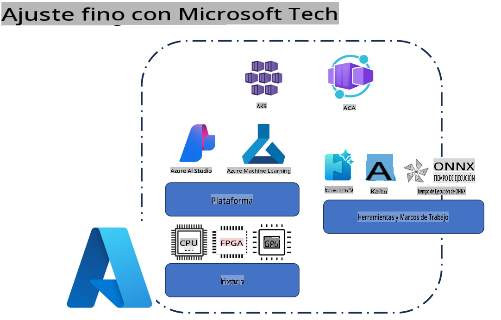
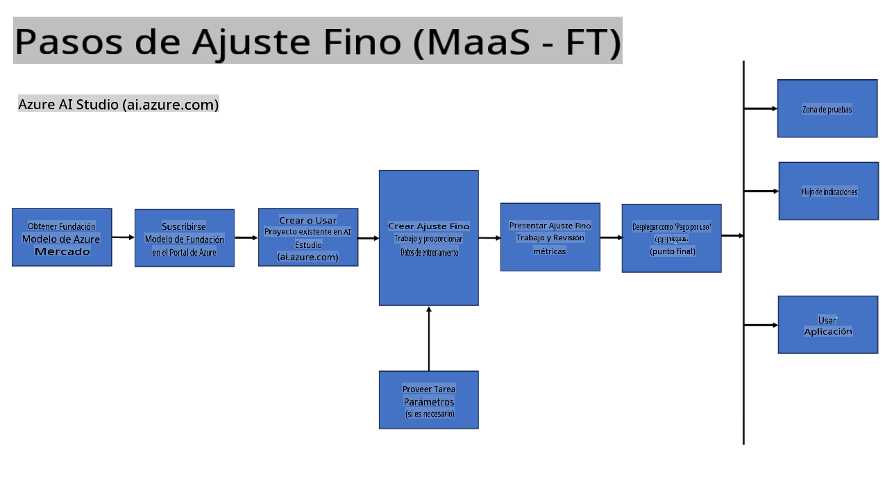
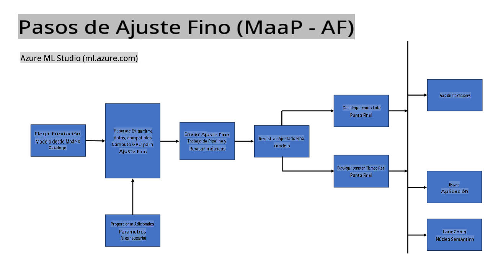
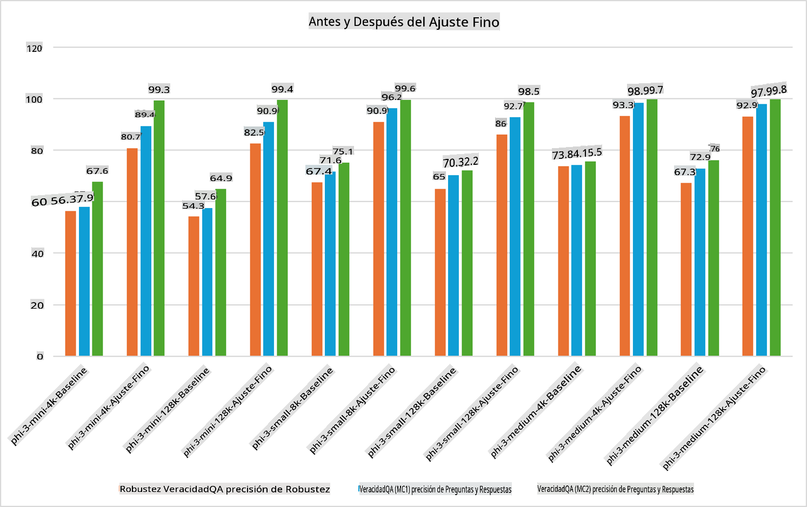

## Escenarios de Ajuste Fino

**Plataforma** Esto incluye varias tecnologías como Azure AI Foundry, Azure Machine Learning, AI Tools, Kaito y ONNX Runtime.

**Infraestructura** Esto incluye la CPU y FPGA, que son esenciales para el proceso de ajuste fino. Déjame mostrarte los íconos de cada una de estas tecnologías.

**Herramientas y Framework** Esto incluye ONNX Runtime y ONNX Runtime. Déjame mostrarte los íconos de cada una de estas tecnologías.
[Insertar íconos para ONNX Runtime y ONNX Runtime]

El proceso de ajuste fino con tecnologías de Microsoft involucra varios componentes y herramientas. Al entender y utilizar estas tecnologías, podemos ajustar finamente nuestras aplicaciones y crear mejores soluciones.

## Modelo como Servicio

Ajusta finamente el modelo usando ajuste fino hospedado, sin la necesidad de crear y gestionar computación.

El ajuste fino sin servidor está disponible para los modelos Phi-3-mini y Phi-3-medium, permitiendo a los desarrolladores personalizar rápidamente los modelos para escenarios en la nube y en el borde sin tener que organizar la computación. También hemos anunciado que, Phi-3-small, ahora está disponible a través de nuestra oferta de Modelos-como-Servicio para que los desarrolladores puedan comenzar rápidamente con el desarrollo de IA sin tener que gestionar la infraestructura subyacente.

[Muestra de Ajuste Fino](https://github.com/microsoft/Phi-3CookBook/blob/main/md/04.Fine-tuning/FineTuning_AIStudio.md)
## Modelo como Plataforma

Los usuarios gestionan su propia computación para ajustar finamente sus modelos.

[Muestra de Ajuste Fino](https://github.com/Azure/azureml-examples/blob/main/sdk/python/foundation-models/system/finetune/chat-completion/chat-completion.ipynb)

## Escenarios de Ajuste Fino

| | | | | | | |
|-|-|-|-|-|-|-|
|Escenario|LoRA|QLoRA|PEFT|DeepSpeed|ZeRO|DORA|
|Adaptar LLMs preentrenados a tareas o dominios específicos|Sí|Sí|Sí|Sí|Sí|Sí|
|Ajuste fino para tareas de PLN como clasificación de texto, reconocimiento de entidades nombradas y traducción automática|Sí|Sí|Sí|Sí|Sí|Sí|
|Ajuste fino para tareas de QA|Sí|Sí|Sí|Sí|Sí|Sí|
|Ajuste fino para generar respuestas similares a las humanas en chatbots|Sí|Sí|Sí|Sí|Sí|Sí|
|Ajuste fino para generar música, arte u otras formas de creatividad|Sí|Sí|Sí|Sí|Sí|Sí|
|Reducir costos computacionales y financieros|Sí|Sí|No|Sí|Sí|No|
|Reducir el uso de memoria|No|Sí|No|Sí|Sí|Sí|
|Usar menos parámetros para un ajuste fino eficiente|No|Sí|Sí|No|No|Sí|
|Forma eficiente en memoria de paralelismo de datos que da acceso a la memoria GPU agregada de todos los dispositivos GPU disponibles|No|No|No|Sí|Sí|Sí|

## Ejemplos de Rendimiento de Ajuste Fino

        **Descargo de responsabilidad**: 
        Este documento ha sido traducido utilizando servicios de traducción automática por IA. Aunque nos esforzamos por lograr precisión, tenga en cuenta que las traducciones automáticas pueden contener errores o imprecisiones. El documento original en su idioma nativo debe considerarse la fuente autorizada. Para información crítica, se recomienda la traducción profesional humana. No somos responsables de ningún malentendido o interpretación errónea que surja del uso de esta traducción.