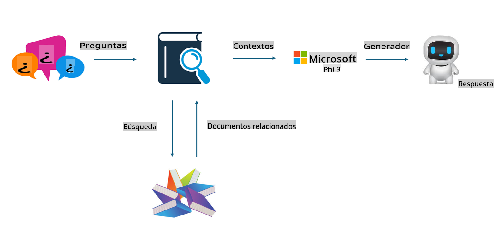

## Ajuste fino vs RAG

## Generación aumentada por recuperación

RAG es recuperación de datos + generación de texto. Los datos estructurados y no estructurados de la empresa se almacenan en la base de datos vectorial. Al buscar contenido relevante, se encuentra el resumen y contenido relevante para formar un contexto, y se combina con la capacidad de completar texto de LLM/SLM para generar contenido.

## Proceso de RAG

## Ajuste fino
El ajuste fino se basa en la mejora de un modelo determinado. No es necesario empezar con el algoritmo del modelo, pero se necesita acumular datos continuamente. Si deseas una terminología y expresión de lenguaje más precisa en aplicaciones industriales, el ajuste fino es tu mejor opción. Pero si tus datos cambian con frecuencia, el ajuste fino puede volverse complicado.

## Cómo elegir
Si nuestra respuesta requiere la introducción de datos externos, RAG es la mejor opción.

Si necesitas generar conocimiento industrial estable y preciso, el ajuste fino será una buena elección. RAG prioriza extraer contenido relevante, pero puede que no siempre capte los matices especializados.

El ajuste fino requiere un conjunto de datos de alta calidad, y si solo es un pequeño rango de datos, no hará mucha diferencia. RAG es más flexible.
El ajuste fino es una caja negra, una metafísica, y es difícil entender el mecanismo interno. Pero RAG puede facilitar la identificación de la fuente de los datos, ajustando efectivamente las alucinaciones o errores de contenido y proporcionando mejor transparencia.

Aviso legal: La traducción fue realizada a partir del original por un modelo de IA y puede no ser perfecta. 
Por favor, revise el resultado y haga las correcciones necesarias.