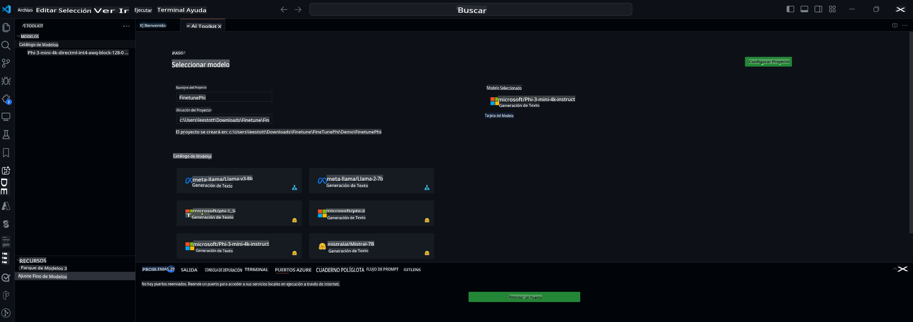

## Bienvenido al AI Toolkit para VS Code

[AI Toolkit para VS Code](https://github.com/microsoft/vscode-ai-toolkit/tree/main) reúne varios modelos del Catálogo de Azure AI Studio y otros catálogos como Hugging Face. El toolkit simplifica las tareas comunes de desarrollo para construir aplicaciones de IA con herramientas y modelos de IA generativa a través de:
- Comienza con el descubrimiento de modelos y el playground.
- Ajuste y inferencia de modelos utilizando recursos de cómputo locales.
- Ajuste e inferencia remotos utilizando recursos de Azure.

[Instala AI Toolkit para VSCode](https://marketplace.visualstudio.com/items?itemName=ms-windows-ai-studio.windows-ai-studio)



**[Vista Previa Privada]** Aprovisionamiento con un clic para Azure Container Apps para ejecutar el ajuste y la inferencia de modelos en la nube.

Ahora, vamos a sumergirnos en el desarrollo de tu aplicación de IA:

- [Desarrollo Local](../../../../md/04.Fine-tuning)
    - [Preparativos](../../../../md/04.Fine-tuning)
    - [Activar Conda](../../../../md/04.Fine-tuning)
    - [Solo ajuste del modelo base](../../../../md/04.Fine-tuning)
    - [Ajuste e inferencia del modelo](../../../../md/04.Fine-tuning)
- [**[Vista Previa Privada]** Desarrollo Remoto](../../../../md/04.Fine-tuning)
    - [Requisitos previos](../../../../md/04.Fine-tuning)
    - [Configurar un Proyecto de Desarrollo Remoto](../../../../md/04.Fine-tuning)
    - [Aprovisionar Recursos de Azure](../../../../md/04.Fine-tuning)
    - [[Opcional] Agregar Token de Huggingface al Secreto de la Azure Container App](../../../../md/04.Fine-tuning)
    - [Ejecutar el Ajuste](../../../../md/04.Fine-tuning)
    - [Aprovisionar el Endpoint de Inferencia](../../../../md/04.Fine-tuning)
    - [Desplegar el Endpoint de Inferencia](../../../../md/04.Fine-tuning)
    - [Uso avanzado](../../../../md/04.Fine-tuning)

## Desarrollo Local
### Preparativos

1. Asegúrate de que el controlador de NVIDIA esté instalado en el host.
2. Ejecuta `huggingface-cli login`, si estás usando HF para la utilización de datasets.
3. Explicaciones de configuraciones clave de `Olive` para cualquier cosa que modifique el uso de memoria.

### Activar Conda
Como estamos utilizando un entorno WSL y es compartido, necesitas activar manualmente el entorno conda. Después de este paso, puedes ejecutar el ajuste o la inferencia.

```bash
conda activate [conda-env-name]
```

### Solo ajuste del modelo base
Para probar el modelo base sin ajuste, puedes ejecutar este comando después de activar conda.

```bash
cd inference

# La interfaz del navegador web permite ajustar algunos parámetros como la longitud máxima de nuevos tokens, la temperatura, etc.
# El usuario debe abrir manualmente el enlace (por ejemplo, http://0.0.0.0:7860) en un navegador después de que gradio inicie las conexiones.
python gradio_chat.py --baseonly
```

### Ajuste e inferencia del modelo

Una vez que el espacio de trabajo esté abierto en un contenedor de desarrollo, abre una terminal (la ruta predeterminada es la raíz del proyecto), luego ejecuta el comando a continuación para ajustar un LLM en el dataset seleccionado.

```bash
python finetuning/invoke_olive.py
```

Los puntos de control y el modelo final se guardarán en la carpeta `models`.

Luego ejecuta la inferencia con el modelo ajustado a través de chats en una `consola`, `navegador web` o `prompt flow`.

```bash
cd inference

# Interfaz de consola.
python console_chat.py

# La interfaz del navegador web permite ajustar algunos parámetros como la longitud máxima de nuevos tokens, la temperatura, etc.
# El usuario debe abrir manualmente el enlace (por ejemplo, http://127.0.0.1:7860) en un navegador después de que gradio inicie las conexiones.
python gradio_chat.py
```

Para usar `prompt flow` en VS Code, consulta este [Inicio Rápido](https://microsoft.github.io/promptflow/how-to-guides/quick-start.html).

### Ajuste del Modelo

A continuación, descarga el siguiente modelo dependiendo de la disponibilidad de una GPU en tu dispositivo.

Para iniciar la sesión de ajuste local usando QLoRA, selecciona un modelo que quieras ajustar de nuestro catálogo.
| Plataforma(s) | GPU disponible | Nombre del modelo | Tamaño (GB) |
|---------|---------|--------|--------|
| Windows | Sí | Phi-3-mini-4k-**directml**-int4-awq-block-128-onnx | 2.13GB |
| Linux | Sí | Phi-3-mini-4k-**cuda**-int4-onnx | 2.30GB |
| Windows<br>Linux | No | Phi-3-mini-4k-**cpu**-int4-rtn-block-32-acc-level-4-onnx | 2.72GB |

**_Nota_** No necesitas una cuenta de Azure para descargar los modelos.

El modelo Phi3-mini (int4) tiene un tamaño aproximado de 2GB-3GB. Dependiendo de la velocidad de tu red, podría tomar unos minutos descargarlo.

Comienza seleccionando un nombre y una ubicación para el proyecto.
Luego, selecciona un modelo del catálogo de modelos. Se te pedirá que descargues la plantilla del proyecto. Luego puedes hacer clic en "Configurar Proyecto" para ajustar varias configuraciones.

### Microsoft Olive

Usamos [Olive](https://microsoft.github.io/Olive/overview/olive.html) para ejecutar el ajuste QLoRA en un modelo PyTorch de nuestro catálogo. Todas las configuraciones están preestablecidas con los valores predeterminados para optimizar la ejecución del proceso de ajuste localmente con uso optimizado de memoria, pero se puede ajustar para tu escenario.

### Ejemplos y Recursos de Ajuste

- [Guía de Inicio Rápido de Ajuste](https://learn.microsoft.com/windows/ai/toolkit/toolkit-fine-tune)
- [Ajuste con un Dataset de HuggingFace](https://github.com/microsoft/vscode-ai-toolkit/blob/main/walkthrough-hf-dataset.md)
- [Ajuste con un Dataset Simple](https://github.com/microsoft/vscode-ai-toolkit/blob/main/walkthrough-simple-dataset.md)

## **[Vista Previa Privada]** Desarrollo Remoto
### Requisitos previos
1. Para ejecutar el ajuste del modelo en tu entorno de Azure Container App remoto, asegúrate de que tu suscripción tenga suficiente capacidad de GPU. Envía un [ticket de soporte](https://azure.microsoft.com/support/create-ticket/) para solicitar la capacidad requerida para tu aplicación. [Obtén Más Información sobre la capacidad de GPU](https://learn.microsoft.com/azure/container-apps/workload-profiles-overview)
2. Si estás usando un dataset privado en HuggingFace, asegúrate de tener una [cuenta de HuggingFace](https://huggingface.co/) y [genera un token de acceso](https://huggingface.co/docs/hub/security-tokens).
3. Habilita la bandera de característica de Ajuste e Inferencia Remotos en el AI Toolkit para VS Code
   1. Abre la Configuración de VS Code seleccionando *Archivo -> Preferencias -> Configuración*.
   2. Navega a *Extensiones* y selecciona *AI Toolkit*.
   3. Selecciona la opción *"Habilitar Ajuste e Inferencia Remotos"*.
   4. Recarga VS Code para que tenga efecto.

- [Ajuste Remoto](https://github.com/microsoft/vscode-ai-toolkit/blob/main/remote-finetuning.md)

### Configurar un Proyecto de Desarrollo Remoto
1. Ejecuta el comando paleta `AI Toolkit: Focus on Resource View`.
2. Navega a *Model Fine-tuning* para acceder al catálogo de modelos. Asigna un nombre a tu proyecto y selecciona su ubicación en tu máquina. Luego, haz clic en el botón *"Configurar Proyecto"*.
3. Configuración del Proyecto
    1. Evita habilitar la opción *"Ajustar localmente"*.
    2. Las configuraciones de Olive aparecerán con valores predeterminados preestablecidos. Ajusta y completa estas configuraciones según sea necesario.
    3. Pasa a *Generar Proyecto*. Esta etapa aprovecha WSL e implica configurar un nuevo entorno Conda, preparando futuras actualizaciones que incluyen Dev Containers.
4. Haz clic en *"Reiniciar Ventana en el Espacio de Trabajo"* para abrir tu proyecto de desarrollo remoto.

> **Nota:** El proyecto actualmente funciona localmente o de forma remota dentro del AI Toolkit para VS Code. Si eliges *"Ajustar localmente"* durante la creación del proyecto, operará exclusivamente en WSL sin capacidades de desarrollo remoto. Por otro lado, si no habilitas *"Ajustar localmente"*, el proyecto estará restringido al entorno de Azure Container App remoto.

### Aprovisionar Recursos de Azure
Para comenzar, necesitas aprovisionar el Recurso de Azure para el ajuste remoto. Haz esto ejecutando el `AI Toolkit: Provision Azure Container Apps job for fine-tuning` desde la paleta de comandos.

Monitorea el progreso del aprovisionamiento a través del enlace mostrado en el canal de salida.

### [Opcional] Agregar Token de Huggingface al Secreto de la Azure Container App
Si estás usando un dataset privado de HuggingFace, establece tu token de HuggingFace como una variable de entorno para evitar la necesidad de iniciar sesión manualmente en el Hugging Face Hub.
Puedes hacerlo usando el comando `AI Toolkit: Add Azure Container Apps Job secret for fine-tuning`. Con este comando, puedes establecer el nombre del secreto como [`HF_TOKEN`](https://huggingface.co/docs/huggingface_hub/package_reference/environment_variables#hftoken) y usar tu token de Hugging Face como el valor del secreto.

### Ejecutar el Ajuste
Para iniciar el trabajo de ajuste remoto, ejecuta el comando `AI Toolkit: Run fine-tuning`.

Para ver los registros del sistema y la consola, puedes visitar el portal de Azure usando el enlace en el panel de salida (más pasos en [Ver y Consultar Registros en Azure](https://aka.ms/ai-toolkit/remote-provision#view-and-query-logs-on-azure)). O, puedes ver los registros de la consola directamente en el panel de salida de VSCode ejecutando el comando `AI Toolkit: Show the running fine-tuning job streaming logs`.
> **Nota:** El trabajo podría estar en cola debido a recursos insuficientes. Si el registro no se muestra, ejecuta el comando `AI Toolkit: Show the running fine-tuning job streaming logs`, espera un momento y luego ejecuta el comando nuevamente para reconectar al registro de transmisión.

Durante este proceso, se usará QLoRA para el ajuste, y se crearán adaptadores LoRA para que el modelo los use durante la inferencia.
Los resultados del ajuste se almacenarán en los Archivos de Azure.

### Aprovisionar el Endpoint de Inferencia
Después de que los adaptadores estén entrenados en el entorno remoto, usa una aplicación simple de Gradio para interactuar con el modelo.
Similar al proceso de ajuste, necesitas configurar los Recursos de Azure para la inferencia remota ejecutando el `AI Toolkit: Provision Azure Container Apps for inference` desde la paleta de comandos.

Por defecto, la suscripción y el grupo de recursos para la inferencia deben coincidir con los usados para el ajuste. La inferencia usará el mismo entorno de Azure Container App y accederá al modelo y al adaptador del modelo almacenados en los Archivos de Azure, que fueron generados durante el paso de ajuste.

### Desplegar el Endpoint de Inferencia
Si deseas revisar el código de inferencia o recargar el modelo de inferencia, ejecuta el comando `AI Toolkit: Deploy for inference`. Esto sincronizará tu último código con Azure Container App y reiniciará la réplica.

Una vez que el despliegue se complete con éxito, puedes acceder a la API de inferencia haciendo clic en el botón "*Ir al Endpoint de Inferencia*" mostrado en la notificación de VSCode. O, el endpoint de la API web se puede encontrar bajo `ACA_APP_ENDPOINT` en `./infra/inference.config.json` y en el panel de salida. Ahora estás listo para evaluar el modelo usando este endpoint.

### Uso avanzado
Para más información sobre el desarrollo remoto con AI Toolkit, consulta la documentación de [Ajuste de modelos de forma remota](https://aka.ms/ai-toolkit/remote-provision) y [Inferencia con el modelo ajustado](https://aka.ms/ai-toolkit/remote-inference).

Aviso legal: La traducción fue realizada a partir del original por un modelo de inteligencia artificial y puede no ser perfecta. Por favor, revise el resultado y haga las correcciones necesarias.