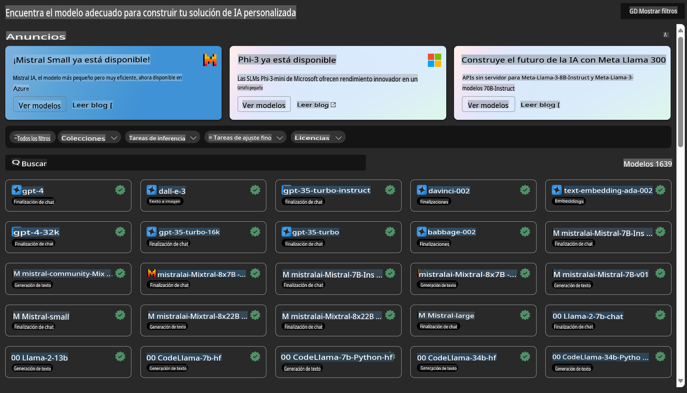
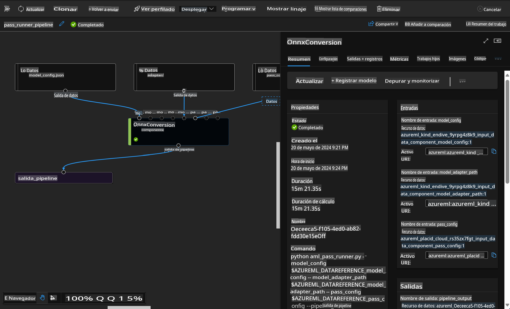

# **Introducción al Servicio de Azure Machine Learning**

[Azure Machine Learning](https://ml.azure.com?WT.mc_id=aiml-138114-kinfeylo) es un servicio en la nube para acelerar y gestionar el ciclo de vida de los proyectos de aprendizaje automático (ML).

Los profesionales de ML, científicos de datos e ingenieros pueden usarlo en sus flujos de trabajo diarios para:

- Entrenar y desplegar modelos.
- Gestionar operaciones de aprendizaje automático (MLOps).
- Puedes crear un modelo en Azure Machine Learning o usar un modelo construido desde una plataforma de código abierto, como PyTorch, TensorFlow o scikit-learn.
- Las herramientas de MLOps te ayudan a monitorizar, reentrenar y rediseñar modelos.

## ¿Para quién es Azure Machine Learning?

**Científicos de Datos e Ingenieros de ML**

Pueden usar herramientas para acelerar y automatizar sus flujos de trabajo diarios.
Azure ML proporciona características para equidad, explicabilidad, seguimiento y auditabilidad.
Desarrolladores de Aplicaciones:
Pueden integrar modelos en aplicaciones o servicios sin problemas.

**Desarrolladores de Plataforma**

Tienen acceso a un conjunto robusto de herramientas respaldadas por APIs duraderas de Azure Resource Manager.
Estas herramientas permiten construir herramientas avanzadas de ML.

**Empresas**

Trabajando en la nube de Microsoft Azure, las empresas se benefician de la seguridad familiar y el control de acceso basado en roles.
Configura proyectos para controlar el acceso a datos protegidos y operaciones específicas.

## Productividad para Todos en el Equipo
Los proyectos de ML a menudo requieren un equipo con un conjunto de habilidades variado para construir y mantener.

Azure ML proporciona herramientas que te permiten:
- Colaborar con tu equipo a través de cuadernos compartidos, recursos de cómputo, cómputo sin servidor, datos y entornos.
- Desarrollar modelos con equidad, explicabilidad, seguimiento y auditabilidad para cumplir con los requisitos de linaje y cumplimiento de auditoría.
- Desplegar modelos de ML rápida y fácilmente a escala, y gestionarlos y gobernarlos eficientemente con MLOps.
- Ejecutar cargas de trabajo de aprendizaje automático en cualquier lugar con gobernanza, seguridad y cumplimiento integrados.

## Herramientas de Plataforma Compatibles

Cualquier persona en un equipo de ML puede usar sus herramientas preferidas para hacer el trabajo.
Ya sea que estés ejecutando experimentos rápidos, ajustando hiperparámetros, construyendo pipelines o gestionando inferencias, puedes usar interfaces familiares, incluyendo:
- Azure Machine Learning Studio
- Python SDK (v2)
- Azure CLI (v2)
- APIs REST de Azure Resource Manager

A medida que refinas modelos y colaboras a lo largo del ciclo de desarrollo, puedes compartir y encontrar activos, recursos y métricas dentro de la interfaz de Azure Machine Learning studio.

## **LLM/SLM en Azure ML**

Azure ML ha añadido muchas funciones relacionadas con LLM/SLM, combinando LLMOps y SLMOps para crear una plataforma tecnológica de inteligencia artificial generativa a nivel empresarial.

### **Catálogo de Modelos**

Los usuarios empresariales pueden desplegar diferentes modelos según diferentes escenarios de negocio a través del Catálogo de Modelos, y proporcionar servicios como Model as Service para que los desarrolladores o usuarios empresariales accedan.

El Catálogo de Modelos en Azure Machine Learning studio es el centro para descubrir y usar una amplia gama de modelos que te permiten construir aplicaciones de IA Generativa. El catálogo de modelos presenta cientos de modelos de proveedores de modelos como Azure OpenAI service, Mistral, Meta, Cohere, Nvidia, Hugging Face, incluidos modelos entrenados por Microsoft. Los modelos de proveedores distintos a Microsoft son Productos No-Microsoft, según lo definido en los Términos del Producto de Microsoft, y están sujetos a los términos proporcionados con el modelo.

### **Pipeline de Trabajo**

El núcleo de un pipeline de aprendizaje automático es dividir una tarea completa de aprendizaje automático en un flujo de trabajo de múltiples pasos. Cada paso es un componente manejable que puede ser desarrollado, optimizado, configurado y automatizado individualmente. Los pasos están conectados a través de interfaces bien definidas. El servicio de pipeline de Azure Machine Learning orquesta automáticamente todas las dependencias entre los pasos del pipeline.

En el ajuste fino de SLM / LLM, podemos gestionar nuestros datos, procesos de entrenamiento y generación a través del Pipeline.

### **Flujo de Prompt**

Beneficios de usar el flujo de prompt de Azure Machine Learning
El flujo de prompt de Azure Machine Learning ofrece una gama de beneficios que ayudan a los usuarios a pasar de la ideación a la experimentación y, en última instancia, a aplicaciones listas para producción basadas en LLM:

**Agilidad en la ingeniería de prompts**

Experiencia de autoría interactiva: El flujo de prompt de Azure Machine Learning proporciona una representación visual de la estructura del flujo, permitiendo a los usuarios entender y navegar fácilmente por sus proyectos. También ofrece una experiencia de codificación similar a un cuaderno para el desarrollo y depuración eficientes del flujo.
Variantes para el ajuste de prompts: Los usuarios pueden crear y comparar múltiples variantes de prompts, facilitando un proceso iterativo de refinamiento.

Evaluación: Los flujos de evaluación integrados permiten a los usuarios evaluar la calidad y efectividad de sus prompts y flujos.

Recursos completos: El flujo de prompt de Azure Machine Learning incluye una biblioteca de herramientas integradas, muestras y plantillas que sirven como punto de partida para el desarrollo, inspirando creatividad y acelerando el proceso.

**Preparación empresarial para aplicaciones basadas en LLM**

Colaboración: El flujo de prompt de Azure Machine Learning admite la colaboración en equipo, permitiendo que múltiples usuarios trabajen juntos en proyectos de ingeniería de prompts, compartan conocimientos y mantengan el control de versiones.

Plataforma todo en uno: El flujo de prompt de Azure Machine Learning agiliza todo el proceso de ingeniería de prompts, desde el desarrollo y la evaluación hasta el despliegue y la monitorización. Los usuarios pueden desplegar sus flujos como endpoints de Azure Machine Learning y monitorizar su rendimiento en tiempo real, asegurando una operación óptima y mejora continua.

Soluciones de Preparación Empresarial de Azure Machine Learning: El flujo de prompt aprovecha las robustas soluciones de preparación empresarial de Azure Machine Learning, proporcionando una base segura, escalable y confiable para el desarrollo, experimentación y despliegue de flujos.

Con el flujo de prompt de Azure Machine Learning, los usuarios pueden liberar su agilidad en la ingeniería de prompts, colaborar efectivamente y aprovechar soluciones de grado empresarial para el desarrollo y despliegue exitoso de aplicaciones basadas en LLM.

Combinando la potencia de cálculo, los datos y los diferentes componentes de Azure ML, los desarrolladores empresariales pueden construir fácilmente sus propias aplicaciones de inteligencia artificial.

**Descargo de responsabilidad**:
Este documento ha sido traducido utilizando servicios de traducción automática basados en IA. Aunque nos esforzamos por lograr precisión, tenga en cuenta que las traducciones automáticas pueden contener errores o inexactitudes. El documento original en su idioma nativo debe considerarse la fuente autorizada. Para información crítica, se recomienda una traducción humana profesional. No nos hacemos responsables de cualquier malentendido o interpretación errónea que surja del uso de esta traducción.