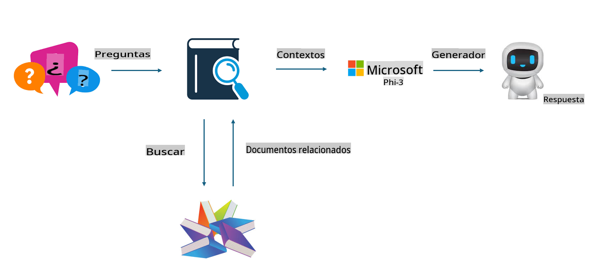
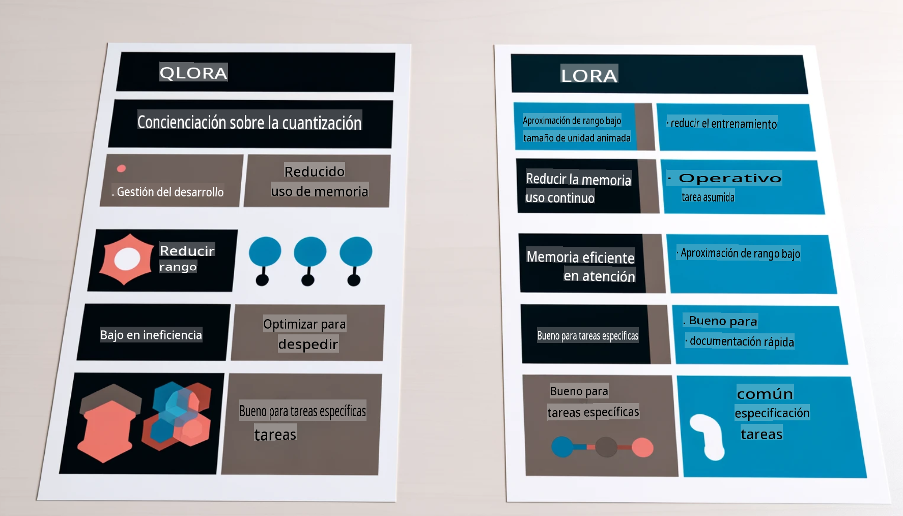

# **Deja que Phi-3 se convierta en un experto de la industria**

Para introducir el modelo Phi-3 en una industria, necesitas agregar datos comerciales específicos de la industria al modelo Phi-3. Tenemos dos opciones diferentes, la primera es RAG (Generación Aumentada por Recuperación) y la segunda es Fine Tuning.

## **RAG vs Fine-Tuning**

### **Generación Aumentada por Recuperación**

RAG es recuperación de datos + generación de texto. Los datos estructurados y no estructurados de la empresa se almacenan en la base de datos vectorial. Al buscar contenido relevante, se encuentra el resumen y contenido relevante para formar un contexto, y se combina la capacidad de completado de texto de LLM/SLM para generar contenido.

### **Fine-tuning**

El Fine-tuning se basa en la mejora de un modelo determinado. No necesita comenzar con el algoritmo del modelo, pero los datos deben acumularse continuamente. Si deseas una terminología y expresión de lenguaje más precisa en aplicaciones industriales, el Fine-tuning es tu mejor opción. Pero si tus datos cambian frecuentemente, el Fine-tuning puede volverse complicado.

### **Cómo elegir**

1. Si nuestra respuesta requiere la introducción de datos externos, RAG es la mejor opción.

2. Si necesitas producir conocimientos industriales estables y precisos, el Fine-tuning será una buena opción. RAG prioriza extraer contenido relevante pero podría no captar siempre los matices especializados.

3. El Fine-tuning requiere un conjunto de datos de alta calidad, y si es solo un rango pequeño de datos, no hará mucha diferencia. RAG es más flexible.

4. El Fine-tuning es una caja negra, una metafísica, y es difícil entender el mecanismo interno. Pero RAG puede hacer más fácil encontrar la fuente de los datos, ajustando efectivamente alucinaciones o errores de contenido y proporcionando mejor transparencia.

### **Escenarios**

1. Industrias verticales que requieren vocabulario y expresiones profesionales específicas, ***Fine-tuning*** será la mejor opción.

2. Sistema de preguntas y respuestas, involucrando la síntesis de diferentes puntos de conocimiento, ***RAG*** será la mejor opción.

3. La combinación de flujo de negocio automatizado ***RAG + Fine-tuning*** es la mejor opción.

## **Cómo usar RAG**

Una base de datos vectorial es una colección de datos almacenados en forma matemática. Las bases de datos vectoriales facilitan que los modelos de aprendizaje automático recuerden entradas anteriores, permitiendo que el aprendizaje automático se utilice para casos de uso como búsqueda, recomendaciones y generación de texto. Los datos pueden identificarse basándose en métricas de similitud en lugar de coincidencias exactas, permitiendo que los modelos informáticos comprendan el contexto de los datos.

La base de datos vectorial es clave para realizar RAG. Podemos convertir datos en almacenamiento vectorial a través de modelos vectoriales como text-embedding-3, jina-ai-embedding, etc.

Aprende más sobre cómo crear una aplicación RAG [https://github.com/microsoft/Phi-3CookBook](https://github.com/microsoft/Phi-3CookBook?WT.mc_id=aiml-138114-kinfeylo)

## **Cómo usar Fine-tuning**

Los algoritmos comúnmente utilizados en Fine-tuning son Lora y QLora. ¿Cómo elegir?
- [Aprende más con este cuaderno de ejemplo](../../code/04.Finetuning/Phi_3_Inference_Finetuning.ipynb)
- [Ejemplo de script de FineTuning en Python](../../code/04.Finetuning/FineTrainingScript.py)

### **Lora y QLora**

LoRA (Low-Rank Adaptation) y QLoRA (Quantized Low-Rank Adaptation) son técnicas utilizadas para ajustar modelos de lenguaje grandes (LLMs) utilizando Fine Tuning Eficiente en Parámetros (PEFT). Las técnicas PEFT están diseñadas para entrenar modelos de manera más eficiente que los métodos tradicionales.
LoRA es una técnica de ajuste fino independiente que reduce el uso de memoria aplicando una aproximación de bajo rango a la matriz de actualización de pesos. Ofrece tiempos de entrenamiento rápidos y mantiene un rendimiento cercano a los métodos tradicionales de ajuste fino.

QLoRA es una versión extendida de LoRA que incorpora técnicas de cuantización para reducir aún más el uso de memoria. QLoRA cuantiza la precisión de los parámetros de peso en el LLM preentrenado a una precisión de 4 bits, lo cual es más eficiente en memoria que LoRA. Sin embargo, el entrenamiento de QLoRA es aproximadamente un 30% más lento que el entrenamiento de LoRA debido a los pasos adicionales de cuantización y decuantización.

QLoRA utiliza LoRA como un accesorio para corregir los errores introducidos durante los errores de cuantización. QLoRA permite el ajuste fino de modelos masivos con miles de millones de parámetros en GPUs relativamente pequeñas y altamente disponibles. Por ejemplo, QLoRA puede ajustar fino un modelo de 70B parámetros que requiere 36 GPUs con solo 2.

Aviso legal: La traducción fue realizada a partir del original por un modelo de inteligencia artificial y puede no ser perfecta. 
Por favor, revise el resultado y haga las correcciones necesarias.