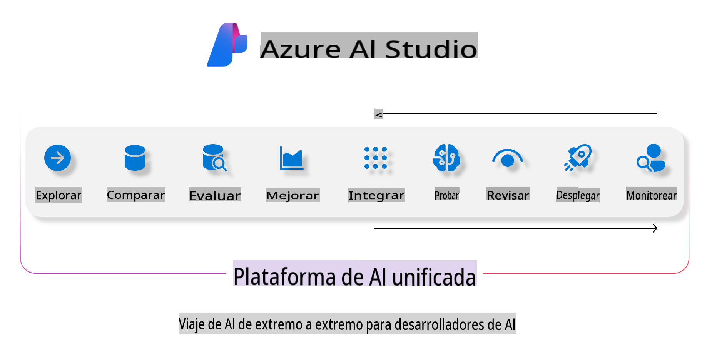
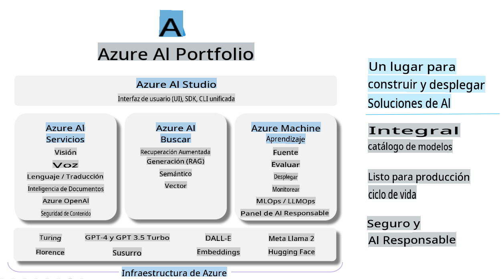

# **Usando Azure AI Studio para evaluación**

Cómo evaluar tu aplicación de IA generativa usando [Azure AI Studio](https://ai.azure.com?WT.mc_id=aiml-138114-kinfeylo). Ya sea que estés evaluando conversaciones de un solo turno o de múltiples turnos, Azure AI Studio ofrece herramientas para evaluar el rendimiento y la seguridad del modelo.

## Cómo evaluar aplicaciones de IA generativa con Azure AI Studio
Para más detalles, consulta la [Documentación de Azure AI Studio](https://learn.microsoft.com/azure/ai-studio/how-to/evaluate-generative-ai-app?WT.mc_id=aiml-138114-kinfeylo)

Aquí están los pasos para empezar:

## Evaluación de Modelos de IA Generativa en Azure AI Studio

**Requisitos Previos**

- Un conjunto de datos de prueba en formato CSV o JSON.
- Un modelo de IA generativa desplegado (como los modelos Phi-3, GPT 3.5, GPT 4, o Davinci).
- Un entorno de ejecución con una instancia de cómputo para realizar la evaluación.

## Métricas de Evaluación Incorporadas

Azure AI Studio te permite evaluar tanto conversaciones de un solo turno como complejas de múltiples turnos.
Para escenarios de Generación Aumentada por Recuperación (RAG), donde el modelo se basa en datos específicos, puedes evaluar el rendimiento usando métricas de evaluación incorporadas.
Además, puedes evaluar escenarios generales de respuesta a preguntas de un solo turno (no RAG).

## Creando una Ejecución de Evaluación

Desde la interfaz de usuario de Azure AI Studio, navega a la página de Evaluar o a la página de Flujo de Prompt.
Sigue el asistente de creación de evaluación para configurar una ejecución de evaluación. Proporciona un nombre opcional para tu evaluación.
Selecciona el escenario que se alinea con los objetivos de tu aplicación.
Elige una o más métricas de evaluación para evaluar la salida del modelo.

## Flujo de Evaluación Personalizado (Opcional)

Para mayor flexibilidad, puedes establecer un flujo de evaluación personalizado. Personaliza el proceso de evaluación según tus requisitos específicos.

## Visualización de Resultados

Después de ejecutar la evaluación, registra, visualiza y analiza métricas de evaluación detalladas en Azure AI Studio. Obtén información sobre las capacidades y limitaciones de tu aplicación.

**Nota** Azure AI Studio está actualmente en vista previa pública, por lo que úsalo para propósitos de experimentación y desarrollo. Para cargas de trabajo de producción, considera otras opciones. Explora la [documentación oficial de AI Studio](https://learn.microsoft.com/azure/ai-studio/?WT.mc_id=aiml-138114-kinfeylo) para más detalles e instrucciones paso a paso.

Aviso legal: La traducción fue realizada a partir del original por un modelo de IA y puede no ser perfecta. 
Por favor, revise el resultado y haga las correcciones necesarias.