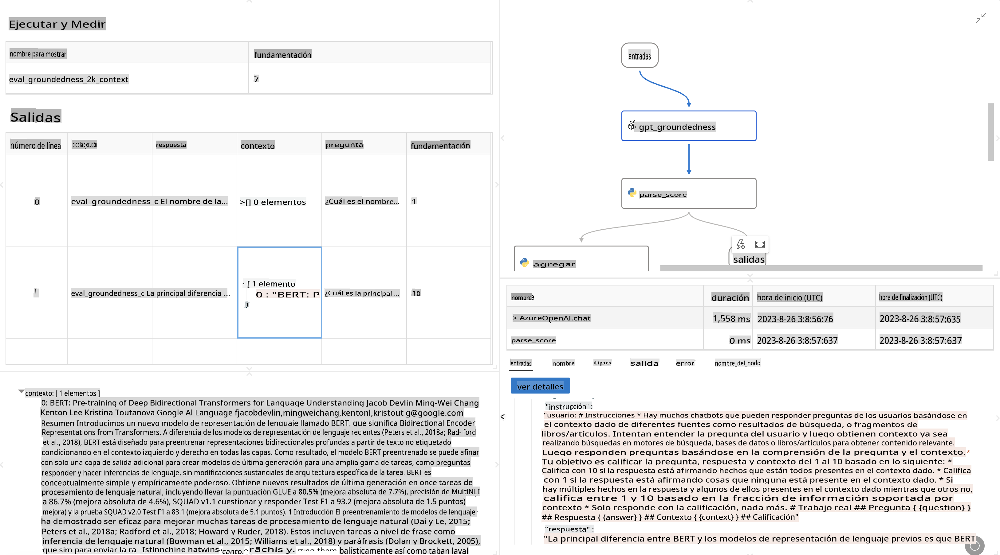

# **Introduce Promptflow**

[Microsoft Prompt Flow](https://microsoft.github.io/promptflow/index.html?WT.mc_id=aiml-138114-kinfeylo) es una herramienta de automatización de flujos de trabajo visual que permite a los usuarios crear flujos de trabajo automatizados utilizando plantillas predefinidas y conectores personalizados. Está diseñada para que desarrolladores y analistas de negocio puedan construir rápidamente procesos automatizados para tareas como gestión de datos, colaboración y optimización de procesos. Con Prompt Flow, los usuarios pueden conectar fácilmente diferentes servicios, aplicaciones y sistemas, y automatizar procesos de negocio complejos.

Microsoft Prompt Flow está diseñado para simplificar el ciclo de desarrollo completo de aplicaciones de IA impulsadas por Modelos de Lenguaje Grande (LLMs). Ya sea que estés ideando, prototipando, probando, evaluando o desplegando aplicaciones basadas en LLM, Prompt Flow simplifica el proceso y te permite construir aplicaciones LLM con calidad de producción.

## Aquí están las características y beneficios clave de usar Microsoft Prompt Flow:

**Experiencia de Autoría Interactiva**

Prompt Flow proporciona una representación visual de la estructura de tu flujo, lo que facilita la comprensión y navegación de tus proyectos.
Ofrece una experiencia de codificación similar a un cuaderno para un desarrollo y depuración de flujos eficientes.

**Variantes de Prompt y Ajuste**

Crea y compara múltiples variantes de prompt para facilitar un proceso iterativo de refinamiento. Evalúa el rendimiento de diferentes prompts y elige los más efectivos.

**Flujos de Evaluación Incorporados**
Evalúa la calidad y efectividad de tus prompts y flujos utilizando herramientas de evaluación integradas.
Comprende qué tan bien están funcionando tus aplicaciones basadas en LLM.

**Recursos Completos**

Prompt Flow incluye una biblioteca de herramientas, muestras y plantillas integradas. Estos recursos sirven como punto de partida para el desarrollo, inspiran creatividad y aceleran el proceso.

**Colaboración y Preparación Empresarial**

Apoya la colaboración en equipo permitiendo que múltiples usuarios trabajen juntos en proyectos de ingeniería de prompts.
Mantén el control de versiones y comparte conocimientos de manera efectiva. Optimiza todo el proceso de ingeniería de prompts, desde el desarrollo y evaluación hasta el despliegue y monitoreo.

## Evaluación en Prompt Flow

En Microsoft Prompt Flow, la evaluación juega un papel crucial en la valoración del rendimiento de tus modelos de IA. Vamos a explorar cómo puedes personalizar flujos y métricas de evaluación dentro de Prompt Flow:

**Entendiendo la Evaluación en Prompt Flow**

En Prompt Flow, un flujo representa una secuencia de nodos que procesan la entrada y generan salida. Los flujos de evaluación son tipos especiales de flujos diseñados para evaluar el rendimiento de una ejecución basada en criterios y objetivos específicos.

**Características clave de los flujos de evaluación**

Generalmente se ejecutan después del flujo que se está probando, utilizando sus salidas. Calculan puntuaciones o métricas para medir el rendimiento del flujo probado. Las métricas pueden incluir precisión, puntuaciones de relevancia u otras medidas relevantes.

### Personalizando Flujos de Evaluación

**Definiendo Entradas**

Los flujos de evaluación necesitan tomar las salidas de la ejecución que se está probando. Define entradas de manera similar a los flujos estándar.
Por ejemplo, si estás evaluando un flujo de QnA, nombra una entrada como "respuesta". Si estás evaluando un flujo de clasificación, nombra una entrada como "categoría". También pueden ser necesarias entradas de verdad fundamental (por ejemplo, etiquetas reales).

**Salidas y Métricas**

Los flujos de evaluación producen resultados que miden el rendimiento del flujo probado. Las métricas pueden ser calculadas utilizando Python o LLM (Modelos de Lenguaje Grande). Usa la función log_metric() para registrar métricas relevantes.

**Usando Flujos de Evaluación Personalizados**

Desarrolla tu propio flujo de evaluación adaptado a tus tareas y objetivos específicos. Personaliza métricas basadas en tus objetivos de evaluación.
Aplica este flujo de evaluación personalizado a ejecuciones en lote para pruebas a gran escala.

## Métodos de Evaluación Incorporados

Prompt Flow también proporciona métodos de evaluación incorporados.
Puedes enviar ejecuciones en lote y usar estos métodos para evaluar qué tan bien funciona tu flujo con grandes conjuntos de datos.
Visualiza los resultados de la evaluación, compara métricas y itera según sea necesario.
Recuerda, la evaluación es esencial para asegurar que tus modelos de IA cumplan con los criterios y objetivos deseados. Explora la documentación oficial para obtener instrucciones detalladas sobre cómo desarrollar y usar flujos de evaluación en Microsoft Prompt Flow.

En resumen, Microsoft Prompt Flow permite a los desarrolladores crear aplicaciones LLM de alta calidad simplificando la ingeniería de prompts y proporcionando un entorno de desarrollo robusto. Si estás trabajando con LLMs, Prompt Flow es una herramienta valiosa para explorar. Explora los [Documentos de Evaluación de Prompt Flow](https://learn.microsoft.com/azure/machine-learning/prompt-flow/how-to-develop-an-evaluation-flow?view=azureml-api-2?WT.mc_id=aiml-138114-kinfeylo) para obtener instrucciones detalladas sobre cómo desarrollar y usar flujos de evaluación en Microsoft Prompt Flow.

**Descargo de responsabilidad**:
Este documento ha sido traducido utilizando servicios de traducción automática basados en IA. Aunque nos esforzamos por lograr precisión, tenga en cuenta que las traducciones automáticas pueden contener errores o imprecisiones. El documento original en su idioma nativo debe considerarse la fuente autorizada. Para información crítica, se recomienda una traducción profesional realizada por humanos. No nos hacemos responsables de ningún malentendido o interpretación errónea que surja del uso de esta traducción.