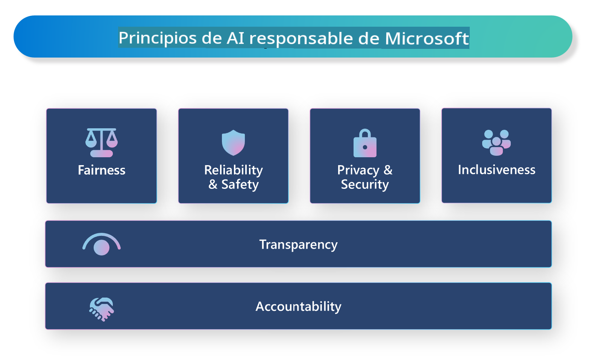

# **Introducción a la IA Responsable**

[Microsoft Responsible AI](https://www.microsoft.com/ai/responsible-ai?WT.mc_id=aiml-138114-kinfeylo) es una iniciativa que busca ayudar a desarrolladores y organizaciones a construir sistemas de IA que sean transparentes, confiables y responsables. La iniciativa ofrece orientación y recursos para desarrollar soluciones de IA responsables que se alineen con principios éticos, como la privacidad, la equidad y la transparencia. También exploraremos algunos de los desafíos y mejores prácticas asociados con la construcción de sistemas de IA responsables.

## Visión general de Microsoft Responsible AI

**Principios éticos**

Microsoft Responsible AI se guía por un conjunto de principios éticos, como la privacidad, la equidad, la transparencia, la responsabilidad y la seguridad. Estos principios están diseñados para asegurar que los sistemas de IA se desarrollen de manera ética y responsable.

**IA Transparente**

Microsoft Responsible AI enfatiza la importancia de la transparencia en los sistemas de IA. Esto incluye proporcionar explicaciones claras de cómo funcionan los modelos de IA, así como garantizar que las fuentes de datos y los algoritmos estén disponibles públicamente.

**IA Responsable**

[Microsoft Responsible AI](https://www.microsoft.com/ai/responsible-ai?WT.mc_id=aiml-138114-kinfeylo) promueve el desarrollo de sistemas de IA responsables, que pueden proporcionar información sobre cómo los modelos de IA toman decisiones. Esto puede ayudar a los usuarios a comprender y confiar en los resultados de los sistemas de IA.

**Inclusividad**

Los sistemas de IA deben diseñarse para beneficiar a todos. Microsoft busca crear IA inclusiva que considere diversas perspectivas y evite sesgos o discriminación.

**Fiabilidad y Seguridad**

Asegurar que los sistemas de IA sean fiables y seguros es crucial. Microsoft se enfoca en construir modelos robustos que funcionen de manera consistente y eviten resultados perjudiciales.

**Equidad en la IA**

Microsoft Responsible AI reconoce que los sistemas de IA pueden perpetuar sesgos si se entrenan con datos o algoritmos sesgados. La iniciativa proporciona orientación para desarrollar sistemas de IA justos que no discriminen por factores como raza, género o edad.

**Privacidad y Seguridad**

Microsoft Responsible AI enfatiza la importancia de proteger la privacidad del usuario y la seguridad de los datos en los sistemas de IA. Esto incluye implementar una fuerte encriptación de datos y controles de acceso, así como auditar regularmente los sistemas de IA en busca de vulnerabilidades.

**Responsabilidad**

Microsoft Responsible AI promueve la responsabilidad en el desarrollo y despliegue de IA. Esto incluye asegurar que los desarrolladores y las organizaciones sean conscientes de los riesgos potenciales asociados con los sistemas de IA y tomen medidas para mitigarlos.

## Mejores prácticas para construir sistemas de IA responsables

**Desarrollar modelos de IA usando conjuntos de datos diversos**

Para evitar sesgos en los sistemas de IA, es importante usar conjuntos de datos diversos que representen una variedad de perspectivas y experiencias.

**Usar técnicas de IA explicable**

Las técnicas de IA explicable pueden ayudar a los usuarios a entender cómo los modelos de IA toman decisiones, lo que puede aumentar la confianza en el sistema.

**Auditar regularmente los sistemas de IA en busca de vulnerabilidades**

Las auditorías regulares de los sistemas de IA pueden ayudar a identificar riesgos y vulnerabilidades potenciales que deben ser abordados.

**Implementar una fuerte encriptación de datos y controles de acceso**

La encriptación de datos y los controles de acceso pueden ayudar a proteger la privacidad y la seguridad del usuario en los sistemas de IA.

**Seguir principios éticos en el desarrollo de IA**

Seguir principios éticos, como la equidad, la transparencia y la responsabilidad, puede ayudar a generar confianza en los sistemas de IA y asegurar que se desarrollen de manera responsable.

## Uso de AI Studio para IA Responsable

[Azure AI Studio](https://ai.azure.com?WT.mc_id=aiml-138114-kinfeylo) es una plataforma poderosa que permite a desarrolladores y organizaciones crear rápidamente aplicaciones inteligentes, innovadoras, listas para el mercado y responsables. Aquí hay algunas características y capacidades clave de Azure AI Studio:

**APIs y Modelos Preconstruidos**

Azure AI Studio proporciona APIs y modelos preconstruidos y personalizables. Estos cubren una amplia gama de tareas de IA, incluyendo IA generativa, procesamiento de lenguaje natural para conversaciones, búsqueda, monitoreo, traducción, habla, visión y toma de decisiones.

**Flujo de Prompts**

El flujo de prompts en Azure AI Studio permite crear experiencias de IA conversacional. Permite diseñar y gestionar flujos conversacionales, facilitando la construcción de chatbots, asistentes virtuales y otras aplicaciones interactivas.

**Generación Aumentada por Recuperación (RAG)**

RAG es una técnica que combina enfoques basados en recuperación y generación. Mejora la calidad de las respuestas generadas aprovechando tanto el conocimiento preexistente (recuperación) como la generación creativa (generación).

**Métricas de Evaluación y Monitoreo para IA Generativa**

Azure AI Studio proporciona herramientas para evaluar y monitorear modelos de IA generativa. Puedes evaluar su rendimiento, equidad y otras métricas importantes para asegurar un despliegue responsable. Además, si has creado un tablero, puedes usar la interfaz de usuario sin código en Azure Machine Learning Studio para personalizar y generar un Tablero de IA Responsable y una tarjeta de puntuación asociada basada en las librerías de Python de [Responsible AI Toolbox](https://responsibleaitoolbox.ai/?WT.mc_id=aiml-138114-kinfeylo). Esta tarjeta de puntuación te ayuda a compartir ideas clave relacionadas con la equidad, la importancia de las características y otras consideraciones de despliegue responsable con partes interesadas técnicas y no técnicas.

Para usar AI Studio con IA responsable, puedes seguir estas mejores prácticas:

**Definir el problema y los objetivos de tu sistema de IA**

Antes de comenzar el proceso de desarrollo, es importante definir claramente el problema u objetivo que tu sistema de IA pretende resolver. Esto te ayudará a identificar los datos, algoritmos y recursos necesarios para construir un modelo efectivo.

**Reunir y preprocesar datos relevantes**

La calidad y cantidad de datos utilizados en el entrenamiento de un sistema de IA pueden tener un impacto significativo en su rendimiento. Por lo tanto, es importante reunir datos relevantes, limpiarlos, preprocesarlos y asegurarse de que sean representativos de la población o problema que intentas resolver.

**Elegir la evaluación apropiada**

Hay varios algoritmos de evaluación disponibles. Es importante elegir el algoritmo más apropiado basado en tus datos y problema.

**Evaluar e interpretar el modelo**

Una vez que hayas construido un modelo de IA, es importante evaluar su rendimiento usando métricas apropiadas e interpretar los resultados de manera transparente. Esto te ayudará a identificar cualquier sesgo o limitación en el modelo y hacer mejoras donde sea necesario.

**Asegurar transparencia y explicabilidad**

Los sistemas de IA deben ser transparentes y explicables para que los usuarios puedan entender cómo funcionan y cómo se toman las decisiones. Esto es especialmente importante para aplicaciones que tienen impactos significativos en la vida humana, como la salud, las finanzas y los sistemas legales.

**Monitorear y actualizar el modelo**

Los sistemas de IA deben ser monitoreados y actualizados continuamente para asegurar que permanezcan precisos y efectivos a lo largo del tiempo. Esto requiere mantenimiento continuo, pruebas y reentrenamiento del modelo.

En conclusión, Microsoft Responsible AI es una iniciativa que busca ayudar a desarrolladores y organizaciones a construir sistemas de IA que sean transparentes, confiables y responsables. Recuerda que la implementación de IA responsable es crucial, y Azure AI Studio busca hacerla práctica para las organizaciones. Siguiendo principios éticos y mejores prácticas, podemos asegurar que los sistemas de IA se desarrollen y desplieguen de manera responsable, beneficiando a la sociedad en su conjunto.

Aviso legal: La traducción fue realizada a partir de su original por un modelo de IA y puede no ser perfecta. 
Por favor, revise el resultado y haga las correcciones necesarias.