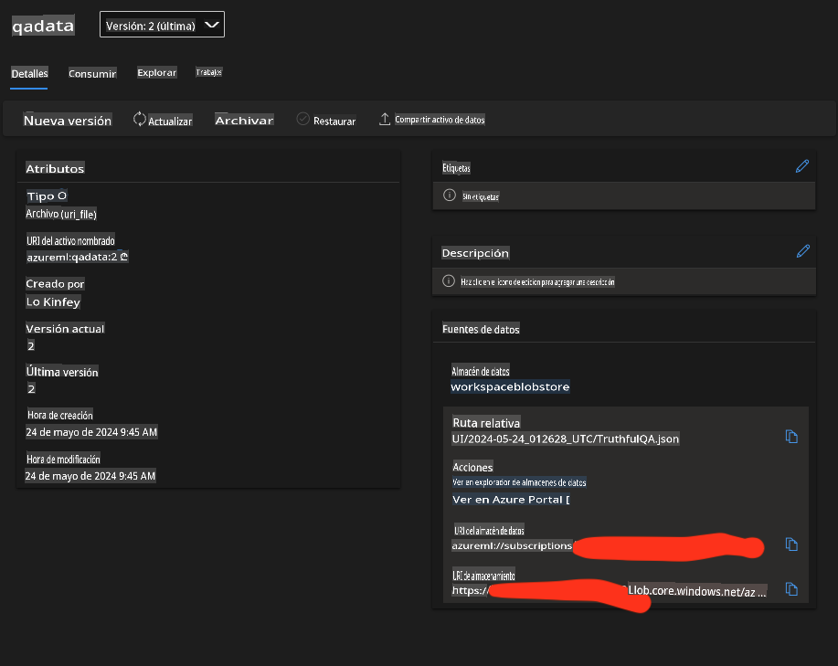

# **Prepara tus datos de la industria**

Esperamos inyectar Phi-3-mini en [TruthfulQA's data](https://github.com/sylinrl/TruthfulQA/blob/main/TruthfulQA.csv). El primer paso es importar los datos de TruthfulQA.

### **1. Cargar datos en csv y guardarlos en json**

```python
import csv
import json

csvfile = open('./datasets/TruthfulQA.csv', 'r')
jsonfile = open('./output/TruthfulQA.json', 'w')

fieldnames = ("Type","Category","Question","Best Answer","Correct Answers","Incorrect Answers","Source")

reader = csv.DictReader(csvfile, fieldnames)

for row in reader:
    json.dump(row, jsonfile)
    jsonfile.write('\n')

i = 1
data = []
with open('./output/TruthfulQA.json', 'r') as file:
    for line in file:
        print(line)
        data.append(json.loads(line))
        print(str(i))
        i+=1
```

### **2. Subir datos a los almacenes de datos de Azure ML**



### **¡Felicidades!**

Tus datos se han cargado exitosamente. A continuación, necesitas configurar tus datos y los algoritmos relacionados a través de Microsoft Olive [E2E_LoRA&QLoRA_Config_With_Olive.md](./E2E_LoRA&QLoRA_Config_With_Olive.md)

Aviso legal: La traducción fue realizada a partir del original por un modelo de IA y puede no ser perfecta. Por favor, revise el resultado y haga las correcciones necesarias.