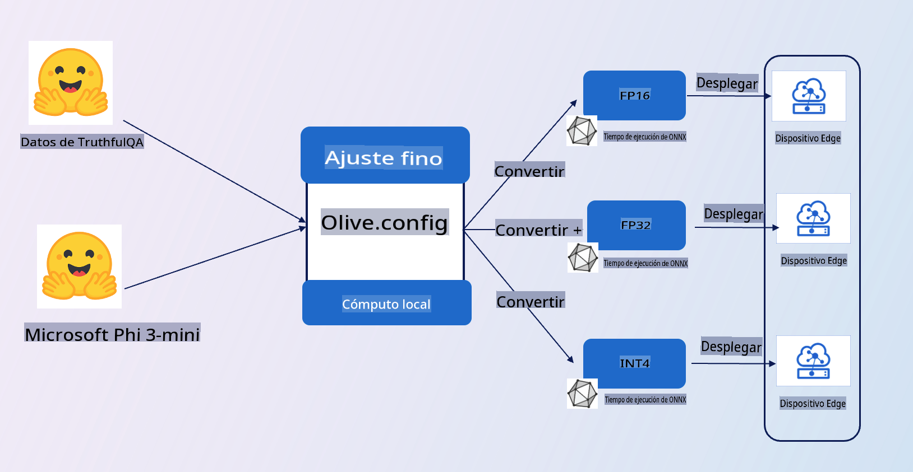

# **Introducción a la Muestra E2E**

Esta muestra importa los datos de [TruthfulQA](https://github.com/sylinrl/TruthfulQA/blob/main/TruthfulQA.csv) para ajustar el modelo Phi-3-mini. Esta es la arquitectura

## **Introducción**

Esperamos usar el conjunto de datos de [TruthfulQA](https://github.com/sylinrl/TruthfulQA/blob/main/TruthfulQA.csv) para que Phi-3-mini responda nuestras preguntas de manera más profesional. Este es tu primer proyecto E2E usando Phi-3-mini.

### **Requisitos**

1. Python 3.10+
2. CUDA 12.1
3. Linux / WSL
4. Azure ML
5. Azure Compute A100

### **Conocimientos**

1. [Aprende sobre Phi-3](../01.Introduce/Phi3Family.md)
2. [Aprende cómo usar Microsoft Olive para ajuste fino](../04.Fine-tuning/FineTuning_MicrosoftOlive.md)
3. [Aprende sobre ONNX Runtime para IA generativa](https://github.com/microsoft/onnxruntime-genai)

**Descargo de responsabilidad**:
Este documento ha sido traducido utilizando servicios de traducción automática basados en IA. Si bien nos esforzamos por lograr precisión, tenga en cuenta que las traducciones automáticas pueden contener errores o imprecisiones. El documento original en su idioma nativo debe considerarse la fuente autorizada. Para información crítica, se recomienda una traducción profesional humana. No nos hacemos responsables de ningún malentendido o interpretación errónea que surja del uso de esta traducción.