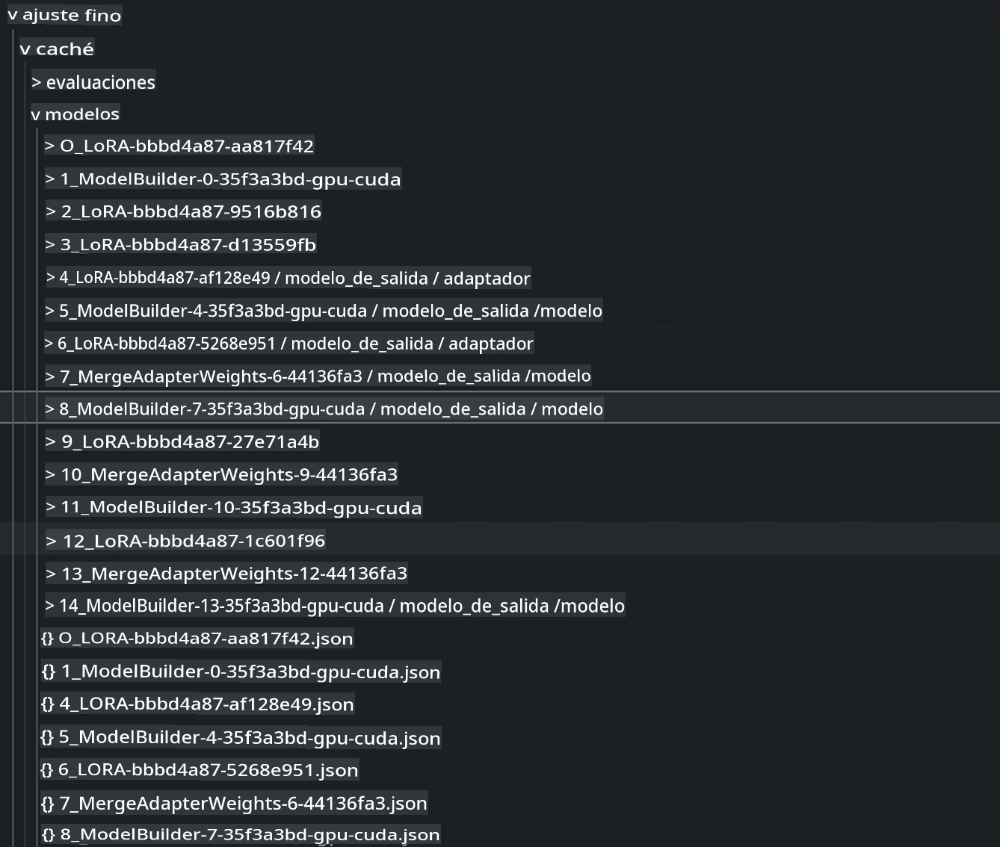
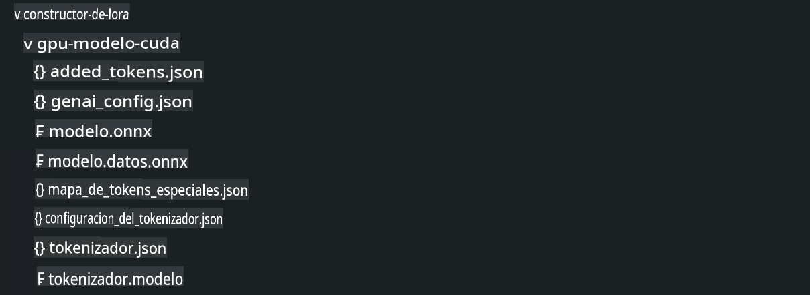

# **Usa Microsoft Olive para diseñar tus proyectos**

Si una empresa quiere tener su propio modelo vertical de industria, necesita comenzar con datos, ajuste fino y despliegue. En el contenido anterior, introdujimos el contenido de Microsoft Olive, y ahora completamos una introducción más detallada basada en el trabajo de E2E.

## **Arquitectura**

Podemos referirnos a los proyectos generados por AI Toolkit para VS Code para estructurar nuestros proyectos, incluyendo datos, modelos, formatos afinados y inferencias, como


```txt

｜-- Tu Proyecto Phi-3-mini E2E
    ｜-- datasets
    ｜-- fine-tuning
    ｜-- inferences
    ｜-- model-cache
    ｜-- gen-model
    ｜-- setup
     

```

- **datasets**

    Los datos pueden almacenarse en csv, json y otros formatos. En este ejemplo, es el dato json exportado. [dataset](./E2E_Datasets.md) 

    ***Nota*** Podemos ignorar las configuraciones relevantes aquí porque los datos ya se han subido a Azure ML (si es local podemos subir los datos aquí)

- **fine-tuning**
    
    Especifica los algoritmos QLoRA y LoRA para ajuste fino, y los parámetros relacionados

- **inferences**

    La inferencia es el modelo después del ajuste fino. Puede ser una referencia a la capa Adapter afinada, una referencia al modelo integrado con el Adapter después del ajuste fino, o puede ser un modelo cuantificado de ONNX Runtime.

- **model-cache**

    Modelos descargados vía Hugging Face CLI, aquí está el modelo Phi-3-Mini (usando Azure ML podemos ignorar este contenido, si quieres operar localmente ejecuta el siguiente script para obtener el modelo phi-3)


```bash

huggingface-cli login

# ingresa tu clave desde el portal de Hugging Face

huggingface-cli download microsoft/Phi-3-mini-4k-instruct --local-dir Tu ubicación de Phi-3-mini

```

- **gen-model**

El modelo guardado después de la operación incluye el modelo Adapter afinado, el modelo Adapter afinado integrado y el modelo cuantitativo ejecutado por ONNX Runtime.

- **setup**

Entorno de instalación requerido, por favor ejecuta esto para configurar tu Olive Env


```bash

pip install -r requirements.txt

```

## **Configuración de Microsoft Olive**

Si quieres saber más sobre la configuración de Microsoft Olive, por favor visita [Fine Tuning with Microsoft Olive](../04.Fine-tuning/FineTuning_MicrosoftOlive.md)

***Nota*** Para mantenerte actualizado, instala Microsoft Olive usando


```bash

pip install git+https://github.com/microsoft/Olive

```

## **Ejecutando Microsoft Olive en Azure ML**

**LoRA**

Este ejemplo utiliza computación en la nube, datasets en la nube, agrega olive.config en la carpeta de ajuste fino


```json

{
    "azureml_client": {
        "subscription_id": "Tu ID de Suscripción de Azure",
        "resource_group": "Tu Grupo de Recursos de Azure",
        "workspace_name": "Tu Espacio de Trabajo de Azure ML",
        "keyvault_name":  "Tu Bóveda de Claves de Azure"
    },
    "input_model":{
        "type": "PyTorchModel",
        "config": {
            "hf_config": {
                "model_name": "microsoft/Phi-3-mini-4k-instruct",
                "task": "text-generation",
                "from_pretrained_args": {
                    "trust_remote_code": true
                }
            }
        }
    },
    "systems": {
        "aml": {
            "type": "AzureML",
            "config": {
                "accelerators": [
                    {
                        "device": "gpu",
                        "execution_providers": [
                            "CUDAExecutionProvider"
                        ]
                    }
                ],
                "hf_token": true,
                "aml_compute": "Tu Clúster de Computación de Azure ML",
                "aml_docker_config": {
                    "base_image": "mcr.microsoft.com/azureml/openmpi4.1.0-cuda11.8-cudnn8-ubuntu22.04",
                    "conda_file_path": "conda.yaml"
                }
            }
        },
        "azure_arc": {
            "type": "AzureML",
            "config": {
                "accelerators": [
                    {
                        "device": "gpu",
                        "execution_providers": [
                            "CUDAExecutionProvider"
                        ]
                    }
                ],
                "aml_compute": "Tu Computación de Azure ML",
                "aml_docker_config": {
                    "base_image": "mcr.microsoft.com/azureml/openmpi4.1.0-cuda11.8-cudnn8-ubuntu22.04",
                    "conda_file_path": "conda.yaml"
                }
            }
        }
    },
    "data_configs": [
        {
            "name": "dataset_default_train",
            "type": "HuggingfaceContainer",
            "load_dataset_config": {
                "params": {
                    "data_name": "json", 
                    "data_files": {
                        "type": "azureml_datastore",
                        "config": {
                            "azureml_client": {
                                "subscription_id": "Tu ID de Suscripción de Azure",
                                "resource_group": "Tu Grupo de Recursos de Azure",
                                "workspace_name": "El nombre de tu Espacio de Trabajo de Azure ML"
                            },
                            "datastore_name": "workspaceblobstore",
                            "relative_path": "La Ubicación de tu train_data.json en Azure ML"
                        }
                    },
                    "split": "train"
                }
            },
            "pre_process_data_config": {
                "params": {
                    "dataset_type": "corpus",
                    "text_cols": [
                            "Question",
                            "Best Answer"
                    ],
                    "text_template": "<|user|>\n{Question}<|end|>\n<|assistant|>\n{Best Answer}\n<|end|>",
                    "corpus_strategy": "join",
                    "source_max_len": 2048,
                    "pad_to_max_len": false,
                    "use_attention_mask": false
                }
            }
        }
    ],
    "passes": {
        "lora": {
            "type": "LoRA",
            "config": {
                "target_modules": [
                    "o_proj",
                    "qkv_proj"
                ],
                "double_quant": true,
                "lora_r": 64,
                "lora_alpha": 64,
                "lora_dropout": 0.1,
                "train_data_config": "dataset_default_train",
                "eval_dataset_size": 0.1,
                "training_args": {
                    "seed": 0,
                    "data_seed": 42,
                    "per_device_train_batch_size": 1,
                    "per_device_eval_batch_size": 1,
                    "gradient_accumulation_steps": 4,
                    "gradient_checkpointing": false,
                    "learning_rate": 0.0001,
                    "num_train_epochs": 1000,
                    "max_steps": 100,
                    "logging_steps": 100,
                    "evaluation_strategy": "steps",
                    "eval_steps": 187,
                    "group_by_length": true,
                    "adam_beta2": 0.999,
                    "max_grad_norm": 0.3
                }
            }
        },
        "merge_adapter_weights": {
            "type": "MergeAdapterWeights"
        },
        "builder": {
            "type": "ModelBuilder",
            "config": {
                "precision": "int4"
            }
        }
    },
    "engine": {
        "log_severity_level": 0,
        "host": "aml",
        "target": "aml",
        "search_strategy": false,
        "cache_dir": "cache",
        "output_dir" : "../model-cache/models/phi3-finetuned"
    }
}


```


**QLoRA**


```json

{
    "azureml_client": {
        "subscription_id": "Tu ID de Suscripción de Azure",
        "resource_group": "Tu Grupo de Recursos de Azure",
        "workspace_name": "Tu Espacio de Trabajo de Azure ML",
        "keyvault_name":  "Tu Bóveda de Claves de Azure"
    },
    "input_model":{
        "type": "PyTorchModel",
        "config": {
            "hf_config": {
                "model_name": "microsoft/Phi-3-mini-4k-instruct",
                "task": "text-generation",
                "from_pretrained_args": {
                    "trust_remote_code": true
                }
            }
        }
    },
    "systems": {
        "aml": {
            "type": "AzureML",
            "config": {
                "accelerators": [
                    {
                        "device": "gpu",
                        "execution_providers": [
                            "CUDAExecutionProvider"
                        ]
                    }
                ],
                "hf_token": true,
                "aml_compute": "Tu Clúster de Computación de Azure ML",
                "aml_docker_config": {
                    "base_image": "mcr.microsoft.com/azureml/openmpi4.1.0-cuda11.8-cudnn8-ubuntu22.04",
                    "conda_file_path": "conda.yaml"
                }
            }
        },
        "azure_arc": {
            "type": "AzureML",
            "config": {
                "accelerators": [
                    {
                        "device": "gpu",
                        "execution_providers": [
                            "CUDAExecutionProvider"
                        ]
                    }
                ],
                "aml_compute": "Tu Computación de Azure ML",
                "aml_docker_config": {
                    "base_image": "mcr.microsoft.com/azureml/openmpi4.1.0-cuda11.8-cudnn8-ubuntu22.04",
                    "conda_file_path": "conda.yaml"
                }
            }
        }
    },
    "data_configs": [
        {
            "name": "dataset_default_train",
            "type": "HuggingfaceContainer",
            "load_dataset_config": {
                "params": {
                    "data_name": "json", 
                    "data_files": {
                        "type": "azureml_datastore",
                        "config": {
                            "azureml_client": {
                                "subscription_id": "Tu ID de Suscripción de Azure",
                                "resource_group": "Tu Grupo de Recursos de Azure",
                                "workspace_name": "El nombre de tu Espacio de Trabajo de Azure ML"
                            },
                            "datastore_name": "workspaceblobstore",
                            "relative_path": "La Ubicación de tu train_data.json en Azure ML"
                        }
                    },
                    "split": "train"
                }
            },
            "pre_process_data_config": {
                "params": {
                    "dataset_type": "corpus",
                    "text_cols": [
                            "Question",
                            "Best Answer"
                    ],
                    "text_template": "<|user|>\n{Question}<|end|>\n<|assistant|>\n{Best Answer}\n<|end|>",
                    "corpus_strategy": "join",
                    "source_max_len": 2048,
                    "pad_to_max_len": false,
                    "use_attention_mask": false
                }
            }
        }
    ],
    "passes": {
        "qlora": {
            "type": "QLoRA",
            "config": {
                "compute_dtype": "bfloat16",
                "quant_type": "nf4",
                "double_quant": true,
                "lora_r": 64,
                "lora_alpha": 64,
                "lora_dropout": 0.1,
                "train_data_config": "dataset_default_train",
                "eval_dataset_size": 0.3,
                "training_args": {
                    "seed": 0,
                    "data_seed": 42,
                    "per_device_train_batch_size": 1,
                    "per_device_eval_batch_size": 1,
                    "gradient_accumulation_steps": 4,
                    "gradient_checkpointing": false,
                    "learning_rate": 0.0001,
                    "num_train_epochs": 3,
                    "max_steps": 10,
                    "logging_steps": 10,
                    "evaluation_strategy": "steps",
                    "eval_steps": 187,
                    "group_by_length": true,
                    "adam_beta2": 0.999,
                    "max_grad_norm": 0.3
                }
            }
        },
        "merge_adapter_weights": {
            "type": "MergeAdapterWeights"
        }
    },
    "engine": {
        "log_severity_level": 0,
        "host": "aml",
        "target": "aml",
        "search_strategy": false,
        "cache_dir": "cache",
        "output_dir" : "../model-cache/models/phi3-finetuned"
    }
}


```

***Aviso*** 

- Si utilizas QLoRA, la conversión de cuantificación de ONNXRuntime-genai no es compatible por el momento.


- Aquí se debe señalar que puedes configurar los pasos anteriores según tus propias necesidades. No es necesario configurar completamente los pasos anteriores. Dependiendo de tus necesidades, puedes usar directamente los pasos del algoritmo sin ajuste fino. Finalmente, necesitas configurar los motores relevantes.

### **Ejecutando Microsoft Olive**


Después de terminar con Microsoft Olive, necesitas ejecutar este comando en la terminal 


```bash

olive run --config olive-config.json  

```

***Aviso*** 

1. Cuando se ejecuta Microsoft Olive, cada paso puede colocarse en la caché. Podemos ver los resultados de los pasos relevantes viendo el directorio de ajuste fino.




2. Proporcionamos tanto LoRA como QLoRA aquí, y puedes configurarlos según tus necesidades.

3. El entorno de ejecución recomendado es WSL / Ubuntu 22.04+.

4. ¿Por qué elegir ORT? Porque ORT puede desplegarse en dispositivos de borde. La inferencia se implementa en el entorno ORT.



Aviso legal: La traducción fue realizada a partir del original por un modelo de IA y puede no ser perfecta. 
Por favor, revise el resultado y haga las correcciones necesarias.