# Ajustar y Integrar modelos personalizados Phi-3 con Prompt flow

Este ejemplo de extremo a extremo (E2E) se basa en la guía "[Fine-Tune and Integrate Custom Phi-3 Models with Prompt Flow: Step-by-Step Guide](https://techcommunity.microsoft.com/t5/educator-developer-blog/fine-tune-and-integrate-custom-phi-3-models-with-prompt-flow/ba-p/4178612?WT.mc_id=aiml-137032-kinfeylo)" de la Comunidad Técnica de Microsoft. Introduce los procesos de ajuste fino, despliegue e integración de modelos personalizados Phi-3 con Prompt flow.

## Descripción general

En este ejemplo E2E, aprenderás cómo ajustar el modelo Phi-3 e integrarlo con Prompt flow. Aprovechando Azure Machine Learning y Prompt flow, establecerás un flujo de trabajo para desplegar y utilizar modelos de IA personalizados. Este ejemplo E2E se divide en tres escenarios:

**Escenario 1: Configurar recursos de Azure y Prepararse para el ajuste fino**

**Escenario 2: Ajustar el modelo Phi-3 y Desplegar en Azure Machine Learning Studio**

**Escenario 3: Integrar con Prompt flow y Chatear con tu modelo personalizado**

Aquí tienes una visión general de este ejemplo E2E.

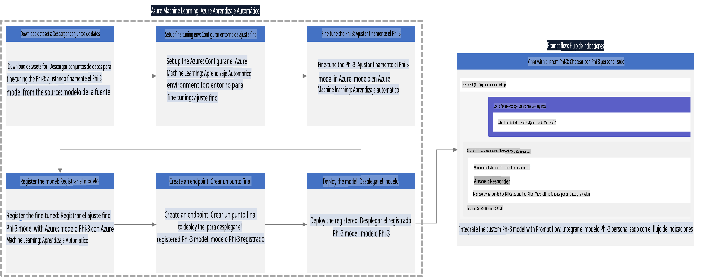

### Tabla de Contenidos

1. **[Escenario 1: Configurar recursos de Azure y Prepararse para el ajuste fino](../../../../md/06.E2ESamples)**
    - [Crear un Workspace de Azure Machine Learning](../../../../md/06.E2ESamples)
    - [Solicitar cuotas de GPU en la Suscripción de Azure](../../../../md/06.E2ESamples)
    - [Agregar asignación de roles](../../../../md/06.E2ESamples)
    - [Configurar proyecto](../../../../md/06.E2ESamples)
    - [Preparar el conjunto de datos para el ajuste fino](../../../../md/06.E2ESamples)

1. **[Escenario 2: Ajustar el modelo Phi-3 y Desplegar en Azure Machine Learning Studio](../../../../md/06.E2ESamples)**
    - [Configurar Azure CLI](../../../../md/06.E2ESamples)
    - [Ajustar el modelo Phi-3](../../../../md/06.E2ESamples)
    - [Desplegar el modelo ajustado](../../../../md/06.E2ESamples)

1. **[Escenario 3: Integrar con Prompt flow y Chatear con tu modelo personalizado](../../../../md/06.E2ESamples)**
    - [Integrar el modelo personalizado Phi-3 con Prompt flow](../../../../md/06.E2ESamples)
    - [Chatear con tu modelo personalizado](../../../../md/06.E2ESamples)

## Escenario 1: Configurar recursos de Azure y Prepararse para el ajuste fino

### Crear un Workspace de Azure Machine Learning

1. Escribe *azure machine learning* en la **barra de búsqueda** en la parte superior de la página del portal y selecciona **Azure Machine Learning** de las opciones que aparecen.

    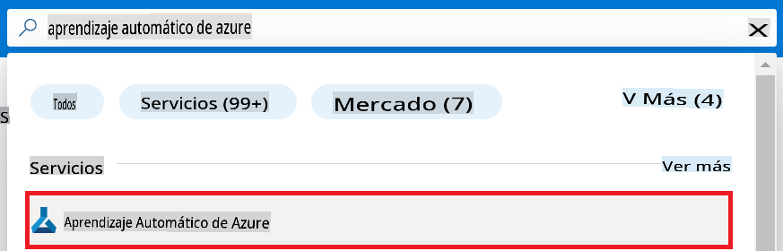

1. Selecciona **+ Crear** desde el menú de navegación.

1. Selecciona **Nuevo workspace** desde el menú de navegación.

    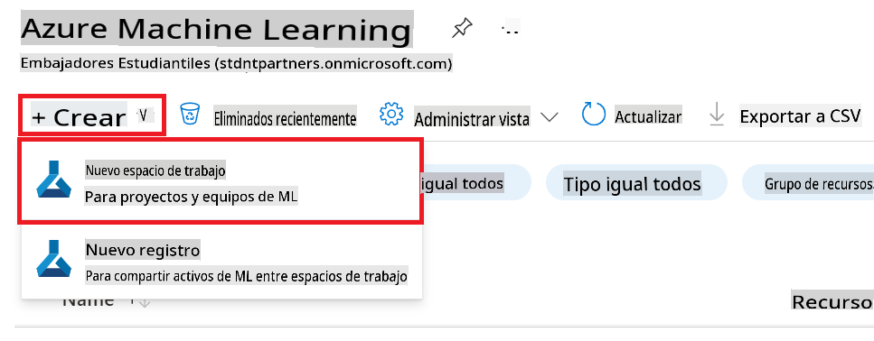

1. Realiza las siguientes tareas:

    - Selecciona tu **Suscripción** de Azure.
    - Selecciona el **Grupo de recursos** a usar (crea uno nuevo si es necesario).
    - Introduce **Nombre del Workspace**. Debe ser un valor único.
    - Selecciona la **Región** que deseas usar.
    - Selecciona la **Cuenta de almacenamiento** a usar (crea una nueva si es necesario).
    - Selecciona el **Key vault** a usar (crea uno nuevo si es necesario).
    - Selecciona los **Application insights** a usar (crea uno nuevo si es necesario).
    - Selecciona el **Registro de contenedor** a usar (crea uno nuevo si es necesario).

    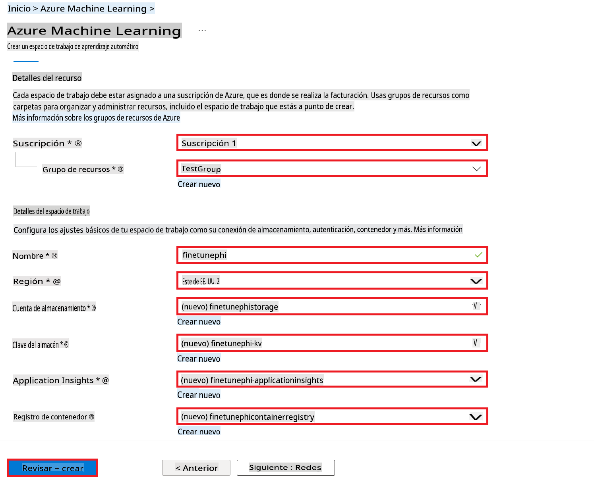

1. Selecciona **Revisar + Crear**.

1. Selecciona **Crear**.

### Solicitar cuotas de GPU en la Suscripción de Azure

En este ejemplo E2E, usarás la GPU *Standard_NC24ads_A100_v4* para el ajuste fino, lo cual requiere una solicitud de cuota, y la CPU *Standard_E4s_v3* para el despliegue, la cual no requiere una solicitud de cuota.

> [!NOTE]
>
> Solo las suscripciones Pay-As-You-Go (el tipo de suscripción estándar) son elegibles para la asignación de GPU; las suscripciones de beneficios no están actualmente soportadas.
>
> Para aquellos que usan suscripciones de beneficios (como la Suscripción Enterprise de Visual Studio) o aquellos que buscan probar rápidamente el proceso de ajuste fino y despliegue, este tutorial también proporciona orientación para ajustar con un conjunto de datos mínimo usando una CPU. Sin embargo, es importante tener en cuenta que los resultados del ajuste fino son significativamente mejores cuando se usa una GPU con conjuntos de datos más grandes.

1. Visita [Azure ML Studio](https://ml.azure.com/home?wt.mc_id=studentamb_279723).

1. Realiza las siguientes tareas para solicitar la cuota de *Standard NCADSA100v4 Family*:

    - Selecciona **Cuota** desde la pestaña lateral izquierda.
    - Selecciona la **Familia de máquinas virtuales** a usar. Por ejemplo, selecciona **Standard NCADSA100v4 Family Cluster Dedicated vCPUs**, que incluye la GPU *Standard_NC24ads_A100_v4*.
    - Selecciona **Solicitar cuota** desde el menú de navegación.

        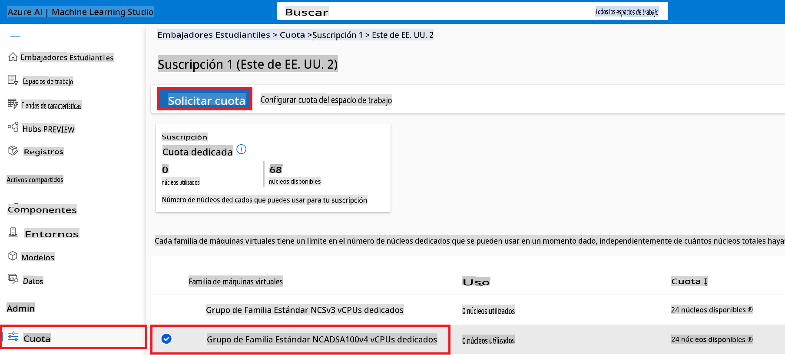

    - Dentro de la página de Solicitud de cuota, introduce el **Nuevo límite de núcleos** que deseas usar. Por ejemplo, 24.
    - Dentro de la página de Solicitud de cuota, selecciona **Enviar** para solicitar la cuota de GPU.

> [!NOTE]
> Puedes seleccionar la GPU o CPU adecuada para tus necesidades consultando el documento [Tamaños de Máquinas Virtuales en Azure](https://learn.microsoft.com/azure/virtual-machines/sizes/overview?tabs=breakdownseries%2Cgeneralsizelist%2Ccomputesizelist%2Cmemorysizelist%2Cstoragesizelist%2Cgpusizelist%2Cfpgasizelist%2Chpcsizelist).

### Agregar asignación de roles

Para ajustar y desplegar tus modelos, primero debes crear una Identidad Administrada Asignada por el Usuario (UAI) y asignarle los permisos apropiados. Esta UAI se usará para la autenticación durante el despliegue.

#### Crear Identidad Administrada Asignada por el Usuario (UAI)

1. Escribe *identidades gestionadas* en la **barra de búsqueda** en la parte superior de la página del portal y selecciona **Identidades Gestionadas** de las opciones que aparecen.

    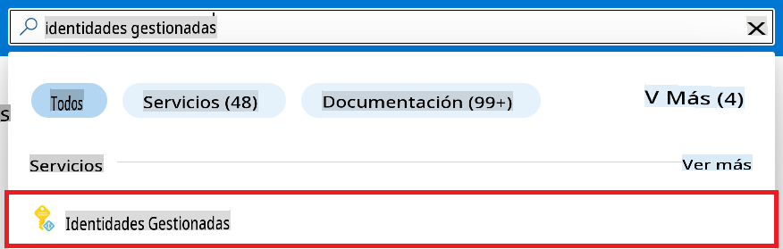

1. Selecciona **+ Crear**.

    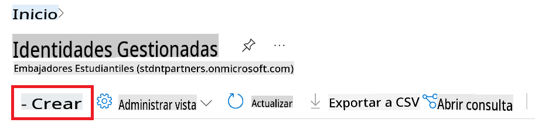

1. Realiza las siguientes tareas:

    - Selecciona tu **Suscripción** de Azure.
    - Selecciona el **Grupo de recursos** a usar (crea uno nuevo si es necesario).
    - Selecciona la **Región** que deseas usar.
    - Introduce el **Nombre**. Debe ser un valor único.

1. Selecciona **Revisar + crear**.

1. Selecciona **+ Crear**.

#### Agregar asignación de rol de Colaborador a la Identidad Gestionada

1. Navega al recurso de Identidad Gestionada que creaste.

1. Selecciona **Asignaciones de roles de Azure** desde la pestaña lateral izquierda.

1. Selecciona **+Agregar asignación de rol** desde el menú de navegación.

1. Dentro de la página de Agregar asignación de rol, realiza las siguientes tareas:
    - Selecciona el **Alcance** a **Grupo de recursos**.
    - Selecciona tu **Suscripción** de Azure.
    - Selecciona el **Grupo de recursos** a usar.
    - Selecciona el **Rol** a **Colaborador**.

    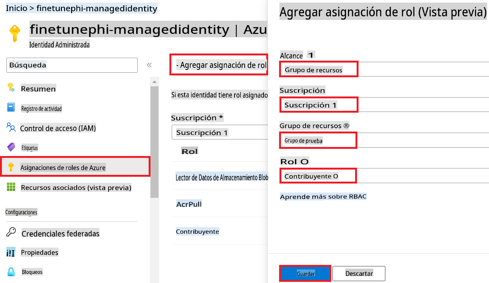

1. Selecciona **Guardar**.

#### Agregar asignación de rol de Lector de Datos de Blob de Almacenamiento a la Identidad Gestionada

1. Escribe *cuentas de almacenamiento* en la **barra de búsqueda** en la parte superior de la página del portal y selecciona **Cuentas de almacenamiento** de las opciones que aparecen.

    

1. Selecciona la cuenta de almacenamiento asociada con el workspace de Azure Machine Learning que creaste. Por ejemplo, *finetunephistorage*.

1. Realiza las siguientes tareas para navegar a la página de Agregar asignación de rol:

    - Navega a la cuenta de almacenamiento de Azure que creaste.
    - Selecciona **Control de acceso (IAM)** desde la pestaña lateral izquierda.
    - Selecciona **+ Agregar** desde el menú de navegación.
    - Selecciona **Agregar asignación de rol** desde el menú de navegación.

    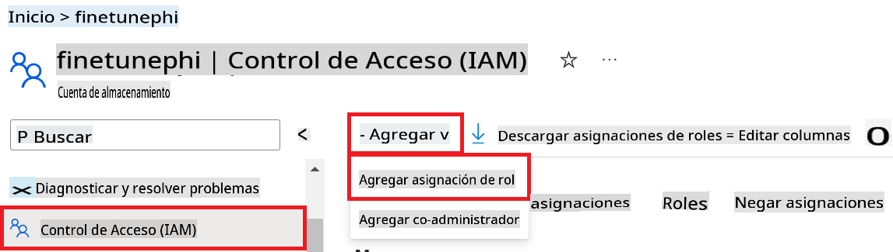

1. Dentro de la página de Agregar asignación de rol, realiza las siguientes tareas:

    - Dentro de la página de Rol, escribe *Lector de Datos de Blob de Almacenamiento* en la **barra de búsqueda** y selecciona **Lector de Datos de Blob de Almacenamiento** de las opciones que aparecen.
    - Dentro de la página de Rol, selecciona **Siguiente**.
    - Dentro de la página de Miembros, selecciona **Asignar acceso a** **Identidad gestionada**.
    - Dentro de la página de Miembros, selecciona **+ Seleccionar miembros**.
    - Dentro de la página de Seleccionar identidades gestionadas, selecciona tu **Suscripción** de Azure.
    - Dentro de la página de Seleccionar identidades gestionadas, selecciona la **Identidad gestionada** a **Gestionar Identidad**.
    - Dentro de la página de Seleccionar identidades gestionadas, selecciona la Identidad Gestionada que creaste. Por ejemplo, *finetunephi-managedidentity*.
    - Dentro de la página de Seleccionar identidades gestionadas, selecciona **Seleccionar**.

    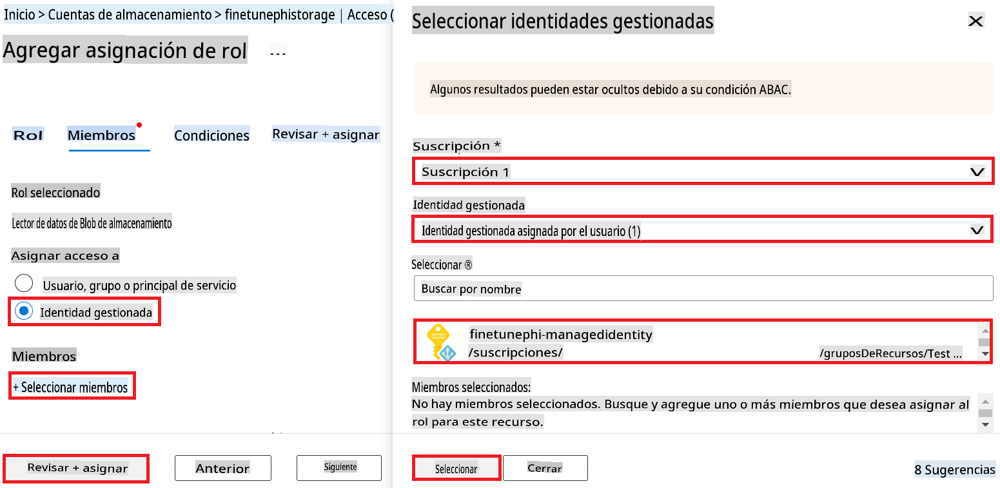

1. Selecciona **Revisar + asignar**.

#### Agregar asignación de rol AcrPull a la Identidad Gestionada

1. Escribe *registros de contenedores* en la **barra de búsqueda** en la parte superior de la página del portal y selecciona **Registros de contenedores** de las opciones que aparecen.

    

1. Selecciona el registro de contenedor asociado con el workspace de Azure Machine Learning. Por ejemplo, *finetunephicontainerregistries*

1. Realiza las siguientes tareas para navegar a la página de Agregar asignación de rol:

    - Selecciona **Control de acceso (IAM)** desde la pestaña lateral izquierda.
    - Selecciona **+ Agregar** desde el menú de navegación.
    - Selecciona **Agregar asignación de rol** desde el menú de navegación.

1. Dentro de la página de Agregar asignación de rol, realiza las siguientes tareas:

    - Dentro de la página de Rol, escribe *AcrPull* en la **barra de búsqueda** y selecciona **AcrPull** de las opciones que aparecen.
    - Dentro de la página de Rol, selecciona **Siguiente**.
    - Dentro de la página de Miembros, selecciona **Asignar acceso a** **Identidad gestionada**.
    - Dentro de la página de Miembros, selecciona **+ Seleccionar miembros**.
    - Dentro de la página de Seleccionar identidades gestionadas, selecciona tu **Suscripción** de Azure.
    - Dentro de la página de Seleccionar identidades gestionadas, selecciona la **Identidad gestionada** a **Gestionar Identidad**.
    - Dentro de la página de Seleccionar identidades gestionadas, selecciona la Identidad Gestionada que creaste. Por ejemplo, *finetunephi-managedidentity*.
    - Dentro de la página de Seleccionar identidades gestionadas, selecciona **Seleccionar**.
    - Selecciona **Revisar + asignar**.

### Configurar proyecto

Ahora, crearás una carpeta para trabajar y configurarás un entorno virtual para desarrollar un programa que interactúe con los usuarios y use el historial de chat almacenado en Azure Cosmos DB para informar sus respuestas.

#### Crear una carpeta para trabajar dentro de ella

1. Abre una ventana de terminal y escribe el siguiente comando para crear una carpeta llamada *finetune-phi* en la ruta predeterminada.

    ```console
    mkdir finetune-phi
    ```

1. Escribe el siguiente comando dentro de tu terminal para navegar a la carpeta *finetune-phi* que creaste.

    ```console
    cd finetune-phi
    ```

#### Crear un entorno virtual

1. Escribe el siguiente comando dentro de tu terminal para crear un entorno virtual llamado *.venv*.

    ```console
    python -m venv .venv
    ```

1. Escribe el siguiente comando dentro de tu terminal para activar el entorno virtual.

    ```console
    .venv\Scripts\activate.bat
    ```

> [!NOTE]
>
> Si funcionó, deberías ver *(.venv)* antes del símbolo del sistema.

#### Instalar los paquetes requeridos

1. Escribe los siguientes comandos dentro de tu terminal para instalar los paquetes requeridos.

    ```console
    pip install datasets==2.19.1
    pip install transformers==4.41.1
    pip install azure-ai-ml==1.16.0
    pip install torch==2.3.1
    pip install trl==0.9.4
    pip install promptflow==1.12.0
    ```

#### Crear archivos del proyecto

En este ejercicio, crearás los archivos esenciales para nuestro proyecto. Estos archivos incluyen scripts para descargar el conjunto de datos, configurar el entorno de Azure Machine Learning, ajustar el modelo Phi-3 y desplegar el modelo ajustado. También crearás un archivo *conda.yml* para configurar el entorno de ajuste fino.

En este ejercicio, harás lo siguiente:

- Crear un archivo *download_dataset.py* para descargar el conjunto de datos.
- Crear un archivo *setup_ml.py* para configurar el entorno de Azure Machine Learning.
- Crear un archivo *fine_tune.py* en la carpeta *finetuning_dir* para ajustar el modelo Phi-3 usando el conjunto de datos.
- Crear un archivo *conda.yml* para configurar el entorno de ajuste fino.
- Crear un archivo *deploy_model.py* para desplegar el modelo ajustado.
- Crear un archivo *integrate_with_promptflow.py*, para integrar el modelo ajustado y ejecutar el modelo usando Prompt flow.
- Crear un archivo flow.dag.yml, para configurar la estructura del flujo de trabajo para Prompt flow.
- Crear un archivo *config.py* para ingresar la información de Azure.

> [!NOTE]
>
> Estructura completa de la carpeta:
>
> ```text
> └── TuNombreDeUsuario
> .    └── finetune-phi
> .        ├── finetuning_dir
> .        │      └── fine_tune.py
> .        ├── conda.yml
> .        ├── config.py
> .        ├── deploy_model.py
> .        ├── download_dataset.py
> .        ├── flow.dag.yml
> .        ├── integrate_with_promptflow.py
> .        └── setup_ml.py
> ```

1. Abre **Visual Studio Code**.

1. Selecciona **Archivo** desde la barra de menú.

1. Selecciona **Abrir Carpeta**.

1. Selecciona la carpeta *finetune-phi* que creaste, ubicada en *C:\Users\tuNombreDeUsuario\finetune-phi*.

    

1. En el panel izquierdo de Visual Studio Code, haz clic derecho y selecciona **Nuevo Archivo** para crear un nuevo archivo llamado *download_dataset.py*.

1. En el panel izquierdo de Visual Studio Code, haz clic derecho y selecciona **Nuevo Archivo** para crear un nuevo archivo llamado *setup_ml.py*.

1. En el panel izquierdo de Visual Studio Code, haz clic derecho y selecciona **Nuevo Archivo** para crear un nuevo archivo llamado *deploy_model.py*.

    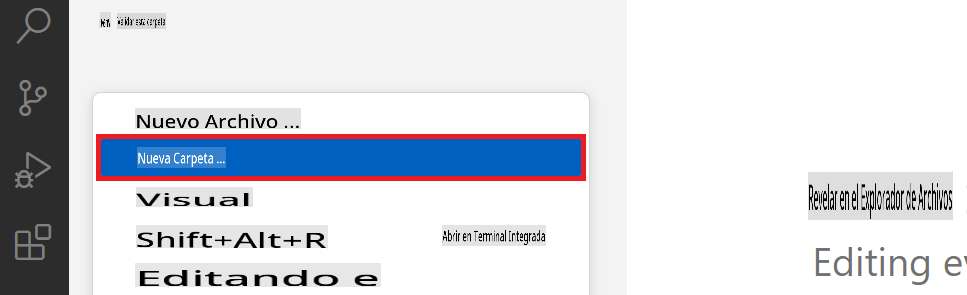

1. En el panel izquierdo de Visual Studio Code, haz clic derecho y selecciona **Nueva Carpeta** para crear una nueva carpeta llamada *finetuning_dir*.

1. En la carpeta *finetuning_dir*, crea un nuevo archivo llamado *fine_tune.py*.

#### Crear y Configurar el archivo *conda.yml*

1. En el panel izquierdo de Visual Studio Code, haz clic derecho y selecciona **Nuevo Archivo** para crear un nuevo

Aviso legal: La traducción fue realizada por un modelo de IA y puede no ser perfecta. 
Por favor, revise el resultado y haga las correcciones necesarias.