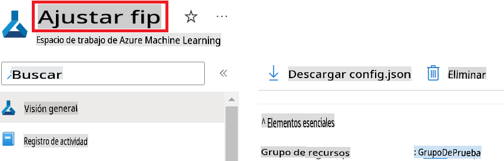
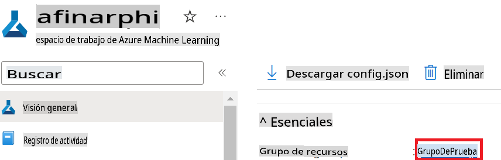
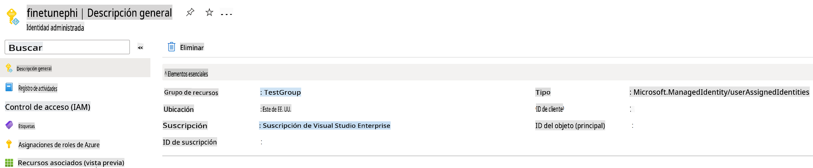
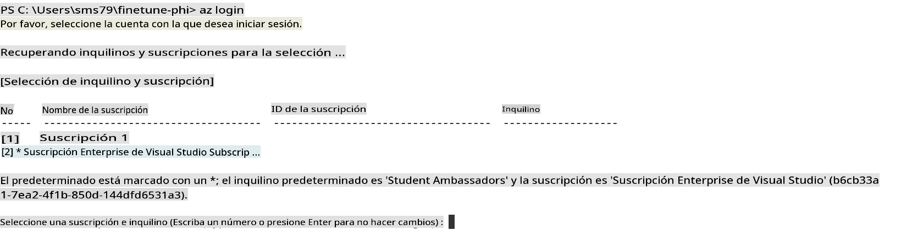

```markdown
# Ajustar y Integrar modelos personalizados Phi-3 con Prompt flow

Este ejemplo de extremo a extremo (E2E) se basa en la guía "[Fine-Tune and Integrate Custom Phi-3 Models with Prompt Flow: Step-by-Step Guide](https://techcommunity.microsoft.com/t5/educator-developer-blog/fine-tune-and-integrate-custom-phi-3-models-with-prompt-flow/ba-p/4178612?WT.mc_id=aiml-137032-kinfeylo)" de la comunidad técnica de Microsoft. Introduce los procesos de ajuste fino, despliegue e integración de modelos personalizados Phi-3 con Prompt flow.

## Resumen

En este ejemplo E2E, aprenderás cómo ajustar el modelo Phi-3 e integrarlo con Prompt flow. Aprovechando Azure Machine Learning y Prompt flow, establecerás un flujo de trabajo para desplegar y utilizar modelos de IA personalizados. Este ejemplo E2E se divide en tres escenarios:

**Escenario 1: Configurar recursos de Azure y Prepararse para el ajuste fino**

**Escenario 2: Ajustar el modelo Phi-3 y Desplegar en Azure Machine Learning Studio**

**Escenario 3: Integrar con Prompt flow y Chatear con tu modelo personalizado**

Aquí tienes un resumen de este ejemplo E2E.


### Tabla de Contenidos

1. **[Escenario 1: Configurar recursos de Azure y Prepararse para el ajuste fino](#scenario-1-set-up-azure-resources-and-prepare-for-fine-tuning)**
    - [Crear un espacio de trabajo de Azure Machine Learning](#create-an-azure-machine-learning-workspace)
    - [Solicitar cuotas de GPU en la suscripción de Azure](#request-gpu-quotas-in-azure-subscription)
    - [Agregar asignación de roles](#add-role-assignment)
    - [Configurar proyecto](#set-up-project)
    - [Preparar el conjunto de datos para el ajuste fino](#prepare-dataset-for-fine-tuning)

1. **[Escenario 2: Ajustar el modelo Phi-3 y Desplegar en Azure Machine Learning Studio](#scenario-2-fine-tune-phi-3-model-and-deploy-in-azure-machine-learning-studio)**
    - [Configurar Azure CLI](#set-up-azure-cli)
    - [Ajustar el modelo Phi-3](#fine-tune-the-phi-3-model)
    - [Desplegar el modelo ajustado](#deploy-the-fine-tuned-model)

1. **[Escenario 3: Integrar con Prompt flow y Chatear con tu modelo personalizado](#scenario-3-integrate-with-prompt-flow-and-chat-with-your-custom-model)**
    - [Integrar el modelo personalizado Phi-3 con Prompt flow](#integrate-the-custom-phi-3-model-with-prompt-flow)
    - [Chatear con tu modelo personalizado](#chat-with-your-custom-model)

## Escenario 1: Configurar recursos de Azure y Prepararse para el ajuste fino

### Crear un espacio de trabajo de Azure Machine Learning

1. Escribe *azure machine learning* en la **barra de búsqueda** en la parte superior de la página del portal y selecciona **Azure Machine Learning** de las opciones que aparecen.

    

1. Selecciona **+ Crear** desde el menú de navegación.

1. Selecciona **Nuevo espacio de trabajo** desde el menú de navegación.

    

1. Realiza las siguientes tareas:

    - Selecciona tu **Suscripción** de Azure.
    - Selecciona el **Grupo de recursos** a utilizar (crea uno nuevo si es necesario).
    - Introduce el **Nombre del espacio de trabajo**. Debe ser un valor único.
    - Selecciona la **Región** que deseas usar.
    - Selecciona la **Cuenta de almacenamiento** a utilizar (crea una nueva si es necesario).
    - Selecciona el **Key vault** a utilizar (crea uno nuevo si es necesario).
    - Selecciona **Application insights** a utilizar (crea uno nuevo si es necesario).
    - Selecciona el **Registro de contenedores** a utilizar (crea uno nuevo si es necesario).

    

1. Selecciona **Revisar + Crear**.

1. Selecciona **Crear**.

### Solicitar cuotas de GPU en la suscripción de Azure

En este ejemplo E2E, usarás la GPU *Standard_NC24ads_A100_v4* para el ajuste fino, que requiere una solicitud de cuota, y la CPU *Standard_E4s_v3* para el despliegue, que no requiere una solicitud de cuota.

> [!NOTE]
>
> Solo las suscripciones de pago por uso (el tipo de suscripción estándar) son elegibles para la asignación de GPU; las suscripciones de beneficios no son actualmente compatibles.
>
> Para aquellos que usan suscripciones de beneficios (como la suscripción de Visual Studio Enterprise) o aquellos que buscan probar rápidamente el proceso de ajuste fino y despliegue, este tutorial también proporciona orientación para ajustar con un conjunto de datos mínimo utilizando una CPU. Sin embargo, es importante notar que los resultados del ajuste fino son significativamente mejores cuando se usa una GPU con conjuntos de datos más grandes.

1. Visita [Azure ML Studio](https://ml.azure.com/home?wt.mc_id=studentamb_279723).

1. Realiza las siguientes tareas para solicitar la cuota de la familia *Standard NCADSA100v4*:

    - Selecciona **Cuota** desde la pestaña del lado izquierdo.
    - Selecciona la **Familia de máquinas virtuales** a utilizar. Por ejemplo, selecciona **Standard NCADSA100v4 Family Cluster Dedicated vCPUs**, que incluye la GPU *Standard_NC24ads_A100_v4*.
    - Selecciona **Solicitar cuota** desde el menú de navegación.

        

    - Dentro de la página de Solicitud de cuota, introduce el **Nuevo límite de núcleos** que deseas usar. Por ejemplo, 24.
    - Dentro de la página de Solicitud de cuota, selecciona **Enviar** para solicitar la cuota de GPU.

> [!NOTE]
> Puedes seleccionar la GPU o CPU adecuada para tus necesidades refiriéndote al documento [Tamaños para máquinas virtuales en Azure](https://learn.microsoft.com/azure/virtual-machines/sizes/overview?tabs=breakdownseries%2Cgeneralsizelist%2Ccomputesizelist%2Cmemorysizelist%2Cstoragesizelist%2Cgpusizelist%2Cfpgasizelist%2Chpcsizelist).

### Agregar asignación de roles

Para ajustar y desplegar tus modelos, primero debes crear una Identidad Administrada Asignada por el Usuario (UAI) y asignarle los permisos adecuados. Esta UAI se utilizará para la autenticación durante el despliegue.

#### Crear Identidad Administrada Asignada por el Usuario (UAI)

1. Escribe *identidades administradas* en la **barra de búsqueda** en la parte superior de la página del portal y selecciona **Identidades Administradas** de las opciones que aparecen.

    

1. Selecciona **+ Crear**.

    

1. Realiza las siguientes tareas:

    - Selecciona tu **Suscripción** de Azure.
    - Selecciona el **Grupo de recursos** a utilizar (crea uno nuevo si es necesario).
    - Selecciona la **Región** que deseas usar.
    - Introduce el **Nombre**. Debe ser un valor único.

1. Selecciona **Revisar + crear**.

1. Selecciona **+ Crear**.

#### Agregar asignación de rol de Colaborador a la Identidad Administrada

1. Navega al recurso de Identidad Administrada que creaste.

1. Selecciona **Asignaciones de roles de Azure** desde la pestaña del lado izquierdo.

1. Selecciona **+Agregar asignación de rol** desde el menú de navegación.

1. Dentro de la página de Agregar asignación de rol, realiza las siguientes tareas:
    - Selecciona el **Alcance** a **Grupo de recursos**.
    - Selecciona tu **Suscripción** de Azure.
    - Selecciona el **Grupo de recursos** a utilizar.
    - Selecciona el **Rol** a **Colaborador**.

    

1. Selecciona **Guardar**.

#### Agregar asignación de rol de Lector de datos de blobs de almacenamiento a la Identidad Administrada

1. Escribe *cuentas de almacenamiento* en la **barra de búsqueda** en la parte superior de la página del portal y selecciona **Cuentas de almacenamiento** de las opciones que aparecen.

    

1. Selecciona la cuenta de almacenamiento asociada con el espacio de trabajo de Azure Machine Learning que creaste. Por ejemplo, *finetunephistorage*.

1. Realiza las siguientes tareas para navegar a la página de Agregar asignación de rol:

    - Navega a la cuenta de almacenamiento de Azure que creaste.
    - Selecciona **Control de acceso (IAM)** desde la pestaña del lado izquierdo.
    - Selecciona **+ Agregar** desde el menú de navegación.
    - Selecciona **Agregar asignación de rol** desde el menú de navegación.

    

1. Dentro de la página de Agregar asignación de rol, realiza las siguientes tareas:

    - Dentro de la página de Rol, escribe *Lector de datos de blobs de almacenamiento* en la **barra de búsqueda** y selecciona **Lector de datos de blobs de almacenamiento** de las opciones que aparecen.
    - Dentro de la página de Rol, selecciona **Siguiente**.
    - Dentro de la página de Miembros, selecciona **Asignar acceso a** **Identidad administrada**.
    - Dentro de la página de Miembros, selecciona **+ Seleccionar miembros**.
    - Dentro de la página de Seleccionar identidades administradas, selecciona tu **Suscripción** de Azure.
    - Dentro de la página de Seleccionar identidades administradas, selecciona la **Identidad administrada** a **Identidad Administrada**.
    - Dentro de la página de Seleccionar identidades administradas, selecciona la Identidad Administrada que creaste. Por ejemplo, *finetunephi-managedidentity*.
    - Dentro de la página de Seleccionar identidades administradas, selecciona **Seleccionar**.

    

1. Selecciona **Revisar + asignar**.

#### Agregar asignación de rol AcrPull a la Identidad Administrada

1. Escribe *registros de contenedores* en la **barra de búsqueda** en la parte superior de la página del portal y selecciona **Registros de contenedores** de las opciones que aparecen.

    

1. Selecciona el registro de contenedores asociado con el espacio de trabajo de Azure Machine Learning. Por ejemplo, *finetunephicontainerregistries*.

1. Realiza las siguientes tareas para navegar a la página de Agregar asignación de rol:

    - Selecciona **Control de acceso (IAM)** desde la pestaña del lado izquierdo.
    - Selecciona **+ Agregar** desde el menú de navegación.
    - Selecciona **Agregar asignación de rol** desde el menú de navegación.

1. Dentro de la página de Agregar asignación de rol, realiza las siguientes tareas:

    - Dentro de la página de Rol, escribe *AcrPull* en la **barra de búsqueda** y selecciona **AcrPull** de las opciones que aparecen.
    - Dentro de la página de Rol, selecciona **Siguiente**.
    - Dentro de la página de Miembros, selecciona **Asignar acceso a** **Identidad administrada**.
    - Dentro de la página de Miembros, selecciona **+ Seleccionar miembros**.
    - Dentro de la página de Seleccionar identidades administradas, selecciona tu **Suscripción** de Azure.
    - Dentro de la página de Seleccionar identidades administradas, selecciona la **Identidad administrada** a **Identidad Administrada**.
    - Dentro de la página de Seleccionar identidades administradas, selecciona la Identidad Administrada que creaste. Por ejemplo, *finetunephi-managedidentity*.
    - Dentro de la página de Seleccionar identidades administradas, selecciona **Seleccionar**.
    - Selecciona **Revisar + asignar**.

### Configurar proyecto

Ahora, crearás una carpeta para trabajar y configurarás un entorno virtual para desarrollar un programa que interactúe con los usuarios y use el historial de chat almacenado en Azure Cosmos DB para informar sus respuestas.

#### Crear una carpeta para trabajar dentro de ella

1. Abre una ventana de terminal y escribe el siguiente comando para crear una carpeta llamada *finetune-phi* en la ruta predeterminada.

    ```console
    mkdir finetune-phi
    ```

1. Escribe el siguiente comando dentro de tu terminal para navegar a la carpeta *finetune-phi* que creaste.

    ```console
    cd finetune-phi
    ```

#### Crear un entorno virtual

1. Escribe el siguiente comando dentro de tu terminal para crear un entorno virtual llamado *.venv*.

    ```console
    python -m venv .venv
    ```

1. Escribe el siguiente comando dentro de tu terminal para activar el entorno virtual.

    ```console
    .venv\Scripts\activate.bat
    ```

> [!NOTE]
>
> Si funcionó, deberías ver *(.venv)* antes del símbolo del sistema.

#### Instalar los paquetes requeridos

1. Escribe los siguientes comandos dentro de tu terminal para instalar los paquetes requeridos.

    ```console
    pip install datasets==2.19.1
    pip install transformers==4.41.1
    pip install azure-ai-ml==1.16.0
    pip install torch==2.3.1
    pip install trl==0.9.4
    pip install promptflow==1.12.0
    ```

#### Crear archivos del proyecto

En este ejercicio, crearás los archivos esenciales para nuestro proyecto. Estos archivos incluyen scripts para descargar el conjunto de datos, configurar el entorno de Azure Machine Learning, ajustar el modelo Phi-3 y desplegar el modelo ajustado. También crearás un archivo *conda.yml* para configurar el entorno de ajuste fino.

En este ejercicio, harás lo siguiente:

- Crear un archivo *download_dataset.py* para descargar el conjunto de datos.
- Crear un archivo *setup_ml.py* para configurar el entorno de Azure Machine Learning.
- Crear un archivo *fine_tune.py* en la carpeta *finetuning_dir* para ajustar el modelo Phi-3 utilizando el conjunto de datos.
- Crear un archivo *conda.yml* para configurar el entorno de ajuste fino.
- Crear un archivo *deploy_model.py* para desplegar el modelo ajustado.
- Crear un archivo *integrate_with_promptflow.py*, para integrar el modelo ajustado y ejecutar el modelo utilizando Prompt flow.
- Crear un archivo flow.dag.yml, para configurar la estructura del flujo de trabajo para Prompt flow.
- Crear un archivo *config.py* para ingresar la información de Azure.

> [!NOTE]
>
> Estructura completa de la carpeta:
>
> ```text
> └── TuNombreDeUsuario
> .    └── finetune-phi
> .        ├── finetuning_dir
> .        │      └── fine_tune.py
> .        ├── conda.yml
> .        ├── config.py
> .        ├── deploy_model.py
> .        ├── download_dataset.py
> .        ├── flow.dag.yml
> .        ├── integrate_with_promptflow.py
> .        └── setup_ml.py
> ```

1. Abre **Visual Studio Code**.

1. Selecciona **Archivo** en la barra de menú.

1. Selecciona **Abrir Carpeta**.

1. Selecciona la carpeta *finetune-phi* que creaste, que está ubicada en *C:\Users\TuNombreDeUsuario\finetune-phi*.

    

1. En el panel izquierdo de Visual Studio Code, haz clic derecho y selecciona **Nuevo Archivo** para crear un nuevo archivo llamado *download_dataset.py*.

1. En el panel izquierdo de Visual Studio Code, haz clic derecho y selecciona **Nuevo Archivo** para crear un nuevo archivo llamado *setup_ml.py*.

1. En el panel izquierdo de Visual Studio Code, haz clic derecho y selecciona **Nuevo Archivo** para crear un nuevo archivo llamado *deploy_model.py*.

    

1. En el panel izquierdo de Visual Studio Code, haz clic derecho y selecciona **Nueva Carpeta** para crear una nueva carpeta llamada *finetuning_dir*.

1. En la carpeta *finetuning_dir*, crea un nuevo archivo llamado *fine_tune.py*.

#### Crear y Configurar el archivo *conda.yml*

1. En el panel izquierdo de Visual Studio Code, haz clic derecho y selecciona **Nuevo Archivo** para crear un nuevo archivo llamado *conda.yml*.

1. Agrega el siguiente código al archivo *conda.yml* para configurar el entorno de ajuste fino para el
```python
    # Configuraciones de Azure
    AZURE_SUBSCRIPTION_ID = "your_subscription_id"
    AZURE_RESOURCE_GROUP_NAME = "your_resource_group_name" # "TestGroup"

    # Configuraciones de Azure Machine Learning
    AZURE_ML_WORKSPACE_NAME = "your_workspace_name" # "finetunephi-workspace"

    # Configuraciones de Identidad Administrada de Azure
    AZURE_MANAGED_IDENTITY_CLIENT_ID = "your_azure_managed_identity_client_id"
    AZURE_MANAGED_IDENTITY_NAME = "your_azure_managed_identity_name" # "finetunephi-mangedidentity"
    AZURE_MANAGED_IDENTITY_RESOURCE_ID = f"/subscriptions/{AZURE_SUBSCRIPTION_ID}/resourceGroups/{AZURE_RESOURCE_GROUP_NAME}/providers/Microsoft.ManagedIdentity/userAssignedIdentities/{AZURE_MANAGED_IDENTITY_NAME}"

    # Rutas de archivos del conjunto de datos
    TRAIN_DATA_PATH = "data/train_data.jsonl"
    TEST_DATA_PATH = "data/test_data.jsonl"

    # Configuraciones del modelo ajustado
    AZURE_MODEL_NAME = "your_fine_tuned_model_name" # "finetune-phi-model"
    AZURE_ENDPOINT_NAME = "your_fine_tuned_model_endpoint_name" # "finetune-phi-endpoint"
    AZURE_DEPLOYMENT_NAME = "your_fine_tuned_model_deployment_name" # "finetune-phi-deployment"

    AZURE_ML_API_KEY = "your_fine_tuned_model_api_key"
    AZURE_ML_ENDPOINT = "your_fine_tuned_model_endpoint_uri" # "https://{your-endpoint-name}.{your-region}.inference.ml.azure.com/score"
```
#### Agregar variables de entorno de Azure

1. Realiza las siguientes tareas para agregar el ID de Suscripción de Azure:

    - Escribe *subscriptions* en la **barra de búsqueda** en la parte superior de la página del portal y selecciona **Subscriptions** de las opciones que aparecen.
    - Selecciona la Suscripción de Azure que estás utilizando actualmente.
    - Copia y pega tu ID de Suscripción en el archivo *config.py*.

    

1. Realiza las siguientes tareas para agregar el Nombre del Workspace de Azure:

    - Navega al recurso de Azure Machine Learning que creaste.
    - Copia y pega el nombre de tu cuenta en el archivo *config.py*.

    

1. Realiza las siguientes tareas para agregar el Nombre del Grupo de Recursos de Azure:

    - Navega al recurso de Azure Machine Learning que creaste.
    - Copia y pega el Nombre del Grupo de Recursos de Azure en el archivo *config.py*.

    

1. Realiza las siguientes tareas para agregar el nombre de la Identidad Administrada de Azure:

    - Navega al recurso de Identidades Administradas que creaste.
    - Copia y pega el nombre de tu Identidad Administrada de Azure en el archivo *config.py*.

    

### Preparar el conjunto de datos para el ajuste fino

En este ejercicio, ejecutarás el archivo *download_dataset.py* para descargar los conjuntos de datos *ULTRACHAT_200k* en tu entorno local. Luego utilizarás estos conjuntos de datos para ajustar el modelo Phi-3 en Azure Machine Learning.

#### Descargar tu conjunto de datos usando *download_dataset.py*

1. Abre el archivo *download_dataset.py* en Visual Studio Code.

1. Agrega el siguiente código en *download_dataset.py*.

    ```python
    import json
    import os
    from datasets import load_dataset
    from config import (
        TRAIN_DATA_PATH,
        TEST_DATA_PATH)

    def load_and_split_dataset(dataset_name, config_name, split_ratio):
        """
        Cargar y dividir un conjunto de datos.
        """
        # Cargar el conjunto de datos con el nombre, configuración y proporción de división especificados
        dataset = load_dataset(dataset_name, config_name, split=split_ratio)
        print(f"Tamaño del conjunto de datos original: {len(dataset)}")
        
        # Dividir el conjunto de datos en conjuntos de entrenamiento y prueba (80% entrenamiento, 20% prueba)
        split_dataset = dataset.train_test_split(test_size=0.2)
        print(f"Tamaño del conjunto de datos de entrenamiento: {len(split_dataset['train'])}")
        print(f"Tamaño del conjunto de datos de prueba: {len(split_dataset['test'])}")
        
        return split_dataset

    def save_dataset_to_jsonl(dataset, filepath):
        """
        Guardar un conjunto de datos en un archivo JSONL.
        """
        # Crear el directorio si no existe
        os.makedirs(os.path.dirname(filepath), exist_ok=True)
        
        # Abrir el archivo en modo escritura
        with open(filepath, 'w', encoding='utf-8') as f:
            # Iterar sobre cada registro en el conjunto de datos
            for record in dataset:
                # Volcar el registro como un objeto JSON y escribirlo en el archivo
                json.dump(record, f)
                # Escribir un carácter de nueva línea para separar los registros
                f.write('\n')
        
        print(f"Conjunto de datos guardado en {filepath}")

    def main():
        """
        Función principal para cargar, dividir y guardar el conjunto de datos.
        """
        # Cargar y dividir el conjunto de datos ULTRACHAT_200k con una configuración específica y proporción de división
        dataset = load_and_split_dataset("HuggingFaceH4/ultrachat_200k", 'default', 'train_sft[:1%]')
        
        # Extraer los conjuntos de datos de entrenamiento y prueba de la división
        train_dataset = dataset['train']
        test_dataset = dataset['test']

        # Guardar el conjunto de datos de entrenamiento en un archivo JSONL
        save_dataset_to_jsonl(train_dataset, TRAIN_DATA_PATH)
        
        # Guardar el conjunto de datos de prueba en un archivo JSONL separado
        save_dataset_to_jsonl(test_dataset, TEST_DATA_PATH)

    if __name__ == "__main__":
        main()

    ```

> [!TIP]
>
> **Guía para ajuste fino con un conjunto de datos mínimo usando una CPU**
>
> Si deseas usar una CPU para el ajuste fino, este enfoque es ideal para aquellos con suscripciones de beneficios (como Visual Studio Enterprise Subscription) o para probar rápidamente el proceso de ajuste fino y despliegue.
>
> Reemplaza `dataset = load_and_split_dataset("HuggingFaceH4/ultrachat_200k", 'default', 'train_sft[:1%]')` con `dataset = load_and_split_dataset("HuggingFaceH4/ultrachat_200k", 'default', 'train_sft[:10]')`
>

1. Escribe el siguiente comando en tu terminal para ejecutar el script y descargar el conjunto de datos a tu entorno local.

    ```console
    python download_data.py
    ```

1. Verifica que los conjuntos de datos se guardaron correctamente en tu directorio local *finetune-phi/data*.

> [!NOTE]
>
> **Tamaño del conjunto de datos y tiempo de ajuste fino**
>
> En este ejemplo E2E, utilizas solo el 1% del conjunto de datos (`train_sft[:1%]`). Esto reduce significativamente la cantidad de datos, acelerando tanto el proceso de carga como el de ajuste fino. Puedes ajustar el porcentaje para encontrar el equilibrio adecuado entre el tiempo de entrenamiento y el rendimiento del modelo. Usar un subconjunto más pequeño del conjunto de datos reduce el tiempo necesario para el ajuste fino, haciendo el proceso más manejable para un ejemplo E2E.

## Escenario 2: Ajustar el modelo Phi-3 y Desplegar en Azure Machine Learning Studio

### Configurar Azure CLI

Necesitas configurar Azure CLI para autenticar tu entorno. Azure CLI te permite gestionar recursos de Azure directamente desde la línea de comandos y proporciona las credenciales necesarias para que Azure Machine Learning acceda a estos recursos. Para empezar, instala [Azure CLI](https://learn.microsoft.com/cli/azure/install-azure-cli)

1. Abre una ventana de terminal y escribe el siguiente comando para iniciar sesión en tu cuenta de Azure.

    ```console
    az login
    ```

1. Selecciona tu cuenta de Azure para usar.

1. Selecciona tu suscripción de Azure para usar.

    

> [!TIP]
>
> Si tienes problemas para iniciar sesión en Azure, intenta usar un código de dispositivo. Abre una ventana de terminal y escribe el siguiente comando para iniciar sesión en tu cuenta de Azure:
>
> ```console
> az login --use-device-code
> ```
>

### Ajustar el modelo Phi-3

En este ejercicio, ajustarás el modelo Phi-3 usando el conjunto de datos proporcionado. Primero, definirás el proceso de ajuste fino en el archivo *fine_tune.py*. Luego, configurarás el entorno de Azure Machine Learning e iniciarás el proceso de ajuste fino ejecutando el archivo *setup_ml.py*. Este script asegura que el ajuste fino ocurra dentro del entorno de Azure Machine Learning.

Al ejecutar *setup_ml.py*, ejecutarás el proceso de ajuste fino en el entorno de Azure Machine Learning.

#### Agregar código al archivo *fine_tune.py*

1. Navega a la carpeta *finetuning_dir* y abre el archivo *fine_tune.py* en Visual Studio Code.

1. Agrega el siguiente código en *fine_tune.py*.

    ```python
    import argparse
    import sys
    import logging
    import os
    from datasets import load_dataset
    import torch
    import mlflow
    from transformers import AutoModelForCausalLM, AutoTokenizer, TrainingArguments
    from trl import SFTTrainer

    # Para evitar el error INVALID_PARAMETER_VALUE en MLflow, deshabilitar la integración de MLflow
    os.environ["DISABLE_MLFLOW_INTEGRATION"] = "True"

    # Configuración de registro
    logging.basicConfig(
        format="%(asctime)s - %(levelname)s - %(name)s - %(message)s",
        datefmt="%Y-%m-%d %H:%M:%S",
        handlers=[logging.StreamHandler(sys.stdout)],
        level=logging.WARNING
    )
    logger = logging.getLogger(__name__)

    def initialize_model_and_tokenizer(model_name, model_kwargs):
        """
        Inicializar el modelo y el tokenizador con el nombre del modelo preentrenado y argumentos dados.
        """
        model = AutoModelForCausalLM.from_pretrained(model_name, **model_kwargs)
        tokenizer = AutoTokenizer.from_pretrained(model_name)
        tokenizer.model_max_length = 2048
        tokenizer.pad_token = tokenizer.unk_token
        tokenizer.pad_token_id = tokenizer.convert_tokens_to_ids(tokenizer.pad_token)
        tokenizer.padding_side = 'right'
        return model, tokenizer

    def apply_chat_template(example, tokenizer):
        """
        Aplicar una plantilla de chat para tokenizar mensajes en el ejemplo.
        """
        messages = example["messages"]
        if messages[0]["role"] != "system":
            messages.insert(0, {"role": "system", "content": ""})
        example["text"] = tokenizer.apply_chat_template(
            messages, tokenize=False, add_generation_prompt=False
        )
        return example

    def load_and_preprocess_data(train_filepath, test_filepath, tokenizer):
        """
        Cargar y preprocesar el conjunto de datos.
        """
        train_dataset = load_dataset('json', data_files=train_filepath, split='train')
        test_dataset = load_dataset('json', data_files=test_filepath, split='train')
        column_names = list(train_dataset.features)

        train_dataset = train_dataset.map(
            apply_chat_template,
            fn_kwargs={"tokenizer": tokenizer},
            num_proc=10,
            remove_columns=column_names,
            desc="Aplicando plantilla de chat al conjunto de datos de entrenamiento",
        )

        test_dataset = test_dataset.map(
            apply_chat_template,
            fn_kwargs={"tokenizer": tokenizer},
            num_proc=10,
            remove_columns=column_names,
            desc="Aplicando plantilla de chat al conjunto de datos de prueba",
        )

        return train_dataset, test_dataset

    def train_and_evaluate_model(train_dataset, test_dataset, model, tokenizer, output_dir):
        """
        Entrenar y evaluar el modelo.
        """
        training_args = TrainingArguments(
            bf16=True,
            do_eval=True,
            output_dir=output_dir,
            eval_strategy="epoch",
            learning_rate=5.0e-06,
            logging_steps=20,
            lr_scheduler_type="cosine",
            num_train_epochs=3,
            overwrite_output_dir=True,
            per_device_eval_batch_size=4,
            per_device_train_batch_size=4,
            remove_unused_columns=True,
            save_steps=500,
            seed=0,
            gradient_checkpointing=True,
            gradient_accumulation_steps=1,
            warmup_ratio=0.2,
        )

        trainer = SFTTrainer(
            model=model,
            args=training_args,
            train_dataset=train_dataset,
            eval_dataset=test_dataset,
            max_seq_length=2048,
            dataset_text_field="text",
            tokenizer=tokenizer,
            packing=True
        )

        train_result = trainer.train()
        trainer.log_metrics("train", train_result.metrics)

        mlflow.transformers.log_model(
            transformers_model={"model": trainer.model, "tokenizer": tokenizer},
            artifact_path=output_dir,
        )

        tokenizer.padding_side = 'left'
        eval_metrics = trainer.evaluate()
        eval_metrics["eval_samples"] = len(test_dataset)
        trainer.log_metrics("eval", eval_metrics)

    def main(train_file, eval_file, model_output_dir):
        """
        Función principal para ajustar el modelo.
        """
        model_kwargs = {
            "use_cache": False,
            "trust_remote_code": True,
            "torch_dtype": torch.bfloat16,
            "device_map": None,
            "attn_implementation": "eager"
        }

        # pretrained_model_name = "microsoft/Phi-3-mini-4k-instruct"
        pretrained_model_name = "microsoft/Phi-3.5-mini-instruct"

        with mlflow.start_run():
            model, tokenizer = initialize_model_and_tokenizer(pretrained_model_name, model_kwargs)
            train_dataset, test_dataset = load_and_preprocess_data(train_file, eval_file, tokenizer)
            train_and_evaluate_model(train_dataset, test_dataset, model, tokenizer, model_output_dir)

    if __name__ == "__main__":
        parser = argparse.ArgumentParser()
        parser.add_argument("--train-file", type=str, required=True, help="Ruta al conjunto de datos de entrenamiento")
        parser.add_argument("--eval-file", type=str, required=True, help="Ruta al conjunto de datos de evaluación")
        parser.add_argument("--model_output_dir", type=str, required=True, help="Directorio para guardar el modelo ajustado")
        args = parser.parse_args()
        main(args.train_file, args.eval_file, args.model_output_dir)

    ```

1. Guarda y cierra el archivo *fine_tune.py*.

> [!TIP]
> **Puedes ajustar el modelo Phi-3.5**
>
> En el archivo *fine_tune.py*, puedes cambiar el `pretrained_model_name` de `"microsoft/Phi-3-mini-4k-instruct"` a cualquier modelo que desees ajustar. Por ejemplo, si lo cambias a `"microsoft/Phi-3.5-mini-instruct"`, estarás utilizando el modelo Phi-3.5-mini-instruct para el ajuste fino. Para encontrar y usar el nombre del modelo que prefieras, visita [Hugging Face](https://huggingface.co/), busca el modelo que te interese y luego copia y pega su nombre en el campo `pretrained_model_name` en tu script.
>
> :::image type="content" source="../../imgs/03/FineTuning-PromptFlow/finetunephi3.5.png" alt-text="Fine tune Phi-3.5.":::
>

#### Agregar código al archivo *setup_ml.py*

1. Abre el archivo *setup_ml.py* en Visual Studio Code.

1. Agrega el siguiente código en *setup_ml.py*.


Aviso legal: La traducción fue realizada a partir del original por un modelo de IA y puede no ser perfecta. 
Por favor, revise el resultado y haga las correcciones necesarias.