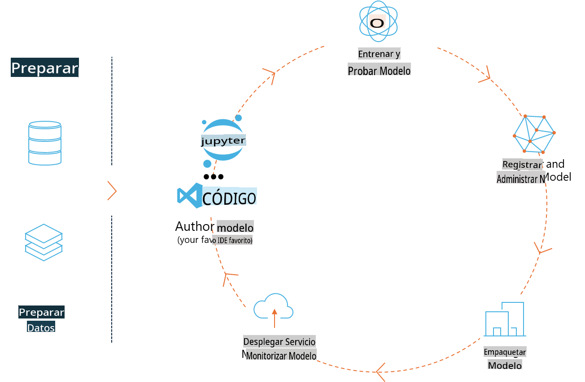
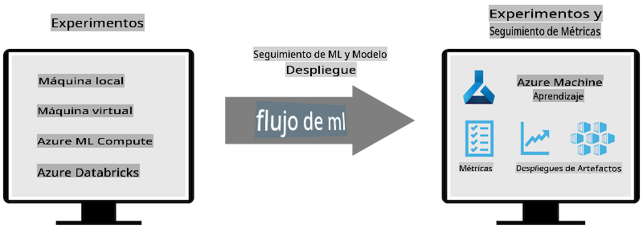
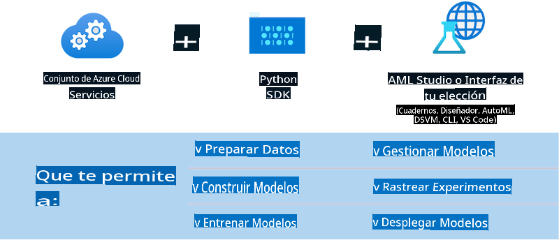

# MLflow

[MLflow](https://mlflow.org/) es una plataforma de código abierto diseñada para gestionar el ciclo de vida completo del aprendizaje automático.



MLFlow se utiliza para gestionar el ciclo de vida del ML, incluyendo experimentación, reproducibilidad, despliegue y un registro central de modelos. Actualmente, MLFlow ofrece cuatro componentes.

- **MLflow Tracking:** Registrar y consultar experimentos, código, configuración de datos y resultados.
- **MLflow Projects:** Empaquetar el código de ciencia de datos en un formato para reproducir ejecuciones en cualquier plataforma.
- **Mlflow Models:** Desplegar modelos de aprendizaje automático en diversos entornos de servicio.
- **Model Registry:** Almacenar, anotar y gestionar modelos en un repositorio central.

Incluye capacidades para rastrear experimentos, empaquetar código en ejecuciones reproducibles, y compartir y desplegar modelos. MLFlow está integrado en Databricks y soporta una variedad de bibliotecas de ML, lo que lo hace independiente de la biblioteca. Puede ser utilizado con cualquier biblioteca de aprendizaje automático y en cualquier lenguaje de programación, ya que proporciona una API REST y CLI para mayor comodidad.



Las características clave de MLFlow incluyen:

- **Seguimiento de Experimentos:** Registrar y comparar parámetros y resultados.
- **Gestión de Modelos:** Desplegar modelos en varias plataformas de servicio e inferencia.
- **Registro de Modelos:** Gestionar colaborativamente el ciclo de vida de los Modelos MLflow, incluyendo versionado y anotaciones.
- **Proyectos:** Empaquetar código de ML para compartir o usar en producción.

MLFlow también soporta el ciclo de MLOps, que incluye preparar datos, registrar y gestionar modelos, empaquetar modelos para ejecución, desplegar servicios y monitorear modelos. Su objetivo es simplificar el proceso de pasar de un prototipo a un flujo de trabajo de producción, especialmente en entornos de nube y edge.

## Escenario E2E - Construyendo un envoltorio y usando Phi-3 como un modelo MLFlow

En este ejemplo E2E, demostraremos dos enfoques diferentes para construir un envoltorio alrededor del pequeño modelo de lenguaje Phi-3 (SLM) y luego ejecutarlo como un modelo MLFlow ya sea localmente o en la nube, por ejemplo, en el espacio de trabajo de Azure Machine Learning.



| Proyecto | Descripción | Ubicación |
| ------------ | ----------- | -------- |
| Transformer Pipeline | Transformer Pipeline es la opción más fácil para construir un envoltorio si deseas usar un modelo de HuggingFace con el sabor experimental de transformadores de MLFlow. | [**TransformerPipeline.ipynb**](../../../../code/06.E2E/E2E_Phi-3-MLflow_TransformerPipeline.ipynb) |
| Custom Python Wrapper | En el momento de escribir esto, el pipeline de transformadores no soportaba la generación de envoltorios MLFlow para modelos de HuggingFace en formato ONNX, incluso con el paquete experimental optimum de Python. Para casos como este, puedes construir tu propio envoltorio de Python para el modo MLFlow. | [**CustomPythonWrapper.ipynb**](../../../../code/06.E2E/E2E_Phi-3-MLflow_CustomPythonWrapper.ipynb) |

## Proyecto: Transformer Pipeline

1. Necesitarás los paquetes de Python relevantes de MLFlow y HuggingFace:

    ``` Python
    import mlflow
    import transformers
    ```

2. A continuación, debes iniciar un pipeline de transformadores refiriéndote al modelo Phi-3 objetivo en el registro de HuggingFace. Como se puede ver en la tarjeta del modelo _Phi-3-mini-4k-instruct_, su tarea es del tipo "Generación de Texto":

    ``` Python
    pipeline = transformers.pipeline(
        task = "text-generation",
        model = "microsoft/Phi-3-mini-4k-instruct"
    )
    ```

3. Ahora puedes guardar el pipeline de transformadores de tu modelo Phi-3 en formato MLFlow y proporcionar detalles adicionales como la ruta de artefactos objetivo, configuraciones específicas del modelo y tipo de API de inferencia:

    ``` Python
    model_info = mlflow.transformers.log_model(
        transformers_model = pipeline,
        artifact_path = "phi3-mlflow-model",
        model_config = model_config,
        task = "llm/v1/chat"
    )
    ```

## Proyecto: Custom Python Wrapper

1. Podemos utilizar aquí la [API generate() de ONNX Runtime](https://github.com/microsoft/onnxruntime-genai) de Microsoft para la inferencia del modelo ONNX y la codificación/decodificación de tokens. Debes elegir el paquete _onnxruntime_genai_ para tu computación objetivo, con el siguiente ejemplo apuntando a la CPU:

    ``` Python
    import mlflow
    from mlflow.models import infer_signature
    import onnxruntime_genai as og
    ```

1. Nuestra clase personalizada implementa dos métodos: _load_context()_ para inicializar el **modelo ONNX** de Phi-3 Mini 4K Instruct, **parámetros del generador** y **tokenizador**; y _predict()_ para generar tokens de salida para el prompt proporcionado:

    ``` Python
    class Phi3Model(mlflow.pyfunc.PythonModel):
        def load_context(self, context):
            # Retrieving model from the artifacts
            model_path = context.artifacts["phi3-mini-onnx"]
            model_options = {
                 "max_length": 300,
                 "temperature": 0.2,         
            }
        
            # Defining the model
            self.phi3_model = og.Model(model_path)
            self.params = og.GeneratorParams(self.phi3_model)
            self.params.set_search_options(**model_options)
            
            # Defining the tokenizer
            self.tokenizer = og.Tokenizer(self.phi3_model)
    
        def predict(self, context, model_input):
            # Retrieving prompt from the input
            prompt = model_input["prompt"][0]
            self.params.input_ids = self.tokenizer.encode(prompt)
    
            # Generating the model's response
            response = self.phi3_model.generate(self.params)
    
            return self.tokenizer.decode(response[0][len(self.params.input_ids):])
    ```

1. Ahora puedes usar la función _mlflow.pyfunc.log_model()_ para generar un envoltorio personalizado de Python (en formato pickle) para el modelo Phi-3, junto con el modelo ONNX original y las dependencias necesarias:

    ``` Python
    model_info = mlflow.pyfunc.log_model(
        artifact_path = artifact_path,
        python_model = Phi3Model(),
        artifacts = {
            "phi3-mini-onnx": "cpu_and_mobile/cpu-int4-rtn-block-32-acc-level-4",
        },
        input_example = input_example,
        signature = infer_signature(input_example, ["Run"]),
        extra_pip_requirements = ["torch", "onnxruntime_genai", "numpy"],
    )
    ```

## Firmas de los modelos generados por MLFlow

1. En el paso 3 del proyecto Transformer Pipeline anterior, establecimos la tarea del modelo MLFlow a "_llm/v1/chat_". Tal instrucción genera un envoltorio de API del modelo, compatible con la API de Chat de OpenAI como se muestra a continuación:

    ``` Python
    {inputs: 
      ['messages': Array({content: string (required), name: string (optional), role: string (required)}) (required), 'temperature': double (optional), 'max_tokens': long (optional), 'stop': Array(string) (optional), 'n': long (optional), 'stream': boolean (optional)],
    outputs: 
      ['id': string (required), 'object': string (required), 'created': long (required), 'model': string (required), 'choices': Array({finish_reason: string (required), index: long (required), message: {content: string (required), name: string (optional), role: string (required)} (required)}) (required), 'usage': {completion_tokens: long (required), prompt_tokens: long (required), total_tokens: long (required)} (required)],
    params: 
      None}
    ```

1. Como resultado, puedes enviar tu prompt en el siguiente formato:

    ``` Python
    messages = [{"role": "user", "content": "What is the capital of Spain?"}]
    ```

1. Luego, usa el post-procesamiento compatible con la API de OpenAI, por ejemplo, _response[0][‘choices’][0][‘message’][‘content’]_, para embellecer tu salida a algo como esto:

    ``` JSON
    Question: What is the capital of Spain?
    
    Answer: The capital of Spain is Madrid. It is the largest city in Spain and serves as the political, economic, and cultural center of the country. Madrid is located in the center of the Iberian Peninsula and is known for its rich history, art, and architecture, including the Royal Palace, the Prado Museum, and the Plaza Mayor.
    
    Usage: {'prompt_tokens': 11, 'completion_tokens': 73, 'total_tokens': 84}
    ```

1. En el paso 3 del proyecto Custom Python Wrapper anterior, permitimos que el paquete MLFlow genere la firma del modelo a partir de un ejemplo de entrada dado. La firma del envoltorio MLFlow se verá así:

    ``` Python
    {inputs: 
      ['prompt': string (required)],
    outputs: 
      [string (required)],
    params: 
      None}
    ```

1. Por lo tanto, nuestro prompt necesitaría contener la clave de diccionario "prompt", similar a esto:

    ``` Python
    {"prompt": "<|system|>You are a stand-up comedian.<|end|><|user|>Tell me a joke about atom<|end|><|assistant|>",}
    ```

1. La salida del modelo se proporcionará entonces en formato de cadena:

    ``` JSON
    Alright, here's a little atom-related joke for you!
    
    Why don't electrons ever play hide and seek with protons?
    
    Because good luck finding them when they're always "sharing" their electrons!
    
    Remember, this is all in good fun, and we're just having a little atomic-level humor!
    ```

**Descargo de responsabilidad**:
Este documento ha sido traducido utilizando servicios de traducción automáticos basados en IA. Si bien nos esforzamos por lograr precisión, tenga en cuenta que las traducciones automatizadas pueden contener errores o inexactitudes. El documento original en su idioma nativo debe considerarse la fuente autorizada. Para información crítica, se recomienda una traducción humana profesional. No nos hacemos responsables de ningún malentendido o interpretación errónea que surja del uso de esta traducción.