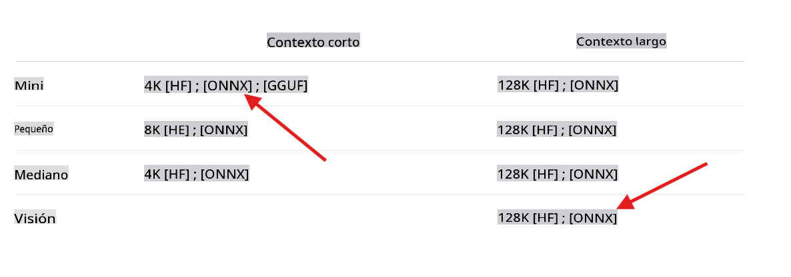

## Bienvenido a los laboratorios Phi-3 usando C#.

Hay una selección de laboratorios que muestran cómo integrar las poderosas versiones de los modelos Phi-3 en un entorno .NET.

## Requisitos previos
Antes de ejecutar el ejemplo, asegúrate de tener lo siguiente instalado:

**.NET 8:** Asegúrate de tener la [última versión de .NET](https://dotnet.microsoft.com/download/dotnet/8.0?WT.mc_id=aiml-137032-kinfeylo) instalada en tu máquina.

**(Opcional) Visual Studio o Visual Studio Code:** Necesitarás un IDE o editor de código capaz de ejecutar proyectos .NET. Se recomiendan [Visual Studio](https://visualstudio.microsoft.com/) o [Visual Studio Code](https://code.visualstudio.com?WT.mc_id=aiml-137032-kinfeylo).

**Usar git** para clonar localmente una de las versiones disponibles de Phi-3 desde [Hugging Face](https://huggingface.co).

**Descargar el modelo phi3-mini-4k-instruct-onnx** a tu máquina local:

### navega a la carpeta para almacenar los modelos
```bash
cd c:\phi3\models
```
### añade soporte para lfs
```bash
git lfs install 
```
### clona y descarga el modelo mini 4K instruct
```bash
git clone https://huggingface.co/microsoft/Phi-3-mini-4k-instruct-onnx
```

### clona y descarga el modelo vision 128K
```
git clone https://huggingface.co/microsoft/Phi-3-vision-128k-instruct-onnx-cpu
```
**Importante:** Las demostraciones actuales están diseñadas para usar las versiones ONNX del modelo. Los pasos anteriores clonan los siguientes modelos.



## Sobre los Laboratorios

La solución principal tiene varios laboratorios de ejemplo que demuestran las capacidades de los modelos Phi-3 usando C#.

| Proyecto | Descripción | Ubicación |
| ------------ | ----------- | -------- |
| LabsPhi301    | Este es un proyecto de ejemplo que usa un modelo local phi3 para hacer una pregunta. El proyecto carga un modelo ONNX Phi-3 local usando las bibliotecas `Microsoft.ML.OnnxRuntime`. | .\src\LabsPhi301\ |
| LabsPhi302    | Este es un proyecto de ejemplo que implementa un chat de consola usando Semantic Kernel. | .\src\LabsPhi302\ |
| LabsPhi303 | Este es un proyecto de ejemplo que usa un modelo de visión phi3 local para analizar imágenes. El proyecto carga un modelo ONNX Phi-3 Vision local usando las bibliotecas `Microsoft.ML.OnnxRuntime`. | .\src\LabsPhi303\ |
| LabsPhi304 | Este es un proyecto de ejemplo que usa un modelo de visión phi3 local para analizar imágenes. El proyecto carga un modelo ONNX Phi-3 Vision local usando las bibliotecas `Microsoft.ML.OnnxRuntime`. El proyecto también presenta un menú con diferentes opciones para interactuar con el usuario. | .\src\LabsPhi304\ |
| LabsPhi305 | Este es un proyecto de ejemplo que usa el modelo Phi-3 alojado en ollama para responder una pregunta. |**próximamente**|
| LabsPhi306 | Este es un proyecto de ejemplo que implementa un chat de consola usando Semantic Kernel. |**próximamente**|
| LabsPhi307  | Este es un proyecto de ejemplo que implementa un RAG usando embeddings locales y Semantic Kernel. |**próximamente**|

## Cómo Ejecutar los Proyectos

Para ejecutar los proyectos, sigue estos pasos:
1. Clona el repositorio a tu máquina local.

1. Abre una terminal y navega al proyecto deseado. Por ejemplo, vamos a ejecutar `LabsPhi301`.
    ```bash
    cd .\src\LabsPhi301\
    ```

1. Ejecuta el proyecto con el comando
    ```bash
    dotnet run
    ```

1. El proyecto de ejemplo pedirá una entrada del usuario y responderá usando el modelo local.

    La demostración en ejecución es similar a esta:

    

    ***Nota:** ¡hay un error tipográfico en la primera pregunta, Phi-3 es lo suficientemente genial como para compartir la respuesta correcta!*

1. El proyecto `LabsPhi304` pedirá al usuario que seleccione diferentes opciones y luego procesará la solicitud. Por ejemplo, analizando una imagen local.

    La demostración en ejecución es similar a esta:

    

Aviso legal: La traducción fue realizada a partir de su original por un modelo de IA y puede no ser perfecta. 
Por favor, revise el resultado y haga las correcciones necesarias.