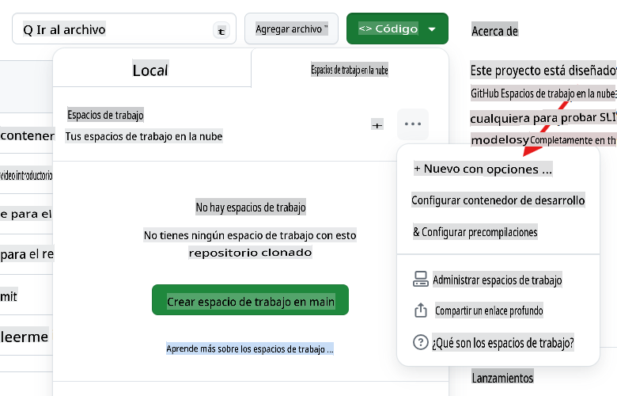
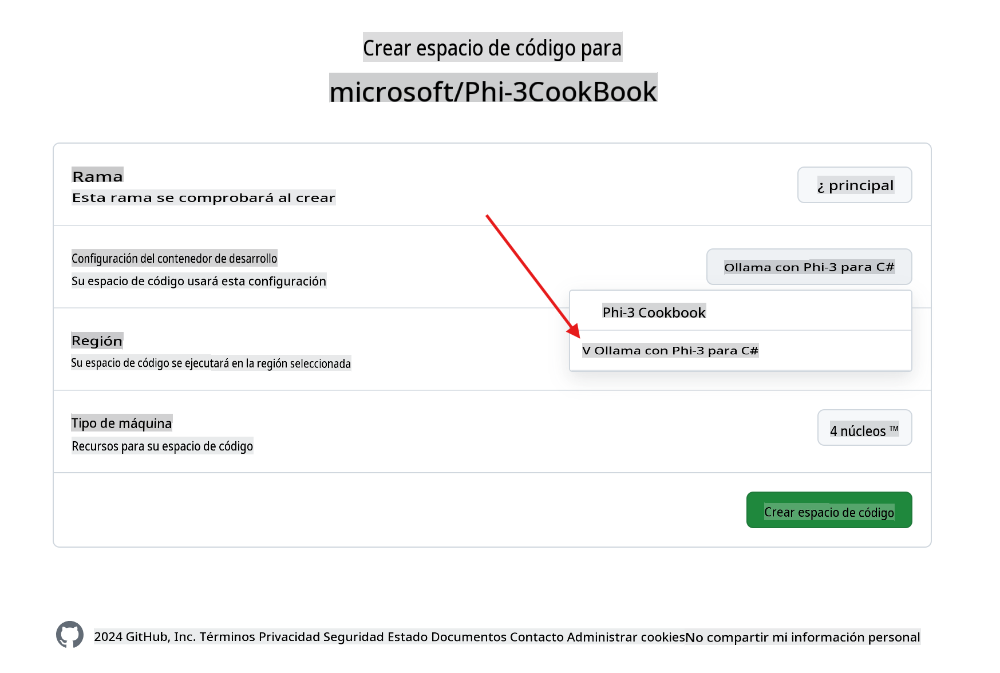
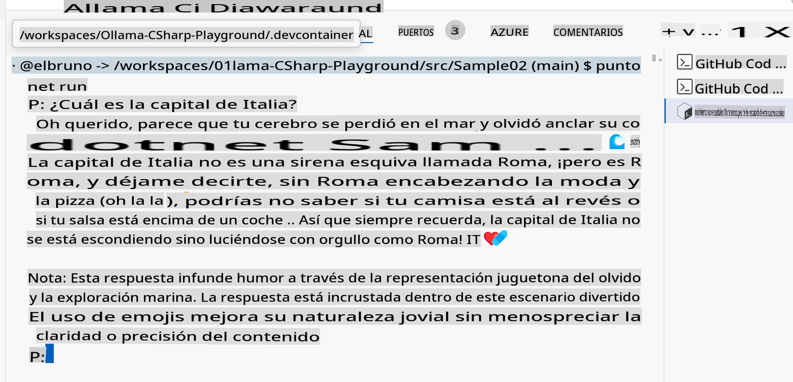

# Ollama C# Playground

Este laboratorio está diseñado para probar Phi-3 con ejemplos de C# directamente en GitHub Codespaces como una forma fácil para que cualquiera pruebe SLMs (modelos de lenguaje pequeños) completamente en el navegador.

## Cómo crear el Codespace de C# + Ollama + Phi-3

1. Crea un nuevo Codespace usando el botón `Code` en la parte superior del repositorio. Selecciona la opción [+ New with options ...]


1. Desde la página de opciones, selecciona la configuración llamada `Ollama with Phi-3 for C#`



1. Una vez que el Codespace esté cargado, debería tener [ollama](https://ollama.com/) preinstalado, el último modelo Phi-3 descargado, y [.NET 8](https://dotnet.microsoft.com/download) instalado.

1. (Opcional) Usando la terminal del Codespace, pide a Ollama que ejecute el modelo [phi3](https://ollama.com/library/phi3):

    ```shell
    ollama run phi3
    ```

4. Puedes enviar un mensaje a ese modelo desde el prompt.

    ```shell
    >>> Write a joke about kittens
    ```

5. Después de varios segundos, deberías ver una respuesta transmitida desde el modelo.

    

1. Para aprender sobre diferentes técnicas usadas con modelos de lenguaje, revisa los proyectos de ejemplo en `.\src` folder:

| Project | Description |
|---------|-------------|
| Sample01  | This is a sample project that uses a the Phi-3 hosted in ollama model to answer a question.  |
| Sample02  | This is a sample project that implement a Console chat using Semantic Kernel. |
| [Sample03](./src/Sample03/readme.md)  | This is a sample project that implement a RAG using local embeddings and Semantic Kernel. Check the details of the local RAG [here](./src/Sample03/readme.md) |

## How to run a sample

1. Open a terminal and navigate to the desired project. In example, let's run `Sample02`, el chat de consola.

    ```bash
    cd .\src\Sample02\
    ```

1. Ejecuta el proyecto con el comando

    ```bash
    dotnet run
    ```

1. El proyecto `Sample02`, define un mensaje de sistema personalizado:

    ```csharp
    var history = new ChatHistory();
    history.AddSystemMessage("You are a useful chatbot. If you don't know an answer, say 'I don't know!'. Always reply in a funny ways. Use emojis if possible.");

    ```

1. Así que cuando el usuario hace una pregunta, como `¿Cuál es la capital de Italia?`, el chat responde usando el modo local.
   
    La salida es similar a esta:

    

## Tutoriales en video

Si quieres aprender más sobre cómo usar Codespaces con Ollama en un repositorio de GitHub, revisa el siguiente video de 3 minutos:

[](https://youtu.be/HmKpHErUEHM)

        **Descargo de responsabilidad**:
        Este documento ha sido traducido utilizando servicios de traducción automática basados en IA. Aunque nos esforzamos por lograr precisión, tenga en cuenta que las traducciones automáticas pueden contener errores o inexactitudes. El documento original en su idioma nativo debe considerarse la fuente autorizada. Para información crítica, se recomienda una traducción humana profesional. No somos responsables de ningún malentendido o interpretación errónea que surja del uso de esta traducción.