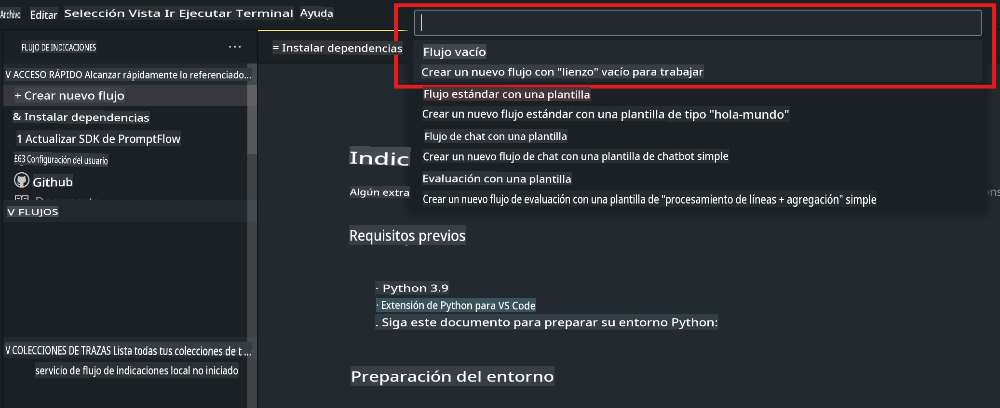
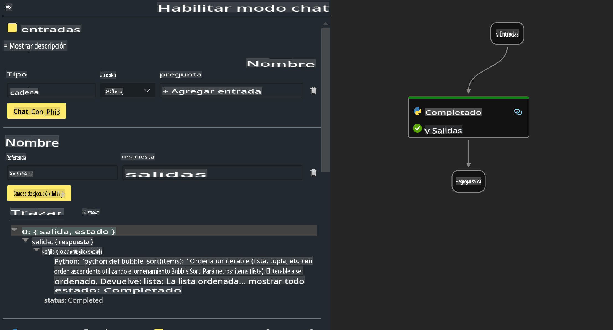

# **Laboratorio 2 - Ejecutar Prompt flow con Phi-3-mini en AIPC**

## **Qué es Prompt flow**

Prompt flow es un conjunto de herramientas de desarrollo diseñadas para optimizar el ciclo de desarrollo de aplicaciones de IA basadas en LLM, desde la ideación, prototipado, pruebas, evaluación hasta la implementación en producción y el monitoreo. Facilita mucho la ingeniería de prompts y te permite construir aplicaciones LLM con calidad de producción.

Con prompt flow, podrás:

- Crear flujos que vinculen LLMs, prompts, código Python y otras herramientas en un flujo de trabajo ejecutable.

- Depurar e iterar tus flujos, especialmente la interacción con LLMs con facilidad.

- Evaluar tus flujos, calcular métricas de calidad y rendimiento con conjuntos de datos más grandes.

- Integrar las pruebas y la evaluación en tu sistema CI/CD para asegurar la calidad de tu flujo.

- Implementar tus flujos en la plataforma de servicio que elijas o integrarlos fácilmente en la base de código de tu aplicación.

- (Opcional pero altamente recomendado) Colaborar con tu equipo aprovechando la versión en la nube de Prompt flow en Azure AI.


## **Construcción de flujos de generación de código en Apple Silicon**

***Nota***: Si no has completado la instalación del entorno, por favor visita [Lab 0 - Instalaciones](./01.Installations.md)

1. Abre la extensión Prompt flow en Visual Studio Code y crea un proyecto de flujo vacío



2. Agrega parámetros de Entradas y Salidas y añade código Python como nuevo flujo



Puedes referirte a esta estructura (flow.dag.yaml) para construir tu flujo

```yaml

inputs:
  prompt:
    type: string
    default: Write python code for Fibonacci serie. Please use markdown as output
outputs:
  result:
    type: string
    reference: ${gen_code_by_phi3.output}
nodes:
- name: gen_code_by_phi3
  type: python
  source:
    type: code
    path: gen_code_by_phi3.py
  inputs:
    prompt: ${inputs.prompt}


```

3. Cuantificar phi-3-mini

Esperamos ejecutar mejor SLM en dispositivos locales. Generalmente, cuantificamos el modelo (INT4, FP16, FP32)

```bash

python -m mlx_lm.convert --hf-path microsoft/Phi-3-mini-4k-instruct

```

**Nota:** la carpeta por defecto es mlx_model

4. Agrega código en ***Chat_With_Phi3.py***

```python


from promptflow import tool

from mlx_lm import load, generate


# The inputs section will change based on the arguments of the tool function, after you save the code
# Adding type to arguments and return value will help the system show the types properly
# Please update the function name/signature per need
@tool
def my_python_tool(prompt: str) -> str:

    model_id = './mlx_model_phi3_mini'

    model, tokenizer = load(model_id)

    # <|user|>\nWrite python code for Fibonacci serie. Please use markdown as output<|end|>\n<|assistant|>

    response = generate(model, tokenizer, prompt="<|user|>\n" + prompt  + "<|end|>\n<|assistant|>", max_tokens=2048, verbose=True)

    return response


```

4. Puedes probar el flujo desde Debug o Run para verificar si el código generado está bien o no


5. Ejecuta el flujo como API de desarrollo en la terminal

```

pf flow serve --source ./ --port 8080 --host localhost   

```

Puedes probarlo en Postman / Thunder Client


### **Nota**

1. La primera ejecución toma mucho tiempo. Se recomienda descargar el modelo phi-3 desde Hugging face CLI.

2. Considerando la limitada potencia de cómputo del NPU de Intel, se recomienda usar Phi-3-mini-4k-instruct.

3. Usamos la aceleración del NPU de Intel para cuantizar la conversión a INT4, pero si vuelves a ejecutar el servicio, necesitas eliminar las carpetas cache y nc_workshop.


## **Recursos**

1. Aprende Promptflow [https://microsoft.github.io/promptflow/](https://microsoft.github.io/promptflow/)

2. Aprende Intel NPU Acceleration [https://github.com/intel/intel-npu-acceleration-library](https://github.com/intel/intel-npu-acceleration-library)

3. Código de ejemplo, descarga [Local NPU Agent Sample Code](../../../../../../../code/07.Lab/01/AIPC/local-npu-agent)

**Descargo de responsabilidad**:
Este documento ha sido traducido utilizando servicios de traducción automática basados en inteligencia artificial. Aunque nos esforzamos por lograr precisión, tenga en cuenta que las traducciones automáticas pueden contener errores o imprecisiones. El documento original en su idioma nativo debe considerarse la fuente autorizada. Para información crítica, se recomienda una traducción humana profesional. No nos hacemos responsables de ningún malentendido o interpretación errónea que surja del uso de esta traducción.