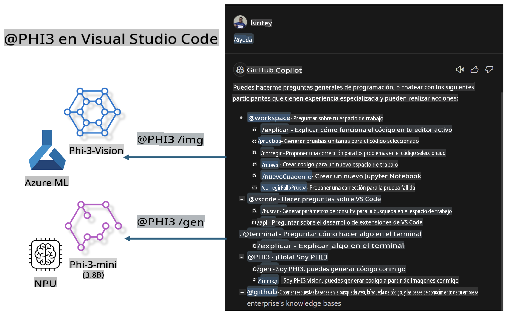

# **Construye tu propio Visual Studio Code GitHub Copilot Chat con Microsoft Phi-3 Family**

¿Has utilizado el agente de espacio de trabajo en GitHub Copilot Chat? ¿Quieres construir el agente de código de tu propio equipo? Este laboratorio práctico espera combinar el modelo de código abierto para construir un agente empresarial de negocios de código.

## **Fundamentos**

### **Por qué elegir Microsoft Phi-3**

Phi-3 es una serie de familia, que incluye phi-3-mini, phi-3-small y phi-3-medium, basados en diferentes parámetros de entrenamiento para generación de texto, finalización de diálogos y generación de código. También está phi-3-vision basado en Vision. Es adecuado para empresas o diferentes equipos que deseen crear soluciones de IA generativa offline.

Recomendado leer este enlace [https://github.com/microsoft/Phi-3CookBook/blob/main/md/01.Introduce/Phi3Family.md](https://github.com/microsoft/Phi-3CookBook/blob/main/md/01.Introduce/Phi3Family.md)

### **Microsoft GitHub Copilot Chat**

La extensión GitHub Copilot Chat te proporciona una interfaz de chat que te permite interactuar con GitHub Copilot y recibir respuestas a preguntas relacionadas con la codificación directamente dentro de VS Code, sin necesidad de navegar por la documentación o buscar en foros en línea.

Copilot Chat puede utilizar resaltado de sintaxis, indentación y otras características de formato para añadir claridad a la respuesta generada. Dependiendo del tipo de pregunta del usuario, el resultado puede contener enlaces al contexto que Copilot utilizó para generar una respuesta, como archivos de código fuente o documentación, o botones para acceder a la funcionalidad de VS Code.

- Copilot Chat se integra en tu flujo de desarrollo y te ofrece asistencia donde la necesitas:

- Inicia una conversación de chat en línea directamente desde el editor o la terminal para obtener ayuda mientras estás codificando

- Usa la vista de Chat para tener un asistente de IA a tu lado que te ayude en cualquier momento

- Lanza Quick Chat para hacer una pregunta rápida y volver a lo que estabas haciendo

Puedes usar GitHub Copilot Chat en varios escenarios, tales como:

- Responder preguntas de codificación sobre cómo resolver mejor un problema

- Explicar el código de otra persona y sugerir mejoras

- Proponer correcciones de código

- Generar casos de prueba unitarios

- Generar documentación de código

Recomendado leer este enlace [https://code.visualstudio.com/docs/copilot/copilot-chat](https://code.visualstudio.com/docs/copilot/copilot-chat?WT.mc_id=aiml-137032-kinfeylo)

###  **Microsoft GitHub Copilot Chat @workspace**

Referenciar **@workspace** en Copilot Chat te permite hacer preguntas sobre toda tu base de código. Basado en la pregunta, Copilot recupera inteligentemente archivos y símbolos relevantes, que luego referencia en su respuesta como enlaces y ejemplos de código.

Para responder a tu pregunta, **@workspace** busca a través de las mismas fuentes que un desarrollador usaría al navegar por una base de código en VS Code:

- Todos los archivos en el espacio de trabajo, excepto aquellos que son ignorados por un archivo .gitignore

- Estructura de directorios con nombres de carpetas y archivos anidados

- El índice de búsqueda de código de GitHub, si el espacio de trabajo es un repositorio de GitHub e indexado por la búsqueda de código

- Símbolos y definiciones en el espacio de trabajo

- Texto seleccionado actualmente o texto visible en el editor activo

Nota: .gitignore se omite si tienes un archivo abierto o tienes texto seleccionado dentro de un archivo ignorado.

Recomendado leer este enlace [[https://code.visualstudio.com/docs/copilot/copilot-chat](https://code.visualstudio.com/docs/copilot/workspace-context?WT.mc_id=aiml-137032-kinfeylo)]

## **Conoce más sobre este Lab**

GitHub Copilot ha mejorado enormemente la eficiencia de programación de las empresas, y cada empresa espera personalizar las funciones relevantes de GitHub Copilot. Muchas empresas han personalizado Extensiones similares a GitHub Copilot basadas en sus propios escenarios de negocio y modelos de código abierto. Para las empresas, las Extensiones personalizadas son más fáciles de controlar, pero esto también afecta la experiencia del usuario. Después de todo, GitHub Copilot tiene funciones más fuertes para tratar con escenarios generales y profesionalismo. Si se puede mantener una experiencia consistente, sería mejor personalizar la propia Extensión de la empresa. GitHub Copilot Chat proporciona APIs relevantes para que las empresas amplíen la experiencia de Chat. Mantener una experiencia consistente y tener funciones personalizadas es una mejor experiencia de usuario.

Este laboratorio utiliza principalmente el modelo Phi-3 combinado con el NPU local y Azure híbrido para construir un Agente personalizado en GitHub Copilot Chat ***@PHI3*** para ayudar a los desarrolladores empresariales a completar la generación de código***(@PHI3 /gen)*** y generar código basado en imágenes ***(@PHI3 /img)***.

### ***Nota:*** 

Este laboratorio se implementa actualmente en el AIPC de CPU Intel y Apple Silicon. Continuaremos actualizando la versión Qualcomm de NPU.

## **Lab**

| Nombre | Descripción | AIPC | Apple |
| ------------ | ----------- | -------- |-------- |
| Lab0 - Instalaciones(✅) | Configurar e instalar entornos relacionados y herramientas de instalación | [Ir](./HOL/AIPC/01.Installations.md) |[Ir](./HOL/Apple/01.Installations.md) |
| Lab1 - Ejecutar Prompt flow con Phi-3-mini (✅) | Combinado con AIPC / Apple Silicon, utilizando NPU local para crear generación de código a través de Phi-3-mini | [Ir](./HOL/AIPC/02.PromptflowWithNPU.md) |  [Ir](./HOL/Apple/02.PromptflowWithMLX.md) |
| Lab2 - Desplegar Phi-3-vision en Azure Machine Learning Service(✅) | Generar código desplegando Azure Machine Learning Service's Model Catalog - imagen Phi-3-vision | [Ir](./HOL/AIPC/03.DeployPhi3VisionOnAzure.md) |[Ir](./HOL/Apple/03.DeployPhi3VisionOnAzure.md) |
| Lab3 - Crear un agente @phi-3 en GitHub Copilot Chat(✅)  | Crear un agente Phi-3 personalizado en GitHub Copilot Chat para completar generación de código, generación de código gráfico, RAG, etc. | [Ir](./HOL/AIPC/04.CreatePhi3AgentInVSCode.md) | [Ir](./HOL/Apple/04.CreatePhi3AgentInVSCode.md) |
| Código de Ejemplo (✅)  | Descargar código de ejemplo | [Ir](../../../../../code/07.Lab/01/AIPC) | [Ir](../../../../../code/07.Lab/01/Apple) |

## **Recursos**

1. Phi-3 Cookbook [https://github.com/microsoft/Phi-3CookBook](https://github.com/microsoft/Phi-3CookBook)

2. Aprende más sobre GitHub Copilot [https://learn.microsoft.com/training/paths/copilot/](https://learn.microsoft.com/training/paths/copilot/?WT.mc_id=aiml-137032-kinfeylo)

3. Aprende más sobre GitHub Copilot Chat [https://learn.microsoft.com/training/paths/accelerate-app-development-using-github-copilot/](https://learn.microsoft.com/training/paths/accelerate-app-development-using-github-copilot/?WT.mc_id=aiml-137032-kinfeylo)

4. Aprende más sobre la API de GitHub Copilot Chat [https://code.visualstudio.com/api/extension-guides/chat](https://code.visualstudio.com/api/extension-guides/chat?WT.mc_id=aiml-137032-kinfeylo)

5. Aprende más sobre Azure AI Studio [https://learn.microsoft.com/training/paths/create-custom-copilots-ai-studio/](https://learn.microsoft.com/training/paths/create-custom-copilots-ai-studio/?WT.mc_id=aiml-137032-kinfeylo)

6. Aprende más sobre el Model Catalog de Azure AI Studio [https://learn.microsoft.com/azure/ai-studio/how-to/model-catalog-overview](https://learn.microsoft.com/azure/ai-studio/how-to/model-catalog-overview)

Aviso legal: La traducción fue realizada a partir de su original por un modelo de IA y puede no ser perfecta. Por favor, revise el resultado y haga las correcciones necesarias.