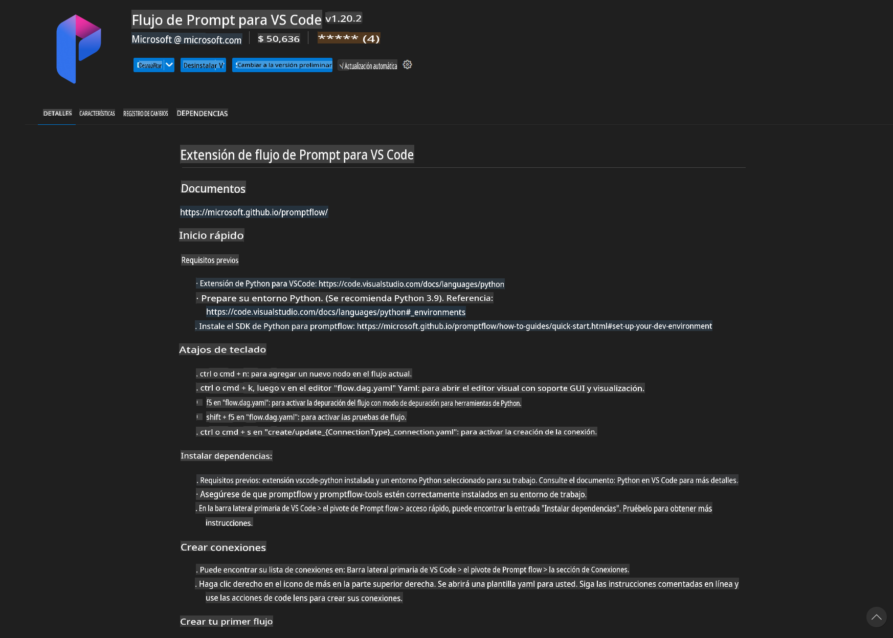
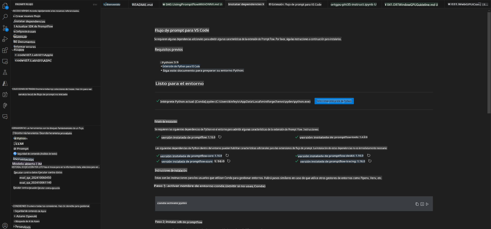
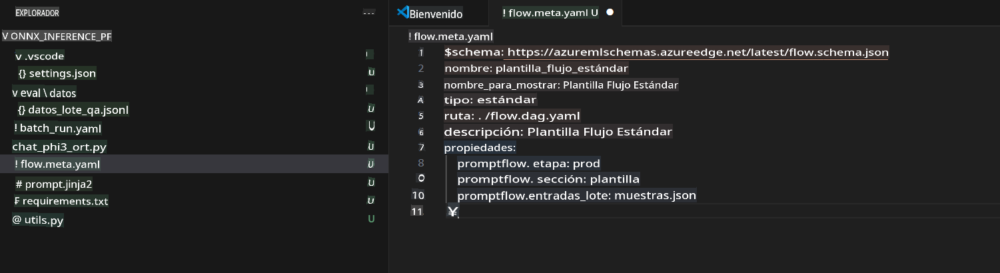
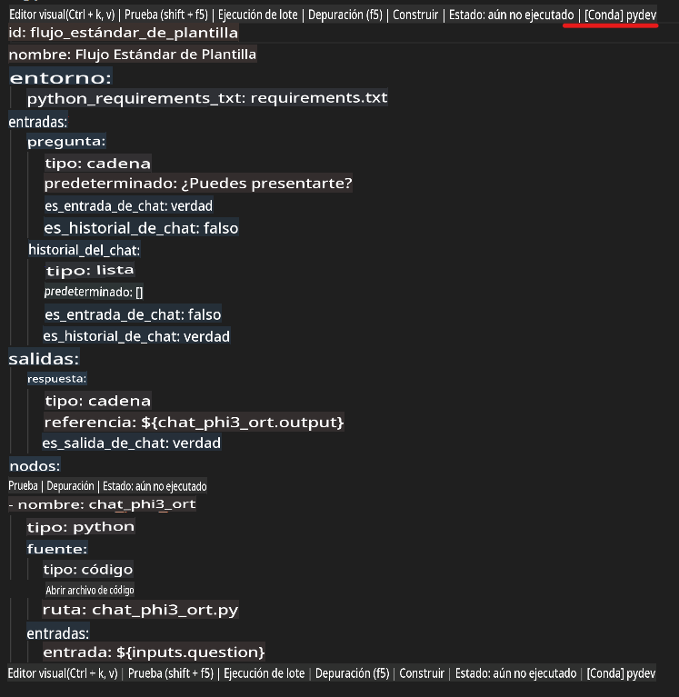
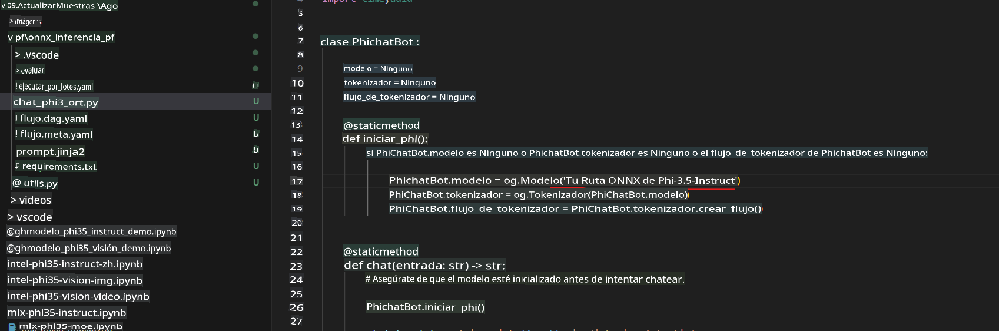
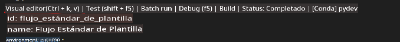
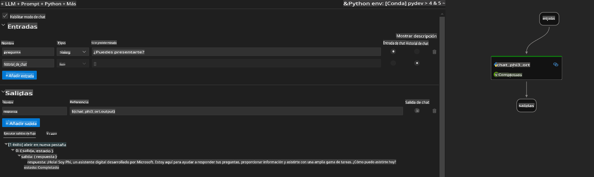
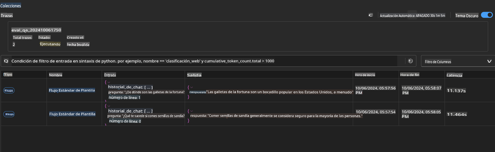

# Usar GPU de Windows para crear una solución Prompt flow con Phi-3.5-Instruct ONNX 

El siguiente documento es un ejemplo de cómo usar PromptFlow con ONNX (Open Neural Network Exchange) para desarrollar aplicaciones de IA basadas en modelos Phi-3.

PromptFlow es un conjunto de herramientas de desarrollo diseñadas para agilizar el ciclo de desarrollo completo de aplicaciones de IA basadas en LLM (Large Language Model), desde la ideación y el prototipado hasta las pruebas y la evaluación.

Al integrar PromptFlow con ONNX, los desarrolladores pueden:

- Optimizar el Rendimiento del Modelo: Aprovechar ONNX para una inferencia y despliegue eficientes del modelo.
- Simplificar el Desarrollo: Usar PromptFlow para gestionar el flujo de trabajo y automatizar tareas repetitivas.
- Mejorar la Colaboración: Facilitar una mejor colaboración entre los miembros del equipo proporcionando un entorno de desarrollo unificado.

**Prompt flow** es un conjunto de herramientas de desarrollo diseñadas para agilizar el ciclo de desarrollo completo de aplicaciones de IA basadas en LLM, desde la ideación, prototipado, pruebas, evaluación hasta el despliegue y monitoreo en producción. Facilita la ingeniería de prompts y te permite construir aplicaciones LLM con calidad de producción.

Prompt flow puede conectarse a OpenAI, Azure OpenAI Service y modelos personalizables (Huggingface, LLM/SLM locales). Esperamos desplegar el modelo ONNX cuantizado de Phi-3.5 en aplicaciones locales. Prompt flow puede ayudarnos a planificar mejor nuestro negocio y completar soluciones locales basadas en Phi-3.5. En este ejemplo, combinaremos la Biblioteca GenAI de ONNX Runtime para completar la solución Prompt flow basada en GPU de Windows.

## **Instalación**

### **ONNX Runtime GenAI para GPU de Windows**

Lee esta guía para configurar ONNX Runtime GenAI para GPU de Windows [haz clic aquí](./041.ORTWindowGPUGuideline.md)

### **Configurar Prompt flow en VSCode**

1. Instala la Extensión de VS Code para Prompt flow



2. Después de instalar la Extensión de VS Code para Prompt flow, haz clic en la extensión y elige **Installation dependencies** siguiendo esta guía para instalar el SDK de Prompt flow en tu entorno



3. Descarga [Código de Ejemplo](../../../../../code/09.UpdateSamples/Aug/pf/onnx_inference_pf) y usa VS Code para abrir este ejemplo



4. Abre **flow.dag.yaml** para elegir tu entorno de Python



   Abre **chat_phi3_ort.py** para cambiar la ubicación de tu modelo Phi-3.5-instruct ONNX



5. Ejecuta tu flujo de prompts para realizar pruebas

Abre **flow.dag.yaml** y haz clic en el editor visual



después de hacer clic, ejecútalo para probar



6. Puedes ejecutar lotes en la terminal para verificar más resultados

```bash

pf run create --file batch_run.yaml --stream --name 'Your eval qa name'    

```

Puedes verificar los resultados en tu navegador predeterminado



        **Descargo de responsabilidad**: 
        Este documento ha sido traducido utilizando servicios de traducción automatizada por IA. Si bien nos esforzamos por lograr precisión, tenga en cuenta que las traducciones automáticas pueden contener errores o imprecisiones. El documento original en su idioma nativo debe considerarse la fuente autorizada. Para información crítica, se recomienda una traducción profesional realizada por humanos. No nos hacemos responsables de ningún malentendido o interpretación errónea que surja del uso de esta traducción.