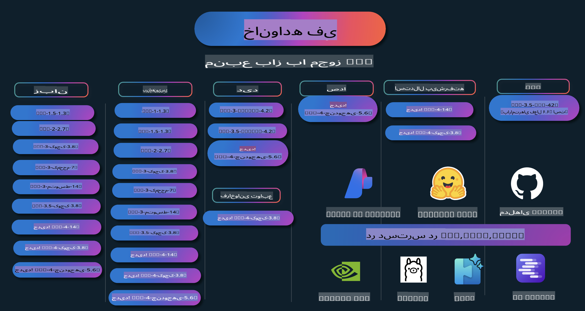

# کتاب آشپزی فی: مثال‌های عملی با مدل‌های فی مایکروسافت

  

  
  
  

  
  

فی مجموعه‌ای از مدل‌های هوش مصنوعی متن‌باز است که توسط مایکروسافت توسعه داده شده است.

فی در حال حاضر قدرتمندترین و مقرون‌به‌صرفه‌ترین مدل زبان کوچک (SLM) است که در سناریوهایی مانند چندزبانه، استدلال، تولید متن/چت، کدنویسی، تصاویر، صوت و سایر موارد عملکرد بسیار خوبی دارد.

شما می‌توانید فی را روی فضای ابری یا دستگاه‌های لبه مستقر کنید و با توان محاسباتی محدود به راحتی برنامه‌های هوش مصنوعی تولیدی بسازید.

برای شروع استفاده از این منابع مراحل زیر را دنبال کنید:  
1. **فورک کردن مخزن**: کلیک کنید   
2. **کلون کردن مخزن**: `git clone https://github.com/microsoft/PhiCookBook.git`  
3. [**به جامعه Discord هوش مصنوعی مایکروسافت بپیوندید و با کارشناسان و توسعه‌دهندگان دیگر ملاقات کنید**](https://discord.com/invite/ByRwuEEgH4?WT.mc_id=aiml-137032-kinfeylo)

## فهرست مطالب

- مقدمه  
  - [خوش‌آمدید به خانواده فی](./md/01.Introduction/01/01.PhiFamily.md)  
  - [راه‌اندازی محیط شما](./md/01.Introduction/01/01.EnvironmentSetup.md)  
  - [درک فناوری‌های کلیدی](./md/01.Introduction/01/01.Understandingtech.md)  
  - [ایمنی هوش مصنوعی برای مدل‌های فی](./md/01.Introduction/01/01.AISafety.md)  
  - [پشتیبانی سخت‌افزاری فی](./md/01.Introduction/01/01.Hardwaresupport.md)  
  - [مدل‌های فی و دسترسی آن‌ها در پلتفرم‌های مختلف](./md/01.Introduction/01/01.Edgeandcloud.md)  
  - [استفاده از Guidance-ai و فی](./md/01.Introduction/01/01.Guidance.md)  
  - [مدل‌های بازار GitHub](https://github.com/marketplace/models)  
  - [کاتالوگ مدل‌های Azure AI](https://ai.azure.com)  

- استنتاج فی در محیط‌های مختلف  
    - [Hugging face](./md/01.Introduction/02/01.HF.md)  
    - [مدل‌های GitHub](./md/01.Introduction/02/02.GitHubModel.md)  
    - [کاتالوگ مدل Azure AI Foundry](./md/01.Introduction/02/03.AzureAIFoundry.md)  
    - [Ollama](./md/01.Introduction/02/04.Ollama.md)  
    - [ابزار هوش مصنوعی VSCode (AITK)](./md/01.Introduction/02/05.AITK.md)  
    - [NVIDIA NIM](./md/01.Introduction/02/06.NVIDIA.md)  

- استنتاج خانواده فی  
    - [استنتاج فی در iOS](./md/01.Introduction/03/iOS_Inference.md)  
    - [استنتاج فی در Android](./md/01.Introduction/03/Android_Inference.md)  
- [استنتاج فی در جتسون](./md/01.Introduction/03/Jetson_Inference.md)  
    - [استنتاج فی در کامپیوتر هوش مصنوعی](./md/01.Introduction/03/AIPC_Inference.md)  
    - [استنتاج فی با فریم‌ورک Apple MLX](./md/01.Introduction/03/MLX_Inference.md)  
    - [استنتاج فی در سرور محلی](./md/01.Introduction/03/Local_Server_Inference.md)  
    - [استنتاج فی در سرور راه دور با استفاده از AI Toolkit](./md/01.Introduction/03/Remote_Interence.md)  
    - [استنتاج فی با زبان Rust](./md/01.Introduction/03/Rust_Inference.md)  
    - [استنتاج فی--ویژن به صورت محلی](./md/01.Introduction/03/Vision_Inference.md)  
    - [استنتاج فی با Kaito AKS، کانتینرهای Azure (پشتیبانی رسمی)](./md/01.Introduction/03/Kaito_Inference.md)  

- [کوانتیزه کردن خانواده فی](./md/01.Introduction/04/QuantifyingPhi.md)  
    - [کوانتیزه کردن Phi-3.5 / 4 با استفاده از llama.cpp](./md/01.Introduction/04/UsingLlamacppQuantifyingPhi.md)  
    - [کوانتیزه کردن Phi-3.5 / 4 با استفاده از افزونه‌های Generative AI برای onnxruntime](./md/01.Introduction/04/UsingORTGenAIQuantifyingPhi.md)  
    - [کوانتیزه کردن Phi-3.5 / 4 با استفاده از Intel OpenVINO](./md/01.Introduction/04/UsingIntelOpenVINOQuantifyingPhi.md)  
    - [کوانتیزه کردن Phi-3.5 / 4 با استفاده از فریم‌ورک Apple MLX](./md/01.Introduction/04/UsingAppleMLXQuantifyingPhi.md)  

- ارزیابی فی  
    - [هوش مصنوعی مسئول](./md/01.Introduction/05/ResponsibleAI.md)  
    - [Azure AI Foundry برای ارزیابی](./md/01.Introduction/05/AIFoundry.md)  
    - [استفاده از Promptflow برای ارزیابی](./md/01.Introduction/05/Promptflow.md)  

- RAG با Azure AI Search  
    - [چگونه از Phi-4-mini و Phi-4-multimodal (RAG) با Azure AI Search استفاده کنیم](https://github.com/microsoft/PhiCookBook/blob/main/code/06.E2E/E2E_Phi-4-RAG-Azure-AI-Search.ipynb)  

- نمونه‌های توسعه اپلیکیشن فی  
  - اپلیکیشن‌های متنی و چت  
    - نمونه‌های Phi-4 🆕  
      - [📓] [چت با مدل Phi-4-mini ONNX](./md/02.Application/01.TextAndChat/Phi4/ChatWithPhi4ONNX/README.md)  
      - [چت با مدل محلی Phi-4 ONNX در .NET](../../md/04.HOL/dotnet/src/LabsPhi4-Chat-01OnnxRuntime)  
      - [اپلیکیشن کنسول .NET برای چت با Phi-4 ONNX با استفاده از Semantic Kernel](../../md/04.HOL/dotnet/src/LabsPhi4-Chat-02SK)  
    - نمونه‌های Phi-3 / 3.5  
      - [چت‌بات محلی در مرورگر با استفاده از Phi3، ONNX Runtime Web و WebGPU](https://github.com/microsoft/onnxruntime-inference-examples/tree/main/js/chat)  
      - [چت OpenVINO](./md/02.Application/01.TextAndChat/Phi3/E2E_OpenVino_Chat.md)  
      - [مدل چندگانه - تعامل Phi-3-mini و OpenAI Whisper](./md/02.Application/01.TextAndChat/Phi3/E2E_Phi-3-mini_with_whisper.md)  
      - [MLFlow - ساخت یک wrapper و استفاده از Phi-3 با MLFlow](./md//02.Application/01.TextAndChat/Phi3/E2E_Phi-3-MLflow.md)  
      - [بهینه‌سازی مدل - چگونه مدل Phi-3-min را برای ONNX Runtime Web با Olive بهینه کنیم](https://github.com/microsoft/Olive/tree/main/examples/phi3)  
      - [اپلیکیشن WinUI3 با Phi-3 mini-4k-instruct-onnx](https://github.com/microsoft/Phi3-Chat-WinUI3-Sample/)  
      - [نمونه اپلیکیشن یادداشت‌های هوش مصنوعی چندمدلی با WinUI3](https://github.com/microsoft/ai-powered-notes-winui3-sample)  
      - [فاین‌تیون کردن و ادغام مدل‌های سفارشی Phi-3 با Promptflow](./md/02.Application/01.TextAndChat/Phi3/E2E_Phi-3-FineTuning_PromptFlow_Integration.md)  
      - [فاین‌تیون کردن و ادغام مدل‌های سفارشی Phi-3 با Promptflow در Azure AI Foundry](./md/02.Application/01.TextAndChat/Phi3/E2E_Phi-3-FineTuning_PromptFlow_Integration_AIFoundry.md)  
      - [ارزیابی مدل فاین‌تیون شده Phi-3 / Phi-3.5 در Azure AI Foundry با تمرکز بر اصول هوش مصنوعی مسئول مایکروسافت](./md/02.Application/01.TextAndChat/Phi3/E2E_Phi-3-Evaluation_AIFoundry.md)  
- [📓] [نمونه پیش‌بینی زبان Phi-3.5-mini-instruct (چینی/انگلیسی)](../../md/02.Application/01.TextAndChat/Phi3/phi3-instruct-demo.ipynb)  
      - [چت‌بات RAG با Phi-3.5-Instruct و WebGPU](./md/02.Application/01.TextAndChat/Phi3/WebGPUWithPhi35Readme.md)  
      - [استفاده از GPU ویندوز برای ایجاد راه‌حل Prompt flow با Phi-3.5-Instruct ONNX](./md/02.Application/01.TextAndChat/Phi3/UsingPromptFlowWithONNX.md)  
      - [ساخت اپلیکیشن اندروید با استفاده از Microsoft Phi-3.5 tflite](./md/02.Application/01.TextAndChat/Phi3/UsingPhi35TFLiteCreateAndroidApp.md)  
      - [مثال پرسش و پاسخ .NET با مدل ONNX محلی Phi-3 با استفاده از Microsoft.ML.OnnxRuntime](../../md/04.HOL/dotnet/src/LabsPhi301)  
      - [اپلیکیشن چت کنسول .NET با Semantic Kernel و Phi-3](../../md/04.HOL/dotnet/src/LabsPhi302)  

  - نمونه‌های کدنویسی SDK استنتاج Azure AI  
    - نمونه‌های Phi-4 🆕  
      - [📓] [ایجاد کد پروژه با استفاده از Phi-4-multimodal](./md/02.Application/02.Code/Phi4/GenProjectCode/README.md)  
    - نمونه‌های Phi-3 / 3.5  
      - [ساخت چت GitHub Copilot در Visual Studio Code با خانواده Microsoft Phi-3](./md/02.Application/02.Code/Phi3/VSCodeExt/README.md)  
      - [ایجاد Agent چت در Visual Studio Code با Phi-3.5 و مدل‌های GitHub](/md/02.Application/02.Code/Phi3/CreateVSCodeChatAgentWithGitHubModels.md)  

  - نمونه‌های استدلال پیشرفته  
    - نمونه‌های Phi-4 🆕  
      - [📓] [نمونه‌های استدلال Phi-4-mini](./md/02.Application/03.AdvancedReasoning/Phi4/AdvancedResoningPhi4mini/README.md)  

  - دموها  
      - [دموهای Phi-4-mini میزبانی‌شده در Hugging Face Spaces](https://huggingface.co/spaces/microsoft/phi-4-mini?WT.mc_id=aiml-137032-kinfeylo)  
      - [دموهای Phi-4-multimodal میزبانی‌شده در Hugging Face Spaces](https://huggingface.co/spaces/microsoft/phi-4-multimodal?WT.mc_id=aiml-137032-kinfeylo)  
  - نمونه‌های تصویری  
    - نمونه‌های Phi-4 🆕  
      - [📓] [استفاده از Phi-4-multimodal برای خواندن تصاویر و تولید کد](./md/02.Application/04.Vision/Phi4/CreateFrontend/README.md)  
    - نمونه‌های Phi-3 / 3.5  
      - [📓][Phi-3-vision-تبدیل متن تصویر به متن](../../md/02.Application/04.Vision/Phi3/E2E_Phi-3-vision-image-text-to-text-online-endpoint.ipynb)  
      - [Phi-3-vision-ONNX](https://onnxruntime.ai/docs/genai/tutorials/phi3-v.html)  
      - [📓][Phi-3-vision جاسازی CLIP](../../md/02.Application/04.Vision/Phi3/E2E_Phi-3-vision-image-text-to-text-online-endpoint.ipynb)  
      - [دمو: بازیافت با Phi-3](https://github.com/jennifermarsman/PhiRecycling/)  
      - [Phi-3-vision - دستیار زبان تصویری - با Phi3-Vision و OpenVINO](https://docs.openvino.ai/nightly/notebooks/phi-3-vision-with-output.html)  
      - [Phi-3 Vision Nvidia NIM](./md/02.Application/04.Vision/Phi3/E2E_Nvidia_NIM_Vision.md)  
      - [Phi-3 Vision OpenVino](./md/02.Application/04.Vision/Phi3/E2E_OpenVino_Phi3Vision.md)  
      - [📓][نمونه چندتصویری یا چندفریمی Phi-3.5 Vision](../../md/02.Application/04.Vision/Phi3/phi3-vision-demo.ipynb)  
      - [مدل محلی ONNX Phi-3 Vision با استفاده از Microsoft.ML.OnnxRuntime .NET](../../md/04.HOL/dotnet/src/LabsPhi303)  
      - [مدل محلی ONNX Phi-3 Vision با منوی مبتنی بر Microsoft.ML.OnnxRuntime .NET](../../md/04.HOL/dotnet/src/LabsPhi304)  

  - نمونه‌های صوتی  
    - نمونه‌های Phi-4 🆕  
      - [📓] [استخراج رونوشت‌های صوتی با استفاده از Phi-4-multimodal](./md/02.Application/05.Audio/Phi4/Transciption/README.md)  
      - [📓] [نمونه صوتی Phi-4-multimodal](../../md/02.Application/05.Audio/Phi4/Siri/demo.ipynb)  
      - [📓] [نمونه ترجمه صوتی Phi-4-multimodal](../../md/02.Application/05.Audio/Phi4/Translate/demo.ipynb)  
      - [اپلیکیشن کنسول .NET با استفاده از Phi-4-multimodal Audio برای تحلیل فایل صوتی و ایجاد رونوشت](../../md/04.HOL/dotnet/src/LabsPhi4-MultiModal-02Audio)  

  - نمونه‌های MoE  
    - نمونه‌های Phi-3 / 3.5  
      - [📓] [نمونه مدل‌های Mixture of Experts (MoEs) Phi-3.5 در رسانه‌های اجتماعی](../../md/02.Application/06.MoE/Phi3/phi3_moe_demo.ipynb)  
      - [📓] [ساخت یک خط لوله بازیابی-تولید (RAG) با NVIDIA NIM Phi-3 MOE، Azure AI Search و LlamaIndex](../../md/02.Application/06.MoE/Phi3/azure-ai-search-nvidia-rag.ipynb)  
  - نمونه‌های فراخوانی توابع  
    - نمونه‌های Phi-4 🆕  
      - [📓] [استفاده از فراخوانی توابع با Phi-4-mini](./md/02.Application/07.FunctionCalling/Phi4/FunctionCallingBasic/README.md)  
  - نمونه‌های ترکیب چندوجهی  
    - نمونه‌های Phi-4 🆕  
- [📓] [استفاده از Phi-4-multimodal به عنوان یک روزنامه‌نگار فناوری](../../md/02.Application/08.Multimodel/Phi4/TechJournalist/phi_4_mm_audio_text_publish_news.ipynb)
  - [.NET console application برای تحلیل تصاویر با استفاده از Phi-4-multimodal](../../md/04.HOL/dotnet/src/LabsPhi4-MultiModal-01Images)

- نمونه‌های Fine-tuning Phi
  - [سناریوهای Fine-tuning](./md/03.FineTuning/FineTuning_Scenarios.md)
  - [مقایسه Fine-tuning و RAG](./md/03.FineTuning/FineTuning_vs_RAG.md)
  - [Fine-tuning: تبدیل Phi-3 به یک متخصص صنعتی](./md/03.FineTuning/LetPhi3gotoIndustriy.md)
  - [Fine-tuning Phi-3 با استفاده از AI Toolkit برای VS Code](./md/03.FineTuning/Finetuning_VSCodeaitoolkit.md)
  - [Fine-tuning Phi-3 با استفاده از Azure Machine Learning Service](./md/03.FineTuning/Introduce_AzureML.md)
  - [Fine-tuning Phi-3 با استفاده از Lora](./md/03.FineTuning/FineTuning_Lora.md)
  - [Fine-tuning Phi-3 با استفاده از QLora](./md/03.FineTuning/FineTuning_Qlora.md)
  - [Fine-tuning Phi-3 با استفاده از Azure AI Foundry](./md/03.FineTuning/FineTuning_AIFoundry.md)
  - [Fine-tuning Phi-3 با استفاده از Azure ML CLI/SDK](./md/03.FineTuning/FineTuning_MLSDK.md)
  - [Fine-tuning با استفاده از Microsoft Olive](./md/03.FineTuning/FineTuning_MicrosoftOlive.md)
  - [کارگاه عملی Fine-tuning با Microsoft Olive](./md/03.FineTuning/olive-lab/readme.md)
  - [Fine-tuning Phi-3-vision با Weights and Bias](./md/03.FineTuning/FineTuning_Phi-3-visionWandB.md)
  - [Fine-tuning Phi-3 با استفاده از Apple MLX Framework](./md/03.FineTuning/FineTuning_MLX.md)
  - [Fine-tuning رسمی Phi-3-vision](./md/03.FineTuning/FineTuning_Vision.md)
  - [Fine-tuning Phi-3 با Kaito AKS و Azure Containers (پشتیبانی رسمی)](./md/03.FineTuning/FineTuning_Kaito.md)
  - [Fine-tuning Phi-3 و 3.5 Vision](https://github.com/2U1/Phi3-Vision-Finetune)

- کارگاه عملی
  - [بررسی مدل‌های پیشرفته: LLMs، SLMs، توسعه محلی و موارد دیگر](https://github.com/microsoft/aitour-exploring-cutting-edge-models)
  - [آزادسازی پتانسیل NLP: Fine-Tuning با Microsoft Olive](https://github.com/azure/Ignite_FineTuning_workshop)

- مقالات پژوهشی و انتشارات علمی
  - [همه آنچه نیاز دارید: گزارش فنی phi-1.5](https://arxiv.org/abs/2309.05463)
  - [گزارش فنی Phi-3: یک مدل زبانی بسیار توانمند به‌صورت محلی روی تلفن شما](https://arxiv.org/abs/2404.14219)
  - [گزارش فنی Phi-4](https://arxiv.org/abs/2412.08905)
  - [بهینه‌سازی مدل‌های زبانی کوچک برای فراخوانی توابع در خودرو](https://arxiv.org/abs/2501.02342)
  - [(WhyPHI) Fine-Tuning PHI-3 برای پاسخگویی به سوالات چندگزینه‌ای: متدولوژی، نتایج و چالش‌ها](https://arxiv.org/abs/2501.01588)

## استفاده از مدل‌های Phi

### Phi در Azure AI Foundry

می‌توانید نحوه استفاده از Microsoft Phi و ساخت راه‌حل‌های انتها به انتها (E2E) در دستگاه‌های سخت‌افزاری مختلف خود را یاد بگیرید. برای تجربه Phi، با آزمایش مدل‌ها و سفارشی‌سازی Phi برای سناریوهای خود از طریق [کاتالوگ مدل Azure AI Foundry](https://aka.ms/phi3-azure-ai) شروع کنید. اطلاعات بیشتر را می‌توانید در [شروع به کار با Azure AI Foundry](/md/02.QuickStart/AzureAIFoundry_QuickStart.md) پیدا کنید.

**Playground**  
هر مدل یک Playground اختصاصی برای آزمایش دارد: [Azure AI Playground](https://aka.ms/try-phi3).

### Phi در مدل‌های GitHub

می‌توانید نحوه استفاده از Microsoft Phi و ساخت راه‌حل‌های انتها به انتها (E2E) در دستگاه‌های سخت‌افزاری مختلف خود را یاد بگیرید. برای تجربه Phi، با آزمایش مدل و سفارشی‌سازی Phi برای سناریوهای خود از طریق [کاتالوگ مدل GitHub](https://github.com/marketplace/models?WT.mc_id=aiml-137032-kinfeylo) شروع کنید. اطلاعات بیشتر را می‌توانید در [شروع به کار با کاتالوگ مدل GitHub](/md/02.QuickStart/GitHubModel_QuickStart.md) پیدا کنید.

**Playground**
هر مدل دارای یک [محیط آزمایشی اختصاصی برای تست مدل](/md/02.QuickStart/GitHubModel_QuickStart.md) است.

### Phi در Hugging Face

شما می‌توانید این مدل را در [Hugging Face](https://huggingface.co/microsoft) نیز پیدا کنید.

**محیط آزمایشی**  
[محیط آزمایشی Hugging Chat](https://huggingface.co/chat/models/microsoft/Phi-3-mini-4k-instruct)

## هوش مصنوعی مسئولانه

مایکروسافت متعهد است که به مشتریان خود کمک کند تا از محصولات هوش مصنوعی ما به صورت مسئولانه استفاده کنند، تجربیات خود را به اشتراک بگذارند و از طریق ابزارهایی مانند یادداشت‌های شفافیت و ارزیابی‌های تأثیر، شراکت‌هایی مبتنی بر اعتماد ایجاد کنند. بسیاری از این منابع را می‌توانید در [https://aka.ms/RAI](https://aka.ms/RAI) پیدا کنید.  
رویکرد مایکروسافت به هوش مصنوعی مسئولانه بر اساس اصول هوش مصنوعی ما است که شامل انصاف، قابلیت اطمینان و ایمنی، حفظ حریم خصوصی و امنیت، فراگیری، شفافیت و پاسخگویی می‌شود.

مدل‌های زبان طبیعی، تصویر و گفتار در مقیاس بزرگ - مانند مدل‌هایی که در این نمونه استفاده می‌شوند - ممکن است به گونه‌ای رفتار کنند که ناعادلانه، غیرقابل اعتماد یا توهین‌آمیز باشد و در نتیجه آسیب‌هایی ایجاد کنند. لطفاً برای آگاهی از خطرات و محدودیت‌ها به [یادداشت شفافیت سرویس Azure OpenAI](https://learn.microsoft.com/legal/cognitive-services/openai/transparency-note?tabs=text) مراجعه کنید.

رویکرد پیشنهادی برای کاهش این خطرات، گنجاندن یک سیستم ایمنی در معماری شماست که بتواند رفتارهای مضر را شناسایی و جلوگیری کند. [Azure AI Content Safety](https://learn.microsoft.com/azure/ai-services/content-safety/overview) یک لایه حفاظتی مستقل فراهم می‌کند که قادر به شناسایی محتوای مضر تولیدشده توسط کاربر یا هوش مصنوعی در برنامه‌ها و خدمات است. Azure AI Content Safety شامل APIهای متن و تصویر است که به شما امکان شناسایی محتوای مضر را می‌دهد. در Azure AI Foundry، سرویس Content Safety به شما این امکان را می‌دهد که کد نمونه برای شناسایی محتوای مضر در حالت‌های مختلف را مشاهده، بررسی و آزمایش کنید. [مستندات شروع سریع](https://learn.microsoft.com/azure/ai-services/content-safety/quickstart-text?tabs=visual-studio%2Clinux&pivots=programming-language-rest) شما را در ارسال درخواست‌ها به این سرویس راهنمایی می‌کند.

یکی دیگر از جنبه‌های مهم، عملکرد کلی برنامه است. در برنامه‌های چندحالتی و چندمدلی، عملکرد به این معناست که سیستم مطابق با انتظارات شما و کاربران شما عمل کند، از جمله جلوگیری از تولید خروجی‌های مضر. ارزیابی عملکرد کلی برنامه شما با استفاده از [ارزیاب‌های عملکرد و کیفیت و ارزیاب‌های ریسک و ایمنی](https://learn.microsoft.com/azure/ai-studio/concepts/evaluation-metrics-built-in) اهمیت دارد. همچنین می‌توانید با استفاده از [ارزیاب‌های سفارشی](https://learn.microsoft.com/azure/ai-studio/how-to/develop/evaluate-sdk#custom-evaluators) سیستم خود را ایجاد و ارزیابی کنید.

شما می‌توانید برنامه هوش مصنوعی خود را در محیط توسعه با استفاده از [Azure AI Evaluation SDK](https://microsoft.github.io/promptflow/index.html) ارزیابی کنید. با استفاده از یک مجموعه داده آزمایشی یا هدف، تولیدات برنامه هوش مصنوعی مولد شما به صورت کمی با ارزیاب‌های داخلی یا ارزیاب‌های سفارشی موردنظر شما اندازه‌گیری می‌شوند. برای شروع با Azure AI Evaluation SDK و ارزیابی سیستم خود، می‌توانید [راهنمای شروع سریع](https://learn.microsoft.com/azure/ai-studio/how-to/develop/flow-evaluate-sdk) را دنبال کنید. پس از اجرای یک ارزیابی، می‌توانید [نتایج را در Azure AI Foundry مشاهده کنید](https://learn.microsoft.com/azure/ai-studio/how-to/evaluate-flow-results).

## علائم تجاری

این پروژه ممکن است شامل علائم تجاری یا لوگوهای مربوط به پروژه‌ها، محصولات یا خدمات باشد. استفاده مجاز از علائم تجاری یا لوگوهای مایکروسافت باید مطابق با [راهنمای علائم تجاری و برند مایکروسافت](https://www.microsoft.com/legal/intellectualproperty/trademarks/usage/general) باشد.  
استفاده از علائم تجاری یا لوگوهای مایکروسافت در نسخه‌های اصلاح‌شده این پروژه نباید باعث سردرگمی یا القای حمایت مایکروسافت شود. هرگونه استفاده از علائم تجاری یا لوگوهای شخص ثالث تابع سیاست‌های آن شخص ثالث است.

**سلب مسئولیت**:  
این سند با استفاده از خدمات ترجمه ماشینی مبتنی بر هوش مصنوعی ترجمه شده است. در حالی که ما تلاش می‌کنیم دقت را رعایت کنیم، لطفاً توجه داشته باشید که ترجمه‌های خودکار ممکن است حاوی خطاها یا نادرستی‌هایی باشند. سند اصلی به زبان اصلی آن باید به عنوان منبع معتبر در نظر گرفته شود. برای اطلاعات حساس یا حیاتی، ترجمه حرفه‌ای انسانی توصیه می‌شود. ما هیچ گونه مسئولیتی در قبال سوءتفاهم‌ها یا تفسیرهای نادرست ناشی از استفاده از این ترجمه نداریم.