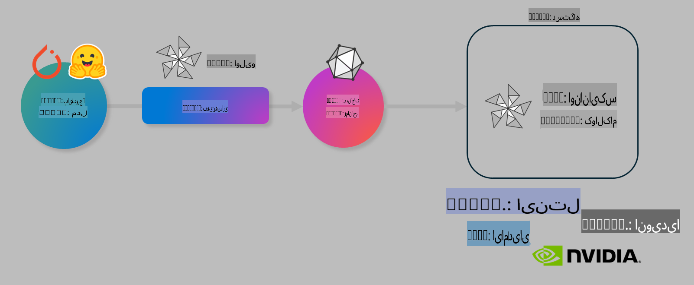

# آزمایشگاه: بهینه‌سازی مدل‌های هوش مصنوعی برای استنتاج روی دستگاه

## مقدمه

> [!IMPORTANT]  
> این آزمایشگاه نیاز به **کارت گرافیک Nvidia A10 یا A100** به همراه درایورها و ابزار CUDA نسخه 12 یا بالاتر دارد.

> [!NOTE]  
> این یک آزمایشگاه **35 دقیقه‌ای** است که به شما یک معرفی عملی از مفاهیم اصلی بهینه‌سازی مدل‌ها برای استنتاج روی دستگاه با استفاده از OLIVE می‌دهد.

## اهداف یادگیری

در پایان این آزمایشگاه، شما قادر خواهید بود با استفاده از OLIVE:

- یک مدل هوش مصنوعی را با روش کوانتیزاسیون AWQ کوانتیزه کنید.  
- یک مدل هوش مصنوعی را برای یک وظیفه خاص تنظیم کنید.  
- آداپتورهای LoRA (مدل تنظیم‌شده) را برای استنتاج کارآمد روی دستگاه با ONNX Runtime تولید کنید.  

### OLIVE چیست؟

OLIVE (*O*NNX *live*) یک ابزار بهینه‌سازی مدل با رابط خط فرمان (CLI) است که به شما امکان می‌دهد مدل‌ها را برای اجرای در ONNX Runtime +++https://onnxruntime.ai+++ با کیفیت و عملکرد بهینه آماده کنید.



ورودی OLIVE معمولاً یک مدل PyTorch یا Hugging Face است و خروجی آن یک مدل بهینه‌شده ONNX است که روی یک دستگاه (هدف استقرار) با ONNX Runtime اجرا می‌شود. OLIVE مدل را برای شتاب‌دهنده هوش مصنوعی دستگاه هدف (NPU، GPU، CPU) که توسط فروشندگانی مانند Qualcomm، AMD، Nvidia یا Intel ارائه شده، بهینه می‌کند.

OLIVE یک *جریان کاری* اجرا می‌کند که یک توالی مرتب از وظایف بهینه‌سازی مدل به نام *پاس‌ها* است. نمونه‌هایی از پاس‌ها شامل: فشرده‌سازی مدل، گرفتن گراف، کوانتیزاسیون، بهینه‌سازی گراف. هر پاس دارای مجموعه‌ای از پارامترهاست که می‌توان آنها را برای دستیابی به بهترین معیارها مانند دقت و تأخیر، تنظیم کرد. OLIVE از یک استراتژی جستجو استفاده می‌کند که الگوریتم جستجو را برای تنظیم خودکار هر پاس به تنهایی یا مجموعه‌ای از پاس‌ها با هم به کار می‌گیرد.

#### مزایای OLIVE

- **کاهش زمان و ناامیدی** ناشی از آزمایش دستی و خطا با تکنیک‌های مختلف برای بهینه‌سازی گراف، فشرده‌سازی و کوانتیزاسیون. محدودیت‌های کیفیت و عملکرد خود را تعریف کنید و بگذارید OLIVE بهترین مدل را برای شما پیدا کند.  
- **بیش از 40 مؤلفه بهینه‌سازی مدل داخلی** شامل تکنیک‌های پیشرفته در کوانتیزاسیون، فشرده‌سازی، بهینه‌سازی گراف و تنظیم دقیق.  
- **رابط خط فرمان ساده** برای وظایف رایج بهینه‌سازی مدل، مانند: olive quantize، olive auto-opt، olive finetune.  
- بسته‌بندی و استقرار مدل به صورت داخلی پشتیبانی می‌شود.  
- قابلیت تولید مدل‌ها برای **Multi LoRA serving**.  
- ساخت جریان‌های کاری با استفاده از YAML/JSON برای هماهنگی وظایف بهینه‌سازی و استقرار مدل.  
- یکپارچه‌سازی با **Hugging Face** و **Azure AI**.  
- مکانیزم **کش داخلی** برای **صرفه‌جویی در هزینه‌ها**.  

## دستورالعمل‌های آزمایشگاه

> [!NOTE]  
> لطفاً اطمینان حاصل کنید که Azure AI Hub و پروژه خود را راه‌اندازی کرده و A100 خود را مطابق با آزمایشگاه 1 تنظیم کرده‌اید.

### مرحله 0: اتصال به محاسبات Azure AI

شما با استفاده از قابلیت اتصال از راه دور در **VS Code** به محاسبات Azure AI متصل خواهید شد.

1. برنامه دسکتاپ **VS Code** خود را باز کنید:  
1. **پالت دستورات** را با استفاده از **Shift+Ctrl+P** باز کنید.  
1. در پالت دستورات، جستجو کنید **AzureML - remote: Connect to compute instance in New Window**.  
1. دستورالعمل‌های روی صفحه را دنبال کنید تا به محاسبه متصل شوید. این شامل انتخاب اشتراک Azure، گروه منابع، پروژه و نام محاسبه‌ای است که در آزمایشگاه 1 تنظیم کرده‌اید.  
1. پس از اتصال به گره محاسبات Azure ML، این اتصال در **پایین سمت چپ VS Code** نمایش داده می‌شود `><Azure ML: Compute Name`  

### مرحله 1: کلون کردن این مخزن

در VS Code، می‌توانید با استفاده از **Ctrl+J** یک ترمینال جدید باز کنید و این مخزن را کلون کنید:

در ترمینال باید این پیام را ببینید:

```
azureuser@computername:~/cloudfiles/code$ 
```  
کلون کردن راه‌حل  

```bash
cd ~/localfiles
git clone https://github.com/microsoft/phi-3cookbook.git
```  

### مرحله 2: باز کردن پوشه در VS Code

برای باز کردن VS Code در پوشه مربوطه، دستور زیر را در ترمینال اجرا کنید که یک پنجره جدید باز می‌کند:

```bash
code phi-3cookbook/code/04.Finetuning/Olive-lab
```  

همچنین می‌توانید پوشه را با انتخاب **File** > **Open Folder** باز کنید.  

### مرحله 3: وابستگی‌ها

یک پنجره ترمینال در VS Code در نمونه محاسبات Azure AI خود باز کنید (نکته: **Ctrl+J**) و دستورات زیر را برای نصب وابستگی‌ها اجرا کنید:

```bash
conda create -n olive-ai python=3.11 -y
conda activate olive-ai
pip install -r requirements.txt
az extension remove -n azure-cli-ml
az extension add -n ml
```  

> [!NOTE]  
> نصب تمام وابستگی‌ها حدود **5 دقیقه** طول می‌کشد.  

در این آزمایشگاه شما مدل‌ها را از کاتالوگ مدل Azure AI دانلود و آپلود خواهید کرد. برای دسترسی به کاتالوگ مدل، باید به Azure وارد شوید:

```bash
az login
```  

> [!NOTE]  
> در زمان ورود، از شما خواسته می‌شود اشتراک خود را انتخاب کنید. اطمینان حاصل کنید که اشتراک ارائه‌شده برای این آزمایشگاه را تنظیم کرده‌اید.  

### مرحله 4: اجرای دستورات OLIVE

یک پنجره ترمینال در VS Code در نمونه محاسبات Azure AI خود باز کنید (نکته: **Ctrl+J**) و اطمینان حاصل کنید که محیط `olive-ai` conda فعال است:

```bash
conda activate olive-ai
```  

سپس، دستورات زیر را در خط فرمان اجرا کنید.

1. **بررسی داده‌ها:** در این مثال، شما قصد دارید مدل Phi-3.5-Mini را برای پاسخ به سوالات مرتبط با سفر تنظیم کنید. کد زیر چند رکورد اول مجموعه داده را که به فرمت خطوط JSON است نمایش می‌دهد:

    ```bash
    head data/data_sample_travel.jsonl
    ```  

1. **کوانتیزه کردن مدل:** قبل از آموزش مدل، ابتدا آن را با دستور زیر که از تکنیکی به نام کوانتیزاسیون آگاه فعال (AWQ) استفاده می‌کند، کوانتیزه کنید. +++https://arxiv.org/abs/2306.00978+++ AWQ وزن‌های یک مدل را با در نظر گرفتن فعال‌سازی‌هایی که در طول استنتاج تولید می‌شوند، کوانتیزه می‌کند. این بدان معناست که فرآیند کوانتیزاسیون توزیع داده واقعی در فعال‌سازی‌ها را در نظر می‌گیرد و منجر به حفظ بهتر دقت مدل در مقایسه با روش‌های سنتی کوانتیزاسیون وزن می‌شود.

    ```bash
    olive quantize \
       --model_name_or_path microsoft/Phi-3.5-mini-instruct \
       --trust_remote_code \
       --algorithm awq \
       --output_path models/phi/awq \
       --log_level 1
    ```  

    این فرآیند **حدود 8 دقیقه** طول می‌کشد و **اندازه مدل را از ~7.5GB به ~2.5GB کاهش می‌دهد**.

    در این آزمایشگاه، ما به شما نشان می‌دهیم که چگونه مدل‌ها را از Hugging Face وارد کنید (به عنوان مثال: `microsoft/Phi-3.5-mini-instruct`). However, Olive also allows you to input models from the Azure AI catalog by updating the `model_name_or_path` argument to an Azure AI asset ID (for example:  `azureml://registries/azureml/models/Phi-3.5-mini-instruct/versions/4`). 

1. **Train the model:** Next, the `olive finetune` این دستور مدل کوانتیزه‌شده را تنظیم می‌کند. کوانتیزاسیون مدل *قبل از* تنظیم دقیق، دقت بهتری ارائه می‌دهد زیرا فرآیند تنظیم دقیق برخی از ضررهای کوانتیزاسیون را بازیابی می‌کند.

    ```bash
    olive finetune \
        --method lora \
        --model_name_or_path models/phi/awq \
        --data_files "data/data_sample_travel.jsonl" \
        --data_name "json" \
        --text_template "<|user|>\n{prompt}<|end|>\n<|assistant|>\n{response}<|end|>" \
        --max_steps 100 \
        --output_path ./models/phi/ft \
        --log_level 1
    ```  

    این فرآیند **حدود 6 دقیقه** طول می‌کشد (با 100 مرحله تنظیم دقیق).

1. **بهینه‌سازی:** با مدل آموزش‌دیده، اکنون می‌توانید مدل را با استفاده از دستور `auto-opt` command, which will capture the ONNX graph and automatically perform a number of optimizations to improve the model performance for CPU by compressing the model and doing fusions. It should be noted, that you can also optimize for other devices such as NPU or GPU by just updating the `--device` and `--provider` OLIVE بهینه کنید - اما برای اهداف این آزمایشگاه ما از CPU استفاده خواهیم کرد.

    ```bash
    olive auto-opt \
       --model_name_or_path models/phi/ft/model \
       --adapter_path models/phi/ft/adapter \
       --device cpu \
       --provider CPUExecutionProvider \
       --use_ort_genai \
       --output_path models/phi/onnx-ao \
       --log_level 1
    ```  

    این فرآیند **حدود 5 دقیقه** طول می‌کشد.

### مرحله 5: آزمایش سریع استنتاج مدل

برای آزمایش استنتاج مدل، یک فایل پایتون در پوشه خود با نام **app.py** ایجاد کنید و کد زیر را در آن کپی کنید:

```python
import onnxruntime_genai as og
import numpy as np

print("loading model and adapters...", end="", flush=True)
model = og.Model("models/phi/onnx-ao/model")
adapters = og.Adapters(model)
adapters.load("models/phi/onnx-ao/model/adapter_weights.onnx_adapter", "travel")
print("DONE!")

tokenizer = og.Tokenizer(model)
tokenizer_stream = tokenizer.create_stream()

params = og.GeneratorParams(model)
params.set_search_options(max_length=100, past_present_share_buffer=False)
user_input = "what is the best thing to see in chicago"
params.input_ids = tokenizer.encode(f"<|user|>\n{user_input}<|end|>\n<|assistant|>\n")

generator = og.Generator(model, params)

generator.set_active_adapter(adapters, "travel")

print(f"{user_input}")

while not generator.is_done():
    generator.compute_logits()
    generator.generate_next_token()

    new_token = generator.get_next_tokens()[0]
    print(tokenizer_stream.decode(new_token), end='', flush=True)

print("\n")
```  

کد را با استفاده از دستور زیر اجرا کنید:

```bash
python app.py
```  

### مرحله 6: آپلود مدل در Azure AI

آپلود مدل در یک مخزن مدل Azure AI باعث می‌شود مدل با سایر اعضای تیم توسعه شما قابل اشتراک‌گذاری باشد و همچنین کنترل نسخه مدل را مدیریت کند. برای آپلود مدل دستور زیر را اجرا کنید:

> [!NOTE]  
> `{}` placeholders with the name of your resource group and Azure AI Project Name. 

To find your resource group `"resourceGroup"` و نام پروژه Azure AI را به‌روزرسانی کنید و دستور زیر را اجرا کنید:

```
az ml workspace show
```  

یا با رفتن به +++ai.azure.com+++ و انتخاب **management center** **project** **overview**

مقادیر `{}` را با نام گروه منابع و نام پروژه Azure AI خود جایگزین کنید.

```bash
az ml model create \
    --name ft-for-travel \
    --version 1 \
    --path ./models/phi/onnx-ao \
    --resource-group {RESOURCE_GROUP_NAME} \
    --workspace-name {PROJECT_NAME}
```  
سپس می‌توانید مدل آپلود‌شده خود را مشاهده کنید و آن را در https://ml.azure.com/model/list مستقر کنید.  

**سلب مسئولیت**:  
این سند با استفاده از خدمات ترجمه ماشینی مبتنی بر هوش مصنوعی ترجمه شده است. در حالی که ما برای دقت تلاش می‌کنیم، لطفاً توجه داشته باشید که ترجمه‌های خودکار ممکن است شامل خطاها یا نادرستی‌هایی باشند. سند اصلی به زبان اصلی آن باید به عنوان منبع معتبر در نظر گرفته شود. برای اطلاعات حیاتی، ترجمه انسانی حرفه‌ای توصیه می‌شود. ما هیچ مسئولیتی در قبال سوءتفاهم‌ها یا تفسیرهای نادرست ناشی از استفاده از این ترجمه نداریم.