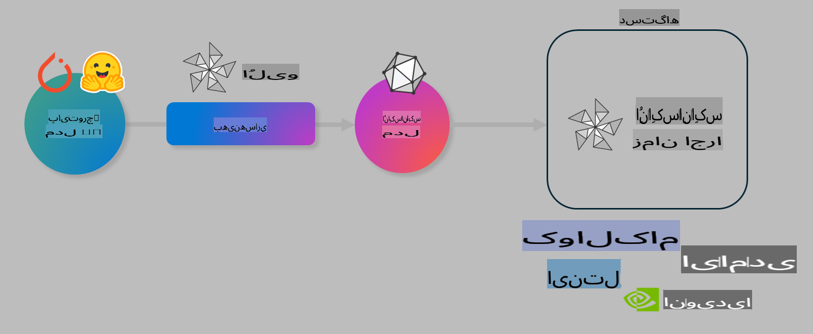

# آزمایشگاه: بهینه‌سازی مدل‌های هوش مصنوعی برای استنتاج در دستگاه

## مقدمه

> [!IMPORTANT]
> این آزمایشگاه نیاز به یک **کارت گرافیک Nvidia A10 یا A100** همراه با درایورهای مربوطه و ابزار CUDA (نسخه ۱۲ به بالا) دارد.

> [!NOTE]
> این یک آزمایشگاه **۳۵ دقیقه‌ای** است که به شما معرفی عملی مفاهیم اصلی بهینه‌سازی مدل‌ها برای استنتاج در دستگاه با استفاده از OLIVE را ارائه می‌دهد.

## اهداف یادگیری

تا پایان این آزمایشگاه، شما قادر خواهید بود با استفاده از OLIVE:

- یک مدل هوش مصنوعی را با استفاده از روش کوانتایز AWQ کوانتایز کنید.
- یک مدل هوش مصنوعی را برای یک وظیفه خاص بهینه‌سازی کنید.
- آداپتورهای LoRA (مدل بهینه‌شده) را برای استنتاج کارآمد در دستگاه روی ONNX Runtime تولید کنید.

### Olive چیست؟

Olive (*O*NNX *live*) یک ابزار بهینه‌سازی مدل همراه با یک رابط خط فرمان (CLI) است که به شما امکان می‌دهد مدل‌هایی را برای ONNX Runtime +++https://onnxruntime.ai+++ با کیفیت و عملکرد مناسب منتشر کنید.



ورودی به Olive معمولاً یک مدل PyTorch یا Hugging Face است و خروجی یک مدل بهینه‌شده ONNX است که روی یک دستگاه (هدف استقرار) اجرا می‌شود که ONNX Runtime را اجرا می‌کند. Olive مدل را برای شتاب‌دهنده هوش مصنوعی دستگاه هدف (NPU، GPU، CPU) که توسط یک تأمین‌کننده سخت‌افزار مانند Qualcomm، AMD، Nvidia یا Intel ارائه شده است، بهینه می‌کند.

Olive یک *روند کار* را اجرا می‌کند، که دنباله‌ای از وظایف بهینه‌سازی مدل به نام *گذرها* است - مثال‌هایی از گذرها شامل: فشرده‌سازی مدل، گرفتن گراف، کوانتایز، بهینه‌سازی گراف. هر گذر مجموعه‌ای از پارامترها دارد که می‌توان آنها را تنظیم کرد تا بهترین معیارها، مانند دقت و تأخیر، که توسط ارزیاب مربوطه ارزیابی می‌شوند، به دست آید. Olive از یک استراتژی جستجو استفاده می‌کند که از یک الگوریتم جستجو برای تنظیم خودکار هر گذر به صورت جداگانه یا گروهی از گذرها استفاده می‌کند.

#### مزایای Olive

- **کاهش استرس و زمان** آزمایش‌های دستی و تکراری با تکنیک‌های مختلف برای بهینه‌سازی گراف، فشرده‌سازی و کوانتایز. محدودیت‌های کیفیت و عملکرد خود را تعریف کنید و بگذارید Olive بهترین مدل را برای شما پیدا کند.
- **بیش از ۴۰ مؤلفه بهینه‌سازی مدل داخلی** که تکنیک‌های پیشرفته در کوانتایز، فشرده‌سازی، بهینه‌سازی گراف و بهینه‌سازی را پوشش می‌دهد.
- **رابط خط فرمان ساده** برای وظایف رایج بهینه‌سازی مدل. به عنوان مثال، olive quantize، olive auto-opt، olive finetune.
- بسته‌بندی و استقرار مدل به صورت داخلی پشتیبانی می‌شود.
- پشتیبانی از تولید مدل‌ها برای **Multi LoRA serving**.
- ساخت روندهای کاری با استفاده از YAML/JSON برای هماهنگی وظایف بهینه‌سازی و استقرار مدل.
- ادغام با **Hugging Face** و **Azure AI**.
- مکانیزم **کش داخلی** برای **کاهش هزینه‌ها**.

## دستورالعمل‌های آزمایشگاه

> [!NOTE]
> لطفاً مطمئن شوید که Azure AI Hub و پروژه خود را پیکربندی کرده‌اید و محاسبات A100 خود را طبق آزمایشگاه ۱ تنظیم کرده‌اید.

### گام ۰: اتصال به Azure AI Compute

شما با استفاده از قابلیت اتصال از راه دور در **VS Code** به Azure AI Compute متصل خواهید شد.

1. برنامه دسکتاپ **VS Code** خود را باز کنید:
1. از **Shift+Ctrl+P** برای باز کردن **پالت فرمان** استفاده کنید.
1. در پالت فرمان، **AzureML - remote: Connect to compute instance in New Window** را جستجو کنید.
1. دستورالعمل‌های روی صفحه را برای اتصال به Compute دنبال کنید. این شامل انتخاب اشتراک Azure، گروه منابع، پروژه و نام Compute است که در آزمایشگاه ۱ تنظیم کرده‌اید.
1. پس از اتصال به گره Azure ML Compute، این وضعیت در **پایین سمت چپ VS Code** نمایش داده خواهد شد `><Azure ML: Compute Name`

### گام ۱: کلون کردن این مخزن

در VS Code، می‌توانید با استفاده از **Ctrl+J** یک ترمینال جدید باز کنید و این مخزن را کلون کنید:

در ترمینال باید این پیام را ببینید:

```
azureuser@computername:~/cloudfiles/code$ 
```
کلون کردن راه‌حل:

```bash
cd ~/localfiles
git clone https://github.com/microsoft/phi-3cookbook.git
```

### گام ۲: باز کردن پوشه در VS Code

برای باز کردن VS Code در پوشه مربوطه، دستور زیر را در ترمینال اجرا کنید که یک پنجره جدید باز می‌کند:

```bash
code phi-3cookbook/code/04.Finetuning/Olive-lab
```

همچنین می‌توانید با انتخاب **File** > **Open Folder** پوشه را باز کنید.

### گام ۳: وابستگی‌ها

یک پنجره ترمینال در VS Code در Azure AI Compute Instance خود باز کنید (نکته: **Ctrl+J**) و دستورات زیر را برای نصب وابستگی‌ها اجرا کنید:

```bash
conda create -n olive-ai python=3.11 -y
conda activate olive-ai
pip install -r requirements.txt
az extension remove -n azure-cli-ml
az extension add -n ml
```

> [!NOTE]
> نصب تمام وابستگی‌ها حدود **۵ دقیقه** طول می‌کشد.

در این آزمایشگاه، شما مدل‌ها را از کاتالوگ مدل Azure AI دانلود و آپلود خواهید کرد. برای دسترسی به کاتالوگ مدل، باید با استفاده از دستور زیر وارد Azure شوید:

```bash
az login
```

> [!NOTE]
> هنگام ورود، از شما خواسته می‌شود اشتراک خود را انتخاب کنید. مطمئن شوید که اشتراک را به مورد ارائه شده برای این آزمایشگاه تنظیم کرده‌اید.

### گام ۴: اجرای دستورات Olive

یک پنجره ترمینال در VS Code در Azure AI Compute Instance خود باز کنید (نکته: **Ctrl+J**) و مطمئن شوید که محیط `olive-ai` conda فعال است:

```bash
conda activate olive-ai
```

سپس دستورات زیر را در خط فرمان Olive اجرا کنید.

1. **بررسی داده‌ها:** در این مثال، شما مدل Phi-3.5-Mini را بهینه‌سازی می‌کنید تا در پاسخ به سوالات مرتبط با سفر تخصصی شود. کد زیر چند رکورد اول مجموعه داده را که در قالب JSON lines است، نمایش می‌دهد:

    ```bash
    head data/data_sample_travel.jsonl
    ```
    
1. **کوانتایز کردن مدل:** قبل از آموزش مدل، ابتدا آن را با دستور زیر کوانتایز کنید که از تکنیکی به نام کوانتایز آگاه فعال (AWQ) استفاده می‌کند +++https://arxiv.org/abs/2306.00978+++. AWQ وزن‌های مدل را با توجه به فعال‌سازی‌هایی که در طول استنتاج تولید می‌شوند، کوانتایز می‌کند. این فرآیند به دلیل در نظر گرفتن توزیع داده واقعی در فعال‌سازی‌ها، نسبت به روش‌های سنتی کوانتایز وزن، دقت مدل را بهتر حفظ می‌کند.

    ```bash
    olive quantize \
       --model_name_or_path microsoft/Phi-3.5-mini-instruct \
       --trust_remote_code \
       --algorithm awq \
       --output_path models/phi/awq \
       --log_level 1
    ```
    
    این فرآیند حدود **۸ دقیقه** طول می‌کشد و **اندازه مدل را از حدود ۷.۵ گیگابایت به حدود ۲.۵ گیگابایت کاهش می‌دهد**.
    
    در این آزمایشگاه، ما به شما نشان می‌دهیم که چگونه مدل‌ها را از Hugging Face وارد کنید (برای مثال: `microsoft/Phi-3.5-mini-instruct`). However, Olive also allows you to input models from the Azure AI catalog by updating the `model_name_or_path` argument to an Azure AI asset ID (for example:  `azureml://registries/azureml/models/Phi-3.5-mini-instruct/versions/4`). 

1. **Train the model:** Next, the `olive finetune` دستور، مدل کوانتایز شده را بهینه‌سازی می‌کند. کوانتایز کردن مدل *قبل از* بهینه‌سازی به جای بعد از آن، دقت بهتری ارائه می‌دهد زیرا فرآیند بهینه‌سازی برخی از کاهش دقت ناشی از کوانتایز را جبران می‌کند.

    ```bash
    olive finetune \
        --method lora \
        --model_name_or_path models/phi/awq \
        --data_files "data/data_sample_travel.jsonl" \
        --data_name "json" \
        --text_template "<|user|>\n{prompt}<|end|>\n<|assistant|>\n{response}<|end|>" \
        --max_steps 100 \
        --output_path ./models/phi/ft \
        --log_level 1
    ```
    
    بهینه‌سازی حدود **۶ دقیقه** طول می‌کشد (با ۱۰۰ مرحله).

1. **بهینه‌سازی:** با مدل آموزش‌دیده، اکنون مدل را با استفاده از دستور `auto-opt` command, which will capture the ONNX graph and automatically perform a number of optimizations to improve the model performance for CPU by compressing the model and doing fusions. It should be noted, that you can also optimize for other devices such as NPU or GPU by just updating the `--device` and `--provider` Olive بهینه‌سازی کنید - اما برای اهداف این آزمایشگاه از CPU استفاده خواهیم کرد.

    ```bash
    olive auto-opt \
       --model_name_or_path models/phi/ft/model \
       --adapter_path models/phi/ft/adapter \
       --device cpu \
       --provider CPUExecutionProvider \
       --use_ort_genai \
       --output_path models/phi/onnx-ao \
       --log_level 1
    ```
    
    این فرآیند حدود **۵ دقیقه** طول می‌کشد.

### گام ۵: آزمایش سریع استنتاج مدل

برای آزمایش استنتاج مدل، یک فایل Python به نام **app.py** در پوشه خود ایجاد کنید و کد زیر را در آن کپی کنید:

```python
import onnxruntime_genai as og
import numpy as np

print("loading model and adapters...", end="", flush=True)
model = og.Model("models/phi/onnx-ao/model")
adapters = og.Adapters(model)
adapters.load("models/phi/onnx-ao/model/adapter_weights.onnx_adapter", "travel")
print("DONE!")

tokenizer = og.Tokenizer(model)
tokenizer_stream = tokenizer.create_stream()

params = og.GeneratorParams(model)
params.set_search_options(max_length=100, past_present_share_buffer=False)
user_input = "what is the best thing to see in chicago"
params.input_ids = tokenizer.encode(f"<|user|>\n{user_input}<|end|>\n<|assistant|>\n")

generator = og.Generator(model, params)

generator.set_active_adapter(adapters, "travel")

print(f"{user_input}")

while not generator.is_done():
    generator.compute_logits()
    generator.generate_next_token()

    new_token = generator.get_next_tokens()[0]
    print(tokenizer_stream.decode(new_token), end='', flush=True)

print("\n")
```

کد را با استفاده از دستور زیر اجرا کنید:

```bash
python app.py
```

### گام ۶: آپلود مدل به Azure AI

آپلود مدل در یک مخزن مدل Azure AI، مدل را با دیگر اعضای تیم توسعه شما قابل اشتراک می‌کند و همچنین کنترل نسخه مدل را مدیریت می‌کند. برای آپلود مدل، دستور زیر را اجرا کنید:

> [!NOTE]
> مقادیر `{}` را با نام گروه منابع و پروژه Azure AI خود به‌روزرسانی کنید و دستور زیر را اجرا کنید:

```
az ml workspace show
```

یا با رفتن به +++ai.azure.com+++ و انتخاب **management center** > **project** > **overview**

مقادیر `{}` را با نام گروه منابع و پروژه Azure AI خود به‌روزرسانی کنید.

```bash
az ml model create \
    --name ft-for-travel \
    --version 1 \
    --path ./models/phi/onnx-ao \
    --resource-group {RESOURCE_GROUP_NAME} \
    --workspace-name {PROJECT_NAME}
```
سپس می‌توانید مدل آپلود شده خود را مشاهده کرده و مدل خود را در https://ml.azure.com/model/list مستقر کنید.

**سلب مسئولیت**:  
این سند با استفاده از خدمات ترجمه ماشینی مبتنی بر هوش مصنوعی ترجمه شده است. در حالی که ما برای دقت تلاش می‌کنیم، لطفاً توجه داشته باشید که ترجمه‌های خودکار ممکن است شامل اشتباهات یا نادرستی‌هایی باشند. سند اصلی به زبان اصلی آن باید به عنوان منبع معتبر در نظر گرفته شود. برای اطلاعات حساس یا حیاتی، توصیه می‌شود از ترجمه انسانی حرفه‌ای استفاده کنید. ما هیچ مسئولیتی در قبال سوءتفاهم‌ها یا تفسیرهای نادرست ناشی از استفاده از این ترجمه نداریم.