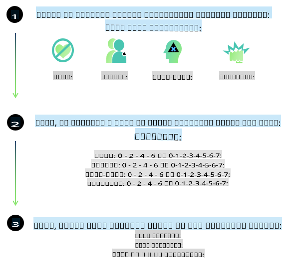
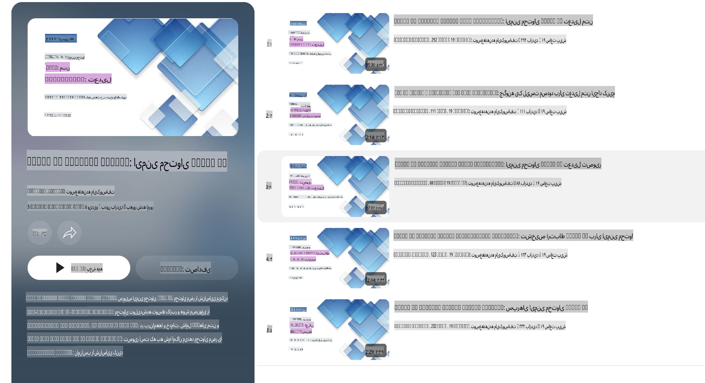

# ایمنی هوش مصنوعی برای مدل‌های Phi

خانواده مدل‌های Phi بر اساس [استاندارد مسئولیت‌پذیری هوش مصنوعی مایکروسافت](https://query.prod.cms.rt.microsoft.com/cms/api/am/binary/RE5cmFl) توسعه یافته‌اند، که مجموعه‌ای از الزامات در سطح شرکت است و بر شش اصل زیر استوار است: پاسخگویی، شفافیت، عدالت، قابلیت اطمینان و ایمنی، حریم خصوصی و امنیت، و فراگیری که اصول [هوش مصنوعی مسئولانه مایکروسافت](https://www.microsoft.com/ai/responsible-ai) را تشکیل می‌دهند.

مانند مدل‌های قبلی Phi، یک ارزیابی ایمنی چندوجهی و رویکرد پس از آموزش ایمنی اتخاذ شده است، با اقداماتی اضافی برای در نظر گرفتن قابلیت‌های چندزبانه این نسخه. رویکرد ما به آموزش و ارزیابی ایمنی، شامل آزمایش در چندین زبان و دسته‌بندی‌های خطر، در [مقاله پس از آموزش ایمنی Phi](https://arxiv.org/abs/2407.13833) شرح داده شده است. اگرچه مدل‌های Phi از این رویکرد بهره‌مند می‌شوند، توسعه‌دهندگان باید بهترین روش‌های هوش مصنوعی مسئولانه را اعمال کنند، از جمله نقشه‌برداری، اندازه‌گیری و کاهش خطرات مرتبط با مورد استفاده خاص خود و زمینه فرهنگی و زبانی.

## بهترین روش‌ها

مانند سایر مدل‌ها، خانواده مدل‌های Phi ممکن است به شیوه‌هایی رفتار کنند که ناعادلانه، غیرقابل‌اعتماد یا توهین‌آمیز باشند.

برخی از رفتارهای محدودکننده SLM و LLM که باید از آن‌ها آگاه باشید شامل موارد زیر است:

- **کیفیت خدمات:** مدل‌های Phi عمدتاً بر اساس متون انگلیسی آموزش دیده‌اند. زبان‌هایی غیر از انگلیسی عملکرد ضعیف‌تری خواهند داشت. گونه‌های زبان انگلیسی که نمایندگی کمتری در داده‌های آموزشی دارند ممکن است عملکرد ضعیف‌تری نسبت به انگلیسی استاندارد آمریکایی داشته باشند.
- **نمایش آسیب‌ها و تداوم کلیشه‌ها:** این مدل‌ها ممکن است گروه‌های مختلف مردم را بیش از حد یا کمتر از حد نمایندگی کنند، نمایندگی برخی گروه‌ها را نادیده بگیرند، یا کلیشه‌های تحقیرآمیز یا منفی را تقویت کنند. با وجود آموزش‌های پس از ایمنی، این محدودیت‌ها ممکن است به دلیل سطوح مختلف نمایندگی گروه‌های مختلف یا فراوانی مثال‌های کلیشه‌های منفی در داده‌های آموزشی که الگوهای واقعی و تعصبات اجتماعی را منعکس می‌کنند، همچنان وجود داشته باشند.
- **محتوای نامناسب یا توهین‌آمیز:** این مدل‌ها ممکن است انواع دیگری از محتوای نامناسب یا توهین‌آمیز تولید کنند که ممکن است آن‌ها را برای استفاده در زمینه‌های حساس بدون کاهش‌های اضافی که مختص مورد استفاده است، نامناسب کند.
- **قابلیت اطمینان اطلاعات:** مدل‌های زبانی ممکن است محتوای بی‌معنی تولید کنند یا محتوایی بسازند که ممکن است منطقی به نظر برسد اما نادرست یا قدیمی باشد.
- **محدودیت در حوزه کدنویسی:** بخش عمده داده‌های آموزشی Phi-3 مبتنی بر Python است و از بسته‌های متداولی مانند "typing, math, random, collections, datetime, itertools" استفاده می‌کند. اگر مدل اسکریپت‌های Python تولید کند که از بسته‌های دیگر یا زبان‌های برنامه‌نویسی دیگر استفاده می‌کنند، اکیداً توصیه می‌شود کاربران تمامی استفاده‌های API را به صورت دستی بررسی کنند.

توسعه‌دهندگان باید بهترین روش‌های هوش مصنوعی مسئولانه را اعمال کنند و اطمینان حاصل کنند که مورد استفاده خاص آن‌ها با قوانین و مقررات مرتبط (مانند حریم خصوصی، تجارت و غیره) سازگار است.

## ملاحظات هوش مصنوعی مسئولانه

مانند سایر مدل‌های زبانی، مدل‌های سری Phi ممکن است به شیوه‌هایی رفتار کنند که ناعادلانه، غیرقابل‌اعتماد یا توهین‌آمیز باشند. برخی از رفتارهای محدودکننده که باید از آن‌ها آگاه باشید شامل موارد زیر است:

**کیفیت خدمات:** مدل‌های Phi عمدتاً بر اساس متون انگلیسی آموزش دیده‌اند. زبان‌هایی غیر از انگلیسی عملکرد ضعیف‌تری خواهند داشت. گونه‌های زبان انگلیسی که نمایندگی کمتری در داده‌های آموزشی دارند ممکن است عملکرد ضعیف‌تری نسبت به انگلیسی استاندارد آمریکایی داشته باشند.

**نمایش آسیب‌ها و تداوم کلیشه‌ها:** این مدل‌ها ممکن است گروه‌های مختلف مردم را بیش از حد یا کمتر از حد نمایندگی کنند، نمایندگی برخی گروه‌ها را نادیده بگیرند، یا کلیشه‌های تحقیرآمیز یا منفی را تقویت کنند. با وجود آموزش‌های پس از ایمنی، این محدودیت‌ها ممکن است به دلیل سطوح مختلف نمایندگی گروه‌های مختلف یا فراوانی مثال‌های کلیشه‌های منفی در داده‌های آموزشی که الگوهای واقعی و تعصبات اجتماعی را منعکس می‌کنند، همچنان وجود داشته باشند.

**محتوای نامناسب یا توهین‌آمیز:** این مدل‌ها ممکن است انواع دیگری از محتوای نامناسب یا توهین‌آمیز تولید کنند که ممکن است آن‌ها را برای استفاده در زمینه‌های حساس بدون کاهش‌های اضافی که مختص مورد استفاده است، نامناسب کند.

**قابلیت اطمینان اطلاعات:** مدل‌های زبانی ممکن است محتوای بی‌معنی تولید کنند یا محتوایی بسازند که ممکن است منطقی به نظر برسد اما نادرست یا قدیمی باشد.

**محدودیت در حوزه کدنویسی:** بخش عمده داده‌های آموزشی Phi-3 مبتنی بر Python است و از بسته‌های متداولی مانند "typing, math, random, collections, datetime, itertools" استفاده می‌کند. اگر مدل اسکریپت‌های Python تولید کند که از بسته‌های دیگر یا زبان‌های برنامه‌نویسی دیگر استفاده می‌کنند، اکیداً توصیه می‌شود کاربران تمامی استفاده‌های API را به صورت دستی بررسی کنند.

توسعه‌دهندگان باید بهترین روش‌های هوش مصنوعی مسئولانه را اعمال کنند و اطمینان حاصل کنند که مورد استفاده خاص آن‌ها با قوانین و مقررات مرتبط (مانند حریم خصوصی، تجارت و غیره) سازگار است. زمینه‌های مهم برای بررسی شامل موارد زیر است:

**تخصیص:** مدل‌ها ممکن است برای سناریوهایی که می‌توانند تأثیر قابل‌توجهی بر وضعیت قانونی یا تخصیص منابع یا فرصت‌های زندگی (مانند مسکن، اشتغال، اعتبار و غیره) داشته باشند، بدون ارزیابی‌های بیشتر و تکنیک‌های کاهش تعصب اضافی، مناسب نباشند.

**سناریوهای پرخطر:** توسعه‌دهندگان باید تناسب استفاده از مدل‌ها را در سناریوهای پرخطر ارزیابی کنند، جایی که خروجی‌های ناعادلانه، غیرقابل‌اعتماد یا توهین‌آمیز ممکن است بسیار پرهزینه باشد یا منجر به آسیب شود. این شامل ارائه مشاوره در حوزه‌های حساس یا تخصصی است که در آن دقت و قابلیت اطمینان بسیار مهم است (مانند مشاوره حقوقی یا پزشکی). اقدامات حفاظتی اضافی باید در سطح برنامه و بر اساس زمینه استقرار اجرا شود.

**اطلاعات نادرست:** مدل‌ها ممکن است اطلاعات نادرست تولید کنند. توسعه‌دهندگان باید بهترین روش‌های شفافیت را دنبال کرده و به کاربران نهایی اطلاع دهند که با یک سیستم هوش مصنوعی تعامل دارند. در سطح برنامه، توسعه‌دهندگان می‌توانند مکانیسم‌های بازخورد و خطوط لوله‌ای برای تثبیت پاسخ‌ها در اطلاعات خاص و متنی مربوط به مورد استفاده ایجاد کنند، تکنیکی که به عنوان تولید بازیابی افزوده (RAG) شناخته می‌شود.

**تولید محتوای مضر:** توسعه‌دهندگان باید خروجی‌ها را برای زمینه خود ارزیابی کرده و از طبقه‌بندی‌کننده‌های ایمنی موجود یا راه‌حل‌های سفارشی مناسب برای مورد استفاده خود استفاده کنند.

**سوءاستفاده:** سایر اشکال سوءاستفاده مانند کلاهبرداری، هرزنامه یا تولید بدافزار ممکن است امکان‌پذیر باشد، و توسعه‌دهندگان باید اطمینان حاصل کنند که برنامه‌های آن‌ها قوانین و مقررات قابل‌اجرا را نقض نمی‌کنند.

### تنظیم دقیق و ایمنی محتوای هوش مصنوعی

پس از تنظیم دقیق یک مدل، اکیداً توصیه می‌شود از اقدامات [ایمنی محتوای هوش مصنوعی Azure](https://learn.microsoft.com/azure/ai-services/content-safety/overview) برای نظارت بر محتوای تولید شده توسط مدل‌ها، شناسایی و مسدود کردن خطرات، تهدیدات و مشکلات کیفیت بالقوه استفاده شود.

[ایمنی محتوای هوش مصنوعی Azure](https://learn.microsoft.com/azure/ai-services/content-safety/overview) از محتوای متنی و تصویری پشتیبانی می‌کند. این قابلیت می‌تواند در فضای ابری، کانتینرهای جداگانه و دستگاه‌های لبه/تعبیه شده مستقر شود.

## نمای کلی از ایمنی محتوای هوش مصنوعی Azure

ایمنی محتوای هوش مصنوعی Azure یک راه‌حل جامع نیست؛ بلکه می‌توان آن را برای همسویی با سیاست‌های خاص کسب‌وکارها سفارشی کرد. علاوه بر این، مدل‌های چندزبانه آن امکان درک چندین زبان به طور همزمان را فراهم می‌کنند.

- **ایمنی محتوای هوش مصنوعی Azure**  
- **توسعه‌دهنده مایکروسافت**  
- **5 ویدیو**

خدمات ایمنی محتوای هوش مصنوعی Azure محتوای مضر تولید شده توسط کاربران و هوش مصنوعی را در برنامه‌ها و خدمات شناسایی می‌کند. این سرویس شامل APIهای متنی و تصویری است که به شما امکان می‌دهد محتوای مضر یا نامناسب را شناسایی کنید.

[لیست پخش ایمنی محتوای هوش مصنوعی](https://www.youtube.com/playlist?list=PLlrxD0HtieHjaQ9bJjyp1T7FeCbmVcPkQ)  

**سلب مسئولیت**:  
این سند با استفاده از خدمات ترجمه ماشینی مبتنی بر هوش مصنوعی ترجمه شده است. در حالی که ما برای دقت تلاش می‌کنیم، لطفاً توجه داشته باشید که ترجمه‌های خودکار ممکن است حاوی خطاها یا نادقتی‌هایی باشند. سند اصلی به زبان اصلی آن باید به عنوان منبع معتبر در نظر گرفته شود. برای اطلاعات حساس، ترجمه حرفه‌ای انسانی توصیه می‌شود. ما هیچ‌گونه مسئولیتی در قبال سوءتفاهم‌ها یا تفسیرهای نادرست ناشی از استفاده از این ترجمه نمی‌پذیریم.