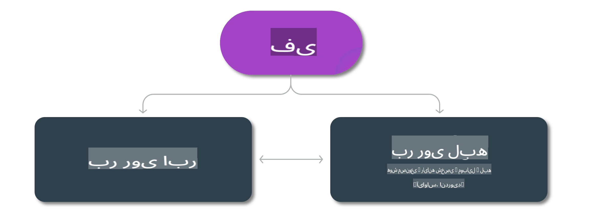

# مدل‌های فی و دسترس‌پذیری در پلتفرم‌های مختلف

## سناریوهای Edge و Cloud

## دسترس‌پذیری مدل‌ها و منابع

| | | | | | | | | |
|-|-|-|-|-|-|-|-|-|
|مدل|ورودی|طول محتوا|Azure AI (MaaS)|Azure ML (MaaP)|ONNX|Hugging Face|Ollama|Nvidia NIM|
|Phi-3-vision-128k-instruct|متن+تصویر|128k|[Playground & Deployment](https://ai.azure.com/explore/models/Phi-3-vision-128k-instruct/version/2/registry/azureml)|[Playground, Deployment & Finetuning](https://ml.azure.com/registries/azureml/models/Phi-3-vision-128k-instruct/version/2)|[CUDA](https://huggingface.co/microsoft/Phi-3-vision-128k-instruct-onnx-cuda/tree/main)،[CPU](https://huggingface.co/microsoft/Phi-3-vision-128k-instruct-onnx-cpu/tree/main)، [DirectML](https://huggingface.co/microsoft/Phi-3-vision-128k-instruct-onnx-directml/tree/main)|[دانلود](https://huggingface.co/microsoft/Phi-3-vision-128k-instruct)|-NA-|[NIM APIs](https://build.nvidia.com/microsoft/phi-3-vision-128k-instruct)|
|Phi-3-mini-4k-instruct|متن|4k|[Playground & Deployment](https://aka.ms/phi3-mini-4k-azure-ml)|[Playground, Deployment](https://aka.ms/phi3-mini-4k-azure-ml) & Finetuning|[CUDA](https://huggingface.co/microsoft/Phi-3-mini-4k-instruct-onnx)، [وب](https://huggingface.co/microsoft/Phi-3-mini-4k-instruct-onnx)|[Playground & دانلود](https://huggingface.co/chat/models/microsoft/Phi-3-mini-4k-instruct)|[GGUF](https://huggingface.co/microsoft/Phi-3-mini-4k-instruct-gguf)|[NIM APIs](https://build.nvidia.com/microsoft/phi-3-mini-4k)|
|Phi-3-mini-128k-instruct|متن|128k|[Playground & Deployment](https://ai.azure.com/explore/models/Phi-3-mini-128k-instruct/version/9/registry/azureml)|[Playground, Deployment](https://ai.azure.com/explore/models/Phi-3-mini-128k-instruct/version/9/registry/azureml) & Finetuning|[CUDA](https://huggingface.co/microsoft/Phi-3-mini-128k-instruct-onnx)|[دانلود](https://huggingface.co/microsoft/Phi-3-mini-128k-instruct-onnx)|-NA-|[NIM APIs](https://build.nvidia.com/microsoft/phi-3-mini)|
|Phi-3-small-8k-instruct|متن|8k|[Playground & Deployment](https://ml.azure.com/registries/azureml/models/Phi-3-small-8k-instruct/version/2)|[Playground, Deployment](https://ai.azure.com/explore/models/Phi-3-small-8k-instruct/version/2/registry/azureml) & Finetuning|[CUDA](https://huggingface.co/microsoft/Phi-3-small-8k-instruct-onnx-cuda)|[دانلود](https://huggingface.co/microsoft/Phi-3-small-8k-instruct-onnx-cuda)|-NA-|[NIM APIs](https://build.nvidia.com/microsoft/phi-3-small-8k-instruct?docker=false)|
|Phi-3-small-128k-instruct|متن|128k|[Playground & Deployment](https://ai.azure.com/explore/models/Phi-3-small-128k-instruct/version/2/registry/azureml)|[Playground, Deployment](https://ml.azure.com/registries/azureml/models/Phi-3-small-128k-instruct/version/2) & Finetuning|[CUDA](https://huggingface.co/microsoft/Phi-3-medium-128k-instruct-onnx-cuda)|[دانلود](https://huggingface.co/microsoft/Phi-3-small-128k-instruct)|-NA-|[NIM APIs](https://build.nvidia.com/microsoft/phi-3-small-128k-instruct?docker=false)|
|Phi-3-medium-4k-instruct|متن|4k|[Playground & Deployment](https://huggingface.co/microsoft/Phi-3-medium-4k-instruct)|[Playground, Deployment](https://ml.azure.com/registries/azureml/models/Phi-3-medium-4k-instruct/version/2) و تنظیم دقیق|[CUDA](https://huggingface.co/microsoft/Phi-3-medium-4k-instruct-onnx-cuda/tree/main), [CPU](https://huggingface.co/microsoft/Phi-3-medium-4k-instruct-onnx-cpu/tree/main), [DirectML](https://huggingface.co/microsoft/Phi-3-medium-4k-instruct-onnx-directml/tree/main)|[Download](https://huggingface.co/microsoft/Phi-3-medium-4k-instruct)|-NA-|[NIM APIs](https://build.nvidia.com/microsoft/phi-3-medium-4k-instruct?docker=false)|
|Phi-3-medium-128k-instruct|متن|128k|[Playground & Deployment](https://ai.azure.com/explore/models/Phi-3-medium-128k-instruct/version/2)|[Playground, Deployment](https://ml.azure.com/registries/azureml/models/Phi-3-medium-128k-instruct/version/2) و تنظیم دقیق|[CUDA](https://huggingface.co/microsoft/Phi-3-medium-128k-instruct-onnx-cuda/tree/main), [CPU](https://huggingface.co/microsoft/Phi-3-medium-128k-instruct-onnx-cpu/tree/main), [DirectML](https://huggingface.co/microsoft/Phi-3-medium-128k-instruct-onnx-directml/tree/main)|[Download](https://huggingface.co/microsoft/Phi-3-medium-128k-instruct)|-NA-|-NA-|

**سلب مسئولیت**:  
این سند با استفاده از خدمات ترجمه ماشینی مبتنی بر هوش مصنوعی ترجمه شده است. در حالی که ما برای دقت تلاش می‌کنیم، لطفاً توجه داشته باشید که ترجمه‌های خودکار ممکن است حاوی اشتباهات یا نادقتی‌هایی باشند. سند اصلی به زبان اصلی آن باید به‌عنوان منبع معتبر در نظر گرفته شود. برای اطلاعات حیاتی، ترجمه انسانی حرفه‌ای توصیه می‌شود. ما هیچ مسئولیتی در قبال سوءتفاهم‌ها یا تفسیرهای نادرست ناشی از استفاده از این ترجمه نداریم.