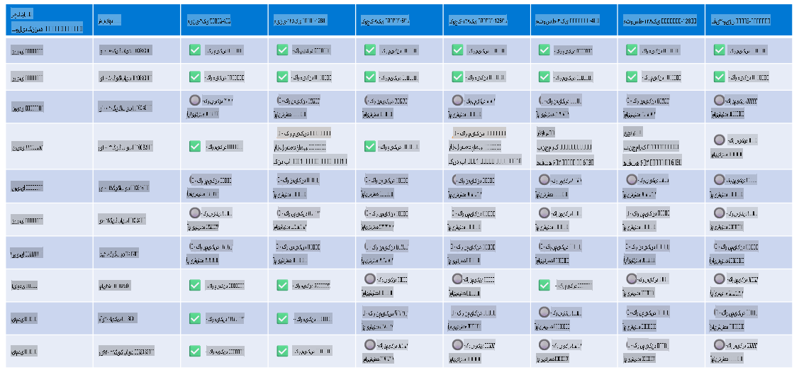

# پشتیبانی سخت‌افزاری Phi

مایکروسافت Phi برای ONNX Runtime بهینه‌سازی شده است و از Windows DirectML پشتیبانی می‌کند. این ابزار با انواع مختلف سخت‌افزار از جمله GPUها، CPUها و حتی دستگاه‌های موبایل به خوبی کار می‌کند.

## سخت‌افزار دستگاه  
سخت‌افزارهای پشتیبانی‌شده شامل موارد زیر است:

- مدل GPU: RTX 4090 (DirectML)
- مدل GPU: 1 A100 80GB (CUDA)
- مدل CPU: Standard F64s v2 (64 vCPU، 128 گیگابایت حافظه)

## مدل‌های موبایل  

- اندروید - سامسونگ گلکسی S21  
- اپل آیفون 14 یا بالاتر با پردازنده A16/A17  

## مشخصات سخت‌افزاری Phi  

- حداقل پیکربندی مورد نیاز:  
- ویندوز: GPU با قابلیت DirectX 12 و حداقل ۴ گیگابایت حافظه ترکیبی  

CUDA: کارت گرافیک NVIDIA با قابلیت محاسباتی >= 7.02  



## اجرای onnxruntime بر روی چند GPU  

مدل‌های Phi ONNX که در حال حاضر موجود هستند، تنها برای ۱ GPU طراحی شده‌اند. امکان پشتیبانی از چند GPU برای مدل Phi وجود دارد، اما استفاده از ORT با ۲ GPU تضمین نمی‌کند که بازدهی بیشتری نسبت به اجرای ۲ نمونه از ORT به صورت جداگانه داشته باشد. برای آخرین به‌روزرسانی‌ها به [ONNX Runtime](https://onnxruntime.ai/) مراجعه کنید.  

در [Build 2024 تیم GenAI ONNX](https://youtu.be/WLW4SE8M9i8?si=EtG04UwDvcjunyfC) اعلام کرد که به جای استفاده از چند GPU، قابلیت چند نمونه‌ای (multi-instance) را برای مدل‌های Phi فعال کرده‌اند.  

در حال حاضر این امکان به شما اجازه می‌دهد که یک نمونه از onnxruntime یا onnxruntime-genai را با استفاده از متغیر محیطی CUDA_VISIBLE_DEVICES به صورت زیر اجرا کنید.  

```Python
CUDA_VISIBLE_DEVICES=0 python infer.py
CUDA_VISIBLE_DEVICES=1 python infer.py
```  

برای کشف بیشتر Phi، به [Azure AI Foundry](https://ai.azure.com) سر بزنید.  

**سلب مسئولیت**:  
این سند با استفاده از خدمات ترجمه ماشینی مبتنی بر هوش مصنوعی ترجمه شده است. در حالی که ما تلاش می‌کنیم دقت را رعایت کنیم، لطفاً توجه داشته باشید که ترجمه‌های خودکار ممکن است شامل خطاها یا نادقتی‌ها باشند. سند اصلی به زبان بومی آن باید به عنوان منبع معتبر در نظر گرفته شود. برای اطلاعات حساس یا حیاتی، توصیه می‌شود از ترجمه انسانی حرفه‌ای استفاده شود. ما هیچ مسئولیتی در قبال سوءتفاهم‌ها یا تفسیرهای نادرست ناشی از استفاده از این ترجمه نمی‌پذیریم.