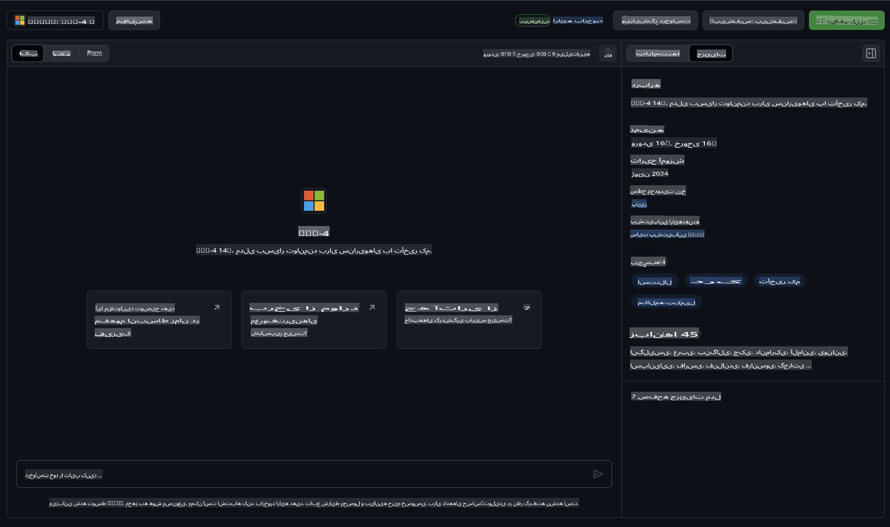

## خانواده Phi در مدل‌های GitHub

به [مدل‌های GitHub](https://github.com/marketplace/models) خوش آمدید! همه چیز آماده است تا شما مدل‌های هوش مصنوعی میزبانی‌شده در Azure AI را کاوش کنید.


برای اطلاعات بیشتر درباره مدل‌های موجود در GitHub Models، به [بازار مدل‌های GitHub](https://github.com/marketplace/models) سر بزنید.

## مدل‌های موجود

هر مدل دارای یک محیط آزمایش (playground) اختصاصی و کد نمونه است.



### خانواده Phi در کاتالوگ مدل‌های GitHub

- [Phi-4](https://github.com/marketplace/models/azureml/Phi-4)

- [Phi-3.5-MoE instruct (128k)](https://github.com/marketplace/models/azureml/Phi-3-5-MoE-instruct)

- [Phi-3.5-vision instruct (128k)](https://github.com/marketplace/models/azureml/Phi-3-5-vision-instruct)

- [Phi-3.5-mini instruct (128k)](https://github.com/marketplace/models/azureml/Phi-3-5-mini-instruct)

- [Phi-3-Medium-128k-Instruct](https://github.com/marketplace/models/azureml/Phi-3-medium-128k-instruct)

- [Phi-3-medium-4k-instruct](https://github.com/marketplace/models/azureml/Phi-3-medium-4k-instruct)

- [Phi-3-mini-128k-instruct](https://github.com/marketplace/models/azureml/Phi-3-mini-128k-instruct)

- [Phi-3-mini-4k-instruct](https://github.com/marketplace/models/azureml/Phi-3-mini-4k-instruct)

- [Phi-3-small-128k-instruct](https://github.com/marketplace/models/azureml/Phi-3-small-128k-instruct)

- [Phi-3-small-8k-instruct](https://github.com/marketplace/models/azureml/Phi-3-small-8k-instruct)

## شروع کار

چند نمونه پایه آماده اجرا برای شما وجود دارد. می‌توانید آن‌ها را در دایرکتوری نمونه‌ها پیدا کنید. اگر می‌خواهید مستقیماً به زبان مورد علاقه‌تان بپردازید، می‌توانید نمونه‌ها را در زبان‌های زیر پیدا کنید:

- Python  
- JavaScript  
- C#  
- Java  
- cURL  

همچنین یک محیط اختصاصی Codespaces برای اجرای نمونه‌ها و مدل‌ها در دسترس است.


## کد نمونه

در زیر قطعه‌کدهای نمونه برای چند مورد استفاده آورده شده است. برای اطلاعات بیشتر درباره Azure AI Inference SDK، به مستندات کامل و نمونه‌ها مراجعه کنید.

## راه‌اندازی

1. ایجاد یک توکن دسترسی شخصی  
نیازی به دادن هیچ مجوزی به این توکن نیست. توجه داشته باشید که توکن به یک سرویس مایکروسافت ارسال خواهد شد.

برای استفاده از قطعه‌کدهای زیر، یک متغیر محیطی ایجاد کنید تا توکن خود را به‌عنوان کلید برای کد کلاینت تنظیم کنید.

اگر از bash استفاده می‌کنید:  
```
export GITHUB_TOKEN="<your-github-token-goes-here>"
```  
اگر از powershell استفاده می‌کنید:  

```
$Env:GITHUB_TOKEN="<your-github-token-goes-here>"
```  

اگر از خط فرمان ویندوز استفاده می‌کنید:  

```
set GITHUB_TOKEN=<your-github-token-goes-here>
```  

## نمونه Python

### نصب وابستگی‌ها  
Azure AI Inference SDK را با استفاده از pip نصب کنید (نیاز به Python >=3.8):  

```
pip install azure-ai-inference
```  

### اجرای یک نمونه کد پایه  

این نمونه یک فراخوانی پایه به API تکمیل چت را نشان می‌دهد. این نمونه از نقطه پایانی استنتاج مدل GitHub AI و توکن GitHub شما استفاده می‌کند. این فراخوانی به‌صورت همگام است.  

```python
import os
from azure.ai.inference import ChatCompletionsClient
from azure.ai.inference.models import SystemMessage, UserMessage
from azure.core.credentials import AzureKeyCredential

endpoint = "https://models.inference.ai.azure.com"
model_name = "Phi-4"
token = os.environ["GITHUB_TOKEN"]

client = ChatCompletionsClient(
    endpoint=endpoint,
    credential=AzureKeyCredential(token),
)

response = client.complete(
    messages=[
        UserMessage(content="I have $20,000 in my savings account, where I receive a 4% profit per year and payments twice a year. Can you please tell me how long it will take for me to become a millionaire? Also, can you please explain the math step by step as if you were explaining it to an uneducated person?"),
    ],
    temperature=0.4,
    top_p=1.0,
    max_tokens=2048,
    model=model_name
)

print(response.choices[0].message.content)
```  

### اجرای یک مکالمه چندمرحله‌ای  

این نمونه یک مکالمه چندمرحله‌ای با API تکمیل چت را نشان می‌دهد. هنگامی که از مدل برای یک برنامه چت استفاده می‌کنید، باید تاریخچه آن مکالمه را مدیریت کرده و آخرین پیام‌ها را به مدل ارسال کنید.  

```
import os
from azure.ai.inference import ChatCompletionsClient
from azure.ai.inference.models import AssistantMessage, SystemMessage, UserMessage
from azure.core.credentials import AzureKeyCredential

token = os.environ["GITHUB_TOKEN"]
endpoint = "https://models.inference.ai.azure.com"
# Replace Model_Name
model_name = "Phi-4"

client = ChatCompletionsClient(
    endpoint=endpoint,
    credential=AzureKeyCredential(token),
)

messages = [
    SystemMessage(content="You are a helpful assistant."),
    UserMessage(content="What is the capital of France?"),
    AssistantMessage(content="The capital of France is Paris."),
    UserMessage(content="What about Spain?"),
]

response = client.complete(messages=messages, model=model_name)

print(response.choices[0].message.content)
```  

### استریم خروجی  

برای تجربه بهتر کاربری، ممکن است بخواهید پاسخ مدل را استریم کنید تا اولین توکن زودتر نمایش داده شود و از انتظار برای پاسخ‌های طولانی جلوگیری شود.  

```
import os
from azure.ai.inference import ChatCompletionsClient
from azure.ai.inference.models import SystemMessage, UserMessage
from azure.core.credentials import AzureKeyCredential

token = os.environ["GITHUB_TOKEN"]
endpoint = "https://models.inference.ai.azure.com"
# Replace Model_Name
model_name = "Phi-4"

client = ChatCompletionsClient(
    endpoint=endpoint,
    credential=AzureKeyCredential(token),
)

response = client.complete(
    stream=True,
    messages=[
        SystemMessage(content="You are a helpful assistant."),
        UserMessage(content="Give me 5 good reasons why I should exercise every day."),
    ],
    model=model_name,
)

for update in response:
    if update.choices:
        print(update.choices[0].delta.content or "", end="")

client.close()
```  

## استفاده رایگان و محدودیت‌های نرخ برای مدل‌های GitHub


[محدودیت‌های نرخ برای محیط آزمایش و استفاده رایگان از API](https://docs.github.com/en/github-models/prototyping-with-ai-models#rate-limits) به شما کمک می‌کند تا با مدل‌ها آزمایش کنید و برنامه هوش مصنوعی خود را نمونه‌سازی کنید. برای استفاده فراتر از این محدودیت‌ها و برای مقیاس‌دهی به برنامه خود، باید منابعی را از یک حساب Azure تأمین کرده و از آنجا احراز هویت کنید، به‌جای استفاده از توکن دسترسی شخصی GitHub. نیازی به تغییر چیز دیگری در کد شما نیست. از این لینک استفاده کنید تا ببینید چگونه می‌توانید فراتر از محدودیت‌های لایه رایگان در Azure AI بروید.

### افشاگری‌ها

به یاد داشته باشید هنگام تعامل با یک مدل، شما در حال آزمایش با هوش مصنوعی هستید، بنابراین امکان خطا در محتوا وجود دارد.

این ویژگی تحت محدودیت‌های مختلفی (شامل درخواست‌ها در هر دقیقه، درخواست‌ها در هر روز، توکن‌ها در هر درخواست، و درخواست‌های هم‌زمان) قرار دارد و برای موارد استفاده تولیدی طراحی نشده است.

مدل‌های GitHub از Azure AI Content Safety استفاده می‌کنند. این فیلترها به‌عنوان بخشی از تجربه مدل‌های GitHub قابل خاموش شدن نیستند. اگر تصمیم به استفاده از مدل‌ها از طریق یک سرویس پولی دارید، لطفاً فیلترهای محتوای خود را مطابق با نیازهای خود پیکربندی کنید.

این سرویس تحت شرایط پیش‌انتشار GitHub است.

**سلب مسئولیت**:  
این سند با استفاده از خدمات ترجمه ماشینی مبتنی بر هوش مصنوعی ترجمه شده است. در حالی که ما برای دقت تلاش می‌کنیم، لطفاً توجه داشته باشید که ترجمه‌های خودکار ممکن است شامل اشتباهات یا نادرستی‌هایی باشند. سند اصلی به زبان اصلی آن باید به عنوان منبع معتبر در نظر گرفته شود. برای اطلاعات حیاتی، توصیه می‌شود از ترجمه انسانی حرفه‌ای استفاده کنید. ما هیچ مسئولیتی در قبال سوءتفاهم‌ها یا تفسیرهای نادرست ناشی از استفاده از این ترجمه نداریم.