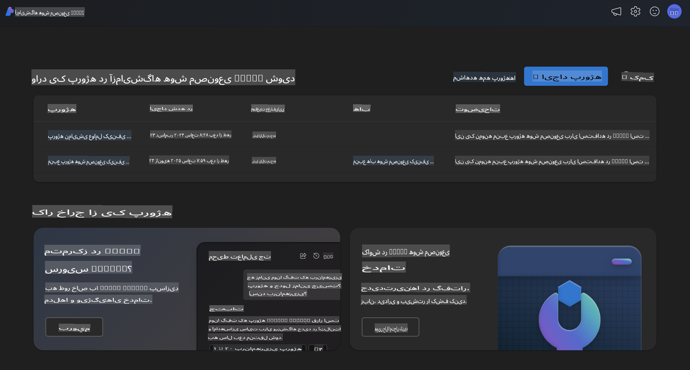
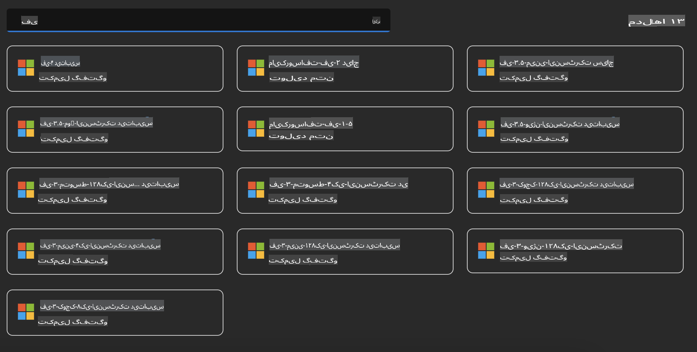
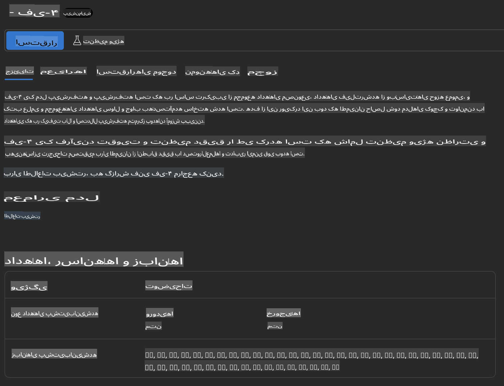
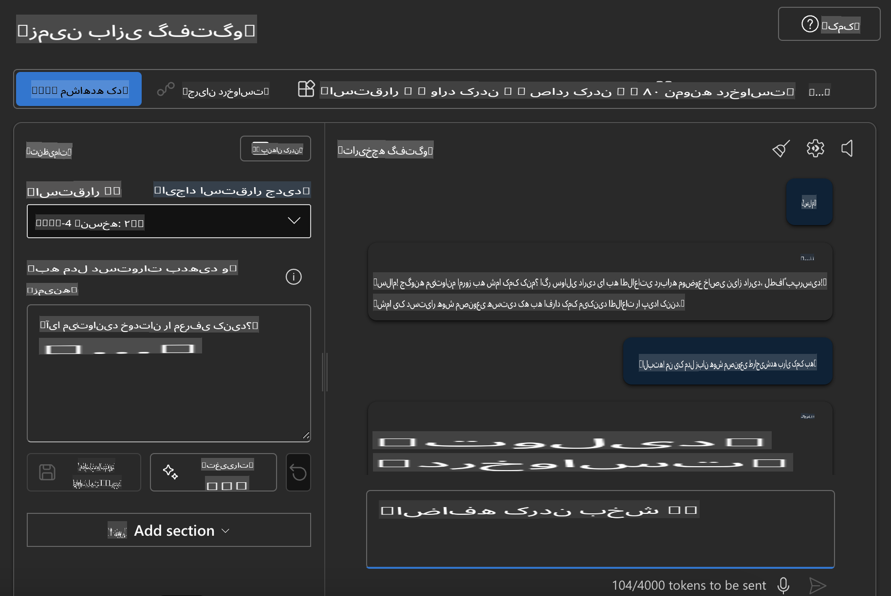

## خانواده فی در Azure AI Foundry

[Azure AI Foundry](https://ai.azure.com) یک پلتفرم قابل اعتماد است که به توسعه‌دهندگان این امکان را می‌دهد تا به شکلی امن، مطمئن و مسئولانه نوآوری کنند و آینده را با هوش مصنوعی شکل دهند.

[Azure AI Foundry](https://ai.azure.com) برای توسعه‌دهندگان طراحی شده است تا:

- برنامه‌های هوش مصنوعی مولد را بر روی یک پلتفرم در سطح سازمانی بسازند.
- با استفاده از ابزارهای پیشرفته هوش مصنوعی و مدل‌های یادگیری ماشین، برنامه‌ها را کاوش، توسعه، آزمایش و پیاده‌سازی کنند، با تأکید بر اصول هوش مصنوعی مسئولانه.
- با یک تیم برای کل چرخه عمر توسعه برنامه همکاری کنند.

با Azure AI Foundry، می‌توانید طیف گسترده‌ای از مدل‌ها، خدمات و قابلیت‌ها را بررسی کنید و برنامه‌های هوش مصنوعی‌ای بسازید که بهترین خدمت را به اهداف شما ارائه می‌دهند. پلتفرم Azure AI Foundry امکان مقیاس‌پذیری را فراهم می‌کند تا نمونه‌های اولیه را به‌راحتی به برنامه‌های تولیدی کامل تبدیل کنید. نظارت و بهبود مداوم نیز از موفقیت بلندمدت پشتیبانی می‌کند.



علاوه بر استفاده از سرویس Azure AOAI در Azure AI Foundry، می‌توانید از مدل‌های شخص ثالث نیز در کاتالوگ مدل Azure AI Foundry استفاده کنید. این گزینه‌ای مناسب است اگر بخواهید از Azure AI Foundry به‌عنوان پلتفرم راه‌حل هوش مصنوعی خود استفاده کنید.

ما می‌توانیم مدل‌های خانواده فی را به‌سرعت از طریق کاتالوگ مدل در Azure AI Foundry پیاده‌سازی کنیم.



### **پیاده‌سازی Phi-4 در Azure AI Foundry**



### **آزمایش Phi-4 در Azure AI Foundry Playground**



### **اجرای کد پایتون برای فراخوانی Phi-4 در Azure AI Foundry**

```python

import os  
import base64
from openai import AzureOpenAI  
from azure.identity import DefaultAzureCredential, get_bearer_token_provider  
        
endpoint = os.getenv("ENDPOINT_URL", "Your Azure AOAI Service Endpoint")  
deployment = os.getenv("DEPLOYMENT_NAME", "Phi-4")  
      
token_provider = get_bearer_token_provider(  
    DefaultAzureCredential(),  
    "https://cognitiveservices.azure.com/.default"  
)  
  
client = AzureOpenAI(  
    azure_endpoint=endpoint,  
    azure_ad_token_provider=token_provider,  
    api_version="2024-05-01-preview",  
)  
  

chat_prompt = [
    {
        "role": "system",
        "content": "You are an AI assistant that helps people find information."
    },
    {
        "role": "user",
        "content": "can you introduce yourself"
    }
] 
    
# Include speech result if speech is enabled  
messages = chat_prompt 

completion = client.chat.completions.create(  
    model=deployment,  
    messages=messages,
    max_tokens=800,  
    temperature=0.7,  
    top_p=0.95,  
    frequency_penalty=0,  
    presence_penalty=0,
    stop=None,  
    stream=False  
)  
  
print(completion.to_json())  

```

**سلب مسئولیت**:  
این سند با استفاده از خدمات ترجمه ماشینی مبتنی بر هوش مصنوعی ترجمه شده است. در حالی که ما برای دقت تلاش می‌کنیم، لطفاً توجه داشته باشید که ترجمه‌های خودکار ممکن است حاوی خطاها یا نواقصی باشند. سند اصلی به زبان اصلی آن باید به عنوان منبع معتبر در نظر گرفته شود. برای اطلاعات حیاتی، ترجمه حرفه‌ای انسانی توصیه می‌شود. ما هیچ مسئولیتی در قبال سوءتفاهم‌ها یا برداشت‌های نادرست ناشی از استفاده از این ترجمه نداریم.