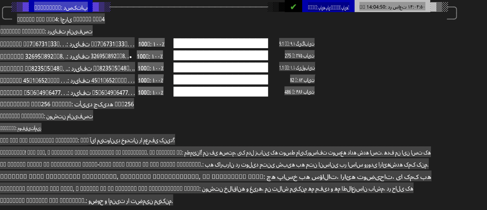

## خانواده فی در Ollama

[Ollama](https://ollama.com) به افراد بیشتری این امکان را می‌دهد که مدل‌های متن باز LLM یا SLM را به‌راحتی از طریق اسکریپت‌های ساده اجرا کنند و همچنین می‌توانند APIهایی بسازند تا سناریوهای کاربردی Copilot محلی را پشتیبانی کنند.

## **1. نصب**

Ollama قابلیت اجرا روی Windows، macOS و Linux را دارد. می‌توانید Ollama را از طریق این لینک نصب کنید ([https://ollama.com/download](https://ollama.com/download)). پس از نصب موفقیت‌آمیز، می‌توانید با استفاده از اسکریپت Ollama از طریق یک پنجره ترمینال، Phi-3 را فراخوانی کنید. تمامی [کتابخانه‌های موجود در Ollama](https://ollama.com/library) را می‌توانید مشاهده کنید. اگر این مخزن را در یک Codespace باز کنید، Ollama از پیش نصب شده خواهد بود.

```bash

ollama run phi4

```

> [!NOTE]
> هنگامی که برای اولین بار اجرا می‌کنید، مدل ابتدا دانلود می‌شود. البته، می‌توانید مستقیماً مدل دانلودشده Phi-4 را نیز مشخص کنید. ما از WSL به عنوان مثال برای اجرای فرمان استفاده می‌کنیم. پس از دانلود موفقیت‌آمیز مدل، می‌توانید مستقیماً در ترمینال تعامل داشته باشید.



## **2. فراخوانی API فی-4 از Ollama**

اگر می‌خواهید API فی-4 تولید شده توسط Ollama را فراخوانی کنید، می‌توانید این فرمان را در ترمینال برای راه‌اندازی سرور Ollama اجرا کنید.

```bash

ollama serve

```

> [!NOTE]
> اگر از macOS یا Linux استفاده می‌کنید، توجه داشته باشید که ممکن است با خطای زیر مواجه شوید:  
> **"Error: listen tcp 127.0.0.1:11434: bind: address already in use"**  
> ممکن است هنگام اجرای فرمان با این خطا روبرو شوید. می‌توانید این خطا را نادیده بگیرید، زیرا معمولاً نشان‌دهنده این است که سرور قبلاً در حال اجرا است، یا می‌توانید Ollama را متوقف کرده و مجدداً راه‌اندازی کنید:

**macOS**

```bash

brew services restart ollama

```

**Linux**

```bash

sudo systemctl stop ollama

```

Ollama از دو API پشتیبانی می‌کند: generate و chat. شما می‌توانید بسته به نیاز خود، API مدل ارائه‌شده توسط Ollama را با ارسال درخواست به سرویس محلی که روی پورت 11434 اجرا می‌شود، فراخوانی کنید.

**چت**

```bash

curl http://127.0.0.1:11434/api/chat -d '{
  "model": "phi3",
  "messages": [
    {
      "role": "system",
      "content": "Your are a python developer."
    },
    {
      "role": "user",
      "content": "Help me generate a bubble algorithm"
    }
  ],
  "stream": false
  
}'

This is the result in Postman


## Additional Resources

Check the list of available models in Ollama in [their library](https://ollama.com/library).

Pull your model from the Ollama server using this command

```bash
ollama pull phi4
```

Run the model using this command

```bash
ollama run phi4
```

***Note:*** Visit this link [https://github.com/ollama/ollama/blob/main/docs/api.md](https://github.com/ollama/ollama/blob/main/docs/api.md) to learn more

## Calling Ollama from Python

You can use `requests` or `urllib3` to make requests to the local server endpoints used above. However, a popular way to use Ollama in Python is via the [openai](https://pypi.org/project/openai/) SDK, since Ollama provides OpenAI-compatible server endpoints as well.

Here is an example for phi3-mini:

```python
import openai

client = openai.OpenAI(
    base_url="http://localhost:11434/v1",
    api_key="nokeyneeded",
)

response = client.chat.completions.create(
    model="phi4",
    temperature=0.7,
    n=1,
    messages=[
        {"role": "system", "content": "You are a helpful assistant."},
        {"role": "user", "content": "Write a haiku about a hungry cat"},
    ],
)

print("Response:")
print(response.choices[0].message.content)
```

## Calling Ollama from JavaScript 

```javascript
// نمونه‌ای از خلاصه کردن یک فایل با Phi-4
script({
    model: "ollama:phi4",
    title: "Summarize with Phi-4",
    system: ["system"],
})

// نمونه‌ای از خلاصه کردن
const file = def("FILE", env.files)
$`Summarize ${file} in a single paragraph.`
```

## Calling Ollama from C#

Create a new C# Console application and add the following NuGet package:

```bash
dotnet add package Microsoft.SemanticKernel --version 1.34.0
```

Then replace this code in the `Program.cs` file

```csharp
using Microsoft.SemanticKernel;
using Microsoft.SemanticKernel.ChatCompletion;

// افزودن سرویس تکمیل چت با استفاده از نقطه پایانی سرور محلی Ollama
#pragma warning disable SKEXP0001, SKEXP0003, SKEXP0010, SKEXP0011, SKEXP0050, SKEXP0052
builder.AddOpenAIChatCompletion(
    modelId: "phi4",
    endpoint: new Uri("http://localhost:11434/"),
    apiKey: "non required");

// ارسال یک درخواست ساده به سرویس چت
string prompt = "Write a joke about kittens";
var response = await kernel.InvokePromptAsync(prompt);
Console.WriteLine(response.GetValue<string>());
```

Run the app with the command:

```bash
dotnet run

**سلب مسئولیت**:  
این سند با استفاده از خدمات ترجمه ماشینی مبتنی بر هوش مصنوعی ترجمه شده است. در حالی که ما برای دقت تلاش می‌کنیم، لطفاً توجه داشته باشید که ترجمه‌های خودکار ممکن است شامل خطاها یا نادرستی‌هایی باشند. سند اصلی به زبان اصلی آن باید به‌عنوان منبع معتبر در نظر گرفته شود. برای اطلاعات حیاتی، ترجمه انسانی حرفه‌ای توصیه می‌شود. ما هیچ مسئولیتی در قبال سوءتفاهم‌ها یا تفسیرهای نادرست ناشی از استفاده از این ترجمه نداریم.