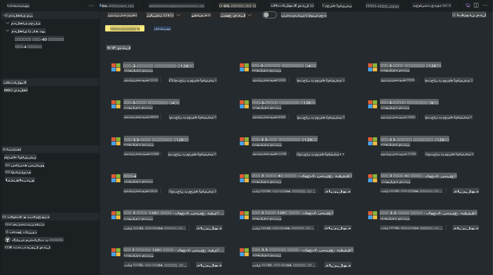
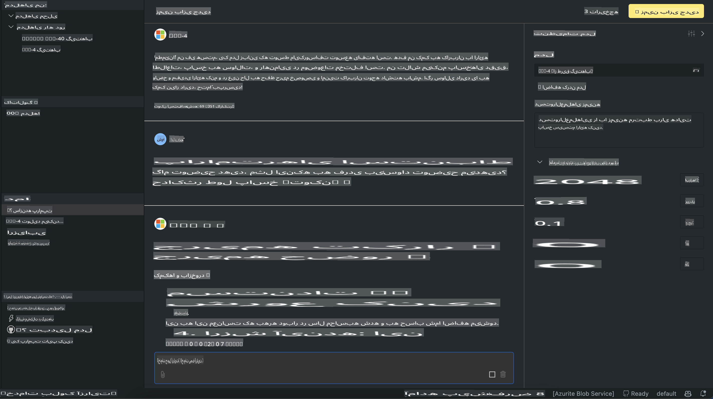

# خانواده Phi در AITK

[AI Toolkit for VS Code](https://marketplace.visualstudio.com/items?itemName=ms-windows-ai-studio.windows-ai-studio) توسعه برنامه‌های هوش مصنوعی مولد را با گردآوری ابزارهای پیشرفته توسعه هوش مصنوعی و مدل‌هایی از کاتالوگ Azure AI Foundry و دیگر کاتالوگ‌ها مانند Hugging Face ساده می‌کند. شما می‌توانید کاتالوگ مدل‌های هوش مصنوعی که توسط GitHub Models و Azure AI Foundry Model Catalogs پشتیبانی می‌شود را مرور کنید، آن‌ها را به صورت محلی یا از راه دور دانلود کنید، تنظیم کنید، آزمایش کنید و در برنامه خود استفاده کنید.

پیش‌نمایش AI Toolkit به صورت محلی اجرا خواهد شد. استفاده از استنتاج محلی یا تنظیم مدل، بسته به مدلی که انتخاب کرده‌اید، ممکن است نیاز به GPU مانند NVIDIA CUDA GPU داشته باشد. شما همچنین می‌توانید مدل‌های GitHub را مستقیماً با AITK اجرا کنید.

## شروع به کار

[اطلاعات بیشتر درباره نصب زیرسیستم ویندوز برای لینوکس](https://learn.microsoft.com/windows/wsl/install?WT.mc_id=aiml-137032-kinfeylo)

و [تغییر توزیع پیش‌فرض](https://learn.microsoft.com/windows/wsl/install#change-the-default-linux-distribution-installed).

[مخزن GitHub AI Toolkit](https://github.com/microsoft/vscode-ai-toolkit/)

- ویندوز، لینوکس، macOS
  
- برای تنظیم مدل در ویندوز و لینوکس، شما به یک Nvidia GPU نیاز دارید. علاوه بر این، **ویندوز** نیاز به زیرسیستم لینوکس با توزیع Ubuntu نسخه 18.4 یا بالاتر دارد. [اطلاعات بیشتر درباره نصب زیرسیستم ویندوز برای لینوکس](https://learn.microsoft.com/windows/wsl/install) و [تغییر توزیع پیش‌فرض](https://learn.microsoft.com/windows/wsl/install#change-the-default-linux-distribution-installed).

### نصب AI Toolkit

AI Toolkit به عنوان یک [افزونه ویژوال استودیو کد](https://code.visualstudio.com/docs/setup/additional-components#_vs-code-extensions) عرضه می‌شود، بنابراین ابتدا باید [VS Code](https://code.visualstudio.com/docs/setup/windows?WT.mc_id=aiml-137032-kinfeylo) را نصب کنید و سپس AI Toolkit را از [VS Marketplace](https://marketplace.visualstudio.com/items?itemName=ms-windows-ai-studio.windows-ai-studio) دانلود کنید.  
[AI Toolkit در بازار افزونه‌های ویژوال استودیو موجود است](https://marketplace.visualstudio.com/items?itemName=ms-windows-ai-studio.windows-ai-studio) و می‌توان آن را مانند هر افزونه دیگری نصب کرد.

اگر با نصب افزونه‌های VS Code آشنا نیستید، مراحل زیر را دنبال کنید:

### ورود به سیستم

1. در نوار فعالیت در VS Code، **Extensions** را انتخاب کنید.  
2. در نوار جستجوی افزونه‌ها، عبارت "AI Toolkit" را تایپ کنید.  
3. "AI Toolkit for Visual Studio code" را انتخاب کنید.  
4. **Install** را انتخاب کنید.

اکنون آماده استفاده از افزونه هستید!

از شما خواسته می‌شود وارد GitHub شوید، بنابراین برای ادامه روی "Allow" کلیک کنید. به صفحه ورود GitHub هدایت خواهید شد.

لطفاً وارد شوید و مراحل را دنبال کنید. پس از تکمیل موفقیت‌آمیز، به VS Code بازگردانده خواهید شد.

پس از نصب افزونه، آیکون AI Toolkit در نوار فعالیت شما ظاهر می‌شود.

بیایید عملکردهای موجود را بررسی کنیم!

### عملکردهای موجود

نوار کناری اصلی AI Toolkit به صورت زیر سازماندهی شده است:

- **مدل‌ها**
- **منابع**
- **Playground**  
- **تنظیم دقیق**
- **ارزیابی**

در بخش منابع در دسترس هستند. برای شروع، **کاتالوگ مدل** را انتخاب کنید.

### دانلود یک مدل از کاتالوگ

با راه‌اندازی AI Toolkit از نوار کناری VS Code، می‌توانید از گزینه‌های زیر انتخاب کنید:



- یافتن مدلی پشتیبانی‌شده از **کاتالوگ مدل** و دانلود آن به صورت محلی  
- آزمایش استنتاج مدل در **Playground مدل**  
- تنظیم مدل به صورت محلی یا از راه دور در **تنظیم دقیق مدل**  
- استقرار مدل‌های تنظیم‌شده در فضای ابری از طریق Command Palette برای AI Toolkit  
- ارزیابی مدل‌ها  

> [!NOTE]
>
> **GPU در مقابل CPU**
>
> متوجه خواهید شد که کارت‌های مدل اندازه مدل، پلتفرم و نوع شتاب‌دهنده (CPU، GPU) را نشان می‌دهند. برای عملکرد بهینه در **دستگاه‌های ویندوزی که حداقل یک GPU دارند**، نسخه‌های مدلی را انتخاب کنید که فقط ویندوز را هدف قرار می‌دهند.  
>
> این کار تضمین می‌کند که مدل شما برای شتاب‌دهنده DirectML بهینه شده است.  
>
> نام مدل‌ها به فرمت زیر است:  
>
> - `{model_name}-{accelerator}-{quantization}-{format}`.
>
> برای بررسی اینکه آیا دستگاه ویندوزی شما GPU دارد، **Task Manager** را باز کنید و سپس تب **Performance** را انتخاب کنید. اگر GPU دارید، تحت نام‌هایی مانند "GPU 0" یا "GPU 1" فهرست خواهند شد.

### اجرای مدل در Playground

پس از تنظیم تمام پارامترها، روی **Generate Project** کلیک کنید.

وقتی مدل شما دانلود شد، روی **Load in Playground** در کارت مدل در کاتالوگ کلیک کنید:

- دانلود مدل را آغاز کنید  
- تمام پیش‌نیازها و وابستگی‌ها را نصب کنید  
- فضای کاری VS Code ایجاد کنید  



### استفاده از REST API در برنامه شما

AI Toolkit با یک سرور REST API محلی **روی پورت 5272** عرضه می‌شود که از [فرمت OpenAI chat completions](https://platform.openai.com/docs/api-reference/chat/create) استفاده می‌کند.

این امکان را به شما می‌دهد که برنامه خود را به صورت محلی آزمایش کنید، بدون نیاز به سرویس مدل هوش مصنوعی ابری. برای مثال، فایل JSON زیر نشان می‌دهد که چگونه می‌توانید بدنه درخواست را پیکربندی کنید:

```json
{
    "model": "Phi-4",
    "messages": [
        {
            "role": "user",
            "content": "what is the golden ratio?"
        }
    ],
    "temperature": 0.7,
    "top_p": 1,
    "top_k": 10,
    "max_tokens": 100,
    "stream": true
}
```

شما می‌توانید REST API را با استفاده از ابزارهایی مانند [Postman](https://www.postman.com/) یا ابزار CURL (Client URL) آزمایش کنید:

```bash
curl -vX POST http://127.0.0.1:5272/v1/chat/completions -H 'Content-Type: application/json' -d @body.json
```

### استفاده از کتابخانه کلاینت OpenAI برای پایتون

```python
from openai import OpenAI

client = OpenAI(
    base_url="http://127.0.0.1:5272/v1/", 
    api_key="x" # required for the API but not used
)

chat_completion = client.chat.completions.create(
    messages=[
        {
            "role": "user",
            "content": "what is the golden ratio?",
        }
    ],
    model="Phi-4",
)

print(chat_completion.choices[0].message.content)
```

### استفاده از کتابخانه کلاینت Azure OpenAI برای .NET

کتابخانه [Azure OpenAI برای .NET](https://www.nuget.org/packages/Azure.AI.OpenAI/) را با استفاده از NuGet به پروژه خود اضافه کنید:

```bash
dotnet add {project_name} package Azure.AI.OpenAI --version 1.0.0-beta.17
```

یک فایل C# به نام **OverridePolicy.cs** به پروژه خود اضافه کنید و کد زیر را در آن قرار دهید:

```csharp
// OverridePolicy.cs
using Azure.Core.Pipeline;
using Azure.Core;

internal partial class OverrideRequestUriPolicy(Uri overrideUri)
    : HttpPipelineSynchronousPolicy
{
    private readonly Uri _overrideUri = overrideUri;

    public override void OnSendingRequest(HttpMessage message)
    {
        message.Request.Uri.Reset(_overrideUri);
    }
}
```

سپس کد زیر را در فایل **Program.cs** خود قرار دهید:

```csharp
// Program.cs
using Azure.AI.OpenAI;

Uri localhostUri = new("http://localhost:5272/v1/chat/completions");

OpenAIClientOptions clientOptions = new();
clientOptions.AddPolicy(
    new OverrideRequestUriPolicy(localhostUri),
    Azure.Core.HttpPipelinePosition.BeforeTransport);
OpenAIClient client = new(openAIApiKey: "unused", clientOptions);

ChatCompletionsOptions options = new()
{
    DeploymentName = "Phi-4",
    Messages =
    {
        new ChatRequestSystemMessage("You are a helpful assistant. Be brief and succinct."),
        new ChatRequestUserMessage("What is the golden ratio?"),
    }
};

StreamingResponse<StreamingChatCompletionsUpdate> streamingChatResponse
    = await client.GetChatCompletionsStreamingAsync(options);

await foreach (StreamingChatCompletionsUpdate chatChunk in streamingChatResponse)
{
    Console.Write(chatChunk.ContentUpdate);
}
```

## تنظیم دقیق با AI Toolkit

- با کشف مدل و Playground شروع کنید.  
- تنظیم دقیق مدل و استنتاج با استفاده از منابع محاسباتی محلی.  
- تنظیم دقیق و استنتاج از راه دور با استفاده از منابع Azure.  

[تنظیم دقیق با AI Toolkit](../../03.FineTuning/Finetuning_VSCodeaitoolkit.md)

## منابع پرسش و پاسخ AI Toolkit

لطفاً به [صفحه پرسش و پاسخ ما](https://github.com/microsoft/vscode-ai-toolkit/blob/main/archive/QA.md) برای رایج‌ترین مشکلات و راه‌حل‌ها مراجعه کنید.

**سلب مسئولیت**:  
این سند با استفاده از خدمات ترجمه ماشینی مبتنی بر هوش مصنوعی ترجمه شده است. در حالی که ما برای دقت تلاش می‌کنیم، لطفاً توجه داشته باشید که ترجمه‌های خودکار ممکن است حاوی خطاها یا نادرستی‌هایی باشند. سند اصلی به زبان اصلی آن باید به عنوان منبع معتبر در نظر گرفته شود. برای اطلاعات حساس یا حیاتی، ترجمه حرفه‌ای انسانی توصیه می‌شود. ما هیچ مسئولیتی در قبال سوءتفاهم‌ها یا تفسیرهای نادرست ناشی از استفاده از این ترجمه نداریم.