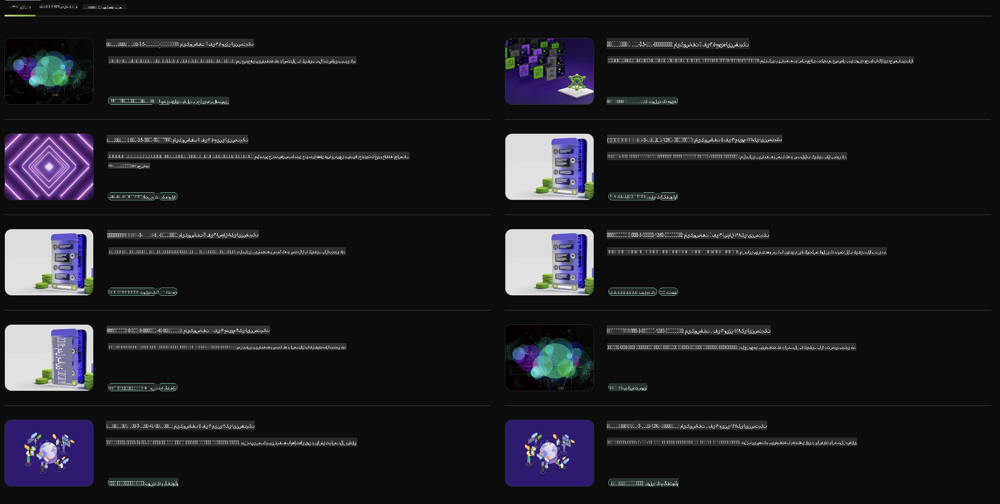

## خانواده فی در NVIDIA NIM

NVIDIA NIM مجموعه‌ای از میکروسرویس‌های آسان برای استفاده است که برای تسریع استقرار مدل‌های هوش مصنوعی تولیدی در فضای ابری، مراکز داده و ورک‌استیشن‌ها طراحی شده است. NIM‌ها بر اساس خانواده مدل و همچنین هر مدل به صورت جداگانه دسته‌بندی می‌شوند. به عنوان مثال، NVIDIA NIM برای مدل‌های زبانی بزرگ (LLMs) قدرت مدل‌های پیشرفته LLM را به برنامه‌های سازمانی می‌آورد و قابلیت‌های بی‌نظیری در پردازش و درک زبان طبیعی ارائه می‌دهد.

NIM به تیم‌های IT و DevOps این امکان را می‌دهد که مدل‌های زبانی بزرگ (LLMs) را در محیط‌های مدیریت شده خود میزبانی کنند و در عین حال، APIهای استاندارد صنعتی را در اختیار توسعه‌دهندگان قرار می‌دهد تا بتوانند کوپایلوت‌ها، چت‌بات‌ها و دستیارهای هوش مصنوعی قدرتمندی بسازند که می‌توانند کسب‌وکارشان را متحول کنند. با استفاده از شتاب‌دهنده‌های پیشرفته GPU شرکت NVIDIA و قابلیت استقرار مقیاس‌پذیر، NIM سریع‌ترین مسیر برای استنتاج با عملکرد بی‌نظیر را ارائه می‌دهد.

شما می‌توانید از NVIDIA NIM برای استنتاج مدل‌های خانواده فی استفاده کنید.



### **نمونه‌ها - Phi-3-Vision در NVIDIA NIM**

تصور کنید که یک تصویر (`demo.png`) دارید و می‌خواهید کدی در زبان پایتون تولید کنید که این تصویر را پردازش کرده و نسخه جدیدی از آن را ذخیره کند (`phi-3-vision.jpg`).

کد بالا این فرآیند را به صورت خودکار انجام می‌دهد:

1. تنظیم محیط و پیکربندی‌های لازم.
2. ایجاد یک پرامپت که به مدل دستور می‌دهد کد پایتون مورد نیاز را تولید کند.
3. ارسال پرامپت به مدل و جمع‌آوری کد تولید شده.
4. استخراج و اجرای کد تولید شده.
5. نمایش تصاویر اصلی و پردازش شده.

این روش از قدرت هوش مصنوعی برای خودکارسازی وظایف پردازش تصویر استفاده می‌کند و دستیابی به اهداف شما را آسان‌تر و سریع‌تر می‌کند.

[راه‌حل نمونه کد](../../../../../code/06.E2E/E2E_Nvidia_NIM_Phi3_Vision.ipynb)

بیایید مرحله به مرحله بررسی کنیم که کل کد چه کارهایی انجام می‌دهد:

1. **نصب بسته مورد نیاز**:
    ```python
    !pip install langchain_nvidia_ai_endpoints -U
    ```
    این دستور بسته `langchain_nvidia_ai_endpoints` را نصب می‌کند و اطمینان می‌دهد که آخرین نسخه آن است.

2. **وارد کردن ماژول‌های لازم**:
    ```python
    from langchain_nvidia_ai_endpoints import ChatNVIDIA
    import getpass
    import os
    import base64
    ```
    این واردات، ماژول‌های لازم برای تعامل با نقاط پایانی NVIDIA AI، مدیریت ایمن پسوردها، تعامل با سیستم‌عامل و کدگذاری/رمزگشایی داده‌ها به فرمت base64 را فراهم می‌کند.

3. **تنظیم کلید API**:
    ```python
    if not os.getenv("NVIDIA_API_KEY"):
        os.environ["NVIDIA_API_KEY"] = getpass.getpass("Enter your NVIDIA API key: ")
    ```
    این کد بررسی می‌کند که آیا متغیر محیطی `NVIDIA_API_KEY` تنظیم شده است یا خیر. اگر تنظیم نشده باشد، از کاربر می‌خواهد که کلید API خود را به صورت ایمن وارد کند.

4. **تعریف مدل و مسیر تصویر**:
    ```python
    model = 'microsoft/phi-3-vision-128k-instruct'
    chat = ChatNVIDIA(model=model)
    img_path = './imgs/demo.png'
    ```
    این قسمت مدل مورد استفاده را تنظیم می‌کند، یک نمونه از `ChatNVIDIA` با مدل مشخص شده ایجاد می‌کند و مسیر فایل تصویر را تعریف می‌کند.

5. **ایجاد پرامپت متنی**:
    ```python
    text = "Please create Python code for image, and use plt to save the new picture under imgs/ and name it phi-3-vision.jpg."
    ```
    این قسمت یک پرامپت متنی تعریف می‌کند که به مدل دستور می‌دهد کد پایتون برای پردازش تصویر تولید کند.

6. **کدگذاری تصویر به فرمت Base64**:
    ```python
    with open(img_path, "rb") as f:
        image_b64 = base64.b64encode(f.read()).decode()
    image = f''
    ```
    این کد فایل تصویر را می‌خواند، آن را به فرمت base64 کدگذاری می‌کند و یک تگ HTML تصویر با داده‌های کدگذاری شده ایجاد می‌کند.

7. **ترکیب متن و تصویر در پرامپت**:
    ```python
    prompt = f"{text} {image}"
    ```
    این قسمت متن پرامپت و تگ HTML تصویر را در یک رشته ترکیب می‌کند.

8. **تولید کد با استفاده از ChatNVIDIA**:
    ```python
    code = ""
    for chunk in chat.stream(prompt):
        print(chunk.content, end="")
        code += chunk.content
    ```
    این کد پرامپت را به `ChatNVIDIA` ارسال کرده و کد تولید شده را در رشته `code` model and collects the generated code in chunks, printing and appending each chunk to the `` ذخیره می‌کند.

9. **استخراج کد پایتون از محتوای تولید شده**:
    ```python
    begin = code.index('```python') + 9
    code = code[begin:]
    end = code.index('```')
    code = code[:end]
    ```
    این قسمت کد واقعی پایتون را از محتوای تولید شده استخراج می‌کند و قالب‌بندی markdown را حذف می‌کند.

10. **اجرای کد تولید شده**:
    ```python
    import subprocess
    result = subprocess.run(["python", "-c", code], capture_output=True)
    ```
    این قسمت کد پایتون استخراج شده را به عنوان یک فرآیند فرعی اجرا کرده و خروجی آن را ثبت می‌کند.

11. **نمایش تصاویر**:
    ```python
    from IPython.display import Image, display
    display(Image(filename='./imgs/phi-3-vision.jpg'))
    display(Image(filename='./imgs/demo.png'))
    ```
    این خطوط تصاویر را با استفاده از ماژول `IPython.display` نمایش می‌دهند.

**سلب مسئولیت**:  
این سند با استفاده از خدمات ترجمه ماشینی مبتنی بر هوش مصنوعی ترجمه شده است. در حالی که ما تلاش می‌کنیم دقت را رعایت کنیم، لطفاً توجه داشته باشید که ترجمه‌های خودکار ممکن است حاوی اشتباهات یا نواقصی باشند. سند اصلی به زبان اصلی آن باید به عنوان منبع معتبر در نظر گرفته شود. برای اطلاعات حیاتی، ترجمه حرفه‌ای انسانی توصیه می‌شود. ما هیچ مسئولیتی در قبال سوءتفاهم‌ها یا تفسیرهای نادرست ناشی از استفاده از این ترجمه نداریم.