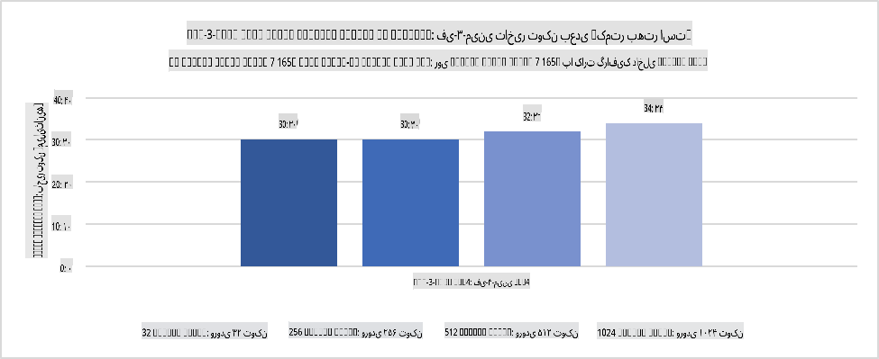
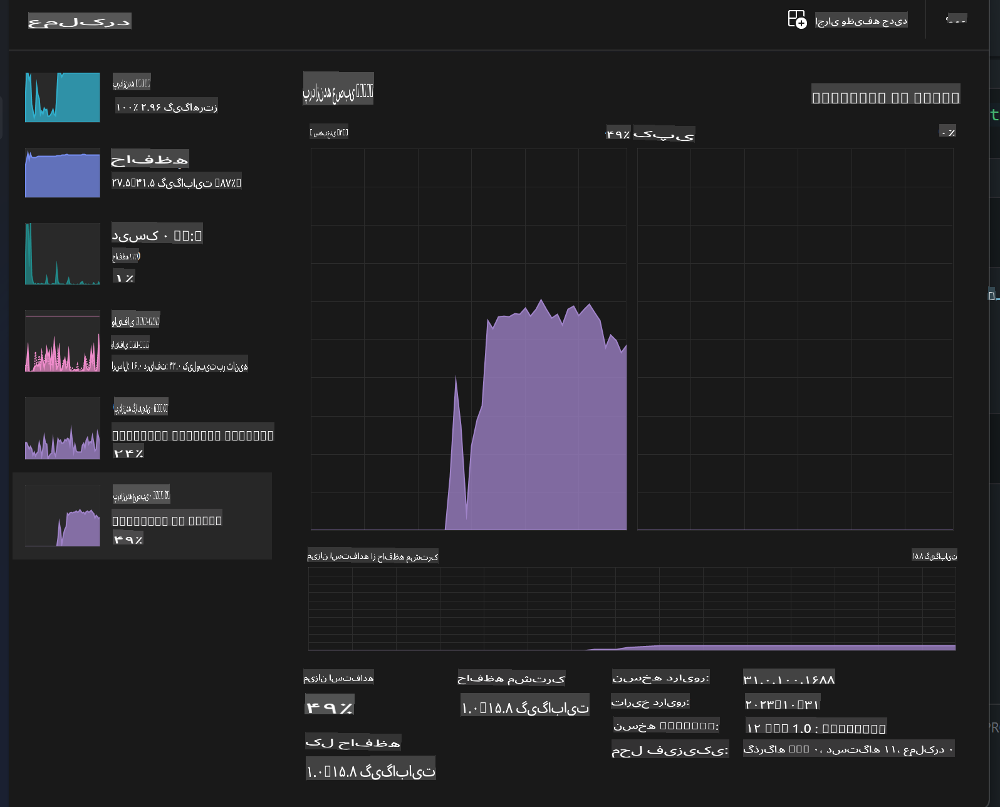
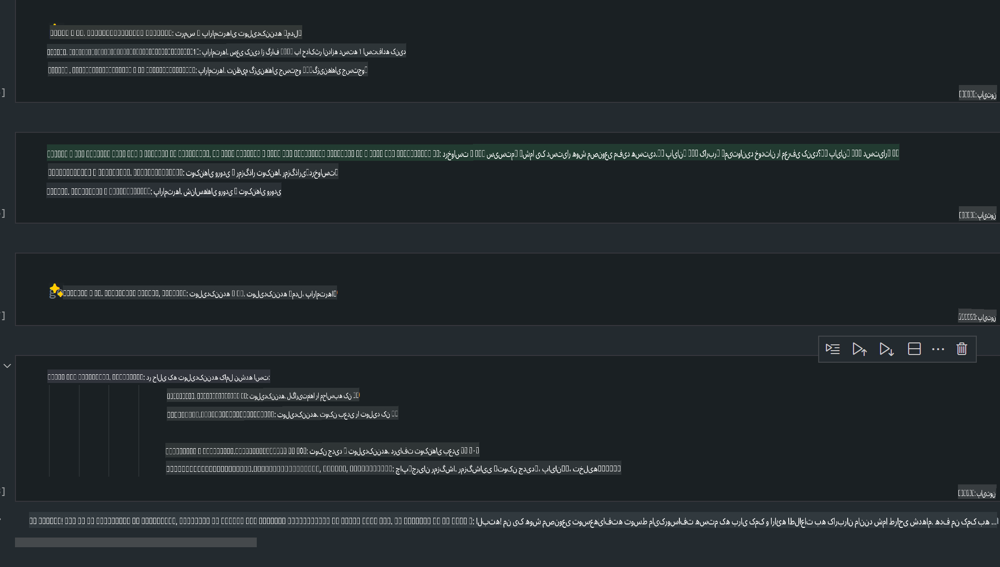
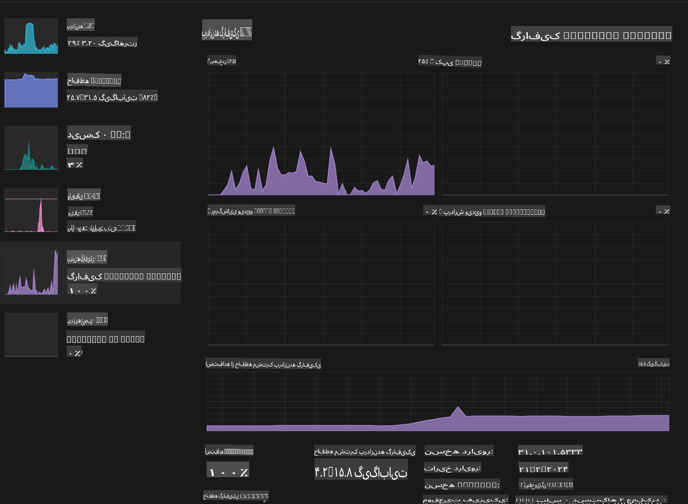

# **استنتاج Phi-3 در AI PC**

با پیشرفت هوش مصنوعی تولیدی و بهبود قابلیت‌های سخت‌افزاری دستگاه‌های لبه، تعداد بیشتری از مدل‌های هوش مصنوعی تولیدی اکنون می‌توانند در دستگاه‌های "دستگاه خودتان را بیاورید" (BYOD) کاربران ادغام شوند. AI PCها یکی از این مدل‌ها هستند. از سال 2024، اینتل، AMD و Qualcomm با تولیدکنندگان PC همکاری کرده‌اند تا AI PCهایی معرفی کنند که استقرار مدل‌های هوش مصنوعی تولیدی محلی را از طریق اصلاحات سخت‌افزاری تسهیل می‌کنند. در این بحث، ما بر روی AI PCهای اینتل تمرکز خواهیم کرد و بررسی خواهیم کرد که چگونه می‌توان Phi-3 را روی یک AI PC اینتل مستقر کرد.

### NPU چیست؟

NPU (واحد پردازش عصبی) یک پردازنده یا واحد پردازش اختصاصی در یک SoC بزرگ‌تر است که به طور خاص برای تسریع عملیات شبکه‌های عصبی و وظایف هوش مصنوعی طراحی شده است. برخلاف CPUها و GPUهای عمومی، NPUها برای محاسبات موازی داده‌محور بهینه‌سازی شده‌اند و آنها را برای پردازش داده‌های چندرسانه‌ای حجیم مانند ویدیوها و تصاویر و همچنین پردازش داده‌ها برای شبکه‌های عصبی بسیار کارآمد می‌کند. آنها به ویژه در انجام وظایف مرتبط با هوش مصنوعی، مانند تشخیص گفتار، محو کردن پس‌زمینه در تماس‌های ویدیویی و فرآیندهای ویرایش عکس یا ویدیو مانند تشخیص اشیا، مهارت دارند.

## تفاوت NPU و GPU

در حالی که بسیاری از بارهای کاری هوش مصنوعی و یادگیری ماشین روی GPUها اجرا می‌شوند، یک تفاوت اساسی بین GPUها و NPUها وجود دارد.  
GPUها به دلیل قابلیت‌های محاسبات موازی خود شناخته می‌شوند، اما همه GPUها در پردازش فراتر از گرافیک به یک اندازه کارآمد نیستند. از سوی دیگر، NPUها به طور خاص برای محاسبات پیچیده مربوط به عملیات شبکه‌های عصبی طراحی شده‌اند و آنها را برای وظایف هوش مصنوعی بسیار مؤثر می‌کند.

به طور خلاصه، NPUها ریاضی‌دان‌های سریع و ماهری هستند که محاسبات هوش مصنوعی را تقویت می‌کنند و در عصر نوظهور AI PCها نقش کلیدی ایفا می‌کنند!

***این مثال بر اساس جدیدترین پردازنده Intel Core Ultra است.***

## **1. استفاده از NPU برای اجرای مدل Phi-3**

دستگاه Intel® NPU یک شتاب‌دهنده استنتاج هوش مصنوعی است که با CPUهای مشتری اینتل، از نسل پردازنده‌های Intel® Core™ Ultra (که قبلاً با نام Meteor Lake شناخته می‌شدند) ادغام شده است. این دستگاه امکان اجرای کارآمد انرژی وظایف شبکه‌های عصبی مصنوعی را فراهم می‌کند.




**کتابخانه شتاب‌دهنده NPU اینتل**

کتابخانه شتاب‌دهنده NPU اینتل [https://github.com/intel/intel-npu-acceleration-library](https://github.com/intel/intel-npu-acceleration-library) یک کتابخانه پایتون است که برای افزایش کارایی برنامه‌های شما با استفاده از قدرت NPU اینتل برای انجام محاسبات پرسرعت روی سخت‌افزارهای سازگار طراحی شده است.

مثال Phi-3-mini در AI PC که با پردازنده‌های Intel® Core™ Ultra پشتیبانی می‌شود.


نصب کتابخانه پایتون با pip

```bash

   pip install intel-npu-acceleration-library

```

***توجه*** این پروژه هنوز در حال توسعه است، اما مدل مرجع بسیار کامل است.

### **اجرای Phi-3 با کتابخانه شتاب‌دهنده NPU اینتل**

با استفاده از شتاب‌دهنده NPU اینتل، این کتابخانه بر فرآیند رمزگذاری سنتی تأثیری ندارد. شما فقط نیاز دارید از این کتابخانه برای کمّی‌سازی مدل اصلی Phi-3 استفاده کنید، مانند FP16، INT8، INT4، مانند 

```python
from transformers import AutoTokenizer, pipeline,TextStreamer
from intel_npu_acceleration_library import NPUModelForCausalLM, int4
from intel_npu_acceleration_library.compiler import CompilerConfig
import warnings

model_id = "microsoft/Phi-3-mini-4k-instruct"

compiler_conf = CompilerConfig(dtype=int4)
model = NPUModelForCausalLM.from_pretrained(
    model_id, use_cache=True, config=compiler_conf, attn_implementation="sdpa"
).eval()

tokenizer = AutoTokenizer.from_pretrained(model_id)

text_streamer = TextStreamer(tokenizer, skip_prompt=True)
```

پس از موفقیت در کمّی‌سازی، به اجرای کد ادامه دهید تا NPU را برای اجرای مدل Phi-3 فراخوانی کنید.

```python
generation_args = {
   "max_new_tokens": 1024,
   "return_full_text": False,
   "temperature": 0.3,
   "do_sample": False,
   "streamer": text_streamer,
}

pipe = pipeline(
   "text-generation",
   model=model,
   tokenizer=tokenizer,
)

query = "<|system|>You are a helpful AI assistant.<|end|><|user|>Can you introduce yourself?<|end|><|assistant|>"

with warnings.catch_warnings():
    warnings.simplefilter("ignore")
    pipe(query, **generation_args)
```

هنگام اجرای کد، می‌توانیم وضعیت اجرای NPU را از طریق Task Manager مشاهده کنیم.



***نمونه‌ها*** : [AIPC_NPU_DEMO.ipynb](../../../../../code/03.Inference/AIPC/AIPC_NPU_DEMO.ipynb)

## **2. استفاده از DirectML + ONNX Runtime برای اجرای مدل Phi-3**

### **DirectML چیست؟**

[DirectML](https://github.com/microsoft/DirectML) یک کتابخانه DirectX 12 با عملکرد بالا و شتاب سخت‌افزاری برای یادگیری ماشین است. DirectML شتاب GPU را برای وظایف رایج یادگیری ماشین در طیف گسترده‌ای از سخت‌افزارها و درایورهای پشتیبانی شده، از جمله همه GPUهای سازگار با DirectX 12 از فروشندگانی مانند AMD، Intel، NVIDIA و Qualcomm فراهم می‌کند.

هنگامی که به صورت مستقل استفاده می‌شود، API DirectML یک کتابخانه سطح پایین DirectX 12 است و برای برنامه‌های با عملکرد بالا و تأخیر کم مانند چارچوب‌ها، بازی‌ها و سایر برنامه‌های بلادرنگ مناسب است. قابلیت همکاری یکپارچه DirectML با Direct3D 12، همراه با سربار کم و تطابق آن در سخت‌افزارهای مختلف، DirectML را برای شتاب یادگیری ماشین در شرایطی که هم عملکرد بالا و هم قابلیت اطمینان و پیش‌بینی نتایج در سخت‌افزارهای مختلف مورد نیاز است، ایده‌آل می‌کند.

***توجه*** : جدیدترین نسخه DirectML اکنون از NPU نیز پشتیبانی می‌کند (https://devblogs.microsoft.com/directx/introducing-neural-processor-unit-npu-support-in-directml-developer-preview/)

### DirectML و CUDA از نظر قابلیت‌ها و عملکرد:

**DirectML** یک کتابخانه یادگیری ماشین است که توسط مایکروسافت توسعه داده شده است. این کتابخانه برای شتاب‌دهی به بارهای کاری یادگیری ماشین روی دستگاه‌های ویندوزی، از جمله دسکتاپ‌ها، لپ‌تاپ‌ها و دستگاه‌های لبه طراحی شده است.
- مبتنی بر DX12: DirectML بر روی DirectX 12 ساخته شده است، که پشتیبانی سخت‌افزاری گسترده‌ای را در GPUها، از جمله NVIDIA و AMD، ارائه می‌دهد.
- پشتیبانی گسترده‌تر: از آنجا که از DX12 استفاده می‌کند، DirectML می‌تواند با هر GPU که از DX12 پشتیبانی می‌کند، حتی GPUهای یکپارچه، کار کند.
- پردازش تصویر: DirectML تصاویر و داده‌های دیگر را با استفاده از شبکه‌های عصبی پردازش می‌کند و آن را برای وظایفی مانند تشخیص تصویر، شناسایی اشیاء و موارد دیگر مناسب می‌کند.
- سهولت در راه‌اندازی: راه‌اندازی DirectML ساده است و به SDKها یا کتابخانه‌های خاصی از تولیدکنندگان GPU نیاز ندارد.
- عملکرد: در برخی موارد، DirectML عملکرد خوبی دارد و می‌تواند از CUDA سریع‌تر باشد، به ویژه برای برخی بارهای کاری خاص.
- محدودیت‌ها: با این حال، در مواردی ممکن است DirectML کندتر باشد، به خصوص برای اندازه‌های بزرگ دسته‌ای float16.

**CUDA** پلتفرم محاسبات موازی و مدل برنامه‌نویسی NVIDIA است. این پلتفرم به توسعه‌دهندگان امکان می‌دهد از قدرت GPUهای NVIDIA برای محاسبات عمومی، از جمله یادگیری ماشین و شبیه‌سازی‌های علمی، بهره ببرند.
- مخصوص NVIDIA: CUDA به طور خاص برای GPUهای NVIDIA طراحی شده است.
- بسیار بهینه‌سازی شده: عملکرد عالی برای وظایف شتاب‌دهی شده توسط GPU، به ویژه هنگام استفاده از GPUهای NVIDIA، ارائه می‌دهد.
- استفاده گسترده: بسیاری از چارچوب‌ها و کتابخانه‌های یادگیری ماشین (مانند TensorFlow و PyTorch) از CUDA پشتیبانی می‌کنند.
- سفارشی‌سازی: توسعه‌دهندگان می‌توانند تنظیمات CUDA را برای وظایف خاص تنظیم کنند، که می‌تواند منجر به عملکرد بهینه شود.
- محدودیت‌ها: با این حال، وابستگی CUDA به سخت‌افزار NVIDIA می‌تواند محدودکننده باشد اگر به سازگاری گسترده‌تری در میان GPUهای مختلف نیاز داشته باشید.

### انتخاب بین DirectML و CUDA

انتخاب بین DirectML و CUDA به مورد استفاده خاص شما، در دسترس بودن سخت‌افزار و ترجیحات شما بستگی دارد.  
اگر به دنبال سازگاری گسترده‌تر و سهولت در راه‌اندازی هستید، DirectML ممکن است گزینه خوبی باشد. با این حال، اگر GPUهای NVIDIA دارید و به عملکرد بسیار بهینه نیاز دارید، CUDA همچنان یک گزینه قوی است. به طور خلاصه، هر دو DirectML و CUDA نقاط قوت و ضعف خود را دارند، بنابراین هنگام تصمیم‌گیری نیازها و سخت‌افزار موجود خود را در نظر بگیرید.

### **هوش مصنوعی تولیدی با ONNX Runtime**

در عصر هوش مصنوعی، قابلیت حمل مدل‌های هوش مصنوعی بسیار مهم است. ONNX Runtime می‌تواند مدل‌های آموزش‌دیده را به راحتی در دستگاه‌های مختلف مستقر کند. توسعه‌دهندگان نیازی به توجه به چارچوب استنتاج ندارند و می‌توانند با استفاده از یک API واحد استنتاج مدل را تکمیل کنند. در عصر هوش مصنوعی تولیدی، ONNX Runtime نیز بهینه‌سازی کد انجام داده است (https://onnxruntime.ai/docs/genai/). از طریق ONNX Runtime بهینه‌شده، مدل هوش مصنوعی تولیدی کمّی‌شده می‌تواند روی ترمینال‌های مختلف استنتاج شود. در هوش مصنوعی تولیدی با ONNX Runtime، می‌توانید از طریق Python، C#، C / C++ API مدل هوش مصنوعی را استنتاج کنید. البته، استقرار روی آیفون می‌تواند از API هوش مصنوعی تولیدی ONNX Runtime در C++ استفاده کند.

[کد نمونه](https://github.com/Azure-Samples/Phi-3MiniSamples/tree/main/onnx)

***کامپایل کتابخانه هوش مصنوعی تولیدی با ONNX Runtime***

```bash

winget install --id=Kitware.CMake  -e

git clone https://github.com/microsoft/onnxruntime.git

cd .\onnxruntime\

./build.bat --build_shared_lib --skip_tests --parallel --use_dml --config Release

cd ../

git clone https://github.com/microsoft/onnxruntime-genai.git

cd .\onnxruntime-genai\

mkdir ort

cd ort

mkdir include

mkdir lib

copy ..\onnxruntime\include\onnxruntime\core\providers\dml\dml_provider_factory.h ort\include

copy ..\onnxruntime\include\onnxruntime\core\session\onnxruntime_c_api.h ort\include

copy ..\onnxruntime\build\Windows\Release\Release\*.dll ort\lib

copy ..\onnxruntime\build\Windows\Release\Release\onnxruntime.lib ort\lib

python build.py --use_dml


```

**نصب کتابخانه**

```bash

pip install .\onnxruntime_genai_directml-0.3.0.dev0-cp310-cp310-win_amd64.whl

```

این نتیجه اجرا است:



***نمونه‌ها*** : [AIPC_DirectML_DEMO.ipynb](../../../../../code/03.Inference/AIPC/AIPC_DirectML_DEMO.ipynb)

## **3. استفاده از Intel OpenVino برای اجرای مدل Phi-3**

### **OpenVINO چیست؟**

[OpenVINO](https://github.com/openvinotoolkit/openvino) یک ابزارک متن‌باز برای بهینه‌سازی و استقرار مدل‌های یادگیری عمیق است. این ابزارک عملکرد یادگیری عمیق را برای مدل‌های بینایی، صوتی و زبانی از چارچوب‌های محبوبی مانند TensorFlow، PyTorch و غیره تقویت می‌کند. با OpenVINO شروع کنید. OpenVINO همچنین می‌تواند در ترکیب با CPU و GPU برای اجرای مدل Phi-3 استفاده شود.

***توجه***: در حال حاضر، OpenVINO از NPU پشتیبانی نمی‌کند.

### **نصب کتابخانه OpenVINO**

```bash

 pip install git+https://github.com/huggingface/optimum-intel.git

 pip install git+https://github.com/openvinotoolkit/nncf.git

 pip install openvino-nightly

```

### **اجرای Phi-3 با OpenVINO**

مانند NPU، OpenVINO نیز فراخوانی مدل‌های هوش مصنوعی تولیدی را با اجرای مدل‌های کمّی‌شده تکمیل می‌کند. ابتدا باید مدل Phi-3 را کمّی‌سازی کنیم و کمّی‌سازی مدل را از طریق خط فرمان با استفاده از optimum-cli تکمیل کنیم.

**INT4**

```bash

optimum-cli export openvino --model "microsoft/Phi-3-mini-4k-instruct" --task text-generation-with-past --weight-format int4 --group-size 128 --ratio 0.6  --sym  --trust-remote-code ./openvinomodel/phi3/int4

```

**FP16**

```bash

optimum-cli export openvino --model "microsoft/Phi-3-mini-4k-instruct" --task text-generation-with-past --weight-format fp16 --trust-remote-code ./openvinomodel/phi3/fp16

```

فرمت تبدیل‌شده، به این شکل است:


مسیرهای مدل (model_dir)، تنظیمات مرتبط (ov_config = {"PERFORMANCE_HINT": "LATENCY", "NUM_STREAMS": "1", "CACHE_DIR": ""}) و دستگاه‌های شتاب‌دهی سخت‌افزاری (GPU.0) را از طریق OVModelForCausalLM بارگذاری کنید.

```python

ov_model = OVModelForCausalLM.from_pretrained(
     model_dir,
     device='GPU.0',
     ov_config=ov_config,
     config=AutoConfig.from_pretrained(model_dir, trust_remote_code=True),
     trust_remote_code=True,
)

```

هنگام اجرای کد، می‌توانیم وضعیت اجرای GPU را از طریق Task Manager مشاهده کنیم.



***نمونه‌ها*** : [AIPC_OpenVino_Demo.ipynb](../../../../../code/03.Inference/AIPC/AIPC_OpenVino_Demo.ipynb)

### ***توجه*** : سه روش فوق هر کدام مزایای خود را دارند، اما توصیه می‌شود از شتاب‌دهنده NPU برای استنتاج AI PC استفاده کنید.

**سلب مسئولیت**:  
این سند با استفاده از خدمات ترجمه ماشینی مبتنی بر هوش مصنوعی ترجمه شده است. در حالی که ما برای دقت تلاش می‌کنیم، لطفاً توجه داشته باشید که ترجمه‌های خودکار ممکن است شامل خطاها یا نادقتی‌ها باشند. سند اصلی به زبان اصلی آن باید به عنوان منبع معتبر در نظر گرفته شود. برای اطلاعات حساس، ترجمه حرفه‌ای انسانی توصیه می‌شود. ما مسئولیت هرگونه سوءتفاهم یا تفسیر نادرست ناشی از استفاده از این ترجمه را نمی‌پذیریم.