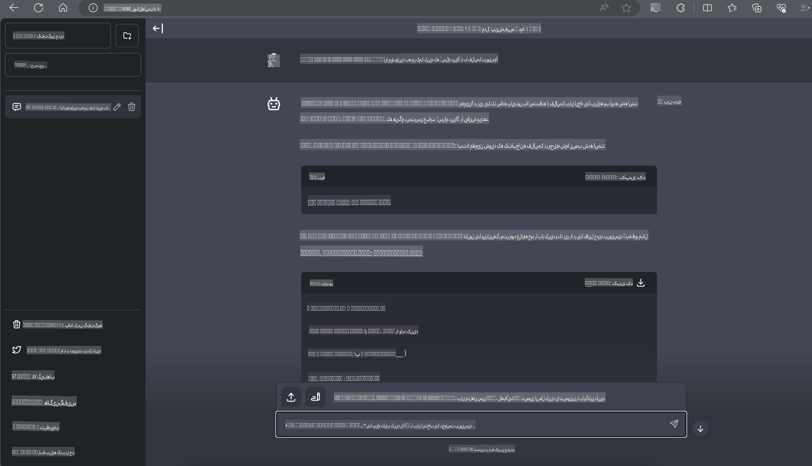

# **استنتاج Phi-3 در Nvidia Jetson**

Nvidia Jetson مجموعه‌ای از بردهای محاسباتی تعبیه‌شده از شرکت Nvidia است. مدل‌های Jetson TK1، TX1 و TX2 همگی دارای پردازنده Tegra (یا SoC) از Nvidia هستند که یک واحد پردازش مرکزی (CPU) با معماری ARM را ادغام می‌کند. Jetson یک سیستم کم‌مصرف است و برای تسریع برنامه‌های یادگیری ماشین طراحی شده است. Nvidia Jetson توسط توسعه‌دهندگان حرفه‌ای برای ایجاد محصولات پیشرفته هوش مصنوعی در تمامی صنایع استفاده می‌شود و همچنین توسط دانشجویان و علاقه‌مندان برای یادگیری عملی هوش مصنوعی و ساخت پروژه‌های شگفت‌انگیز به کار می‌رود. SLM در دستگاه‌های لبه‌ای مانند Jetson مستقر می‌شود که امکان پیاده‌سازی بهتر سناریوهای کاربردی هوش مصنوعی مولد صنعتی را فراهم می‌کند.

## استقرار در NVIDIA Jetson:
توسعه‌دهندگانی که روی رباتیک خودکار و دستگاه‌های تعبیه‌شده کار می‌کنند، می‌توانند از Phi-3 Mini بهره ببرند. اندازه نسبتاً کوچک Phi-3 آن را برای استقرار در لبه ایده‌آل می‌کند. پارامترها در طول آموزش به‌دقت تنظیم شده‌اند تا دقت بالایی در پاسخ‌ها تضمین شود.

### بهینه‌سازی TensorRT-LLM:
کتابخانه [TensorRT-LLM](https://github.com/NVIDIA/TensorRT-LLM?WT.mc_id=aiml-138114-kinfeylo) شرکت NVIDIA استنتاج مدل‌های زبانی بزرگ را بهینه می‌کند. این کتابخانه از پنجره طولانی متن Phi-3 Mini پشتیبانی می‌کند و هم بازدهی و هم تأخیر را بهبود می‌بخشد. بهینه‌سازی‌ها شامل تکنیک‌هایی مانند LongRoPE، FP8 و batching در حال اجرا هستند.

### دسترسی و استقرار:
توسعه‌دهندگان می‌توانند Phi-3 Mini را با پنجره متنی 128K در [هوش مصنوعی NVIDIA](https://www.nvidia.com/en-us/ai-data-science/generative-ai/) بررسی کنند. این مدل به‌عنوان یک NVIDIA NIM ارائه می‌شود، یک میکروسرویس با API استاندارد که می‌تواند در هر مکانی مستقر شود. علاوه بر این، [پیاده‌سازی‌های TensorRT-LLM در GitHub](https://github.com/NVIDIA/TensorRT-LLM) موجود است.

## **1. آماده‌سازی**

a. Jetson Orin NX / Jetson NX

b. JetPack 5.1.2+
   
c. Cuda 11.8
   
d. Python 3.8+

## **2. اجرای Phi-3 در Jetson**

ما می‌توانیم [Ollama](https://ollama.com) یا [LlamaEdge](https://llamaedge.com) را انتخاب کنیم.

اگر می‌خواهید از gguf هم در فضای ابری و هم در دستگاه‌های لبه استفاده کنید، LlamaEdge می‌تواند به‌عنوان WasmEdge درک شود (WasmEdge یک محیط اجرایی WebAssembly سبک، با کارایی بالا و مقیاس‌پذیر است که برای برنامه‌های ابری بومی، لبه‌ای و غیرمتمرکز مناسب است. این محیط از برنامه‌های بدون سرور، توابع تعبیه‌شده، میکروسرویس‌ها، قراردادهای هوشمند و دستگاه‌های اینترنت اشیا پشتیبانی می‌کند. شما می‌توانید مدل کمی‌شده gguf را از طریق LlamaEdge در دستگاه‌های لبه و فضای ابری مستقر کنید).


در اینجا مراحل استفاده آورده شده است:

1. نصب و دانلود کتابخانه‌ها و فایل‌های مرتبط

```bash

curl -sSf https://raw.githubusercontent.com/WasmEdge/WasmEdge/master/utils/install.sh | bash -s -- --plugin wasi_nn-ggml

curl -LO https://github.com/LlamaEdge/LlamaEdge/releases/latest/download/llama-api-server.wasm

curl -LO https://github.com/LlamaEdge/chatbot-ui/releases/latest/download/chatbot-ui.tar.gz

tar xzf chatbot-ui.tar.gz

```

**توجه**: فایل‌های llama-api-server.wasm و chatbot-ui باید در یک پوشه باشند.

2. اجرای اسکریپت‌ها در ترمینال

```bash

wasmedge --dir .:. --nn-preload default:GGML:AUTO:{Your gguf path} llama-api-server.wasm -p phi-3-chat

```

در اینجا نتیجه اجرای برنامه آورده شده است:



***کد نمونه*** [دفترچه نمونه Phi-3 Mini WASM](https://github.com/Azure-Samples/Phi-3MiniSamples/tree/main/wasm)

به‌طور خلاصه، Phi-3 Mini نمایانگر یک پیشرفت بزرگ در مدل‌سازی زبان است که بهره‌وری، آگاهی از متن و توانمندی بهینه‌سازی NVIDIA را ترکیب می‌کند. چه در حال ساخت ربات باشید یا برنامه‌های لبه‌ای، Phi-3 Mini ابزاری قدرتمند است که باید از آن آگاه باشید.

**سلب مسئولیت**:  
این سند با استفاده از خدمات ترجمه ماشینی مبتنی بر هوش مصنوعی ترجمه شده است. در حالی که ما برای دقت تلاش می‌کنیم، لطفاً توجه داشته باشید که ترجمه‌های خودکار ممکن است شامل خطاها یا نادرستی‌هایی باشند. سند اصلی به زبان اصلی آن باید به عنوان منبع معتبر در نظر گرفته شود. برای اطلاعات حیاتی، ترجمه حرفه‌ای انسانی توصیه می‌شود. ما هیچ گونه مسئولیتی در قبال سوءتفاهم‌ها یا تفسیرهای نادرست ناشی از استفاده از این ترجمه نداریم.