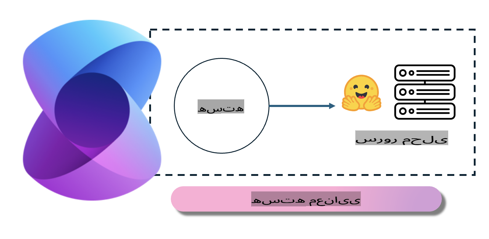
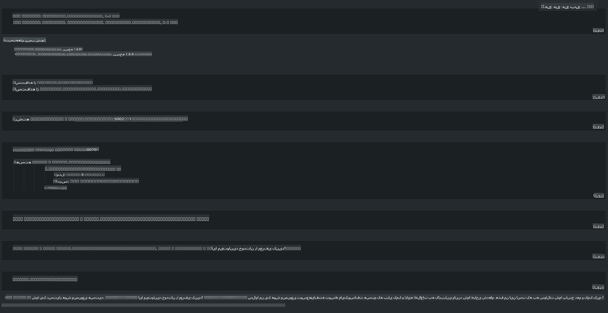

# **استنتاج Phi-3 در سرور محلی**

ما می‌توانیم Phi-3 را روی یک سرور محلی مستقر کنیم. کاربران می‌توانند از راهکارهای [Ollama](https://ollama.com) یا [LM Studio](https://llamaedge.com) استفاده کنند، یا کد خود را بنویسند. شما می‌توانید خدمات محلی Phi-3 را از طریق [Semantic Kernel](https://github.com/microsoft/semantic-kernel?WT.mc_id=aiml-138114-kinfeylo) یا [Langchain](https://www.langchain.com/) برای ساخت برنامه‌های Copilot متصل کنید.

## **استفاده از Semantic Kernel برای دسترسی به Phi-3-mini**

در برنامه Copilot، ما برنامه‌ها را از طریق Semantic Kernel یا LangChain ایجاد می‌کنیم. این نوع چارچوب برنامه معمولاً با Azure OpenAI Service / مدل‌های OpenAI سازگار است و همچنین می‌تواند از مدل‌های متن‌باز در Hugging Face و مدل‌های محلی پشتیبانی کند. اگر بخواهیم از Semantic Kernel برای دسترسی به Phi-3-mini استفاده کنیم، چه کاری باید انجام دهیم؟ با استفاده از .NET به عنوان مثال، می‌توانیم آن را با Hugging Face Connector در Semantic Kernel ترکیب کنیم. به‌طور پیش‌فرض، این ابزار می‌تواند به شناسه مدل در Hugging Face متصل شود (اولین بار که از آن استفاده می‌کنید، مدل از Hugging Face دانلود می‌شود که زمان زیادی می‌برد). همچنین می‌توانید به سرویس محلی ساخته‌شده متصل شوید. در مقایسه این دو، ما استفاده از گزینه دوم را توصیه می‌کنیم زیرا درجه استقلال بیشتری دارد، به‌ویژه در برنامه‌های سازمانی.

همان‌طور که در تصویر مشاهده می‌شود، دسترسی به خدمات محلی از طریق Semantic Kernel به‌راحتی می‌تواند به سرور مدل Phi-3-mini ساخته‌شده متصل شود. در اینجا نتیجه اجرای آن آورده شده است:

***نمونه کد*** https://github.com/kinfey/Phi3MiniSamples/tree/main/semantickernel

**سلب مسئولیت**:  
این سند با استفاده از خدمات ترجمه ماشینی مبتنی بر هوش مصنوعی ترجمه شده است. در حالی که ما برای دقت تلاش می‌کنیم، لطفاً توجه داشته باشید که ترجمه‌های خودکار ممکن است حاوی خطاها یا نادرستی‌هایی باشند. سند اصلی به زبان اصلی آن باید به عنوان منبع معتبر در نظر گرفته شود. برای اطلاعات حساس، ترجمه حرفه‌ای انسانی توصیه می‌شود. ما هیچ‌گونه مسئولیتی در قبال سوءتفاهم‌ها یا تفسیرهای نادرست ناشی از استفاده از این ترجمه نداریم.