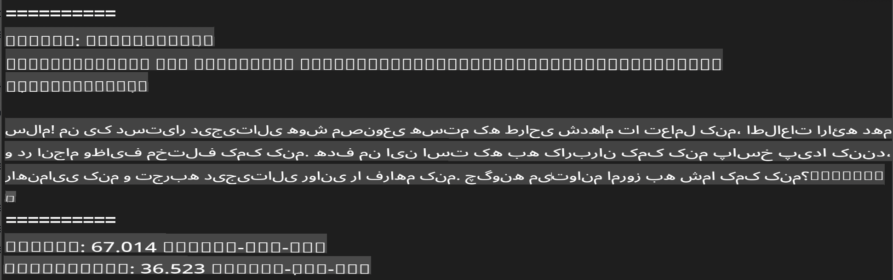
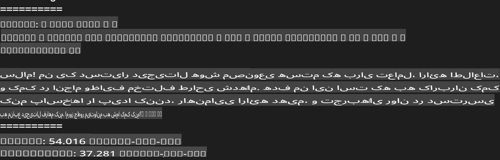
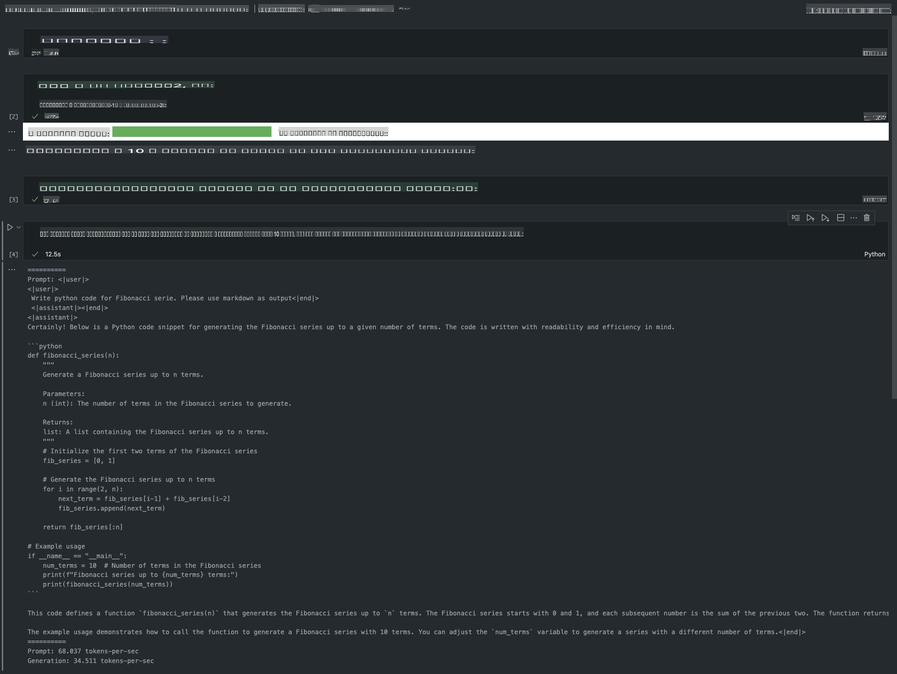

# **استنتاج Phi-3 با چارچوب Apple MLX**

## **چارچوب MLX چیست**

MLX یک چارچوب آرایه‌ای برای تحقیقات یادگیری ماشین بر روی تراشه‌های سیلیکونی اپل است که توسط تیم تحقیقات یادگیری ماشین اپل ارائه شده است.

MLX توسط محققان یادگیری ماشین برای محققان یادگیری ماشین طراحی شده است. این چارچوب به گونه‌ای طراحی شده که هم کاربرپسند باشد و هم کارآمد برای آموزش و پیاده‌سازی مدل‌ها. طراحی این چارچوب به صورت مفهومی ساده است. هدف ما این است که محققان بتوانند به راحتی MLX را گسترش دهند و بهبود بخشند تا بتوانند ایده‌های جدید را سریع‌تر بررسی کنند.

مدل‌های زبانی بزرگ (LLMs) می‌توانند با استفاده از MLX در دستگاه‌های سیلیکونی اپل شتاب داده شوند و مدل‌ها به راحتی به صورت محلی اجرا شوند.

## **استفاده از MLX برای استنتاج Phi-3-mini**

### **1. تنظیم محیط MLX**

1. پایتون نسخه 3.11.x  
2. نصب کتابخانه MLX  

```bash

pip install mlx-lm

```

### **2. اجرای Phi-3-mini در ترمینال با MLX**

```bash

python -m mlx_lm.generate --model microsoft/Phi-3-mini-4k-instruct --max-token 2048 --prompt  "<|user|>\nCan you introduce yourself<|end|>\n<|assistant|>"

```

نتیجه (محیط من Apple M1 Max با 64 گیگابایت رم) به صورت زیر است:



### **3. کوانتیزه کردن Phi-3-mini با MLX در ترمینال**

```bash

python -m mlx_lm.convert --hf-path microsoft/Phi-3-mini-4k-instruct

```

***نکته:*** مدل می‌تواند از طریق mlx_lm.convert کوانتیزه شود و کوانتیزه پیش‌فرض INT4 است. این مثال Phi-3-mini را به INT4 کوانتیزه می‌کند.

مدل می‌تواند از طریق mlx_lm.convert کوانتیزه شود و کوانتیزه پیش‌فرض INT4 است. این مثال Phi-3-mini را به INT4 کوانتیزه می‌کند. پس از کوانتیزه شدن، مدل در مسیر پیش‌فرض ./mlx_model ذخیره می‌شود.

ما می‌توانیم مدل کوانتیزه‌شده با MLX را از طریق ترمینال آزمایش کنیم.

```bash

python -m mlx_lm.generate --model ./mlx_model/ --max-token 2048 --prompt  "<|user|>\nCan you introduce yourself<|end|>\n<|assistant|>"

```

نتیجه به صورت زیر است:



### **4. اجرای Phi-3-mini با MLX در Jupyter Notebook**



***نکته:*** لطفاً این نمونه را مطالعه کنید [روی این لینک کلیک کنید](../../../../../code/03.Inference/MLX/MLX_DEMO.ipynb)

## **منابع**

1. آشنایی با چارچوب Apple MLX [https://ml-explore.github.io](https://ml-explore.github.io/mlx/build/html/index.html)

2. مخزن GitHub چارچوب Apple MLX [https://github.com/ml-explore](https://github.com/ml-explore)

**سلب مسئولیت**:  
این سند با استفاده از خدمات ترجمه ماشینی مبتنی بر هوش مصنوعی ترجمه شده است. در حالی که ما تلاش می‌کنیم دقت را رعایت کنیم، لطفاً توجه داشته باشید که ترجمه‌های خودکار ممکن است حاوی اشتباهات یا نادرستی‌هایی باشند. سند اصلی به زبان بومی آن باید به عنوان منبع معتبر در نظر گرفته شود. برای اطلاعات حساس، ترجمه حرفه‌ای انسانی توصیه می‌شود. ما هیچ مسئولیتی در قبال سوءتفاهم‌ها یا تفسیرهای نادرست ناشی از استفاده از این ترجمه نمی‌پذیریم.