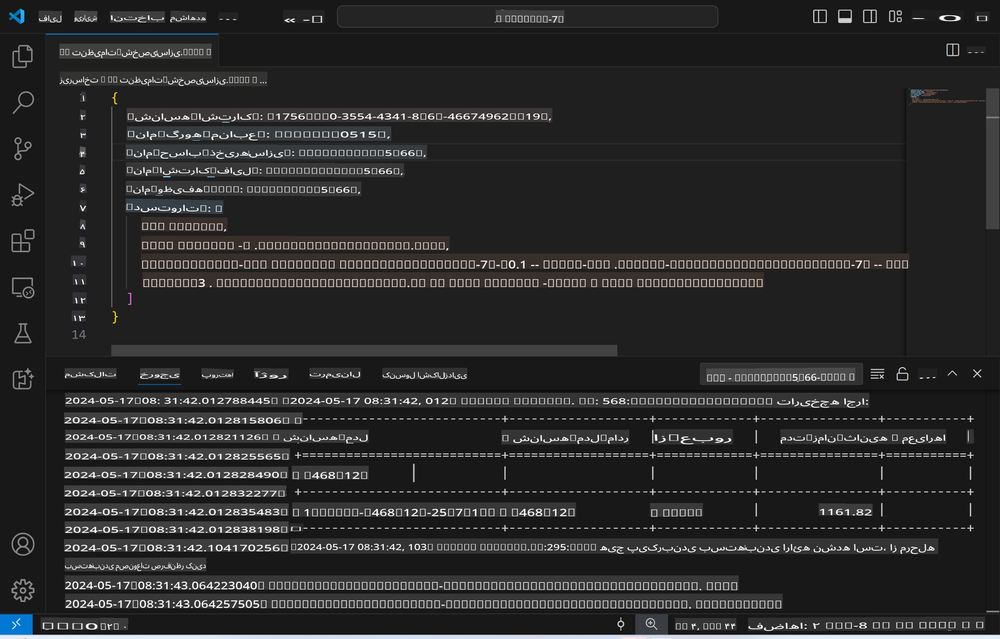
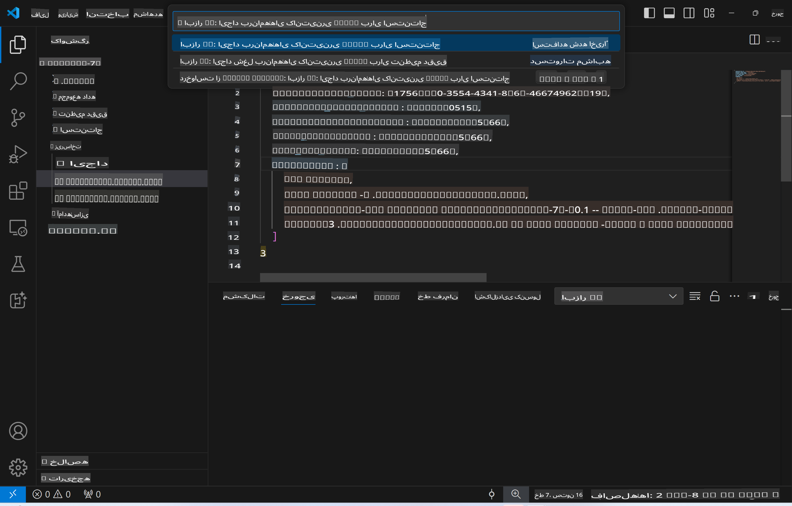
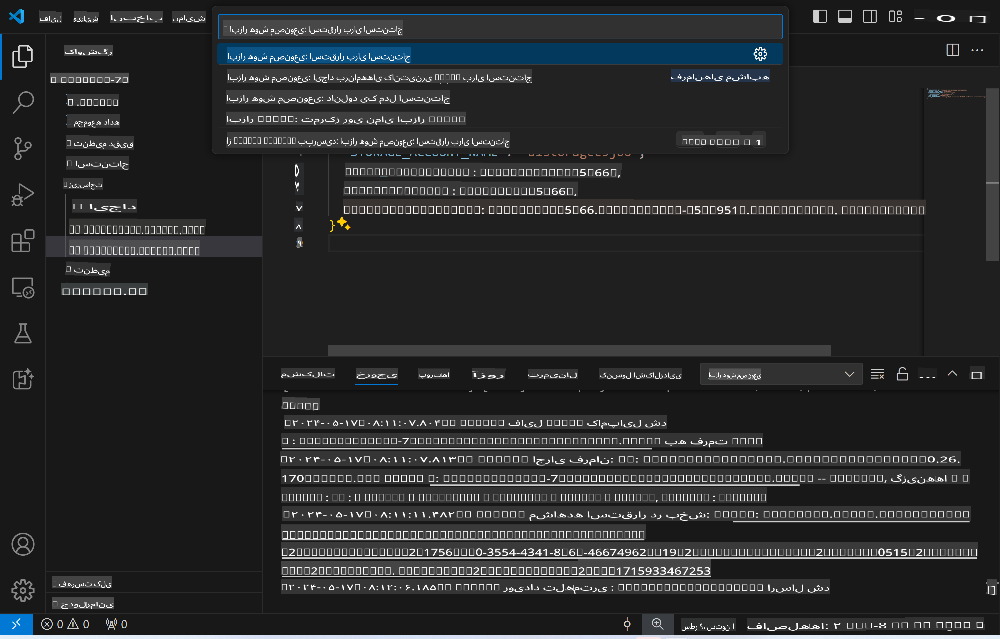
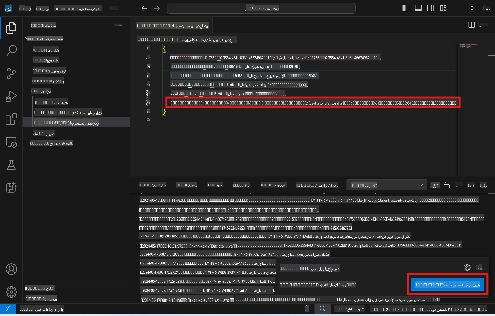

# استنتاج از راه دور با مدل تنظیم‌شده

پس از آموزش آداپتورها در محیط از راه دور، می‌توانید از یک برنامه ساده Gradio برای تعامل با مدل استفاده کنید.



### ایجاد منابع Azure
برای راه‌اندازی استنتاج از راه دور، باید منابع Azure را با اجرای دستور `AI Toolkit: Provision Azure Container Apps for inference` از پنل دستورات تنظیم کنید. در طول این فرآیند، از شما خواسته می‌شود که اشتراک Azure و گروه منابع خود را انتخاب کنید.  

   
به طور پیش‌فرض، اشتراک و گروه منابع برای استنتاج باید با آن‌هایی که برای تنظیم نهایی استفاده شده‌اند، مطابقت داشته باشند. استنتاج از همان محیط Azure Container App استفاده کرده و به مدل و آداپتور مدل ذخیره‌شده در Azure Files، که در مرحله تنظیم نهایی تولید شده‌اند، دسترسی خواهد داشت.

## استفاده از AI Toolkit 

### استقرار برای استنتاج  
اگر می‌خواهید کد استنتاج را بازبینی کنید یا مدل استنتاج را دوباره بارگذاری کنید، لطفاً دستور `AI Toolkit: Deploy for inference` را اجرا کنید. این کار کدهای جدید شما را با ACA همگام‌سازی کرده و نمونه را مجدداً راه‌اندازی می‌کند.  



پس از تکمیل موفقیت‌آمیز استقرار، مدل آماده ارزیابی از طریق این نقطه پایان خواهد بود.

### دسترسی به API استنتاج

می‌توانید با کلیک روی دکمه "*رفتن به نقطه پایان استنتاج*" که در اعلان VSCode نمایش داده می‌شود، به API استنتاج دسترسی پیدا کنید. همچنین، نقطه پایان وب API را می‌توانید در `ACA_APP_ENDPOINT` در `./infra/inference.config.json` و در پنل خروجی پیدا کنید.



> **توجه:** ممکن است چند دقیقه طول بکشد تا نقطه پایان استنتاج به طور کامل عملیاتی شود.

## اجزای استنتاج موجود در قالب

| پوشه | محتویات |
| ------ |--------- |
| `infra` | شامل تمام تنظیمات لازم برای عملیات از راه دور است. |
| `infra/provision/inference.parameters.json` | شامل پارامترهای مربوط به قالب‌های bicep است که برای ایجاد منابع Azure جهت استنتاج استفاده می‌شوند. |
| `infra/provision/inference.bicep` | شامل قالب‌هایی برای ایجاد منابع Azure برای استنتاج است. |
| `infra/inference.config.json` | فایل پیکربندی که توسط دستور `AI Toolkit: Provision Azure Container Apps for inference` تولید شده است. این فایل به‌عنوان ورودی برای سایر دستورات پنل استفاده می‌شود. |

### استفاده از AI Toolkit برای تنظیم منابع Azure
[AI Toolkit](https://marketplace.visualstudio.com/items?itemName=ms-windows-ai-studio.windows-ai-studio) را پیکربندی کنید.

Azure Container Apps را برای استنتاج ایجاد کنید ` command.

You can find configuration parameters in `./infra/provision/inference.parameters.json` file. Here are the details:
| Parameter | Description |
| --------- |------------ |
| `defaultCommands` | This is the commands to initiate a web API. |
| `maximumInstanceCount` | This parameter sets the maximum capacity of GPU instances. |
| `location` | This is the location where Azure resources are provisioned. The default value is the same as the chosen resource group's location. |
| `storageAccountName`, `fileShareName` `acaEnvironmentName`, `acaEnvironmentStorageName`, `acaAppName`,  `acaLogAnalyticsName` | These parameters are used to name the Azure resources for provision. By default, they will be same to the fine-tuning resource name. You can input a new, unused resource name to create your own custom-named resources, or you can input the name of an already existing Azure resource if you'd prefer to use that. For details, refer to the section [Using existing Azure Resources](../../../../../md/01.Introduction/03). |

### Using Existing Azure Resources

By default, the inference provision use the same Azure Container App Environment, Storage Account, Azure File Share, and Azure Log Analytics that were used for fine-tuning. A separate Azure Container App is created solely for the inference API. 

If you have customized the Azure resources during the fine-tuning step or want to use your own existing Azure resources for inference, specify their names in the `./infra/inference.parameters.json` فایل. سپس، دستور `AI Toolkit: Provision Azure Container Apps for inference` را از پنل دستورات اجرا کنید. این کار منابع مشخص‌شده را به‌روزرسانی کرده و هر موردی که وجود ندارد، ایجاد می‌کند.

برای مثال، اگر یک محیط موجود Azure Container دارید، فایل `./infra/finetuning.parameters.json` شما باید به این شکل باشد:

```json
{
    "$schema": "https://schema.management.azure.com/schemas/2019-04-01/deploymentParameters.json#",
    "contentVersion": "1.0.0.0",
    "parameters": {
      ...
      "acaEnvironmentName": {
        "value": "<your-aca-env-name>"
      },
      "acaEnvironmentStorageName": {
        "value": null
      },
      ...
    }
  }
```

### ایجاد دستی  
اگر ترجیح می‌دهید منابع Azure را به صورت دستی تنظیم کنید، می‌توانید از فایل‌های bicep ارائه‌شده در `./infra/provision` folders. If you have already set up and configured all the Azure resources without using the AI Toolkit command palette, you can simply enter the resource names in the `inference.config.json` استفاده کنید.

برای مثال:

```json
{
  "SUBSCRIPTION_ID": "<your-subscription-id>",
  "RESOURCE_GROUP_NAME": "<your-resource-group-name>",
  "STORAGE_ACCOUNT_NAME": "<your-storage-account-name>",
  "FILE_SHARE_NAME": "<your-file-share-name>",
  "ACA_APP_NAME": "<your-aca-name>",
  "ACA_APP_ENDPOINT": "<your-aca-endpoint>"
}
```

**سلب مسئولیت**:  
این سند با استفاده از خدمات ترجمه ماشینی مبتنی بر هوش مصنوعی ترجمه شده است. در حالی که ما برای دقت تلاش می‌کنیم، لطفاً توجه داشته باشید که ترجمه‌های خودکار ممکن است حاوی خطاها یا نادرستی‌هایی باشند. سند اصلی به زبان بومی آن باید به عنوان منبع معتبر در نظر گرفته شود. برای اطلاعات حیاتی، ترجمه حرفه‌ای انسانی توصیه می‌شود. ما هیچ مسئولیتی در قبال سوءتفاهم‌ها یا تفسیرهای نادرست ناشی از استفاده از این ترجمه نداریم.