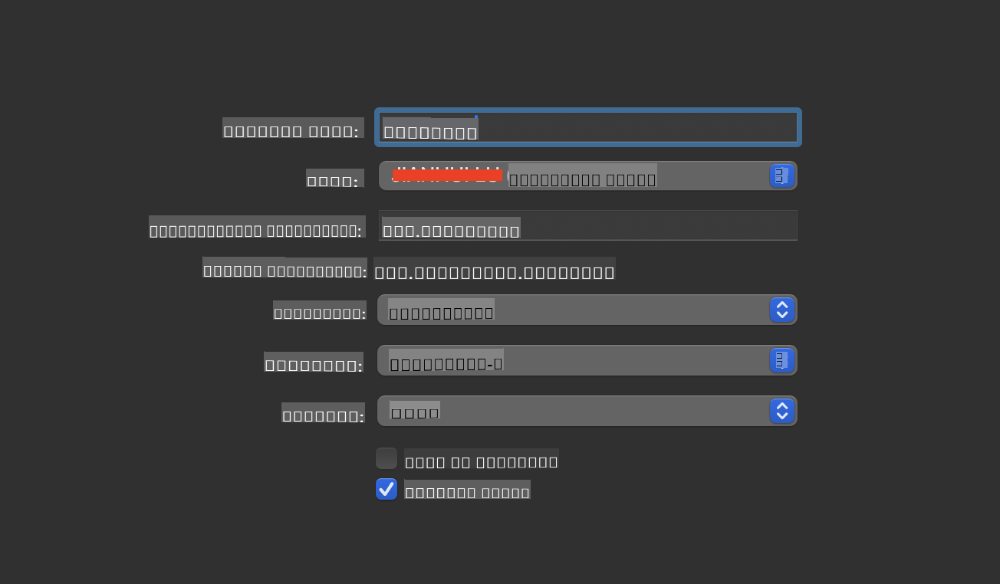
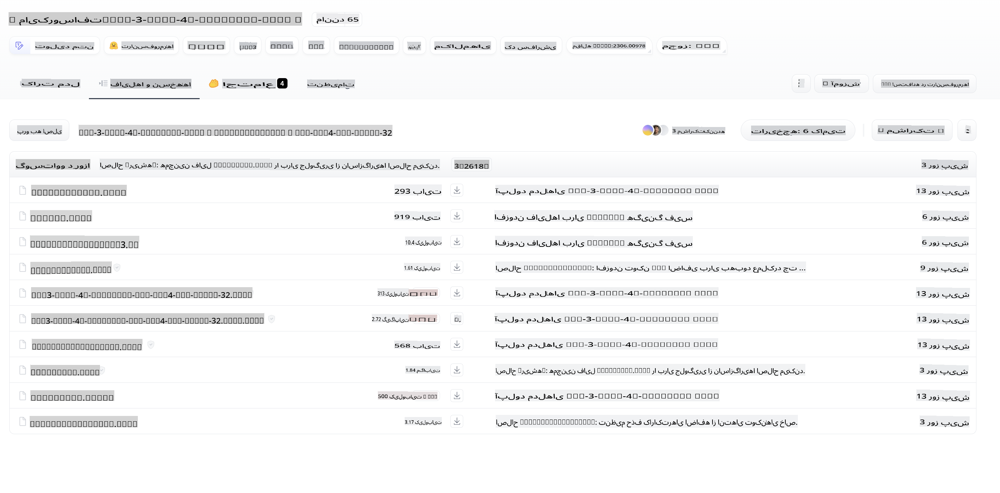
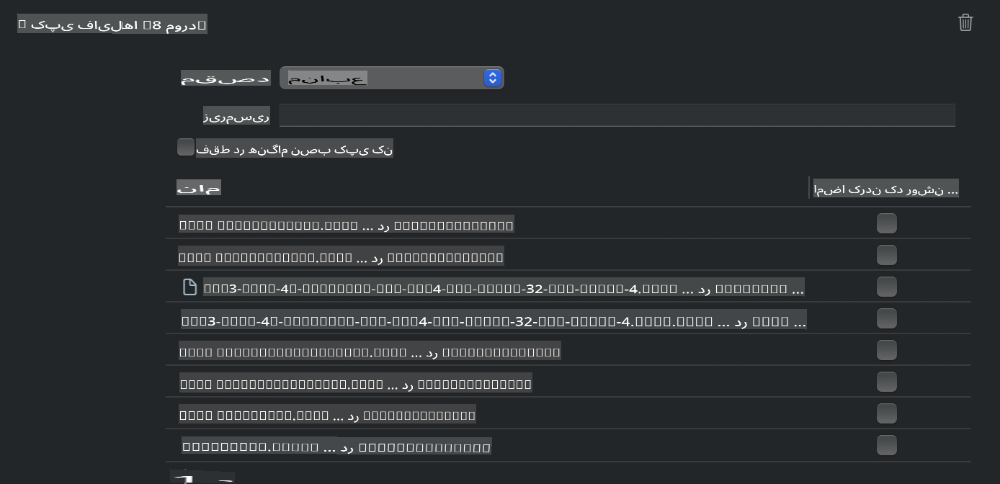
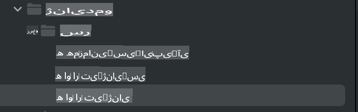
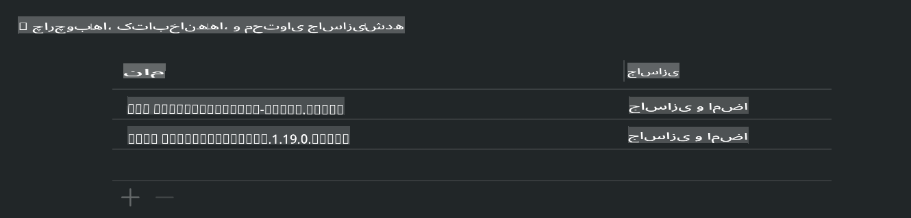
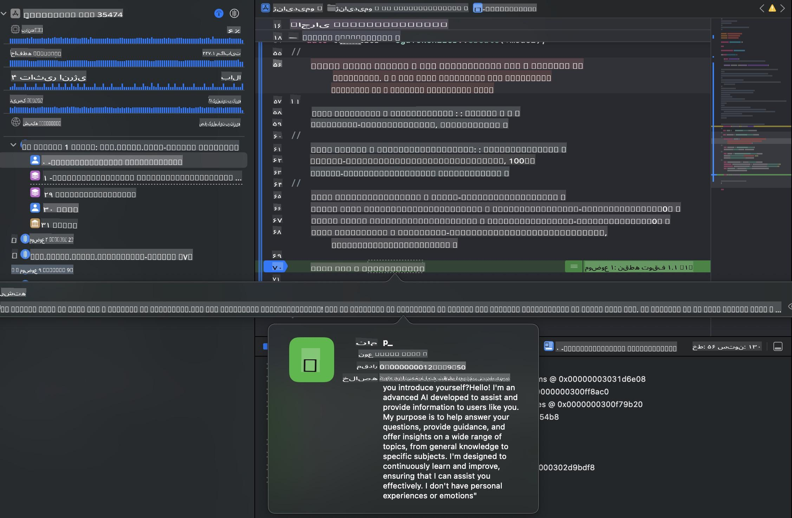

# **استنتاج Phi-3 در iOS**

Phi-3-mini یک سری جدید از مدل‌ها از مایکروسافت است که امکان اجرای مدل‌های زبان بزرگ (LLMs) روی دستگاه‌های لبه و دستگاه‌های اینترنت اشیا را فراهم می‌کند. Phi-3-mini برای iOS، Android و دستگاه‌های لبه قابل استفاده است و اجازه می‌دهد هوش مصنوعی مولد در محیط‌های BYOD مستقر شود. مثال زیر نشان می‌دهد که چگونه می‌توان Phi-3-mini را روی iOS مستقر کرد.

## **1. آماده‌سازی**

- **الف.** macOS 14+
- **ب.** Xcode 15+
- **پ.** iOS SDK 17.x (آیفون 14 A16 یا بالاتر)
- **ت.** نصب Python 3.10+ (Conda توصیه می‌شود)
- **ث.** نصب کتابخانه پایتون: `python-flatbuffers`
- **ج.** نصب CMake

### Semantic Kernel و استنتاج

Semantic Kernel یک چارچوب کاربردی است که به شما اجازه می‌دهد برنامه‌هایی سازگار با Azure OpenAI Service، مدل‌های OpenAI و حتی مدل‌های محلی ایجاد کنید. دسترسی به سرویس‌های محلی از طریق Semantic Kernel، ادغام آسان با سرور مدل Phi-3-mini خودمیزبان شما را ممکن می‌سازد.

### فراخوانی مدل‌های کم‌حجم‌شده با Ollama یا LlamaEdge

بسیاری از کاربران ترجیح می‌دهند از مدل‌های کم‌حجم‌شده برای اجرای مدل‌ها به صورت محلی استفاده کنند. [Ollama](https://ollama.com) و [LlamaEdge](https://llamaedge.com) به کاربران اجازه می‌دهند مدل‌های کم‌حجم‌شده مختلف را فراخوانی کنند:

#### **Ollama**

می‌توانید `ollama run phi3` را مستقیماً اجرا کنید یا آن را به صورت آفلاین پیکربندی کنید. یک Modelfile با مسیر فایل `gguf` خود ایجاد کنید. نمونه کدی برای اجرای مدل کم‌حجم‌شده Phi-3-mini:

```gguf
FROM {Add your gguf file path}
TEMPLATE \"\"\"<|user|> .Prompt<|end|> <|assistant|>\"\"\"
PARAMETER stop <|end|>
PARAMETER num_ctx 4096
```

#### **LlamaEdge**

اگر می‌خواهید از `gguf` هم در فضای ابری و هم روی دستگاه‌های لبه به طور همزمان استفاده کنید، LlamaEdge گزینه‌ای عالی است.

## **2. کامپایل ONNX Runtime برای iOS**

```bash

git clone https://github.com/microsoft/onnxruntime.git

cd onnxruntime

./build.sh --build_shared_lib --ios --skip_tests --parallel --build_dir ./build_ios --ios --apple_sysroot iphoneos --osx_arch arm64 --apple_deploy_target 17.5 --cmake_generator Xcode --config Release

cd ../

```

### **توجه**

- **الف.** پیش از کامپایل، مطمئن شوید که Xcode به درستی پیکربندی شده و به عنوان دایرکتوری توسعه‌دهنده فعال در ترمینال تنظیم شده است:

    ```bash
    sudo xcode-select -switch /Applications/Xcode.app/Contents/Developer
    ```

- **ب.** ONNX Runtime باید برای پلتفرم‌های مختلف کامپایل شود. برای iOS، می‌توانید برای `arm64` or `x86_64` کامپایل کنید.

- **پ.** توصیه می‌شود از جدیدترین iOS SDK برای کامپایل استفاده کنید. با این حال، اگر به سازگاری با SDKهای قبلی نیاز دارید، می‌توانید از نسخه‌های قدیمی‌تر نیز استفاده کنید.

## **3. کامپایل هوش مصنوعی مولد با ONNX Runtime برای iOS**

> **توجه:** از آنجا که هوش مصنوعی مولد با ONNX Runtime در حالت پیش‌نمایش است، لطفاً از تغییرات احتمالی آگاه باشید.

```bash

git clone https://github.com/microsoft/onnxruntime-genai
 
cd onnxruntime-genai
 
mkdir ort
 
cd ort
 
mkdir include
 
mkdir lib
 
cd ../
 
cp ../onnxruntime/include/onnxruntime/core/session/onnxruntime_c_api.h ort/include
 
cp ../onnxruntime/build_ios/Release/Release-iphoneos/libonnxruntime*.dylib* ort/lib
 
export OPENCV_SKIP_XCODEBUILD_FORCE_TRYCOMPILE_DEBUG=1
 
python3 build.py --parallel --build_dir ./build_ios --ios --ios_sysroot iphoneos --ios_arch arm64 --ios_deployment_target 17.5 --cmake_generator Xcode --cmake_extra_defines CMAKE_XCODE_ATTRIBUTE_CODE_SIGNING_ALLOWED=NO

```

## **4. ایجاد یک اپلیکیشن App در Xcode**

من Objective-C را به عنوان روش توسعه اپلیکیشن انتخاب کردم، زیرا با استفاده از هوش مصنوعی مولد با ONNX Runtime C++ API، Objective-C سازگاری بهتری دارد. البته، می‌توانید از طریق Swift bridging نیز فراخوانی‌های مرتبط را انجام دهید.



## **5. کپی کردن مدل کم‌حجم‌شده INT4 ONNX به پروژه اپلیکیشن**

ما باید مدل کم‌حجم‌شده INT4 در فرمت ONNX را وارد کنیم، که ابتدا باید دانلود شود.



پس از دانلود، باید آن را به دایرکتوری Resources پروژه در Xcode اضافه کنید.



## **6. افزودن APIهای C++ در ViewControllers**

> **توجه:**

- **الف.** فایل‌های هدر C++ مربوطه را به پروژه اضافه کنید.

  

- **ب.** `onnxruntime-genai` dynamic library in Xcode.

  

- **c.** Use the C Samples code for testing. You can also add additional features like ChatUI for more functionality.

- **d.** Since you need to use C++ in your project, rename `ViewController.m` to `ViewController.mm` را برای فعال کردن پشتیبانی از Objective-C++ وارد کنید.

```objc

    NSString *llmPath = [[NSBundle mainBundle] resourcePath];
    char const *modelPath = llmPath.cString;

    auto model =  OgaModel::Create(modelPath);

    auto tokenizer = OgaTokenizer::Create(*model);

    const char* prompt = "<|system|>You are a helpful AI assistant.<|end|><|user|>Can you introduce yourself?<|end|><|assistant|>";

    auto sequences = OgaSequences::Create();
    tokenizer->Encode(prompt, *sequences);

    auto params = OgaGeneratorParams::Create(*model);
    params->SetSearchOption("max_length", 100);
    params->SetInputSequences(*sequences);

    auto output_sequences = model->Generate(*params);
    const auto output_sequence_length = output_sequences->SequenceCount(0);
    const auto* output_sequence_data = output_sequences->SequenceData(0);
    auto out_string = tokenizer->Decode(output_sequence_data, output_sequence_length);
    
    auto tmp = out_string;

```

## **7. اجرای اپلیکیشن**

پس از تکمیل تنظیمات، می‌توانید اپلیکیشن را اجرا کنید تا نتایج استنتاج مدل Phi-3-mini را مشاهده کنید.



برای نمونه کدهای بیشتر و دستورالعمل‌های دقیق، به [مخزن نمونه‌های Phi-3 Mini](https://github.com/Azure-Samples/Phi-3MiniSamples/tree/main/ios) مراجعه کنید.

**سلب مسئولیت**:  
این سند با استفاده از خدمات ترجمه ماشینی مبتنی بر هوش مصنوعی ترجمه شده است. در حالی که ما تلاش می‌کنیم دقت را حفظ کنیم، لطفاً توجه داشته باشید که ترجمه‌های خودکار ممکن است حاوی خطاها یا نادقتی‌ها باشند. سند اصلی به زبان اصلی آن باید به عنوان منبع معتبر در نظر گرفته شود. برای اطلاعات حساس، ترجمه حرفه‌ای انسانی توصیه می‌شود. ما هیچ مسئولیتی در قبال سوءتفاهم‌ها یا تفسیرهای نادرست ناشی از استفاده از این ترجمه نداریم.