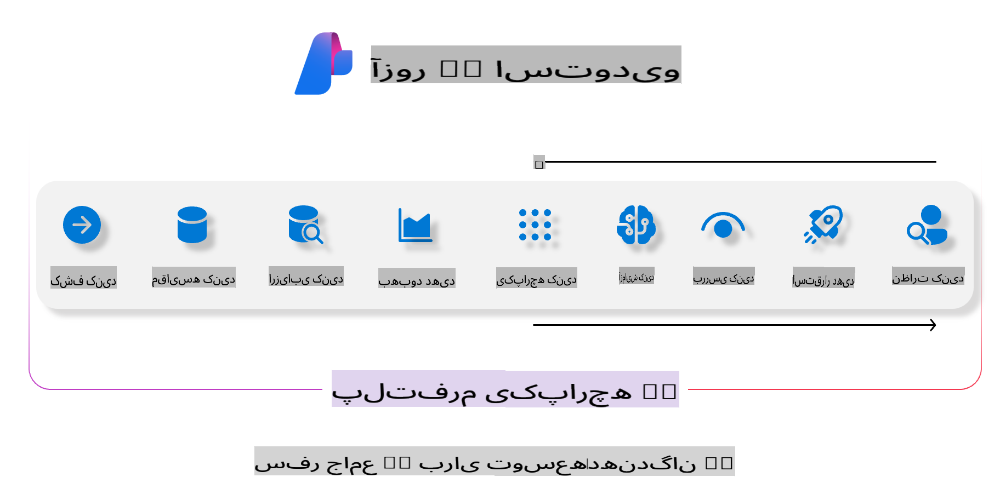
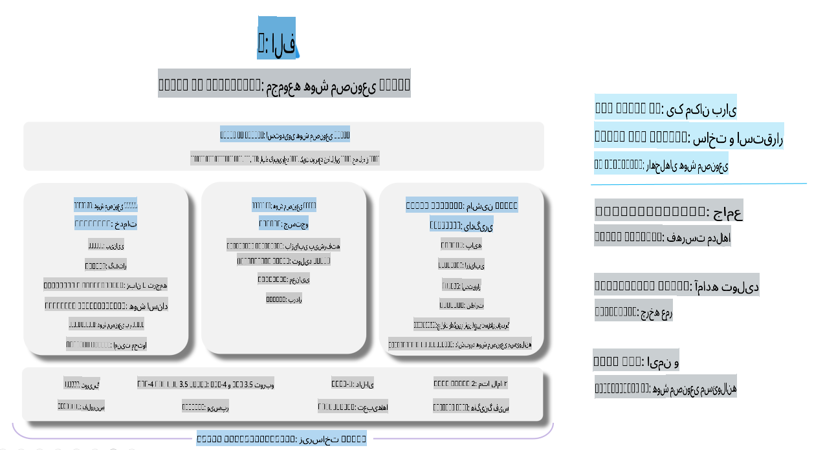

# **استفاده از Azure AI Foundry برای ارزیابی**

چگونه می‌توانید برنامه هوش مصنوعی مولد خود را با استفاده از [Azure AI Foundry](https://ai.azure.com?WT.mc_id=aiml-138114-kinfeylo) ارزیابی کنید؟ چه در حال بررسی مکالمات تک‌مرحله‌ای باشید و چه چندمرحله‌ای، Azure AI Foundry ابزارهایی برای ارزیابی عملکرد و ایمنی مدل ارائه می‌دهد.

## چگونه برنامه‌های هوش مصنوعی مولد را با Azure AI Foundry ارزیابی کنیم؟
برای دستورالعمل‌های بیشتر به [مستندات Azure AI Foundry](https://learn.microsoft.com/azure/ai-studio/how-to/evaluate-generative-ai-app?WT.mc_id=aiml-138114-kinfeylo) مراجعه کنید.

مراحل شروع به این صورت است:

## ارزیابی مدل‌های هوش مصنوعی مولد در Azure AI Foundry

**پیش‌نیازها**

- یک مجموعه داده آزمایشی در قالب CSV یا JSON.
- یک مدل هوش مصنوعی مولد که مستقر شده باشد (مانند مدل‌های Phi-3، GPT 3.5، GPT 4، یا Davinci).
- یک زمان اجرا با یک نمونه محاسباتی برای اجرای ارزیابی.

## معیارهای ارزیابی داخلی

Azure AI Foundry به شما امکان می‌دهد مکالمات تک‌مرحله‌ای و همچنین مکالمات پیچیده چندمرحله‌ای را ارزیابی کنید.  
برای سناریوهای Retrieval Augmented Generation (RAG) که در آن مدل به داده‌های خاصی وابسته است، می‌توانید عملکرد را با استفاده از معیارهای ارزیابی داخلی بسنجید.  
علاوه بر این، می‌توانید سناریوهای عمومی پاسخ‌دهی به سوالات تک‌مرحله‌ای (غیر-RAG) را ارزیابی کنید.

## ایجاد یک اجرای ارزیابی

از رابط کاربری Azure AI Foundry، به صفحه Evaluate یا Prompt Flow بروید.  
دستیار ایجاد ارزیابی را دنبال کنید تا یک اجرای ارزیابی تنظیم کنید. یک نام اختیاری برای ارزیابی خود ارائه دهید.  
سناریویی را انتخاب کنید که با اهداف برنامه شما همسو باشد.  
یک یا چند معیار ارزیابی را برای سنجش خروجی مدل انتخاب کنید.

## جریان ارزیابی سفارشی (اختیاری)

برای انعطاف‌پذیری بیشتر، می‌توانید یک جریان ارزیابی سفارشی ایجاد کنید. فرایند ارزیابی را بر اساس نیازهای خاص خود تنظیم کنید.

## مشاهده نتایج

پس از اجرای ارزیابی، معیارهای ارزیابی دقیق را در Azure AI Foundry ثبت، مشاهده و تحلیل کنید. بینش‌هایی درباره قابلیت‌ها و محدودیت‌های برنامه خود به دست آورید.

**توجه** Azure AI Foundry در حال حاضر در نسخه پیش‌نمایش عمومی قرار دارد، بنابراین از آن برای اهداف آزمایشی و توسعه استفاده کنید. برای بارهای کاری تولیدی، گزینه‌های دیگری را در نظر بگیرید. برای جزئیات بیشتر و دستورالعمل‌های گام‌به‌گام، مستندات رسمی [AI Foundry](https://learn.microsoft.com/azure/ai-studio/?WT.mc_id=aiml-138114-kinfeylo) را بررسی کنید.

**سلب مسئولیت**:  
این سند با استفاده از خدمات ترجمه مبتنی بر هوش مصنوعی ترجمه شده است. در حالی که ما برای دقت تلاش می‌کنیم، لطفاً توجه داشته باشید که ترجمه‌های خودکار ممکن است شامل خطاها یا نادقتی‌ها باشند. سند اصلی به زبان اصلی آن باید به عنوان منبع معتبر در نظر گرفته شود. برای اطلاعات حیاتی، ترجمه حرفه‌ای انسانی توصیه می‌شود. ما مسئولیتی در قبال سوءتفاهم‌ها یا تفسیرهای نادرست ناشی از استفاده از این ترجمه نداریم.