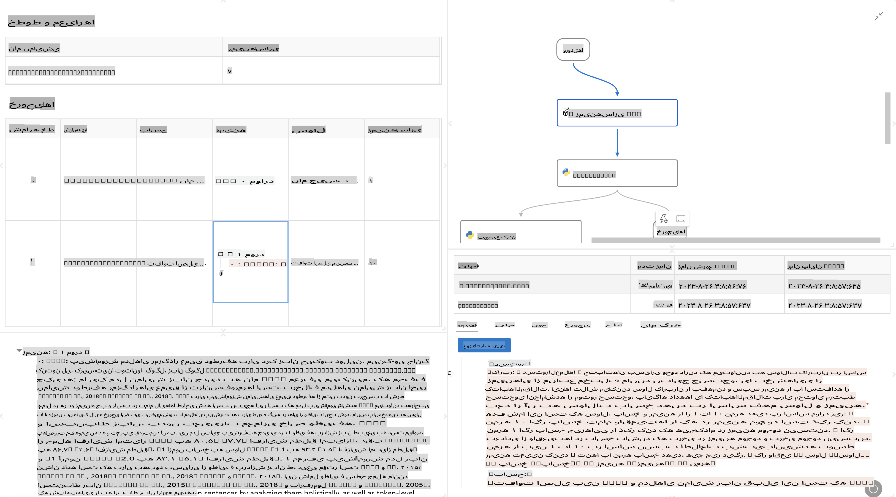

# **معرفی Promptflow**

[Microsoft Prompt Flow](https://microsoft.github.io/promptflow/index.html?WT.mc_id=aiml-138114-kinfeylo) یک ابزار بصری برای اتوماسیون جریان کاری است که به کاربران اجازه می‌دهد با استفاده از قالب‌های از پیش ساخته شده و کانکتورهای سفارشی، جریان‌های کاری خودکار ایجاد کنند. این ابزار برای توسعه‌دهندگان و تحلیل‌گران کسب‌وکار طراحی شده است تا فرآیندهای خودکار را برای وظایفی مانند مدیریت داده، همکاری، و بهینه‌سازی فرآیند به سرعت بسازند. با استفاده از Prompt Flow، کاربران می‌توانند به راحتی خدمات، برنامه‌ها و سیستم‌های مختلف را به هم متصل کرده و فرآیندهای پیچیده کسب‌وکار را خودکار کنند.

Microsoft Prompt Flow برای ساده‌سازی چرخه توسعه از ابتدا تا انتها در برنامه‌های هوش مصنوعی مبتنی بر مدل‌های زبانی بزرگ (LLMs) طراحی شده است. چه در مرحله ایده‌پردازی، نمونه‌سازی، تست، ارزیابی یا پیاده‌سازی برنامه‌های مبتنی بر LLM باشید، Prompt Flow فرآیند را ساده می‌کند و به شما امکان می‌دهد برنامه‌های LLM با کیفیت تولید بسازید.

## ویژگی‌ها و مزایای کلیدی استفاده از Microsoft Prompt Flow:

**تجربه نویسندگی تعاملی**

Prompt Flow یک نمایش بصری از ساختار جریان شما ارائه می‌دهد که درک و پیمایش پروژه‌هایتان را آسان می‌کند.  
این ابزار تجربه کدنویسی شبیه به دفترچه یادداشت برای توسعه و اشکال‌زدایی کارآمد جریان‌ها ارائه می‌دهد.

**تنوع و تنظیم درخواست‌ها**

ایجاد و مقایسه انواع مختلف درخواست‌ها برای تسهیل فرآیند اصلاح تدریجی.  
ارزیابی عملکرد درخواست‌های مختلف و انتخاب موثرترین آنها.

**جریان‌های ارزیابی داخلی**  
ارزیابی کیفیت و اثربخشی درخواست‌ها و جریان‌های خود با استفاده از ابزارهای ارزیابی داخلی.  
درک کنید که برنامه‌های مبتنی بر LLM شما چقدر عملکرد خوبی دارند.

**منابع جامع**

Prompt Flow شامل یک کتابخانه از ابزارها، نمونه‌ها و قالب‌های داخلی است.  
این منابع به‌عنوان نقطه شروع توسعه عمل می‌کنند، خلاقیت را الهام می‌بخشند و فرآیند را تسریع می‌کنند.

**همکاری و آمادگی سازمانی**

حمایت از همکاری تیمی با امکان کار هم‌زمان چندین کاربر روی پروژه‌های مهندسی درخواست.  
حفظ کنترل نسخه و به اشتراک‌گذاری موثر دانش.  
ساده‌سازی کل فرآیند مهندسی درخواست، از توسعه و ارزیابی تا پیاده‌سازی و نظارت.

## ارزیابی در Prompt Flow  

در Microsoft Prompt Flow، ارزیابی نقش مهمی در سنجش عملکرد مدل‌های هوش مصنوعی شما ایفا می‌کند. بیایید بررسی کنیم که چگونه می‌توانید جریان‌ها و معیارهای ارزیابی را در Prompt Flow سفارشی کنید:

**درک ارزیابی در Prompt Flow**

در Prompt Flow، یک جریان نشان‌دهنده دنباله‌ای از گره‌هاست که ورودی را پردازش کرده و خروجی تولید می‌کنند. جریان‌های ارزیابی نوع خاصی از جریان‌ها هستند که برای ارزیابی عملکرد یک اجرا بر اساس معیارها و اهداف مشخص طراحی شده‌اند.

**ویژگی‌های کلیدی جریان‌های ارزیابی**

این جریان‌ها معمولاً پس از جریان مورد آزمایش اجرا می‌شوند و از خروجی‌های آن استفاده می‌کنند.  
آنها امتیازها یا معیارهایی را برای اندازه‌گیری عملکرد جریان آزمایش‌شده محاسبه می‌کنند.  
معیارها می‌توانند شامل دقت، امتیازات مرتبط بودن یا هر معیار مرتبط دیگری باشند.

### سفارشی‌سازی جریان‌های ارزیابی

**تعریف ورودی‌ها**

جریان‌های ارزیابی باید خروجی‌های اجرای مورد آزمایش را دریافت کنند. ورودی‌ها را مشابه جریان‌های استاندارد تعریف کنید.  
برای مثال، اگر در حال ارزیابی یک جریان پرسش و پاسخ هستید، ورودی‌ای به نام "پاسخ" تعریف کنید. اگر در حال ارزیابی یک جریان طبقه‌بندی هستید، ورودی‌ای به نام "دسته‌بندی" تعریف کنید. ورودی‌های داده‌های واقعی (مانند برچسب‌های واقعی) نیز ممکن است مورد نیاز باشند.

**خروجی‌ها و معیارها**

جریان‌های ارزیابی نتایجی تولید می‌کنند که عملکرد جریان آزمایش‌شده را اندازه‌گیری می‌کند.  
معیارها می‌توانند با استفاده از Python یا LLM (مدل‌های زبانی بزرگ) محاسبه شوند. از تابع log_metric() برای ثبت معیارهای مرتبط استفاده کنید.

**استفاده از جریان‌های ارزیابی سفارشی**

یک جریان ارزیابی مختص وظایف و اهداف خود توسعه دهید. معیارها را بر اساس اهداف ارزیابی خود سفارشی کنید.  
این جریان ارزیابی سفارشی را برای اجراهای دسته‌ای در تست‌های بزرگ‌مقیاس اعمال کنید.

## روش‌های ارزیابی داخلی

Prompt Flow همچنین روش‌های ارزیابی داخلی ارائه می‌دهد.  
می‌توانید اجراهای دسته‌ای ارسال کنید و از این روش‌ها برای ارزیابی عملکرد جریان خود با مجموعه داده‌های بزرگ استفاده کنید.  
نتایج ارزیابی را مشاهده کنید، معیارها را مقایسه کنید و در صورت نیاز اصلاحات انجام دهید.  
به یاد داشته باشید، ارزیابی برای اطمینان از برآورده شدن معیارها و اهداف مورد نظر مدل‌های هوش مصنوعی شما ضروری است.  
برای دستورالعمل‌های دقیق در مورد توسعه و استفاده از جریان‌های ارزیابی در Microsoft Prompt Flow، مستندات رسمی را بررسی کنید.

به طور خلاصه، Microsoft Prompt Flow به توسعه‌دهندگان این امکان را می‌دهد که با ساده‌سازی مهندسی درخواست و ارائه یک محیط توسعه قوی، برنامه‌های LLM با کیفیت بالا ایجاد کنند. اگر با LLMها کار می‌کنید، Prompt Flow ابزاری ارزشمند برای کشف است. مستندات [Prompt Flow Evaluation Documents](https://learn.microsoft.com/azure/machine-learning/prompt-flow/how-to-develop-an-evaluation-flow?view=azureml-api-2?WT.mc_id=aiml-138114-kinfeylo) را برای دستورالعمل‌های دقیق در مورد توسعه و استفاده از جریان‌های ارزیابی در Microsoft Prompt Flow بررسی کنید.

**سلب مسئولیت**:  
این سند با استفاده از خدمات ترجمه ماشینی مبتنی بر هوش مصنوعی ترجمه شده است. در حالی که ما برای دقت تلاش می‌کنیم، لطفاً توجه داشته باشید که ترجمه‌های خودکار ممکن است شامل اشتباهات یا نادرستی‌هایی باشد. سند اصلی به زبان اصلی آن باید به عنوان منبع معتبر در نظر گرفته شود. برای اطلاعات حساس، ترجمه حرفه‌ای انسانی توصیه می‌شود. ما هیچ مسئولیتی در قبال سوءتفاهم‌ها یا تفسیرهای نادرست ناشی از استفاده از این ترجمه نداریم.