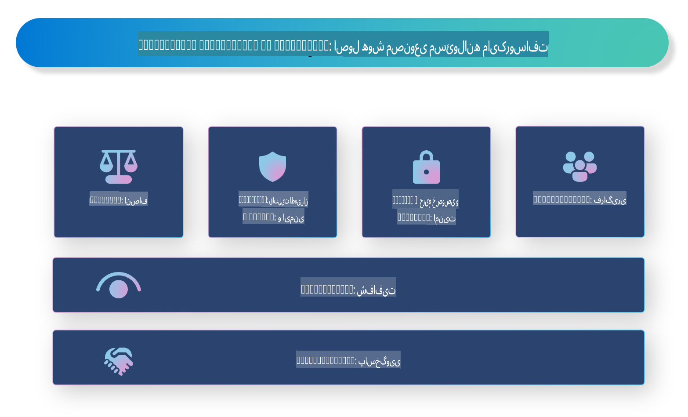

# **معرفی هوش مصنوعی مسئولانه**

[Microsoft Responsible AI](https://www.microsoft.com/ai/responsible-ai?WT.mc_id=aiml-138114-kinfeylo) یک ابتکار است که هدف آن کمک به توسعه‌دهندگان و سازمان‌ها برای ساخت سیستم‌های هوش مصنوعی شفاف، قابل اعتماد و پاسخگو است. این ابتکار راهنمایی‌ها و منابعی را برای توسعه راه‌حل‌های هوش مصنوعی مسئولانه که با اصول اخلاقی مانند حفظ حریم خصوصی، عدالت و شفافیت همسو هستند، ارائه می‌دهد. همچنین به بررسی برخی از چالش‌ها و بهترین روش‌های مرتبط با ساخت سیستم‌های هوش مصنوعی مسئولانه خواهیم پرداخت.

## مروری بر هوش مصنوعی مسئولانه مایکروسافت

**اصول اخلاقی**

هوش مصنوعی مسئولانه مایکروسافت بر اساس مجموعه‌ای از اصول اخلاقی هدایت می‌شود، از جمله حفظ حریم خصوصی، عدالت، شفافیت، پاسخگویی و ایمنی. این اصول برای اطمینان از توسعه سیستم‌های هوش مصنوعی به شکلی اخلاقی و مسئولانه طراحی شده‌اند.

**هوش مصنوعی شفاف**

هوش مصنوعی مسئولانه مایکروسافت بر اهمیت شفافیت در سیستم‌های هوش مصنوعی تأکید دارد. این شامل ارائه توضیحات واضح در مورد نحوه عملکرد مدل‌های هوش مصنوعی و همچنین اطمینان از دسترسی عمومی به منابع داده و الگوریتم‌ها است.

**هوش مصنوعی پاسخگو**

[Microsoft Responsible AI](https://www.microsoft.com/ai/responsible-ai?WT.mc_id=aiml-138114-kinfeylo) توسعه سیستم‌های هوش مصنوعی پاسخگو را ترویج می‌دهد که می‌توانند بینشی از نحوه تصمیم‌گیری مدل‌های هوش مصنوعی ارائه دهند. این موضوع می‌تواند به کاربران کمک کند تا خروجی‌های سیستم‌های هوش مصنوعی را درک و به آن‌ها اعتماد کنند.

**شمول‌گرایی**

سیستم‌های هوش مصنوعی باید به گونه‌ای طراحی شوند که برای همه مفید باشند. مایکروسافت تلاش دارد هوش مصنوعی فراگیر ایجاد کند که دیدگاه‌های متنوع را در نظر بگیرد و از تعصب یا تبعیض اجتناب کند.

**قابلیت اطمینان و ایمنی**

اطمینان از اینکه سیستم‌های هوش مصنوعی قابل اطمینان و ایمن هستند، بسیار حیاتی است. مایکروسافت بر ساخت مدل‌های قوی که به صورت مداوم عمل می‌کنند و از نتایج مضر جلوگیری می‌کنند، تمرکز دارد.

**عدالت در هوش مصنوعی**

هوش مصنوعی مسئولانه مایکروسافت اذعان دارد که سیستم‌های هوش مصنوعی ممکن است تعصبات را در صورتی که بر اساس داده‌ها یا الگوریتم‌های متعصب آموزش داده شوند، تقویت کنند. این ابتکار راهنمایی‌هایی برای توسعه سیستم‌های هوش مصنوعی عادلانه ارائه می‌دهد که بر اساس عواملی مانند نژاد، جنسیت یا سن تبعیض قائل نشوند.

**حریم خصوصی و امنیت**

هوش مصنوعی مسئولانه مایکروسافت بر اهمیت حفاظت از حریم خصوصی کاربران و امنیت داده‌ها در سیستم‌های هوش مصنوعی تأکید دارد. این شامل اجرای رمزنگاری قوی داده‌ها و کنترل دسترسی، و همچنین بررسی‌های منظم سیستم‌های هوش مصنوعی برای شناسایی آسیب‌پذیری‌ها است.

**پاسخگویی و مسئولیت‌پذیری**

هوش مصنوعی مسئولانه مایکروسافت، پاسخگویی و مسئولیت‌پذیری در توسعه و استقرار هوش مصنوعی را ترویج می‌دهد. این شامل اطمینان از آگاهی توسعه‌دهندگان و سازمان‌ها از خطرات بالقوه مرتبط با سیستم‌های هوش مصنوعی و اتخاذ گام‌هایی برای کاهش این خطرات است.

## بهترین روش‌ها برای ساخت سیستم‌های هوش مصنوعی مسئولانه

**توسعه مدل‌های هوش مصنوعی با استفاده از مجموعه داده‌های متنوع**

برای اجتناب از تعصب در سیستم‌های هوش مصنوعی، استفاده از مجموعه داده‌های متنوع که طیف گسترده‌ای از دیدگاه‌ها و تجربیات را نمایندگی می‌کنند، بسیار مهم است.

**استفاده از تکنیک‌های هوش مصنوعی قابل توضیح**

تکنیک‌های هوش مصنوعی قابل توضیح می‌توانند به کاربران کمک کنند تا نحوه تصمیم‌گیری مدل‌های هوش مصنوعی را درک کنند و این موضوع می‌تواند اعتماد به سیستم را افزایش دهد.

**بررسی منظم سیستم‌های هوش مصنوعی برای شناسایی آسیب‌پذیری‌ها**

بررسی‌های منظم سیستم‌های هوش مصنوعی می‌توانند به شناسایی خطرات و آسیب‌پذیری‌های بالقوه که نیاز به رسیدگی دارند، کمک کنند.

**اجرای رمزنگاری قوی داده‌ها و کنترل دسترسی**

رمزنگاری داده‌ها و کنترل دسترسی می‌توانند به حفاظت از حریم خصوصی و امنیت کاربران در سیستم‌های هوش مصنوعی کمک کنند.

**پیروی از اصول اخلاقی در توسعه هوش مصنوعی**

پیروی از اصول اخلاقی مانند عدالت، شفافیت و پاسخگویی می‌تواند به ایجاد اعتماد در سیستم‌های هوش مصنوعی و اطمینان از توسعه آن‌ها به شکلی مسئولانه کمک کند.

## استفاده از AI Foundry برای هوش مصنوعی مسئولانه

[Azure AI Foundry](https://ai.azure.com?WT.mc_id=aiml-138114-kinfeylo) یک پلتفرم قدرتمند است که به توسعه‌دهندگان و سازمان‌ها اجازه می‌دهد به سرعت برنامه‌های هوشمند، پیشرفته، آماده برای بازار و مسئولانه ایجاد کنند. در اینجا برخی از ویژگی‌ها و قابلیت‌های کلیدی Azure AI Foundry آورده شده است:

**APIها و مدل‌های آماده**

Azure AI Foundry APIها و مدل‌های از پیش ساخته و قابل تنظیم را ارائه می‌دهد. این موارد طیف گسترده‌ای از وظایف هوش مصنوعی از جمله هوش مصنوعی مولد، پردازش زبان طبیعی برای مکالمات، جستجو، نظارت، ترجمه، گفتار، بینایی و تصمیم‌گیری را پوشش می‌دهند.

**Prompt Flow**

Prompt Flow در Azure AI Foundry به شما امکان می‌دهد تجربیات هوش مصنوعی مکالمه‌ای ایجاد کنید. این ویژگی به شما امکان طراحی و مدیریت جریان‌های مکالمه را می‌دهد و ساخت چت‌بات‌ها، دستیارهای مجازی و برنامه‌های تعاملی دیگر را آسان‌تر می‌کند.

**تولید تقویت‌شده با بازیابی (RAG)**

RAG یک تکنیک است که رویکردهای مبتنی بر بازیابی و مبتنی بر تولید را ترکیب می‌کند. این تکنیک با استفاده از دانش پیشین (بازیابی) و تولید خلاقانه (تولید)، کیفیت پاسخ‌های تولید شده را بهبود می‌بخشد.

**معیارهای ارزیابی و نظارت برای هوش مصنوعی مولد**

Azure AI Foundry ابزارهایی برای ارزیابی و نظارت بر مدل‌های هوش مصنوعی مولد ارائه می‌دهد. شما می‌توانید عملکرد، عدالت و معیارهای مهم دیگر را برای اطمینان از استقرار مسئولانه ارزیابی کنید. علاوه بر این، اگر داشبوردی ایجاد کرده‌اید، می‌توانید از رابط کاربری بدون کدنویسی در Azure Machine Learning Studio برای سفارشی‌سازی و تولید یک داشبورد هوش مصنوعی مسئولانه و کارت امتیازی مرتبط بر اساس کتابخانه‌های پایتون [Responsible AI Toolbox](https://responsibleaitoolbox.ai/?WT.mc_id=aiml-138114-kinfeylo) استفاده کنید. این کارت امتیازی به شما کمک می‌کند تا بینش‌های کلیدی مرتبط با عدالت، اهمیت ویژگی‌ها و ملاحظات دیگر برای استقرار مسئولانه را با ذینفعان فنی و غیر فنی به اشتراک بگذارید.

برای استفاده از AI Foundry همراه با هوش مصنوعی مسئولانه، می‌توانید این بهترین روش‌ها را دنبال کنید:

**تعریف مسئله و اهداف سیستم هوش مصنوعی**

قبل از شروع فرآیند توسعه، تعریف واضح مسئله یا هدفی که سیستم هوش مصنوعی شما قصد دارد حل کند، مهم است. این کار به شما کمک می‌کند داده‌ها، الگوریتم‌ها و منابع مورد نیاز برای ساخت یک مدل مؤثر را شناسایی کنید.

**جمع‌آوری و پیش‌پردازش داده‌های مرتبط**

کیفیت و کمیت داده‌هایی که برای آموزش سیستم هوش مصنوعی استفاده می‌شوند، تأثیر زیادی بر عملکرد آن دارند. بنابراین، مهم است که داده‌های مرتبط را جمع‌آوری، پاک‌سازی، پیش‌پردازش کرده و اطمینان حاصل کنید که نماینده جمعیت یا مسئله‌ای که قصد حل آن را دارید، هستند.

**انتخاب ارزیابی مناسب**

الگوریتم‌های ارزیابی متعددی در دسترس هستند. انتخاب مناسب‌ترین الگوریتم بر اساس داده‌ها و مسئله شما بسیار اهمیت دارد.

**ارزیابی و تفسیر مدل**

پس از ساخت مدل هوش مصنوعی، ارزیابی عملکرد آن با استفاده از معیارهای مناسب و تفسیر نتایج به صورت شفاف مهم است. این کار به شما کمک می‌کند تعصبات یا محدودیت‌های مدل را شناسایی کرده و در صورت لزوم بهبودهایی انجام دهید.

**اطمینان از شفافیت و قابلیت توضیح**

سیستم‌های هوش مصنوعی باید شفاف و قابل توضیح باشند تا کاربران بتوانند نحوه عملکرد و تصمیم‌گیری آن‌ها را درک کنند. این موضوع به ویژه برای برنامه‌هایی که تأثیرات قابل توجهی بر زندگی انسان‌ها دارند، مانند مراقبت‌های بهداشتی، امور مالی و سیستم‌های حقوقی، اهمیت دارد.

**نظارت و به‌روزرسانی مدل**

سیستم‌های هوش مصنوعی باید به طور مداوم نظارت و به‌روزرسانی شوند تا اطمینان حاصل شود که با گذشت زمان دقیق و مؤثر باقی می‌مانند. این نیازمند نگهداری، آزمایش و آموزش مجدد مداوم مدل است.

در پایان، هوش مصنوعی مسئولانه مایکروسافت یک ابتکار است که هدف آن کمک به توسعه‌دهندگان و سازمان‌ها برای ساخت سیستم‌های هوش مصنوعی شفاف، قابل اعتماد و پاسخگو است. به یاد داشته باشید که اجرای هوش مصنوعی مسئولانه بسیار حیاتی است و Azure AI Foundry تلاش دارد تا آن را برای سازمان‌ها عملی کند. با پیروی از اصول اخلاقی و بهترین روش‌ها، می‌توانیم اطمینان حاصل کنیم که سیستم‌های هوش مصنوعی به شکلی مسئولانه توسعه یافته و مستقر می‌شوند و به نفع کل جامعه هستند.

**سلب مسئولیت**:  
این سند با استفاده از خدمات ترجمه مبتنی بر هوش مصنوعی ترجمه شده است. در حالی که ما برای دقت تلاش می‌کنیم، لطفاً توجه داشته باشید که ترجمه‌های خودکار ممکن است شامل اشتباهات یا نادرستی‌هایی باشد. سند اصلی به زبان اصلی آن باید به عنوان منبع معتبر در نظر گرفته شود. برای اطلاعات حیاتی، ترجمه انسانی حرفه‌ای توصیه می‌شود. ما هیچ مسئولیتی در قبال سوءتفاهم‌ها یا برداشت‌های نادرست ناشی از استفاده از این ترجمه نداریم.