# تنظیم و یکپارچه‌سازی مدل‌های سفارشی Phi-3 با Prompt Flow در Azure AI Foundry

این نمونه کامل (E2E) بر اساس راهنمای "[تنظیم و یکپارچه‌سازی مدل‌های سفارشی Phi-3 با Prompt Flow در Azure AI Foundry](https://techcommunity.microsoft.com/t5/educator-developer-blog/fine-tune-and-integrate-custom-phi-3-models-with-prompt-flow-in/ba-p/4191726?WT.mc_id=aiml-137032-kinfeylo)" از Microsoft Tech Community است. این راهنما فرآیندهای تنظیم، استقرار و یکپارچه‌سازی مدل‌های سفارشی Phi-3 با Prompt Flow در Azure AI Foundry را معرفی می‌کند.  
برخلاف نمونه E2E "[تنظیم و یکپارچه‌سازی مدل‌های سفارشی Phi-3 با Prompt Flow](./E2E_Phi-3-FineTuning_PromptFlow_Integration.md)" که شامل اجرای کد به صورت محلی بود، این آموزش کاملاً بر تنظیم و یکپارچه‌سازی مدل شما در Azure AI / ML Studio متمرکز است.

## مرور کلی

در این نمونه E2E، یاد خواهید گرفت که چگونه مدل Phi-3 را تنظیم کنید و آن را با Prompt Flow در Azure AI Foundry یکپارچه نمایید. با استفاده از Azure AI / ML Studio، یک جریان کاری برای استقرار و استفاده از مدل‌های هوش مصنوعی سفارشی ایجاد خواهید کرد. این نمونه E2E به سه سناریو تقسیم شده است:

**سناریو 1: تنظیم منابع Azure و آماده‌سازی برای تنظیم**

**سناریو 2: تنظیم مدل Phi-3 و استقرار آن در Azure Machine Learning Studio**

**سناریو 3: یکپارچه‌سازی با Prompt Flow و گفتگو با مدل سفارشی خود در Azure AI Foundry**

در اینجا مروری بر این نمونه E2E ارائه شده است.

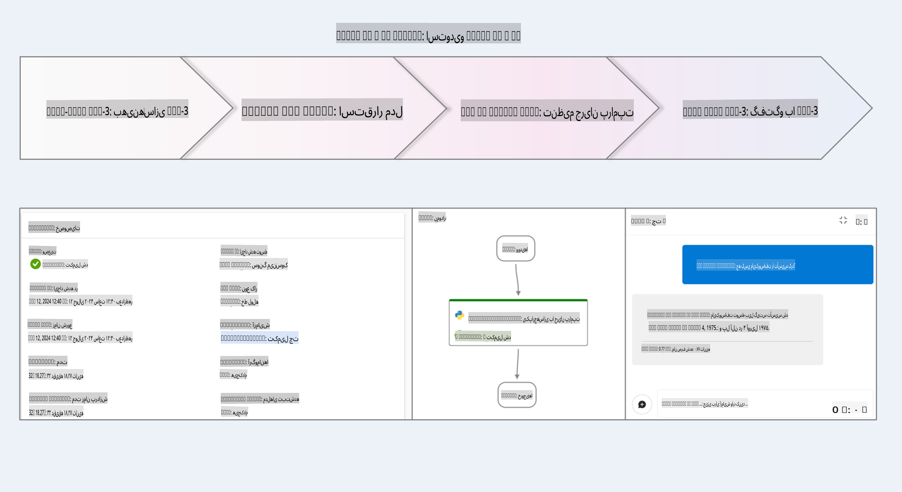

### فهرست مطالب

1. **[سناریو 1: تنظیم منابع Azure و آماده‌سازی برای تنظیم](../../../../../../md/02.Application/01.TextAndChat/Phi3)**  
    - [ایجاد یک Azure Machine Learning Workspace](../../../../../../md/02.Application/01.TextAndChat/Phi3)  
    - [درخواست سهمیه GPU در اشتراک Azure](../../../../../../md/02.Application/01.TextAndChat/Phi3)  
    - [اضافه کردن نقش](../../../../../../md/02.Application/01.TextAndChat/Phi3)  
    - [تنظیم پروژه](../../../../../../md/02.Application/01.TextAndChat/Phi3)  
    - [آماده‌سازی مجموعه داده برای تنظیم](../../../../../../md/02.Application/01.TextAndChat/Phi3)

2. **[سناریو 2: تنظیم مدل Phi-3 و استقرار آن در Azure Machine Learning Studio](../../../../../../md/02.Application/01.TextAndChat/Phi3)**  
    - [تنظیم مدل Phi-3](../../../../../../md/02.Application/01.TextAndChat/Phi3)  
    - [استقرار مدل تنظیم‌شده Phi-3](../../../../../../md/02.Application/01.TextAndChat/Phi3)

3. **[سناریو 3: یکپارچه‌سازی با Prompt Flow و گفتگو با مدل سفارشی خود در Azure AI Foundry](../../../../../../md/02.Application/01.TextAndChat/Phi3)**  
    - [یکپارچه‌سازی مدل سفارشی Phi-3 با Prompt Flow](../../../../../../md/02.Application/01.TextAndChat/Phi3)  
    - [گفتگو با مدل سفارشی Phi-3 خود](../../../../../../md/02.Application/01.TextAndChat/Phi3)

## سناریو 1: تنظیم منابع Azure و آماده‌سازی برای تنظیم

### ایجاد یک Azure Machine Learning Workspace

1. عبارت *azure machine learning* را در **نوار جستجو** بالای صفحه پورتال تایپ کنید و **Azure Machine Learning** را از گزینه‌های ظاهر شده انتخاب کنید.

    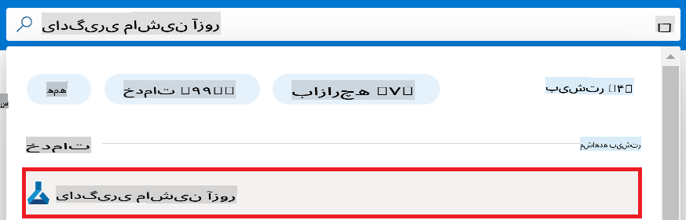

2. از منوی ناوبری، گزینه **+ Create** را انتخاب کنید.

3. از منوی ناوبری، گزینه **New workspace** را انتخاب کنید.

    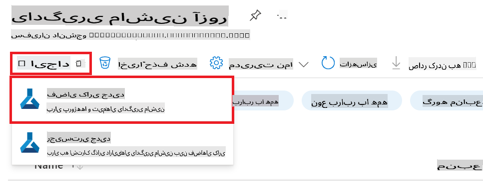

4. کارهای زیر را انجام دهید:

    - اشتراک Azure خود را **Subscription** انتخاب کنید.  
    - **Resource group** مورد نظر را انتخاب کنید (در صورت نیاز یک مورد جدید ایجاد کنید).  
    - **Workspace Name** را وارد کنید. این مقدار باید یکتا باشد.  
    - **Region** مورد نظر را انتخاب کنید.  
    - **Storage account** مورد نظر را انتخاب کنید (در صورت نیاز یک مورد جدید ایجاد کنید).  
    - **Key vault** مورد نظر را انتخاب کنید (در صورت نیاز یک مورد جدید ایجاد کنید).  
    - **Application insights** مورد نظر را انتخاب کنید (در صورت نیاز یک مورد جدید ایجاد کنید).  
    - **Container registry** مورد نظر را انتخاب کنید (در صورت نیاز یک مورد جدید ایجاد کنید).  

    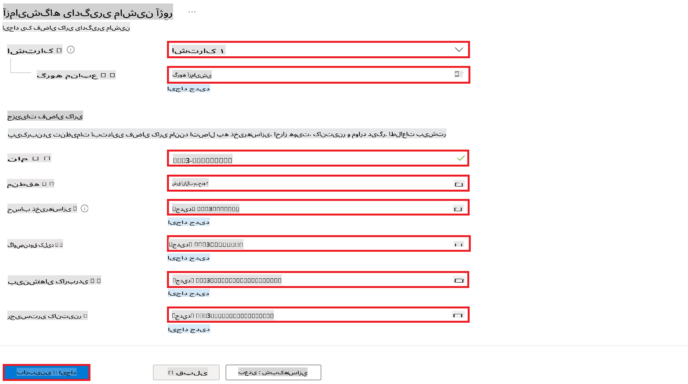

5. گزینه **Review + Create** را انتخاب کنید.

6. گزینه **Create** را انتخاب کنید.

### درخواست سهمیه GPU در اشتراک Azure

در این آموزش، یاد خواهید گرفت که چگونه یک مدل Phi-3 را تنظیم و مستقر کنید، با استفاده از GPUها. برای تنظیم، از GPU *Standard_NC24ads_A100_v4* استفاده خواهید کرد که نیاز به درخواست سهمیه دارد. برای استقرار، از GPU *Standard_NC6s_v3* استفاده خواهید کرد که آن نیز نیاز به درخواست سهمیه دارد.

> [!NOTE]
>
> فقط اشتراک‌های Pay-As-You-Go (نوع استاندارد اشتراک) واجد شرایط تخصیص GPU هستند؛ اشتراک‌های مزایای دیگر در حال حاضر پشتیبانی نمی‌شوند.

1. به [Azure ML Studio](https://ml.azure.com/home?wt.mc_id=studentamb_279723) مراجعه کنید.

1. کارهای زیر را برای درخواست سهمیه *Standard NCADSA100v4 Family* انجام دهید:

    - از تب سمت چپ، **Quota** را انتخاب کنید.  
    - خانواده ماشین مجازی مورد نظر را انتخاب کنید. برای مثال، **Standard NCADSA100v4 Family Cluster Dedicated vCPUs** که شامل GPU *Standard_NC24ads_A100_v4* است.  
    - از منوی ناوبری، گزینه **Request quota** را انتخاب کنید.  

        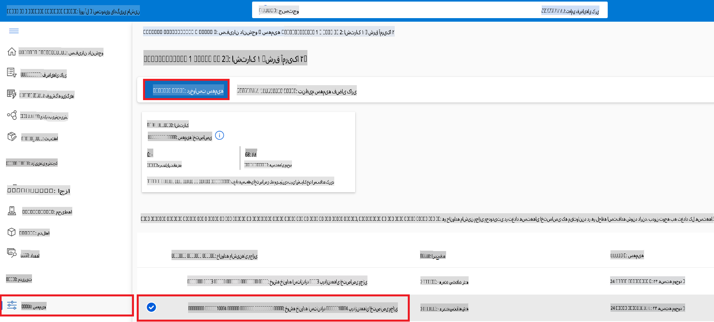

    - در صفحه Request quota، مقدار **New cores limit** مورد نظر را وارد کنید. برای مثال، 24.  
    - در صفحه Request quota، گزینه **Submit** را انتخاب کنید تا سهمیه GPU درخواست شود.

1. کارهای زیر را برای درخواست سهمیه *Standard NCSv3 Family* انجام دهید:

    - از تب سمت چپ، **Quota** را انتخاب کنید.  
    - خانواده ماشین مجازی مورد نظر را انتخاب کنید. برای مثال، **Standard NCSv3 Family Cluster Dedicated vCPUs** که شامل GPU *Standard_NC6s_v3* است.  
    - از منوی ناوبری، گزینه **Request quota** را انتخاب کنید.  
    - در صفحه Request quota، مقدار **New cores limit** مورد نظر را وارد کنید. برای مثال، 24.  
    - در صفحه Request quota، گزینه **Submit** را انتخاب کنید تا سهمیه GPU درخواست شود.

### اضافه کردن نقش

برای تنظیم و استقرار مدل‌های خود، ابتدا باید یک User Assigned Managed Identity (UAI) ایجاد کرده و مجوزهای مناسب را به آن اختصاص دهید. این UAI برای احراز هویت در طول فرآیند استقرار استفاده خواهد شد.

#### ایجاد User Assigned Managed Identity (UAI)

1. عبارت *managed identities* را در **نوار جستجو** بالای صفحه پورتال تایپ کنید و **Managed Identities** را از گزینه‌های ظاهر شده انتخاب کنید.

    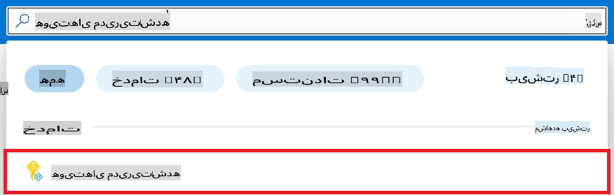

1. گزینه **+ Create** را انتخاب کنید.

    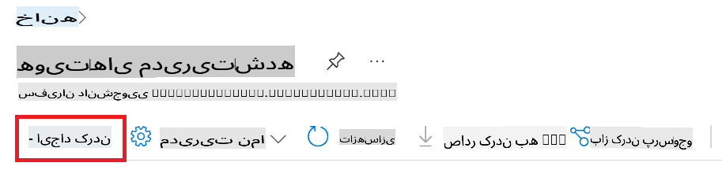

1. کارهای زیر را انجام دهید:

    - اشتراک Azure خود را **Subscription** انتخاب کنید.  
    - **Resource group** مورد نظر را انتخاب کنید (در صورت نیاز یک مورد جدید ایجاد کنید).  
    - **Region** مورد نظر را انتخاب کنید.  
    - **Name** را وارد کنید. این مقدار باید یکتا باشد.  

    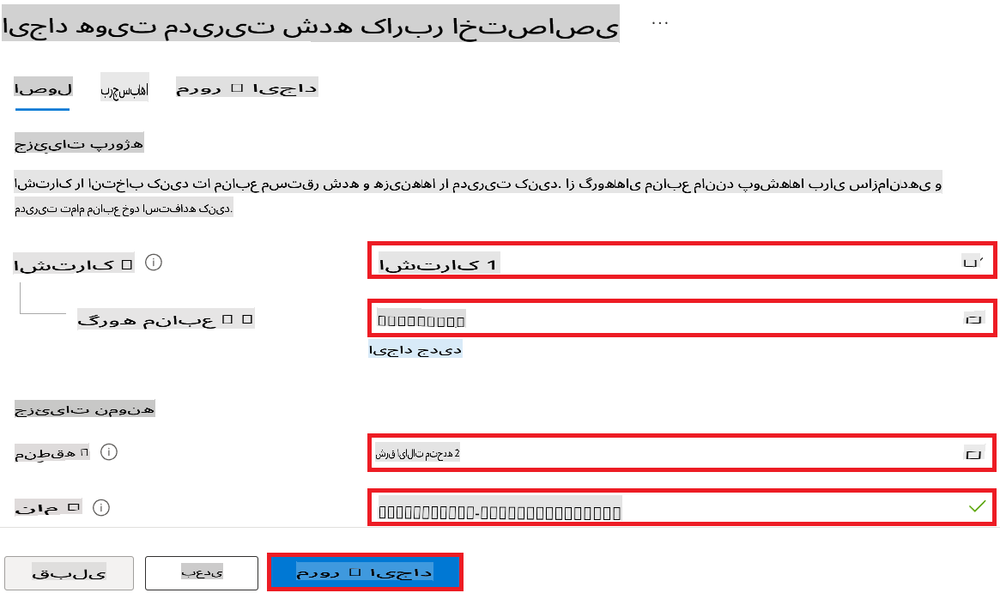

1. گزینه **Review + create** را انتخاب کنید.

1. گزینه **+ Create** را انتخاب کنید.

#### اضافه کردن نقش Contributor به Managed Identity

1. به منبع Managed Identity که ایجاد کرده‌اید بروید.

1. از تب سمت چپ، **Azure role assignments** را انتخاب کنید.

1. از منوی ناوبری، گزینه **+Add role assignment** را انتخاب کنید.

1. در صفحه Add role assignment، کارهای زیر را انجام دهید:
    - **Scope** را به **Resource group** تغییر دهید.  
    - اشتراک Azure خود را **Subscription** انتخاب کنید.  
    - **Resource group** مورد نظر را انتخاب کنید.  
    - **Role** را به **Contributor** تغییر دهید.  

    

2. گزینه **Save** را انتخاب کنید.

#### اضافه کردن نقش Storage Blob Data Reader به Managed Identity

1. عبارت *storage accounts* را در **نوار جستجو** تایپ کنید و **Storage accounts** را از گزینه‌های ظاهر شده انتخاب کنید.

    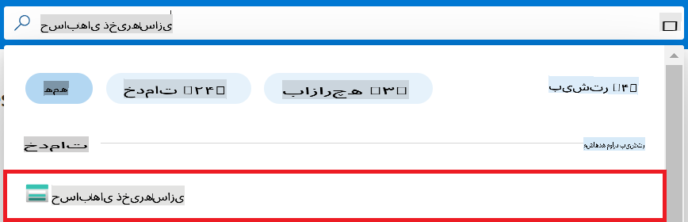

1. حساب ذخیره‌سازی مرتبط با Azure Machine Learning Workspace که ایجاد کرده‌اید را انتخاب کنید. برای مثال، *finetunephistorage*.

1. کارهای زیر را برای دسترسی به صفحه Add role assignment انجام دهید:

    - به حساب ذخیره‌سازی Azure که ایجاد کرده‌اید بروید.  
    - از تب سمت چپ، **Access Control (IAM)** را انتخاب کنید.  
    - از منوی ناوبری، گزینه **+ Add** را انتخاب کنید.  
    - از منوی ناوبری، گزینه **Add role assignment** را انتخاب کنید.  

    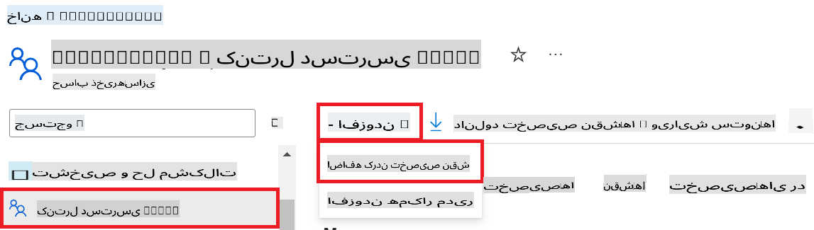

1. در صفحه Add role assignment، کارهای زیر را انجام دهید:

    - در صفحه Role، عبارت *Storage Blob Data Reader* را در **نوار جستجو** تایپ کنید و **Storage Blob Data Reader** را از گزینه‌های ظاهر شده انتخاب کنید.  
    - در صفحه Role، گزینه **Next** را انتخاب کنید.  
    - در صفحه Members، گزینه **Assign access to** را به **Managed identity** تغییر دهید.  
    - در صفحه Members، گزینه **+ Select members** را انتخاب کنید.  
    - در صفحه Select managed identities، اشتراک Azure خود را **Subscription** انتخاب کنید.  
    - در صفحه Select managed identities، **Managed identity** را به **Manage Identity** تغییر دهید.  
    - در صفحه Select managed identities، Managed Identity که ایجاد کرده‌اید را انتخاب کنید. برای مثال، *finetunephi-managedidentity*.  
    - در صفحه Select managed identities، گزینه **Select** را انتخاب کنید.  

    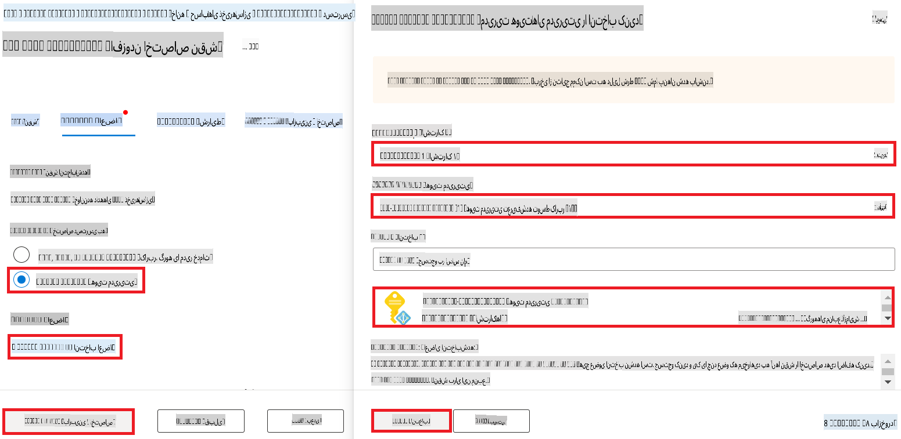

1. گزینه **Review + assign** را انتخاب کنید.

#### اضافه کردن نقش AcrPull به Managed Identity

1. عبارت *container registries* را در **نوار جستجو** تایپ کنید و **Container registries** را از گزینه‌های ظاهر شده انتخاب کنید.

    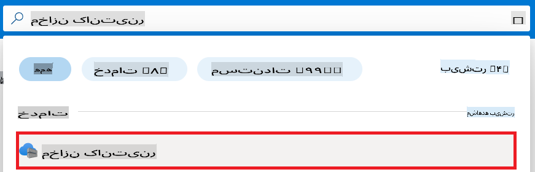

1. رجیستری کانتینر مرتبط با Azure Machine Learning Workspace را انتخاب کنید. برای مثال، *finetunephicontainerregistry*.

1. کارهای زیر را برای دسترسی به صفحه Add role assignment انجام دهید:

    - از تب سمت چپ، **Access Control (IAM)** را انتخاب کنید.  
    - از منوی ناوبری، گزینه **+ Add** را انتخاب کنید.  
    - از منوی ناوبری، گزینه **Add role assignment** را انتخاب کنید.  

1. در صفحه Add role assignment، کارهای زیر را انجام دهید:

    - در صفحه Role، عبارت *AcrPull* را در **نوار جستجو** تایپ کنید و **AcrPull** را از گزینه‌های ظاهر شده انتخاب کنید.  
    - در صفحه Role، گزینه **Next** را انتخاب کنید.  
    - در صفحه Members، گزینه **Assign access to** را به **Managed identity** تغییر دهید.  
    - در صفحه Members، گزینه **+ Select members** را انتخاب کنید.  
    - در صفحه Select managed identities، اشتراک Azure خود را **Subscription** انتخاب کنید.  
    - در صفحه Select managed identities، **Managed identity** را به **Manage Identity** تغییر دهید.  
    - در صفحه Select managed identities، Managed Identity که ایجاد کرده‌اید را انتخاب کنید. برای مثال، *finetunephi-managedidentity*.  
    - در صفحه Select managed identities، گزینه **Select** را انتخاب کنید.  
    - گزینه **Review + assign** را انتخاب کنید.

### تنظیم پروژه

برای دانلود مجموعه داده‌های مورد نیاز برای تنظیم، باید یک محیط محلی تنظیم کنید.

در این تمرین، شما:

- یک پوشه ایجاد می‌کنید تا داخل آن کار کنید.  
- یک محیط مجازی ایجاد می‌کنید.  
- بسته‌های مورد نیاز را نصب می‌کنید.  
- یک فایل *download_dataset.py* برای دانلود مجموعه داده ایجاد می‌کنید.

#### ایجاد یک پوشه برای کار داخل آن

1. یک پنجره ترمینال باز کنید و دستور زیر را برای ایجاد یک پوشه به نام *finetune-phi* در مسیر پیش‌فرض وارد کنید.

    ```console
    mkdir finetune-phi
    ```

2. دستور زیر را در ترمینال وارد کنید تا به پوشه *finetune-phi* که ایجاد کرده‌اید بروید.

    ```console
    cd finetune-phi
    ```

#### ایجاد یک محیط مجازی

1. دستور زیر را در ترمینال وارد کنید تا یک محیط مجازی به نام *.venv* ایجاد کنید.

    ```console
    python -m venv .venv
    ```

2. دستور زیر را در ترمینال وارد کنید تا محیط مجازی را فعال کنید.

    ```console
    .venv\Scripts\activate.bat
    ```

> [!NOTE]
> اگر موفقیت‌آمیز باشد، باید *(.venv)* را قبل از خط فرمان ببینید.

#### نصب بسته‌های مورد نیاز

1. دستورات زیر را در ترمینال وارد کنید تا بسته‌های مورد نیاز نصب شوند.

    ```console
    pip install datasets==2.19.1
    ```

#### ایجاد `download_dataset.py`

> [!NOTE]
> ساختار کامل پوشه:
>
> ```text
> └── YourUserName
> .    └── finetune-phi
> .        └── download_dataset.py
> ```

1. **Visual Studio Code** را باز کنید.

1. از نوار منو، گزینه **File** را انتخاب کنید.

1. گزینه **Open Folder** را انتخاب کنید.

1. پوشه *finetune-phi* که ایجاد کرده‌اید را انتخاب کنید، که در مسیر *C:\Users\yourUserName\finetune-phi* قرار دارد.

    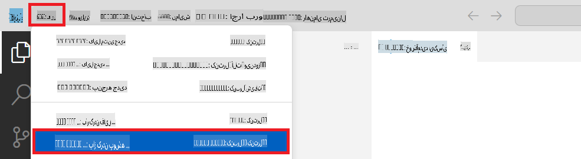

1. در پنل سمت چپ Visual Studio Code، راست‌کلیک کنید و گزینه **New File** را انتخاب کنید تا یک فایل جدید به نام *download_dataset.py* ایجاد کنید.

    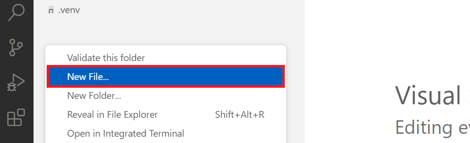

### آماده‌سازی مجموعه داده برای تنظیم

در این تمرین، فایل *download_dataset.py* را اجرا می‌کنید تا مجموعه داده‌های *ultrachat_200k* را به محیط محلی خود دانلود کنید. سپس از این مجموعه داده برای تنظیم مدل Phi-3 در Azure Machine Learning استفاده خواهید کرد.

در این تمرین، شما:

- کد را به فایل *download_dataset.py* اضافه می‌کنید تا مجموعه داده‌ها دانلود شوند.  
- فایل *download_dataset.py* را اجرا می‌کنید تا مجموعه داده‌ها به محیط محلی شما دانلود شوند.

#### دانلود مجموعه داده با استفاده از *download_dataset.py*

1. فایل *download_dataset.py* را در Visual Studio Code باز کنید.

1. کد زیر را به فایل *download_dataset.py* اضافه کنید.

    ```python
    import json
    import os
    from datasets import load_dataset

    def load_and_split_dataset(dataset_name, config_name, split_ratio):
        """
        Load and split a dataset.
        """
        # Load the dataset with the specified name, configuration, and split ratio
        dataset = load_dataset(dataset_name, config_name, split=split_ratio)
        print(f"Original dataset size: {len(dataset)}")
        
        # Split the dataset into train and test sets (80% train, 20% test)
        split_dataset = dataset.train_test_split(test_size=0.2)
        print(f"Train dataset size: {len(split_dataset['train'])}")
        print(f"Test dataset size: {len(split_dataset['test'])}")
        
        return split_dataset

    def save_dataset_to_jsonl(dataset, filepath):
        """
        Save a dataset to a JSONL file.
        """
        # Create the directory if it does not exist
        os.makedirs(os.path.dirname(filepath), exist_ok=True)
        
        # Open the file in write mode
        with open(filepath, 'w', encoding='utf-8') as f:
            # Iterate over each record in the dataset
            for record in dataset:
                # Dump the record as a JSON object and write it to the file
                json.dump(record, f)
                # Write a newline character to separate records
                f.write('\n')
        
        print(f"Dataset saved to {filepath}")

    def main():
        """
        Main function to load, split, and save the dataset.
        """
        # Load and split the ULTRACHAT_200k dataset with a specific configuration and split ratio
        dataset = load_and_split_dataset("HuggingFaceH4/ultrachat_200k", 'default', 'train_sft[:1%]')
        
        # Extract the train and test datasets from the split
        train_dataset = dataset['train']
        test_dataset = dataset['test']

        # Save the train dataset to a JSONL file
        save_dataset_to_jsonl(train_dataset, "data/train_data.jsonl")
        
        # Save the test dataset to a separate JSONL file
        save_dataset_to_jsonl(test_dataset, "data/test_data.jsonl")

    if __name__ == "__main__":
        main()

    ```

1. دستور زیر را در ترمینال وارد کنید تا اسکریپت اجرا شود و مجموعه داده به محیط محلی شما دانلود شود.

    ```console
    python download_dataset.py
    ```

1. اطمینان حاصل کنید که مجموعه داده‌ها به درستی در دایرکتوری محلی *finetune-phi/data* ذخیره شده‌اند.

> [!NOTE]
>
> #### یادداشت در مورد اندازه مجموعه داده و زمان تنظیم
>
> در این آموزش، فقط از 1٪ مجموعه داده (`split='train[:1%]'`) استفاده می‌کنید. این کار مقدار داده‌ها را به طور قابل توجهی کاهش می‌دهد و فرآیند آپلود و تنظیم را تسریع می‌کند. می‌توانید درصد را تنظیم کنید تا تعادلی بین زمان آموزش و عملکرد مدل پیدا کنید. استفاده از یک زیرمجموعه کوچکتر از مجموعه داده، زمان لازم برای تنظیم را کاهش می‌دهد و فرآیند را برای یک آموزش ساده‌تر مدیریت‌پذیر می‌کند.

## سناریو 2: تنظیم مدل Phi-3 و استقرار آن در Azure Machine Learning Studio

### تنظیم مدل Phi-3

در این تمرین، مدل Phi-3 را در Azure Machine Learning Studio تنظیم خواهید کرد.

در این تمرین، شما:

- یک خوشه کامپیوتری برای تنظیم ایجاد می‌کنید.  
- مدل Phi-3 را در Azure Machine Learning Studio تنظیم می‌کنید.

#### ایجاد خوشه کامپیوتری برای تنظیم
1. به [Azure ML Studio](https://ml.azure.com/home?wt.mc_id=studentamb_279723) بروید.

1. از نوار کناری سمت چپ، **Compute** را انتخاب کنید.

1. از منوی ناوبری، **Compute clusters** را انتخاب کنید.

1. گزینه **+ New** را انتخاب کنید.

    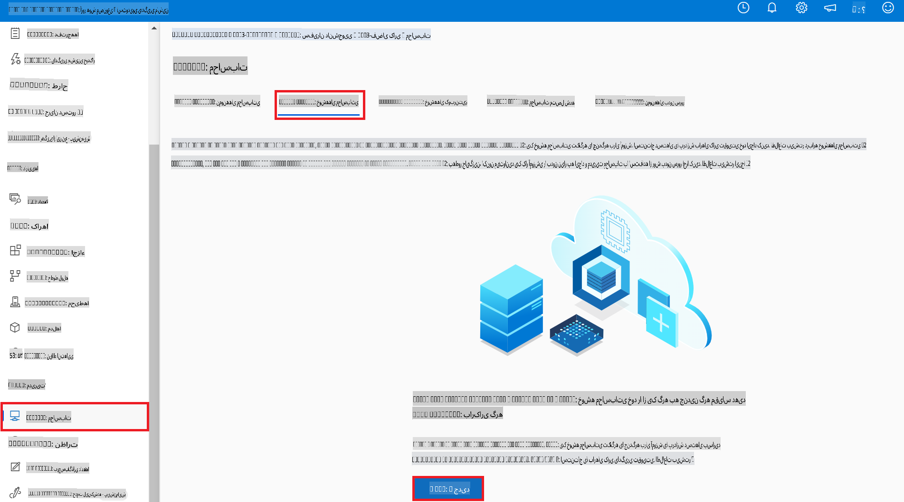

1. کارهای زیر را انجام دهید:

    - **Region** مورد نظر خود را انتخاب کنید.
    - **Virtual machine tier** را به **Dedicated** تنظیم کنید.
    - **Virtual machine type** را به **GPU** تنظیم کنید.
    - فیلتر **Virtual machine size** را روی **Select from all options** قرار دهید.
    - **Virtual machine size** را به **Standard_NC24ads_A100_v4** انتخاب کنید.

    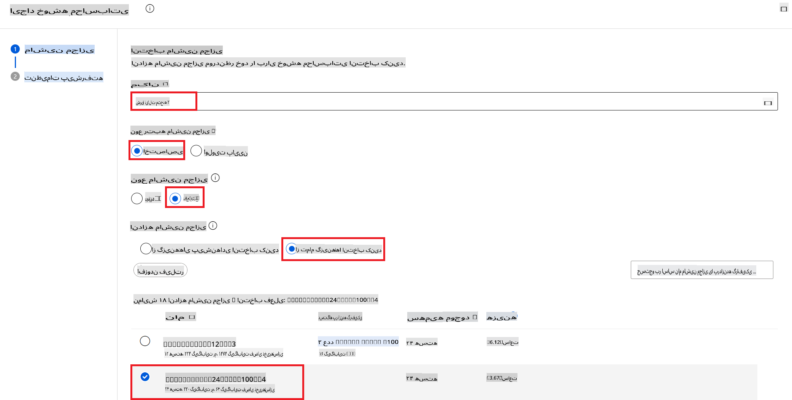

1. گزینه **Next** را انتخاب کنید.

1. کارهای زیر را انجام دهید:

    - نامی یکتا برای **Compute name** وارد کنید.
    - **Minimum number of nodes** را روی **0** تنظیم کنید.
    - **Maximum number of nodes** را روی **1** تنظیم کنید.
    - **Idle seconds before scale down** را روی **120** تنظیم کنید.

    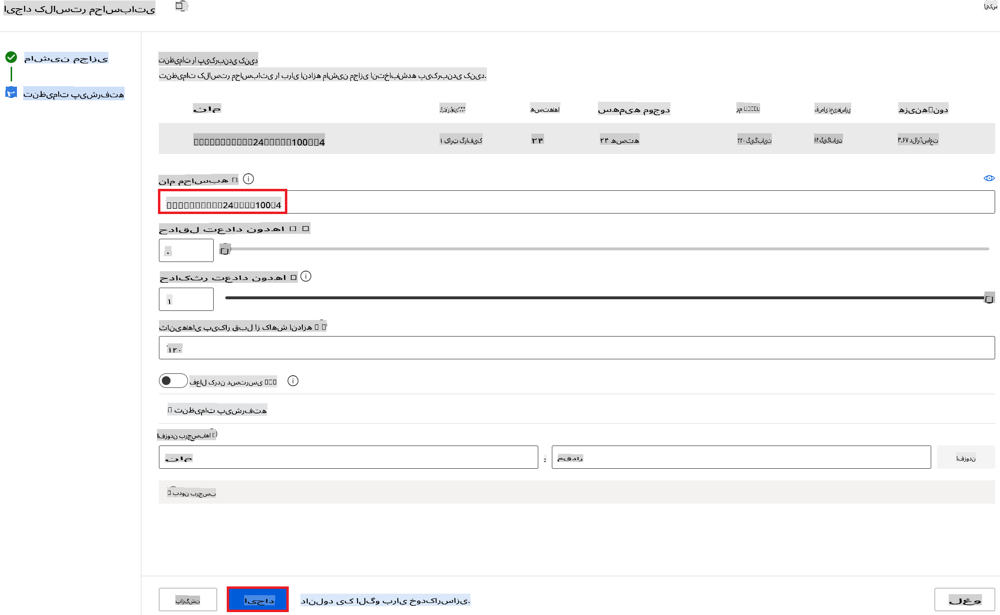

1. گزینه **Create** را انتخاب کنید.

#### تنظیم مدل Phi-3

1. به [Azure ML Studio](https://ml.azure.com/home?wt.mc_id=studentamb_279723) بروید.

1. فضای کاری Azure Machine Learning که ایجاد کرده‌اید را انتخاب کنید.

    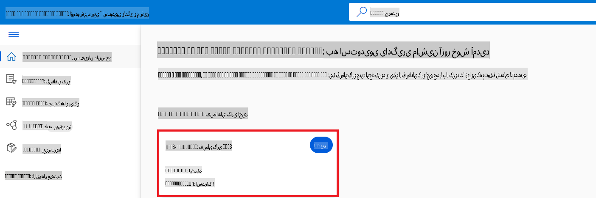

1. کارهای زیر را انجام دهید:

    - از نوار کناری سمت چپ، **Model catalog** را انتخاب کنید.
    - عبارت *phi-3-mini-4k* را در **نوار جستجو** تایپ کنید و گزینه **Phi-3-mini-4k-instruct** را از میان گزینه‌های نمایش داده شده انتخاب کنید.

    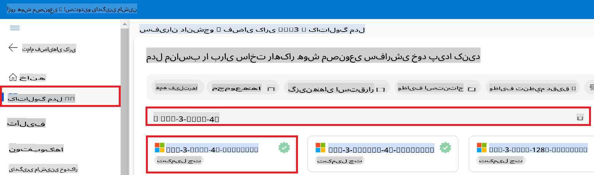

1. از منوی ناوبری، **Fine-tune** را انتخاب کنید.

    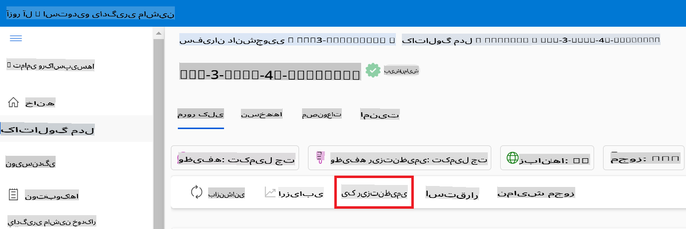

1. کارهای زیر را انجام دهید:

    - **Select task type** را به **Chat completion** تنظیم کنید.
    - گزینه **+ Select data** را برای آپلود **Training data** انتخاب کنید.
    - نوع آپلود داده‌های اعتبارسنجی را به **Provide different validation data** تنظیم کنید.
    - گزینه **+ Select data** را برای آپلود **Validation data** انتخاب کنید.

    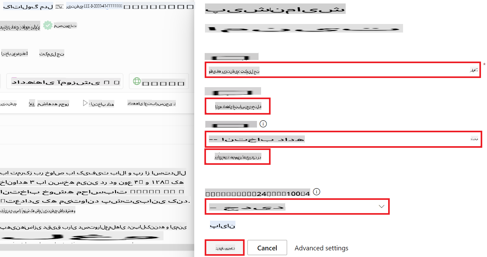

    > [!TIP]
    >
    > می‌توانید از **Advanced settings** برای شخصی‌سازی تنظیماتی مانند **learning_rate** و **lr_scheduler_type** استفاده کنید تا فرآیند تنظیم دقیق را بهینه کنید.

1. گزینه **Finish** را انتخاب کنید.

1. در این تمرین، شما مدل Phi-3 را با موفقیت تنظیم دقیق کردید. لطفاً توجه داشته باشید که فرآیند تنظیم دقیق ممکن است زمان زیادی ببرد. پس از اجرای کار تنظیم دقیق، باید منتظر بمانید تا تکمیل شود. می‌توانید وضعیت کار تنظیم دقیق را با رفتن به برگه Jobs در سمت چپ فضای کاری Azure Machine Learning خود نظارت کنید. در سری بعدی، مدل تنظیم‌شده را مستقر کرده و آن را با Prompt flow ادغام خواهید کرد.

    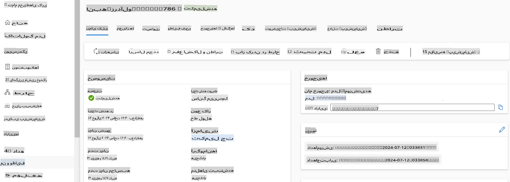

### استقرار مدل Phi-3 تنظیم‌شده

برای ادغام مدل Phi-3 تنظیم‌شده با Prompt flow، باید مدل را مستقر کنید تا برای پیش‌بینی در زمان واقعی قابل دسترسی باشد. این فرآیند شامل ثبت مدل، ایجاد یک نقطه پایانی آنلاین و استقرار مدل است.

در این تمرین، شما:

- مدل تنظیم‌شده را در فضای کاری Azure Machine Learning ثبت خواهید کرد.
- یک نقطه پایانی آنلاین ایجاد خواهید کرد.
- مدل Phi-3 تنظیم‌شده ثبت‌شده را مستقر خواهید کرد.

#### ثبت مدل تنظیم‌شده

1. به [Azure ML Studio](https://ml.azure.com/home?wt.mc_id=studentamb_279723) بروید.

1. فضای کاری Azure Machine Learning که ایجاد کرده‌اید را انتخاب کنید.

    

1. از نوار کناری سمت چپ، **Models** را انتخاب کنید.
1. گزینه **+ Register** را انتخاب کنید.
1. گزینه **From a job output** را انتخاب کنید.

    

1. کاری که ایجاد کرده‌اید را انتخاب کنید.

    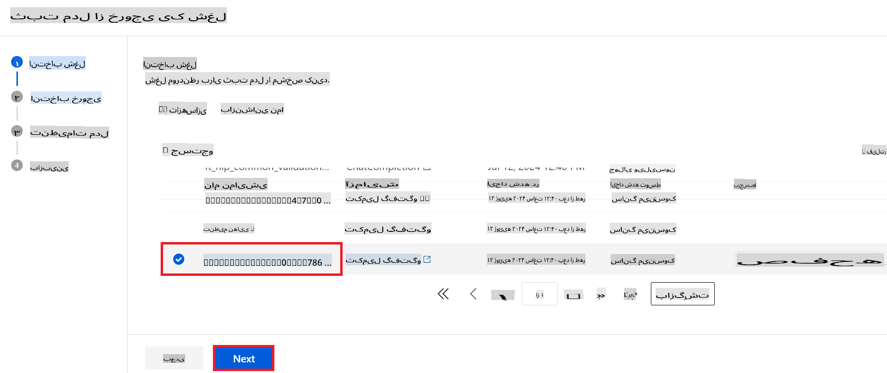

1. گزینه **Next** را انتخاب کنید.

1. **Model type** را به **MLflow** تنظیم کنید.

1. اطمینان حاصل کنید که **Job output** انتخاب شده باشد؛ این گزینه باید به صورت خودکار انتخاب شده باشد.

    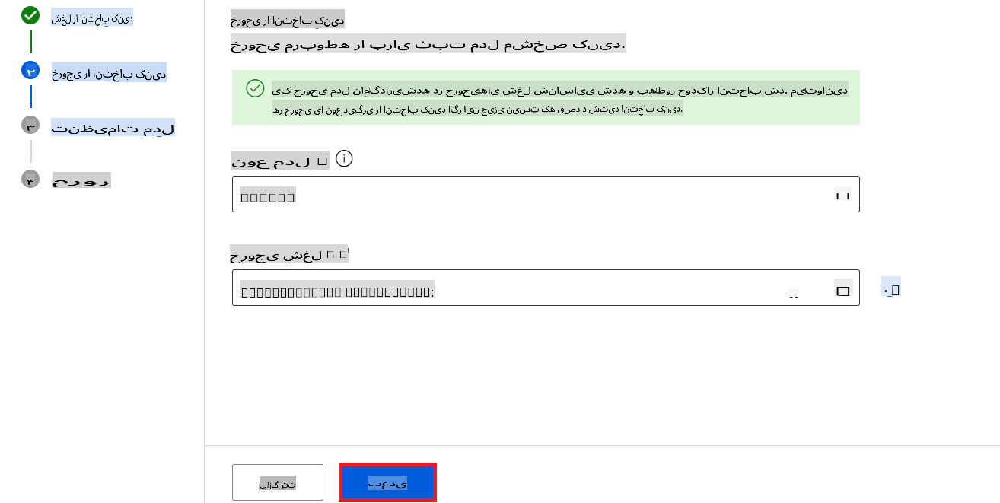

2. گزینه **Next** را انتخاب کنید.

3. گزینه **Register** را انتخاب کنید.

    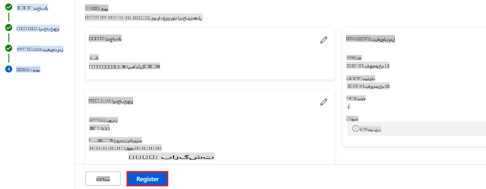

4. می‌توانید مدل ثبت‌شده خود را با رفتن به منوی **Models** از نوار کناری مشاهده کنید.

    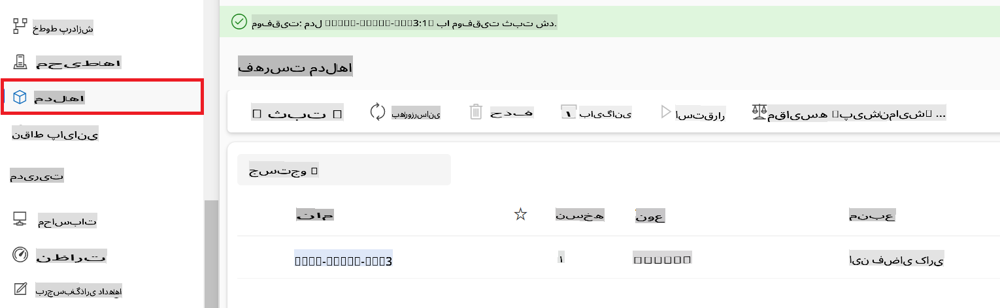

#### استقرار مدل تنظیم‌شده

1. به فضای کاری Azure Machine Learning که ایجاد کرده‌اید بروید.

1. از نوار کناری سمت چپ، **Endpoints** را انتخاب کنید.

1. از منوی ناوبری، **Real-time endpoints** را انتخاب کنید.

    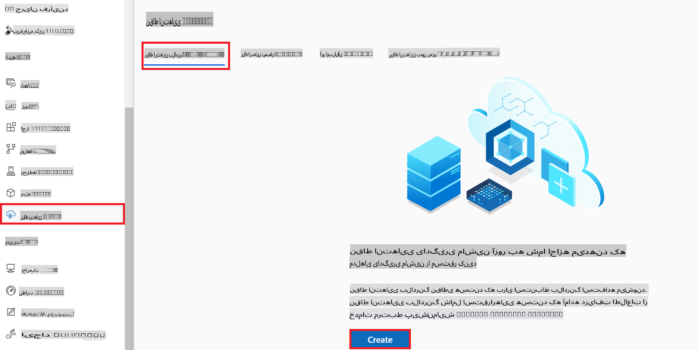

1. گزینه **Create** را انتخاب کنید.

1. مدل ثبت‌شده‌ای که ایجاد کرده‌اید را انتخاب کنید.

    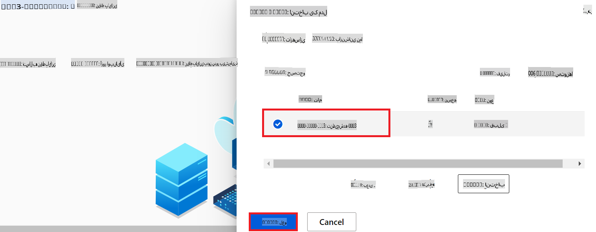

1. گزینه **Select** را انتخاب کنید.

1. کارهای زیر را انجام دهید:

    - **Virtual machine** را به *Standard_NC6s_v3* تنظیم کنید.
    - **Instance count** مورد نظر خود را انتخاب کنید. به عنوان مثال، *1*.
    - **Endpoint** را به **New** تنظیم کنید تا یک نقطه پایانی جدید ایجاد کنید.
    - نامی یکتا برای **Endpoint name** وارد کنید.
    - نامی یکتا برای **Deployment name** وارد کنید.

    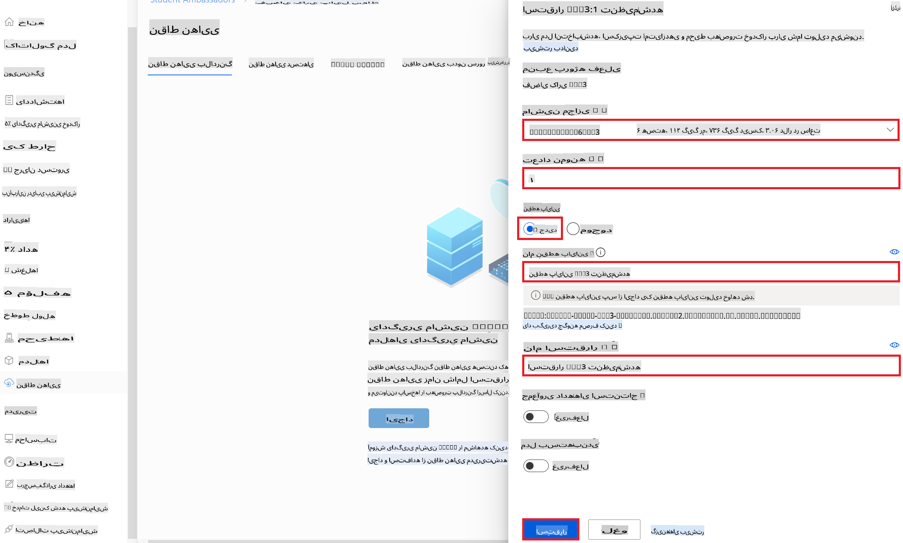

1. گزینه **Deploy** را انتخاب کنید.

> [!WARNING]
> برای جلوگیری از هزینه‌های اضافی، حتماً نقطه پایانی ایجاد شده را در فضای کاری Azure Machine Learning حذف کنید.
>

#### بررسی وضعیت استقرار در فضای کاری Azure Machine Learning

1. به فضای کاری Azure Machine Learning که ایجاد کرده‌اید بروید.

1. از نوار کناری سمت چپ، **Endpoints** را انتخاب کنید.

1. نقطه پایانی که ایجاد کرده‌اید را انتخاب کنید.

    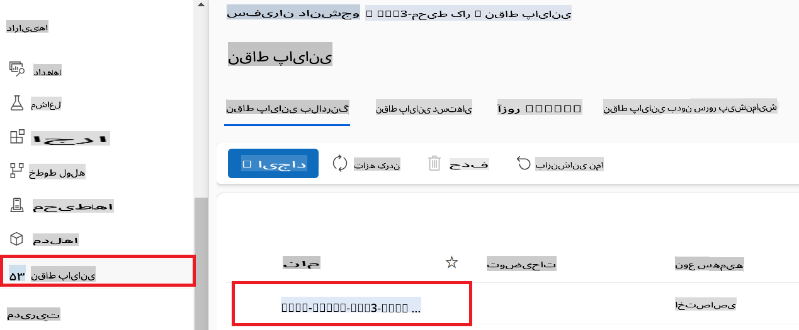

1. در این صفحه می‌توانید نقاط پایانی را در طول فرآیند استقرار مدیریت کنید.

> [!NOTE]
> پس از تکمیل استقرار، اطمینان حاصل کنید که **Live traffic** روی **100%** تنظیم شده باشد. اگر اینطور نیست، گزینه **Update traffic** را انتخاب کنید تا تنظیمات ترافیک را به‌روزرسانی کنید. توجه داشته باشید که اگر ترافیک روی 0% تنظیم شده باشد، نمی‌توانید مدل را تست کنید.
>
> 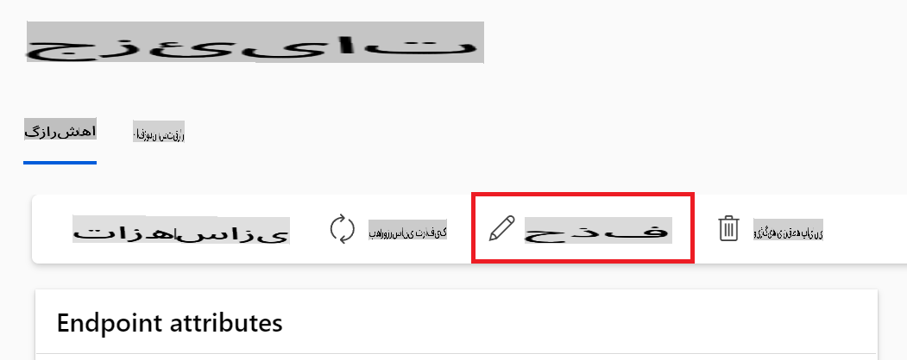
>

## سناریو ۳: ادغام با Prompt flow و چت با مدل سفارشی خود در Azure AI Foundry

### ادغام مدل سفارشی Phi-3 با Prompt flow

پس از موفقیت در استقرار مدل تنظیم‌شده خود، اکنون می‌توانید آن را با Prompt Flow ادغام کنید تا مدل خود را در برنامه‌های زمان واقعی استفاده کنید و وظایف تعاملی متنوعی را با مدل سفارشی Phi-3 خود انجام دهید.

در این تمرین، شما:

- یک Hub در Azure AI Foundry ایجاد می‌کنید.
- یک پروژه در Azure AI Foundry ایجاد می‌کنید.
- Prompt flow ایجاد می‌کنید.
- یک اتصال سفارشی برای مدل تنظیم‌شده Phi-3 اضافه می‌کنید.
- Prompt flow را برای چت با مدل سفارشی Phi-3 تنظیم می‌کنید.

> [!NOTE]
> شما همچنین می‌توانید از طریق Azure ML Studio با Promptflow ادغام کنید. فرآیند ادغام مشابه در Azure ML Studio نیز قابل اعمال است.

#### ایجاد Hub در Azure AI Foundry

قبل از ایجاد پروژه، باید یک Hub ایجاد کنید. Hub مانند یک گروه منابع عمل می‌کند و به شما امکان می‌دهد چندین پروژه را در Azure AI Foundry سازماندهی و مدیریت کنید.

1. به [Azure AI Foundry](https://ai.azure.com/?WT.mc_id=aiml-137032-kinfeylo) بروید.

1. از نوار کناری سمت چپ، **All hubs** را انتخاب کنید.

1. از منوی ناوبری، **+ New hub** را انتخاب کنید.

    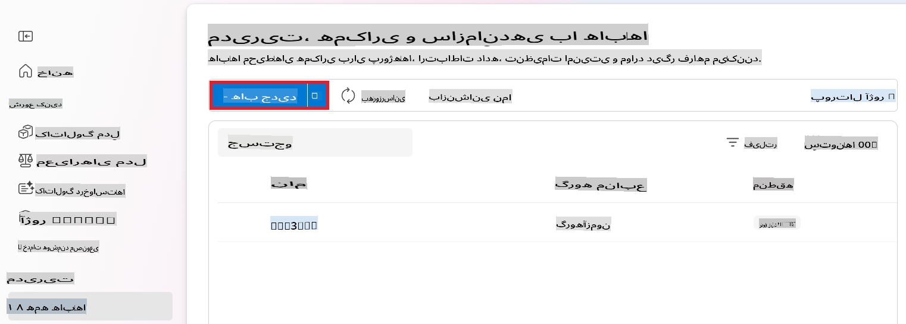

1. کارهای زیر را انجام دهید:

    - نامی یکتا برای **Hub name** وارد کنید.
    - **Subscription** Azure خود را انتخاب کنید.
    - **Resource group** مورد نظر خود را انتخاب کنید (در صورت نیاز یک مورد جدید ایجاد کنید).
    - **Location** مورد نظر خود را انتخاب کنید.
    - **Connect Azure AI Services** مورد نظر خود را انتخاب کنید (در صورت نیاز یک مورد جدید ایجاد کنید).
    - **Connect Azure AI Search** را به **Skip connecting** تنظیم کنید.

    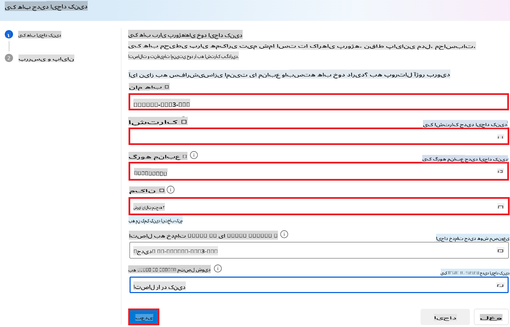

1. گزینه **Next** را انتخاب کنید.

#### ایجاد پروژه در Azure AI Foundry

1. در Hub که ایجاد کرده‌اید، از نوار کناری سمت چپ **All projects** را انتخاب کنید.

1. از منوی ناوبری، **+ New project** را انتخاب کنید.

    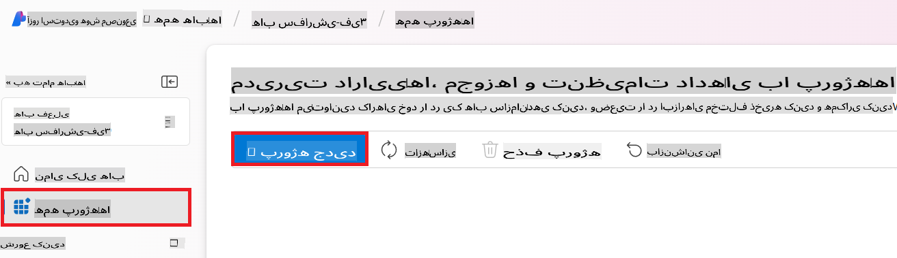

1. نامی یکتا برای **Project name** وارد کنید.

    

1. گزینه **Create a project** را انتخاب کنید.

#### اضافه کردن اتصال سفارشی برای مدل تنظیم‌شده Phi-3

برای ادغام مدل سفارشی Phi-3 خود با Prompt flow، باید نقطه پایانی و کلید مدل را در یک اتصال سفارشی ذخیره کنید. این تنظیم دسترسی به مدل سفارشی Phi-3 شما را در Prompt flow تضمین می‌کند.

#### تنظیم کلید API و آدرس URI نقطه پایانی مدل تنظیم‌شده Phi-3

1. به [Azure ML Studio](https://ml.azure.com/home?WT.mc_id=aiml-137032-kinfeylo) بروید.

1. به فضای کاری Azure Machine Learning که ایجاد کرده‌اید بروید.

1. از نوار کناری سمت چپ، **Endpoints** را انتخاب کنید.

    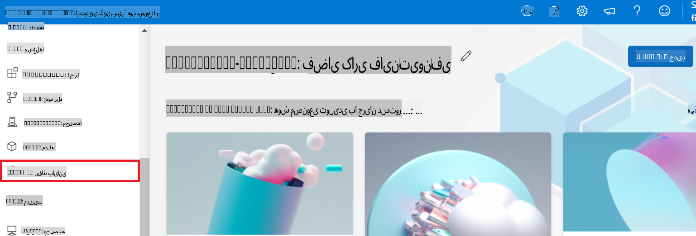

1. نقطه پایانی که ایجاد کرده‌اید را انتخاب کنید.

    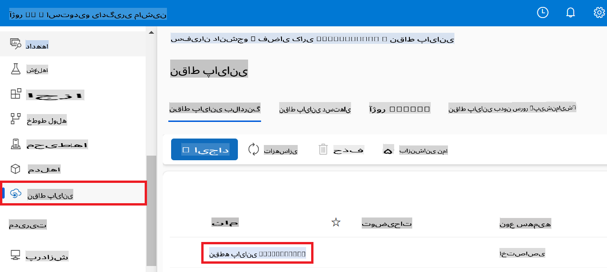

1. از منوی ناوبری، **Consume** را انتخاب کنید.

1. **REST endpoint** و **Primary key** خود را کپی کنید.
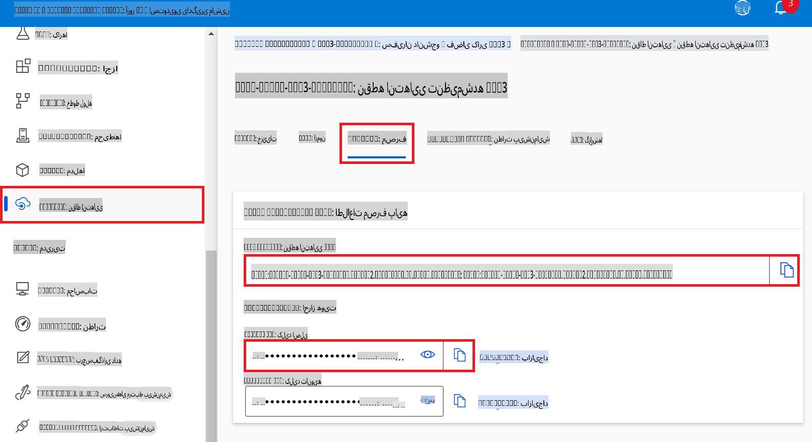

#### اضافه کردن اتصال سفارشی

1. به [Azure AI Foundry](https://ai.azure.com/?WT.mc_id=aiml-137032-kinfeylo) مراجعه کنید.

1. به پروژه Azure AI Foundry که ایجاد کرده‌اید بروید.

1. در پروژه‌ای که ایجاد کرده‌اید، از نوار سمت چپ **Settings** را انتخاب کنید.

1. گزینه **+ New connection** را انتخاب کنید.

   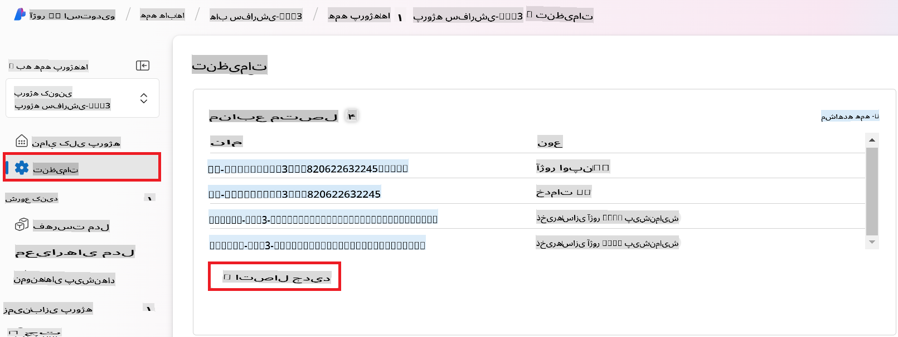

1. از منوی ناوبری گزینه **Custom keys** را انتخاب کنید.

   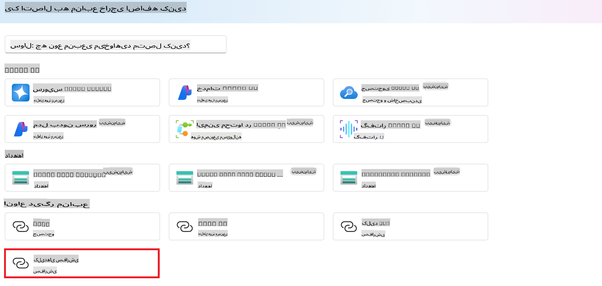

1. مراحل زیر را انجام دهید:

   - گزینه **+ Add key value pairs** را انتخاب کنید.
   - برای نام کلید، **endpoint** وارد کنید و آدرس Endpoint که از Azure ML Studio کپی کرده‌اید را در قسمت مقدار قرار دهید.
   - دوباره گزینه **+ Add key value pairs** را انتخاب کنید.
   - برای نام کلید، **key** وارد کنید و کلیدی که از Azure ML Studio کپی کرده‌اید را در قسمت مقدار قرار دهید.
   - پس از اضافه کردن کلیدها، گزینه **is secret** را انتخاب کنید تا از نمایش کلید جلوگیری شود.

   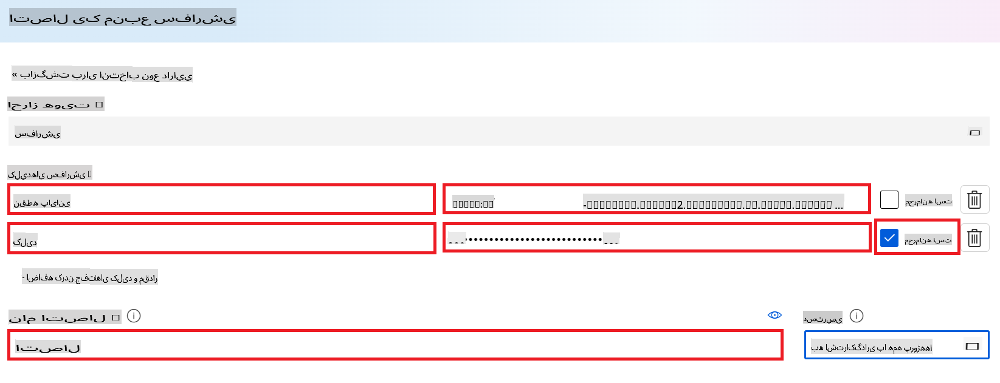

1. گزینه **Add connection** را انتخاب کنید.

#### ایجاد Prompt flow

شما یک اتصال سفارشی در Azure AI Foundry اضافه کرده‌اید. حالا، بیایید با مراحل زیر یک Prompt flow ایجاد کنیم. سپس، این Prompt flow را به اتصال سفارشی متصل می‌کنید تا بتوانید مدل تنظیم‌شده را در Prompt flow استفاده کنید.

1. به پروژه Azure AI Foundry که ایجاد کرده‌اید بروید.

1. از نوار سمت چپ **Prompt flow** را انتخاب کنید.

1. از منوی ناوبری گزینه **+ Create** را انتخاب کنید.

   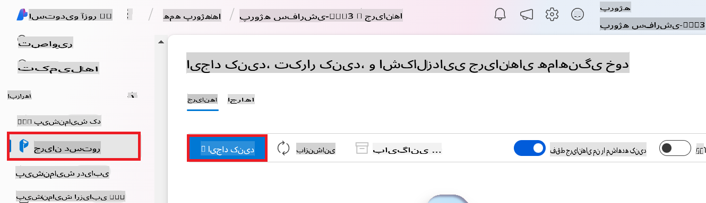

1. از منوی ناوبری گزینه **Chat flow** را انتخاب کنید.

   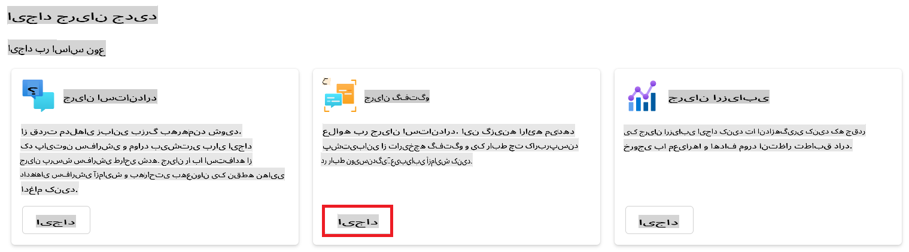

1. **Folder name** مورد نظر را وارد کنید.

   

2. گزینه **Create** را انتخاب کنید.

#### تنظیم Prompt flow برای چت با مدل سفارشی Phi-3

شما باید مدل تنظیم‌شده Phi-3 را به یک Prompt flow ادغام کنید. با این حال، Prompt flow موجود برای این هدف طراحی نشده است. بنابراین، باید Prompt flow را بازطراحی کنید تا ادغام مدل سفارشی امکان‌پذیر شود.

1. در Prompt flow، مراحل زیر را برای بازسازی جریان موجود انجام دهید:

   - گزینه **Raw file mode** را انتخاب کنید.
   - تمام کدهای موجود در فایل *flow.dag.yml* را حذف کنید.
   - کد زیر را به فایل *flow.dag.yml* اضافه کنید.

     ```yml
        inputs:
          input_data:
            type: string
            default: "Who founded Microsoft?"

        outputs:
          answer:
            type: string
            reference: ${integrate_with_promptflow.output}

        nodes:
        - name: integrate_with_promptflow
          type: python
          source:
            type: code
            path: integrate_with_promptflow.py
          inputs:
            input_data: ${inputs.input_data}
        ```

   - گزینه **Save** را انتخاب کنید.

   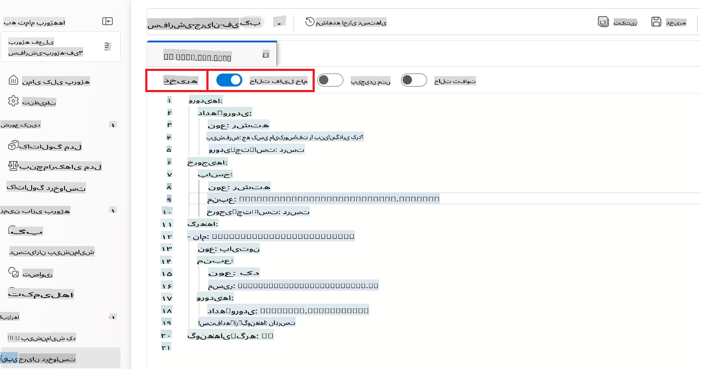

1. کد زیر را به فایل *integrate_with_promptflow.py* اضافه کنید تا از مدل سفارشی Phi-3 در Prompt flow استفاده شود.

   ```python
    import logging
    import requests
    from promptflow import tool
    from promptflow.connections import CustomConnection

    # Logging setup
    logging.basicConfig(
        format="%(asctime)s - %(levelname)s - %(name)s - %(message)s",
        datefmt="%Y-%m-%d %H:%M:%S",
        level=logging.DEBUG
    )
    logger = logging.getLogger(__name__)

    def query_phi3_model(input_data: str, connection: CustomConnection) -> str:
        """
        Send a request to the Phi-3 model endpoint with the given input data using Custom Connection.
        """

        # "connection" is the name of the Custom Connection, "endpoint", "key" are the keys in the Custom Connection
        endpoint_url = connection.endpoint
        api_key = connection.key

        headers = {
            "Content-Type": "application/json",
            "Authorization": f"Bearer {api_key}"
        }
        data = {
            "input_data": {
                "input_string": [
                    {"role": "user", "content": input_data}
                ],
                "parameters": {
                    "temperature": 0.7,
                    "max_new_tokens": 128
                }
            }
        }
        try:
            response = requests.post(endpoint_url, json=data, headers=headers)
            response.raise_for_status()
            
            # Log the full JSON response
            logger.debug(f"Full JSON response: {response.json()}")

            result = response.json()["output"]
            logger.info("Successfully received response from Azure ML Endpoint.")
            return result
        except requests.exceptions.RequestException as e:
            logger.error(f"Error querying Azure ML Endpoint: {e}")
            raise

    @tool
    def my_python_tool(input_data: str, connection: CustomConnection) -> str:
        """
        Tool function to process input data and query the Phi-3 model.
        """
        return query_phi3_model(input_data, connection)

    ```

   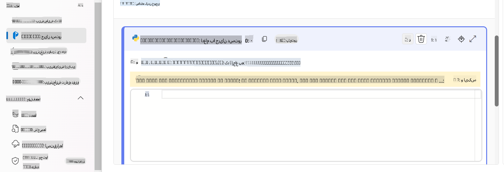

> [!NOTE]
> برای اطلاعات بیشتر درباره استفاده از Prompt flow در Azure AI Foundry می‌توانید به [Prompt flow in Azure AI Foundry](https://learn.microsoft.com/azure/ai-studio/how-to/prompt-flow) مراجعه کنید.

1. گزینه‌های **Chat input** و **Chat output** را برای فعال‌سازی چت با مدل خود انتخاب کنید.

   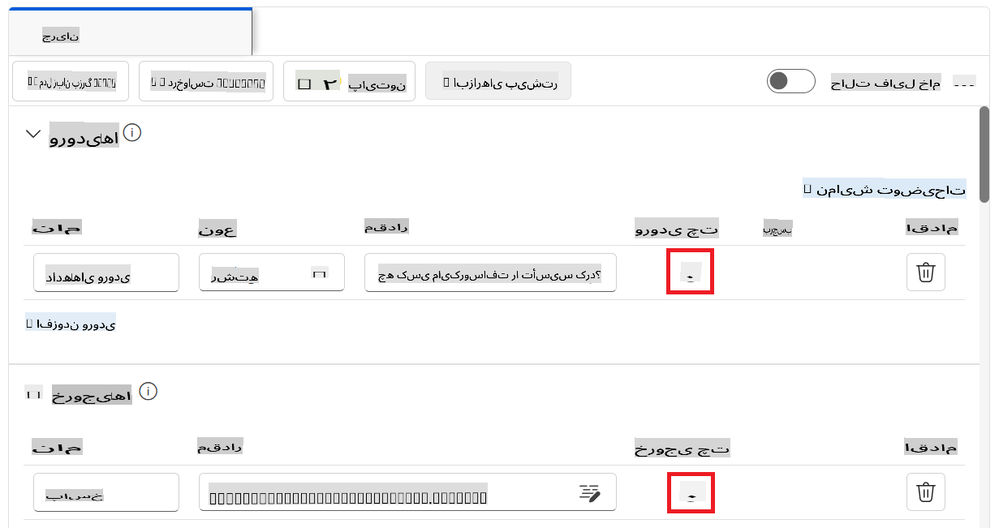

1. اکنون آماده هستید تا با مدل سفارشی Phi-3 خود چت کنید. در تمرین بعدی، یاد می‌گیرید که چگونه Prompt flow را شروع کرده و از آن برای چت با مدل تنظیم‌شده Phi-3 استفاده کنید.

> [!NOTE]
>
> جریان بازسازی‌شده باید شبیه تصویر زیر باشد:
>
> 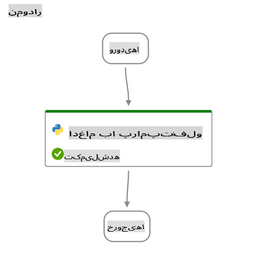
>

### چت با مدل سفارشی Phi-3

اکنون که مدل سفارشی Phi-3 خود را تنظیم و در Prompt flow ادغام کرده‌اید، آماده شروع تعامل با آن هستید. این تمرین شما را در فرآیند تنظیم و شروع چت با مدل خود با استفاده از Prompt flow راهنمایی می‌کند. با دنبال کردن این مراحل، می‌توانید به طور کامل از قابلیت‌های مدل تنظیم‌شده Phi-3 خود برای وظایف و مکالمات مختلف بهره‌مند شوید.

- با استفاده از Prompt flow با مدل سفارشی Phi-3 خود چت کنید.

#### شروع Prompt flow

1. گزینه **Start compute sessions** را برای شروع Prompt flow انتخاب کنید.

   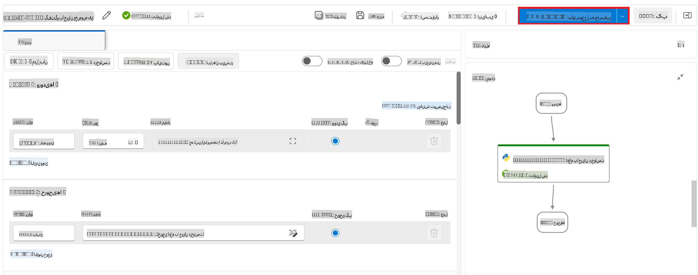

1. گزینه **Validate and parse input** را برای تجدید پارامترها انتخاب کنید.

   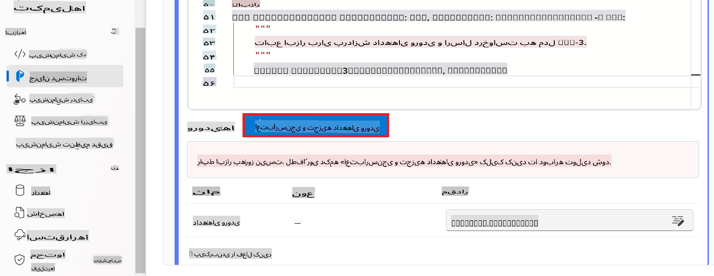

1. مقدار **connection** را به اتصال سفارشی که ایجاد کرده‌اید تنظیم کنید. برای مثال، *connection*.

   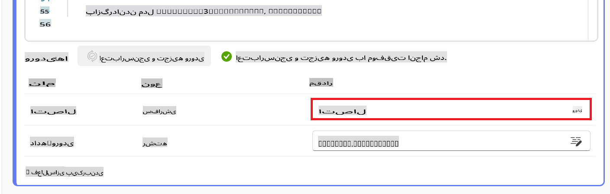

#### چت با مدل سفارشی خود

1. گزینه **Chat** را انتخاب کنید.

   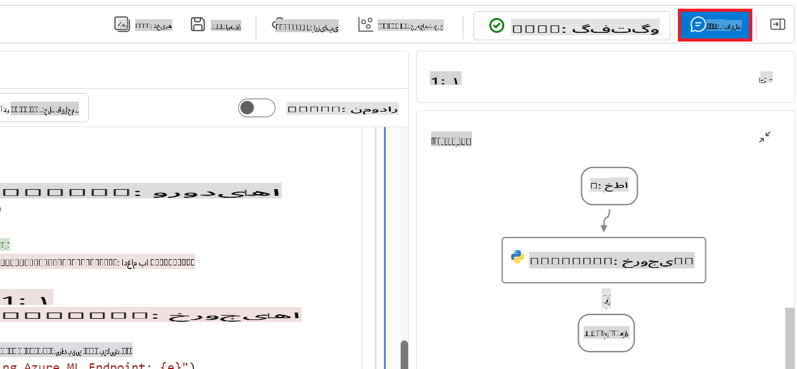

1. اینجا یک نمونه از نتایج آورده شده است: حالا می‌توانید با مدل سفارشی Phi-3 خود چت کنید. توصیه می‌شود سوالاتی را بپرسید که بر اساس داده‌های استفاده‌شده برای تنظیم مدل باشند.

   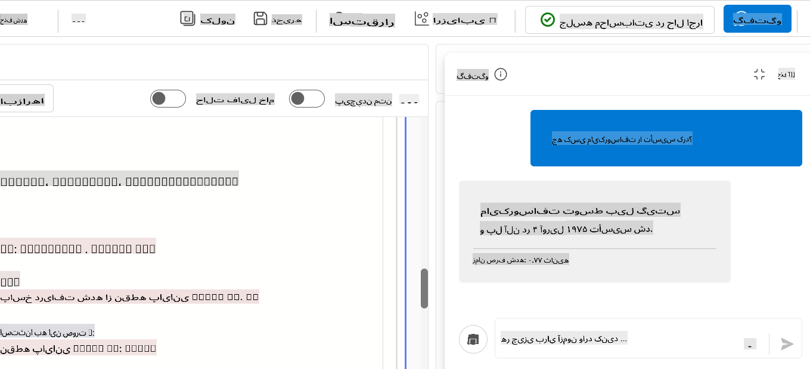

**سلب مسئولیت**:  
این سند با استفاده از خدمات ترجمه ماشینی مبتنی بر هوش مصنوعی ترجمه شده است. در حالی که ما برای دقت تلاش می‌کنیم، لطفاً توجه داشته باشید که ترجمه‌های خودکار ممکن است حاوی خطاها یا نادقتی‌هایی باشند. سند اصلی به زبان اصلی آن باید به عنوان منبع معتبر در نظر گرفته شود. برای اطلاعات حساس، ترجمه حرفه‌ای انسانی توصیه می‌شود. ما هیچ مسئولیتی در قبال سوءتفاهم‌ها یا برداشت‌های نادرست ناشی از استفاده از این ترجمه نداریم.