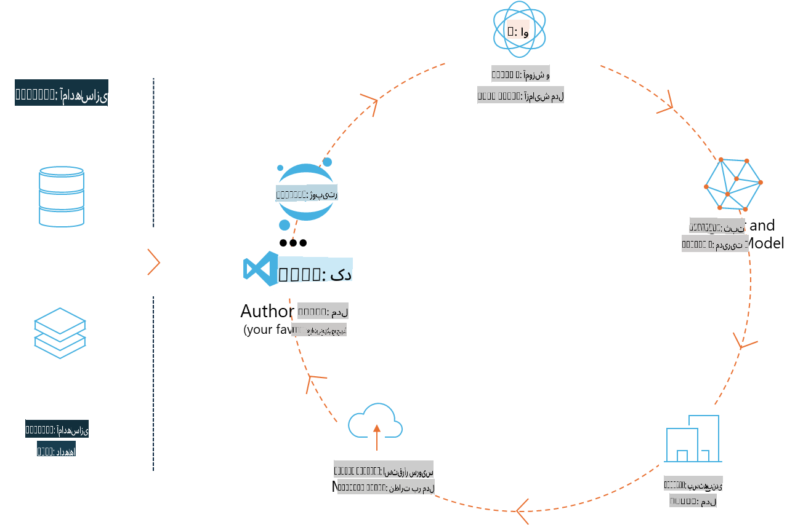
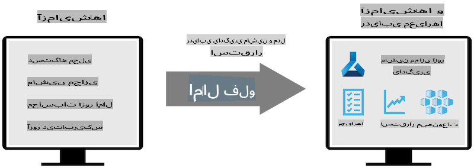
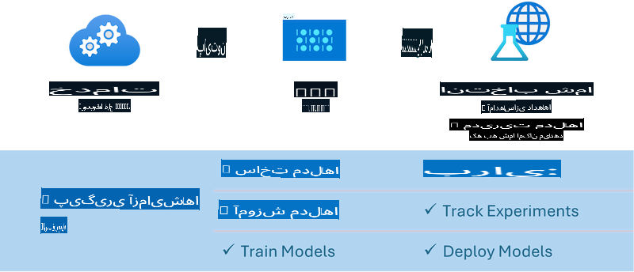

# ام‌ال‌فلو (MLflow)

[MLflow](https://mlflow.org/) یک پلتفرم متن‌باز است که برای مدیریت چرخه‌ی کامل یادگیری ماشین طراحی شده است.



ام‌ال‌فلو برای مدیریت چرخه‌ی یادگیری ماشین استفاده می‌شود، از جمله آزمایش‌ها، بازتولید، استقرار و یک رجیستری مرکزی مدل. ام‌ال‌فلو در حال حاضر چهار مؤلفه اصلی ارائه می‌دهد:

- **ردیابی ام‌ال‌فلو (MLflow Tracking):** ثبت و جستجوی آزمایش‌ها، کد، پیکربندی داده‌ها و نتایج.
- **پروژه‌های ام‌ال‌فلو (MLflow Projects):** بسته‌بندی کد علم داده در قالبی که بتوان اجراها را روی هر پلتفرمی بازتولید کرد.
- **مدل‌های ام‌ال‌فلو (MLflow Models):** استقرار مدل‌های یادگیری ماشین در محیط‌های مختلف سرویس‌دهی.
- **رجیستری مدل (Model Registry):** ذخیره، حاشیه‌نویسی و مدیریت مدل‌ها در یک مخزن مرکزی.

این پلتفرم قابلیت‌هایی برای ردیابی آزمایش‌ها، بسته‌بندی کد به اجراهای قابل بازتولید، و به اشتراک‌گذاری و استقرار مدل‌ها ارائه می‌دهد. ام‌ال‌فلو در Databricks یکپارچه شده و از کتابخانه‌های مختلف یادگیری ماشین پشتیبانی می‌کند، که آن را مستقل از کتابخانه‌ها می‌سازد. این پلتفرم با هر کتابخانه یادگیری ماشین و در هر زبان برنامه‌نویسی قابل استفاده است، زیرا یک API REST و CLI برای راحتی ارائه می‌دهد.



ویژگی‌های کلیدی ام‌ال‌فلو عبارتند از:

- **ردیابی آزمایش‌ها:** ثبت و مقایسه پارامترها و نتایج.
- **مدیریت مدل:** استقرار مدل‌ها در پلتفرم‌های مختلف سرویس‌دهی و استنتاج.
- **رجیستری مدل:** مدیریت مشترک چرخه عمر مدل‌های ام‌ال‌فلو، از جمله نسخه‌بندی و حاشیه‌نویسی.
- **پروژه‌ها:** بسته‌بندی کد یادگیری ماشین برای اشتراک‌گذاری یا استفاده در تولید.

ام‌ال‌فلو همچنین از چرخه‌ی MLOps پشتیبانی می‌کند، که شامل آماده‌سازی داده‌ها، ثبت و مدیریت مدل‌ها، بسته‌بندی مدل‌ها برای اجرا، استقرار سرویس‌ها و نظارت بر مدل‌ها می‌شود. هدف این پلتفرم ساده‌سازی فرآیند انتقال از نمونه اولیه به جریان کاری تولید، به ویژه در محیط‌های ابری و لبه است.

## سناریوی انتها به انتها (E2E) - ساخت یک Wrapper و استفاده از Phi-3 به عنوان مدل ام‌ال‌فلو

در این نمونه‌ی انتها به انتها، دو روش مختلف برای ساخت یک Wrapper برای مدل زبان کوچک Phi-3 (SLM) و سپس اجرای آن به عنوان یک مدل ام‌ال‌فلو به صورت محلی یا در فضای ابری، مثلاً در Azure Machine Learning workspace، نشان داده می‌شود.



| پروژه | توضیحات | مکان |
| ------------ | ----------- | -------- |
| خط لوله‌ی Transformer | خط لوله‌ی Transformer ساده‌ترین گزینه برای ساخت یک Wrapper است، اگر بخواهید از مدل HuggingFace با طعم آزمایشی Transformers ام‌ال‌فلو استفاده کنید. | [**TransformerPipeline.ipynb**](../../../../../../code/06.E2E/E2E_Phi-3-MLflow_TransformerPipeline.ipynb) |
| Wrapper پایتون سفارشی | در زمان نگارش، خط لوله‌ی Transformer از تولید Wrapper ام‌ال‌فلو برای مدل‌های HuggingFace در قالب ONNX پشتیبانی نمی‌کرد، حتی با بسته‌ی آزمایشی optimum پایتون. برای چنین مواردی، می‌توانید یک Wrapper پایتون سفارشی برای حالت ام‌ال‌فلو بسازید. | [**CustomPythonWrapper.ipynb**](../../../../../../code/06.E2E/E2E_Phi-3-MLflow_CustomPythonWrapper.ipynb) |

## پروژه: خط لوله‌ی Transformer

1. شما به بسته‌های پایتون مرتبط از ام‌ال‌فلو و HuggingFace نیاز خواهید داشت:

    ``` Python
    import mlflow
    import transformers
    ```

2. سپس باید یک خط لوله‌ی Transformer را با ارجاع به مدل هدف Phi-3 در رجیستری HuggingFace آغاز کنید. همان‌طور که از کارت مدل _Phi-3-mini-4k-instruct_ مشخص است، وظیفه‌ی آن از نوع "تولید متن" است:

    ``` Python
    pipeline = transformers.pipeline(
        task = "text-generation",
        model = "microsoft/Phi-3-mini-4k-instruct"
    )
    ```

3. اکنون می‌توانید خط لوله‌ی Transformer مدل Phi-3 خود را در قالب ام‌ال‌فلو ذخیره کرده و جزئیات اضافی مانند مسیر مصنوعات هدف، تنظیمات خاص پیکربندی مدل و نوع API استنتاج را ارائه دهید:

    ``` Python
    model_info = mlflow.transformers.log_model(
        transformers_model = pipeline,
        artifact_path = "phi3-mlflow-model",
        model_config = model_config,
        task = "llm/v1/chat"
    )
    ```

## پروژه: Wrapper پایتون سفارشی

1. در اینجا می‌توانیم از [API تولید ONNX Runtime مایکروسافت](https://github.com/microsoft/onnxruntime-genai) برای استنتاج مدل ONNX و کدگذاری / رمزگشایی توکن‌ها استفاده کنیم. شما باید بسته‌ی _onnxruntime_genai_ را برای محاسبات هدف خود انتخاب کنید، با مثال زیر که CPU را هدف قرار می‌دهد:

    ``` Python
    import mlflow
    from mlflow.models import infer_signature
    import onnxruntime_genai as og
    ```

1. کلاس سفارشی ما دو متد را پیاده‌سازی می‌کند: _load_context()_ برای مقداردهی اولیه‌ی **مدل ONNX** Phi-3 Mini 4K Instruct، **پارامترهای تولید‌کننده** و **توکنایزر**؛ و _predict()_ برای تولید توکن‌های خروجی برای ورودی داده شده:

    ``` Python
    class Phi3Model(mlflow.pyfunc.PythonModel):
        def load_context(self, context):
            # Retrieving model from the artifacts
            model_path = context.artifacts["phi3-mini-onnx"]
            model_options = {
                 "max_length": 300,
                 "temperature": 0.2,         
            }
        
            # Defining the model
            self.phi3_model = og.Model(model_path)
            self.params = og.GeneratorParams(self.phi3_model)
            self.params.set_search_options(**model_options)
            
            # Defining the tokenizer
            self.tokenizer = og.Tokenizer(self.phi3_model)
    
        def predict(self, context, model_input):
            # Retrieving prompt from the input
            prompt = model_input["prompt"][0]
            self.params.input_ids = self.tokenizer.encode(prompt)
    
            # Generating the model's response
            response = self.phi3_model.generate(self.params)
    
            return self.tokenizer.decode(response[0][len(self.params.input_ids):])
    ```

1. اکنون می‌توانید از تابع _mlflow.pyfunc.log_model()_ برای تولید یک Wrapper پایتون سفارشی (در قالب pickle) برای مدل Phi-3، همراه با مدل ONNX اصلی و وابستگی‌های مورد نیاز استفاده کنید:

    ``` Python
    model_info = mlflow.pyfunc.log_model(
        artifact_path = artifact_path,
        python_model = Phi3Model(),
        artifacts = {
            "phi3-mini-onnx": "cpu_and_mobile/cpu-int4-rtn-block-32-acc-level-4",
        },
        input_example = input_example,
        signature = infer_signature(input_example, ["Run"]),
        extra_pip_requirements = ["torch", "onnxruntime_genai", "numpy"],
    )
    ```

## امضاهای مدل‌های تولید‌شده ام‌ال‌فلو

1. در مرحله‌ی 3 پروژه‌ی خط لوله‌ی Transformer در بالا، ما وظیفه‌ی مدل ام‌ال‌فلو را به "_llm/v1/chat_" تنظیم کردیم. چنین دستوری یک Wrapper API مدل تولید می‌کند که با API چت OpenAI سازگار است، همان‌طور که در زیر نشان داده شده است:

    ``` Python
    {inputs: 
      ['messages': Array({content: string (required), name: string (optional), role: string (required)}) (required), 'temperature': double (optional), 'max_tokens': long (optional), 'stop': Array(string) (optional), 'n': long (optional), 'stream': boolean (optional)],
    outputs: 
      ['id': string (required), 'object': string (required), 'created': long (required), 'model': string (required), 'choices': Array({finish_reason: string (required), index: long (required), message: {content: string (required), name: string (optional), role: string (required)} (required)}) (required), 'usage': {completion_tokens: long (required), prompt_tokens: long (required), total_tokens: long (required)} (required)],
    params: 
      None}
    ```

1. در نتیجه، می‌توانید ورودی خود را در قالب زیر ارسال کنید:

    ``` Python
    messages = [{"role": "user", "content": "What is the capital of Spain?"}]
    ```

1. سپس، از پردازش پس از سازگار با API OpenAI، مانند _response[0][‘choices’][0][‘message’][‘content’]_، استفاده کنید تا خروجی خود را به شکلی زیبا‌تر نمایش دهید، مانند این:

    ``` JSON
    Question: What is the capital of Spain?
    
    Answer: The capital of Spain is Madrid. It is the largest city in Spain and serves as the political, economic, and cultural center of the country. Madrid is located in the center of the Iberian Peninsula and is known for its rich history, art, and architecture, including the Royal Palace, the Prado Museum, and the Plaza Mayor.
    
    Usage: {'prompt_tokens': 11, 'completion_tokens': 73, 'total_tokens': 84}
    ```

1. در مرحله‌ی 3 پروژه‌ی Wrapper پایتون سفارشی در بالا، ما به بسته‌ی ام‌ال‌فلو اجازه دادیم تا امضای مدل را از یک نمونه ورودی داده شده تولید کند. امضای Wrapper ام‌ال‌فلو ما به این شکل خواهد بود:

    ``` Python
    {inputs: 
      ['prompt': string (required)],
    outputs: 
      [string (required)],
    params: 
      None}
    ```

1. بنابراین، ورودی ما باید شامل کلید "prompt" در قالب دیکشنری باشد، مشابه این:

    ``` Python
    {"prompt": "<|system|>You are a stand-up comedian.<|end|><|user|>Tell me a joke about atom<|end|><|assistant|>",}
    ```

1. خروجی مدل سپس در قالب رشته ارائه خواهد شد:

    ``` JSON
    Alright, here's a little atom-related joke for you!
    
    Why don't electrons ever play hide and seek with protons?
    
    Because good luck finding them when they're always "sharing" their electrons!
    
    Remember, this is all in good fun, and we're just having a little atomic-level humor!
    ```

**سلب مسئولیت**:  
این سند با استفاده از خدمات ترجمه ماشینی مبتنی بر هوش مصنوعی ترجمه شده است. در حالی که ما برای دقت تلاش می‌کنیم، لطفاً توجه داشته باشید که ترجمه‌های خودکار ممکن است حاوی خطاها یا نادرستی‌هایی باشند. سند اصلی به زبان اصلی آن باید به عنوان منبع معتبر در نظر گرفته شود. برای اطلاعات حساس، ترجمه حرفه‌ای انسانی توصیه می‌شود. ما مسئولیتی در قبال سوءتفاهم‌ها یا تفسیرهای نادرست ناشی از استفاده از این ترجمه نداریم.