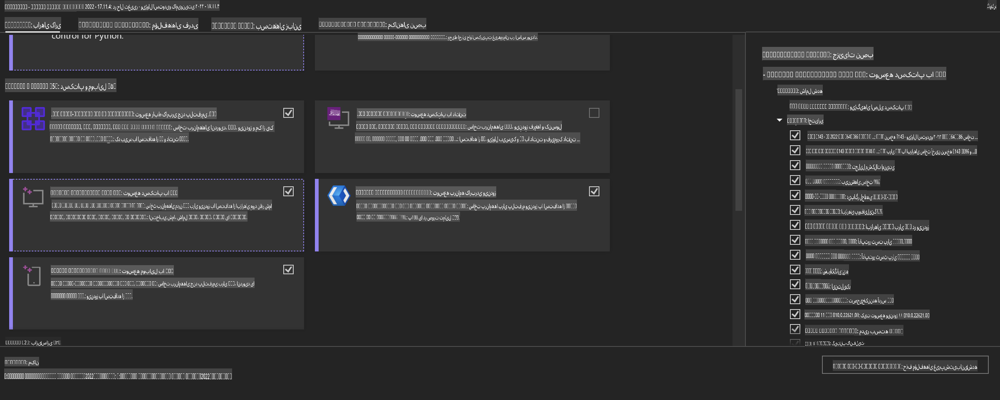
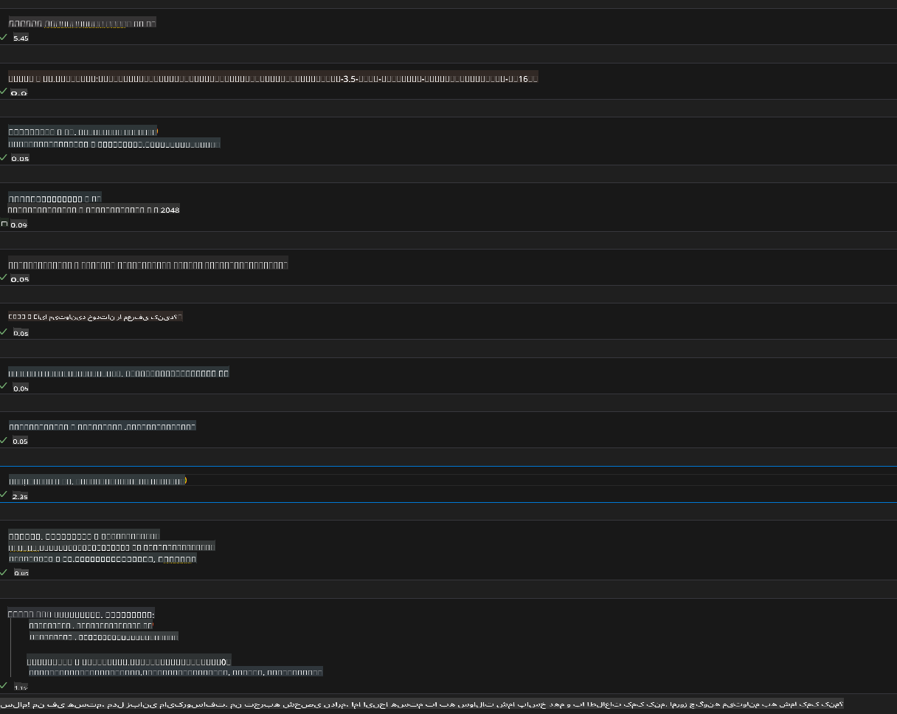
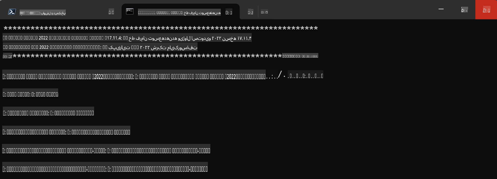

# **راهنمای استفاده از OnnxRuntime GenAI با GPU در ویندوز**

این راهنما مراحل راه‌اندازی و استفاده از ONNX Runtime (ORT) با GPU در ویندوز را ارائه می‌دهد. هدف این است که بتوانید از شتاب‌دهی GPU برای مدل‌های خود بهره ببرید و عملکرد و کارایی را بهبود بخشید.

این سند شامل موارد زیر است:

- **راه‌اندازی محیط**: دستورالعمل‌هایی برای نصب وابستگی‌های لازم مانند CUDA، cuDNN و ONNX Runtime.
- **پیکربندی**: نحوه پیکربندی محیط و ONNX Runtime برای استفاده بهینه از منابع GPU.
- **نکات بهینه‌سازی**: توصیه‌هایی برای تنظیم دقیق تنظیمات GPU برای بهترین عملکرد.

### **1. Python 3.10.x /3.11.8**

   ***توجه*** پیشنهاد می‌شود از [miniforge](https://github.com/conda-forge/miniforge/releases/latest/download/Miniforge3-Windows-x86_64.exe) به‌عنوان محیط Python خود استفاده کنید.

   ```bash

   conda create -n pydev python==3.11.8

   conda activate pydev

   ```

   ***یادآوری*** اگر قبلاً هر کتابخانه‌ای مرتبط با ONNX برای Python نصب کرده‌اید، لطفاً آن را حذف کنید.

### **2. نصب CMake با winget**

   ```bash

   winget install -e --id Kitware.CMake

   ```

### **3. نصب Visual Studio 2022 - توسعه دسکتاپ با C++**

   ***توجه*** اگر قصد کامپایل ندارید، می‌توانید این مرحله را رد کنید.



### **4. نصب درایور NVIDIA**

1. **درایور GPU NVIDIA** [https://www.nvidia.com/en-us/drivers/](https://www.nvidia.com/en-us/drivers/)

2. **NVIDIA CUDA 12.4** [https://developer.nvidia.com/cuda-12-4-0-download-archive](https://developer.nvidia.com/cuda-12-4-0-download-archive)

3. **NVIDIA CUDNN 9.4** [https://developer.nvidia.com/cudnn-downloads](https://developer.nvidia.com/cudnn-downloads)

***یادآوری*** لطفاً از تنظیمات پیش‌فرض در جریان نصب استفاده کنید.

### **5. تنظیم محیط NVIDIA**

فایل‌های lib، bin و include مربوط به NVIDIA CUDNN 9.4 را به مسیرهای lib، bin و include مربوط به NVIDIA CUDA 12.4 کپی کنید.

- فایل‌های *'C:\Program Files\NVIDIA\CUDNN\v9.4\bin\12.6'* را به مسیر *'C:\Program Files\NVIDIA GPU Computing Toolkit\CUDA\v12.4\bin'* کپی کنید.

- فایل‌های *'C:\Program Files\NVIDIA\CUDNN\v9.4\include\12.6'* را به مسیر *'C:\Program Files\NVIDIA GPU Computing Toolkit\CUDA\v12.4\include'* کپی کنید.

- فایل‌های *'C:\Program Files\NVIDIA\CUDNN\v9.4\lib\12.6'* را به مسیر *'C:\Program Files\NVIDIA GPU Computing Toolkit\CUDA\v12.4\lib\x64'* کپی کنید.

### **6. دانلود Phi-3.5-mini-instruct-onnx**

   ```bash

   winget install -e --id Git.Git

   winget install -e --id GitHub.GitLFS

   git lfs install

   git clone https://huggingface.co/microsoft/Phi-3.5-mini-instruct-onnx

   ```

### **7. اجرای InferencePhi35Instruct.ipynb**

   [دفترچه یادداشت](../../../../../../code/09.UpdateSamples/Aug/ortgpu-phi35-instruct.ipynb) را باز کرده و اجرا کنید.



### **8. کامپایل ORT GenAI GPU**

   ***توجه***

   1. ابتدا تمام کتابخانه‌های مرتبط با onnx، onnxruntime و onnxruntime-genai را حذف کنید.

   ```bash

   pip list 
   
   ```

   سپس تمام کتابخانه‌های onnxruntime را حذف کنید، به‌عنوان مثال:

   ```bash

   pip uninstall onnxruntime

   pip uninstall onnxruntime-genai

   pip uninstall onnxruntume-genai-cuda
   
   ```

   2. بررسی پشتیبانی از افزونه Visual Studio

   مسیر *C:\Program Files\NVIDIA GPU Computing Toolkit\CUDA\v12.4\extras* را بررسی کنید تا مطمئن شوید که پوشه *visual_studio_integration* در مسیر *C:\Program Files\NVIDIA GPU Computing Toolkit\CUDA\v12.4\extras\visual_studio_integration* موجود است.

   اگر این پوشه یافت نشد، سایر پوشه‌های درایور CUDA Toolkit را بررسی کنید و پوشه و محتوای *visual_studio_integration* را به مسیر *C:\Program Files\NVIDIA GPU Computing Toolkit\CUDA\v12.4\extras\visual_studio_integration* کپی کنید.

   - اگر قصد کامپایل ندارید، می‌توانید این مرحله را رد کنید.

   ```bash

   git clone https://github.com/microsoft/onnxruntime-genai

   ```

   - دانلود [https://github.com/microsoft/onnxruntime/releases/download/v1.19.2/onnxruntime-win-x64-gpu-1.19.2.zip](https://github.com/microsoft/onnxruntime/releases/download/v1.19.2/onnxruntime-win-x64-gpu-1.19.2.zip)

   - فایل onnxruntime-win-x64-gpu-1.19.2.zip را از حالت فشرده خارج کرده، آن را به **ort** تغییر نام دهید و پوشه ort را به onnxruntime-genai کپی کنید.

   - از طریق Windows Terminal، به Developer Command Prompt برای VS 2022 رفته و به پوشه onnxruntime-genai بروید.



   - آن را با محیط Python خود کامپایل کنید.

   ```bash

   cd onnxruntime-genai

   python build.py --use_cuda  --cuda_home "C:\Program Files\NVIDIA GPU Computing Toolkit\CUDA\v12.4" --config Release
 

   cd build/Windows/Release/Wheel

   pip install .whl

   ```

**سلب مسئولیت**:  
این سند با استفاده از خدمات ترجمه ماشینی مبتنی بر هوش مصنوعی ترجمه شده است. در حالی که ما تلاش می‌کنیم دقت را رعایت کنیم، لطفاً توجه داشته باشید که ترجمه‌های خودکار ممکن است حاوی خطاها یا نادقتی‌هایی باشند. سند اصلی به زبان اصلی باید به عنوان منبع معتبر در نظر گرفته شود. برای اطلاعات حیاتی، ترجمه حرفه‌ای انسانی توصیه می‌شود. ما مسئولیتی در قبال سوءتفاهم‌ها یا تفسیرهای نادرست ناشی از استفاده از این ترجمه نداریم.