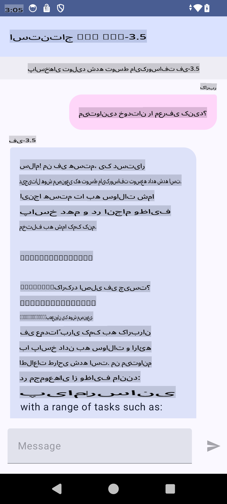

# **استفاده از Microsoft Phi-3.5 tflite برای ساخت اپلیکیشن اندروید**

این یک نمونه برای اندروید است که از مدل‌های Microsoft Phi-3.5 tflite استفاده می‌کند.

## **📚 دانش**

API استنتاج LLM اندروید به شما امکان می‌دهد مدل‌های زبانی بزرگ (LLMs) را به صورت کاملاً روی دستگاه برای اپلیکیشن‌های اندروید اجرا کنید. شما می‌توانید از این قابلیت برای انجام طیف گسترده‌ای از وظایف استفاده کنید، مانند تولید متن، بازیابی اطلاعات به صورت زبان طبیعی، و خلاصه‌سازی اسناد. این قابلیت پشتیبانی داخلی از چندین مدل زبانی بزرگ متن‌به‌متن ارائه می‌دهد، بنابراین می‌توانید جدیدترین مدل‌های تولیدی هوش مصنوعی روی دستگاه را در اپلیکیشن‌های اندرویدی خود اعمال کنید.

Googld AI Edge Torch یک کتابخانه پایتون است که از تبدیل مدل‌های PyTorch به فرمت .tflite پشتیبانی می‌کند. این مدل‌ها سپس می‌توانند با TensorFlow Lite و MediaPipe اجرا شوند. این امکان برنامه‌های اندروید، iOS و IoT را فراهم می‌کند که مدل‌ها را به طور کامل روی دستگاه اجرا کنند. AI Edge Torch پوشش گسترده‌ای از CPU ارائه می‌دهد و پشتیبانی اولیه از GPU و NPU را نیز شامل می‌شود. AI Edge Torch به دنبال یکپارچگی نزدیک با PyTorch است، با استفاده از قابلیت torch.export() و پوشش‌دهی خوب اپراتورهای Core ATen.

## **🪬 راهنما**

### **🔥 تبدیل Microsoft Phi-3.5 به tflite**

0. این نمونه برای اندروید 14+ است.

1. نصب Python 3.10.12

***پیشنهاد:*** استفاده از conda برای نصب محیط پایتون

2. اوبونتو 20.04 / 22.04 (لطفاً بر [google ai-edge-torch](https://github.com/google-ai-edge/ai-edge-torch) تمرکز کنید)

***پیشنهاد:*** استفاده از Azure Linux VM یا سرور ابری شخص ثالث برای ایجاد محیط خود

3. به bash لینوکس خود بروید و کتابخانه پایتون را نصب کنید.

```bash

git clone https://github.com/google-ai-edge/ai-edge-torch.git

cd ai-edge-torch

pip install -r requirements.txt -U 

pip install tensorflow-cpu -U

pip install -e .

```

4. Microsoft-3.5-Instruct را از Hugging face دانلود کنید.

```bash

git lfs install

git clone  https://huggingface.co/microsoft/Phi-3.5-mini-instruct

```

5. Microsoft Phi-3.5 را به tflite تبدیل کنید.

```bash

python ai-edge-torch/ai_edge_torch/generative/examples/phi/convert_phi3_to_tflite.py --checkpoint_path  Your Microsoft Phi-3.5-mini-instruct path --tflite_path Your Microsoft Phi-3.5-mini-instruct tflite path  --prefill_seq_len 1024 --kv_cache_max_len 1280 --quantize True

```

### **🔥 تبدیل Microsoft Phi-3.5 به Android Mediapipe Bundle**

ابتدا mediapipe را نصب کنید.

```bash

pip install mediapipe

```

این کد را در [notebook خود](../../../../../../code/09.UpdateSamples/Aug/Android/convert/convert_phi.ipynb) اجرا کنید.

```python

import mediapipe as mp
from mediapipe.tasks.python.genai import bundler

config = bundler.BundleConfig(
    tflite_model='Your Phi-3.5 tflite model path',
    tokenizer_model='Your Phi-3.5 tokenizer model path',
    start_token='start_token',
    stop_tokens=[STOP_TOKENS],
    output_filename='Your Phi-3.5 task model path',
    enable_bytes_to_unicode_mapping=True or Flase,
)
bundler.create_bundle(config)

```

### **🔥 استفاده از adb برای انتقال مدل به مسیر دستگاه‌های اندروید**

```bash

adb shell rm -r /data/local/tmp/llm/ # Remove any previously loaded models

adb shell mkdir -p /data/local/tmp/llm/

adb push 'Your Phi-3.5 task model path' /data/local/tmp/llm/phi3.task

```

### **🔥 اجرای کد اندروید**



**سلب مسئولیت**:  
این سند با استفاده از خدمات ترجمه ماشینی مبتنی بر هوش مصنوعی ترجمه شده است. در حالی که ما تلاش می‌کنیم دقت را رعایت کنیم، لطفاً توجه داشته باشید که ترجمه‌های خودکار ممکن است شامل خطاها یا نادقتی‌هایی باشند. سند اصلی به زبان بومی آن باید به عنوان منبع معتبر در نظر گرفته شود. برای اطلاعات حیاتی، توصیه می‌شود از ترجمه حرفه‌ای انسانی استفاده کنید. ما هیچ مسئولیتی در قبال سوءتفاهم‌ها یا تفسیرهای نادرست ناشی از استفاده از این ترجمه نداریم.