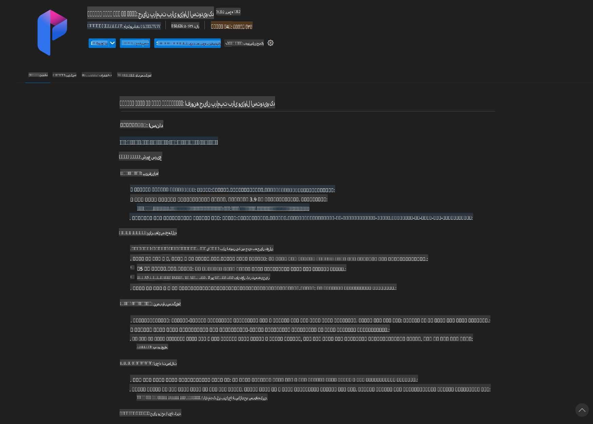
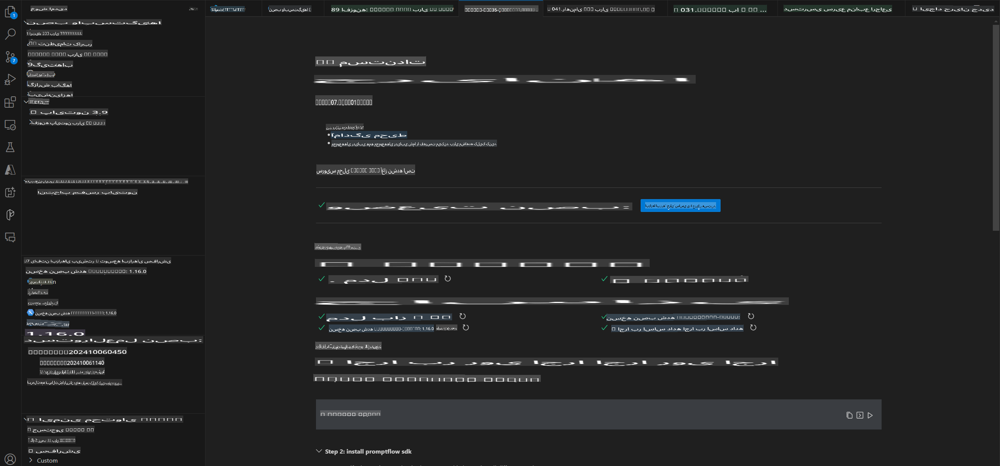
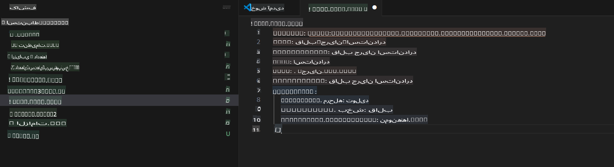
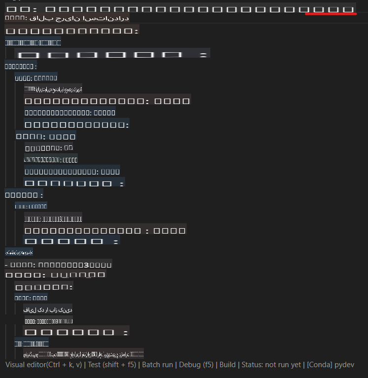
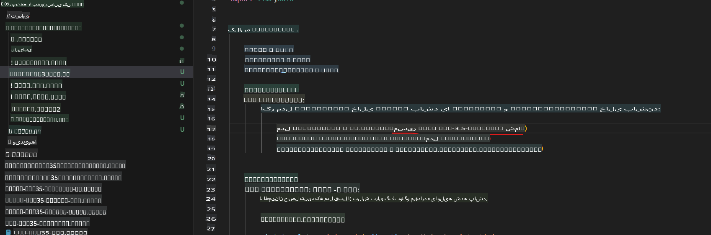
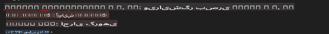
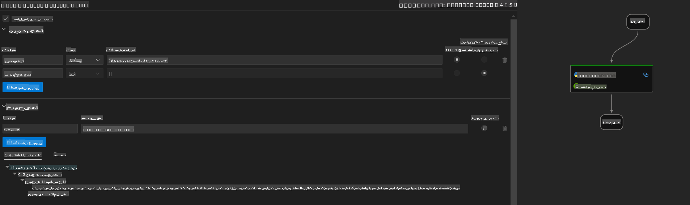
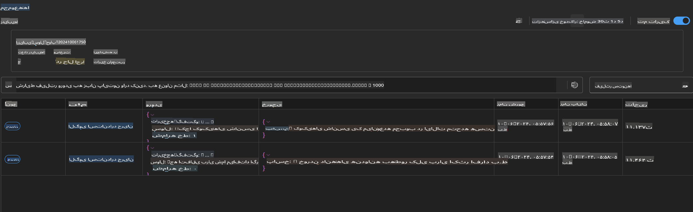

# استفاده از GPU ویندوز برای ایجاد راه‌حل Prompt flow با Phi-3.5-Instruct ONNX

این سند نمونه‌ای است از نحوه استفاده از PromptFlow با ONNX (Open Neural Network Exchange) برای توسعه برنامه‌های هوش مصنوعی مبتنی بر مدل‌های Phi-3.

PromptFlow مجموعه‌ای از ابزارهای توسعه است که به منظور ساده‌سازی چرخه کامل توسعه برنامه‌های هوش مصنوعی مبتنی بر مدل‌های زبانی بزرگ (LLM)، از ایده‌پردازی و نمونه‌سازی اولیه تا آزمایش و ارزیابی طراحی شده است.

با ترکیب PromptFlow و ONNX، توسعه‌دهندگان می‌توانند:

- **بهینه‌سازی عملکرد مدل**: از ONNX برای استنتاج و استقرار کارآمد مدل بهره ببرند.
- **ساده‌سازی توسعه**: از PromptFlow برای مدیریت جریان کاری و خودکارسازی وظایف تکراری استفاده کنند.
- **تقویت همکاری**: محیطی یکپارچه برای همکاری بهتر میان اعضای تیم فراهم کنند.

**Prompt flow** مجموعه‌ای از ابزارهای توسعه است که چرخه کامل توسعه برنامه‌های هوش مصنوعی مبتنی بر LLM را، از ایده‌پردازی، نمونه‌سازی اولیه، آزمایش، ارزیابی تا استقرار و نظارت در محیط تولید، ساده‌تر می‌کند. این ابزار مهندسی پرامپت را بسیار آسان‌تر کرده و به شما امکان می‌دهد برنامه‌های LLM با کیفیت تولید بسازید.

Prompt flow می‌تواند به OpenAI، Azure OpenAI Service و مدل‌های قابل تنظیم (Huggingface، LLM/SLM محلی) متصل شود. ما امیدواریم مدل ONNX کوانتایز شده Phi-3.5 را در برنامه‌های محلی مستقر کنیم. Prompt flow می‌تواند به ما کمک کند تا کسب‌وکار خود را بهتر برنامه‌ریزی کرده و راه‌حل‌های محلی مبتنی بر Phi-3.5 را تکمیل کنیم. در این مثال، ما کتابخانه ONNX Runtime GenAI را با Prompt flow ترکیب خواهیم کرد تا راه‌حل مبتنی بر GPU ویندوز را تکمیل کنیم.

## **نصب**

### **ONNX Runtime GenAI برای GPU ویندوز**

برای مطالعه راهنمای تنظیم ONNX Runtime GenAI برای GPU ویندوز [اینجا کلیک کنید](./ORTWindowGPUGuideline.md)

### **راه‌اندازی Prompt flow در VSCode**

1. نصب افزونه Prompt flow در VS Code



2. پس از نصب افزونه Prompt flow در VS Code، روی افزونه کلیک کرده و گزینه **Installation dependencies** را انتخاب کنید و مطابق این راهنما SDK Prompt flow را در محیط خود نصب کنید.



3. [کد نمونه](../../../../../../code/09.UpdateSamples/Aug/pf/onnx_inference_pf) را دانلود کرده و با VS Code این نمونه را باز کنید.



4. فایل **flow.dag.yaml** را باز کرده و محیط پایتون خود را انتخاب کنید.



   فایل **chat_phi3_ort.py** را باز کرده و مکان مدل Phi-3.5-instruct ONNX خود را تغییر دهید.



5. اجرای Prompt flow برای آزمایش

فایل **flow.dag.yaml** را باز کرده و روی ویرایشگر بصری کلیک کنید.



پس از کلیک روی آن، آن را اجرا کنید تا آزمایش شود.



1. می‌توانید با اجرای دسته‌ای در ترمینال نتایج بیشتری را بررسی کنید.

```bash

pf run create --file batch_run.yaml --stream --name 'Your eval qa name'    

```

می‌توانید نتایج را در مرورگر پیش‌فرض خود بررسی کنید.



**سلب مسئولیت**:  
این سند با استفاده از خدمات ترجمه ماشینی مبتنی بر هوش مصنوعی ترجمه شده است. در حالی که ما برای دقت تلاش می‌کنیم، لطفاً توجه داشته باشید که ترجمه‌های خودکار ممکن است حاوی خطاها یا نادرستی‌هایی باشند. سند اصلی به زبان اصلی آن باید به عنوان منبع معتبر در نظر گرفته شود. برای اطلاعات حساس، ترجمه حرفه‌ای انسانی توصیه می‌شود. ما هیچ‌گونه مسئولیتی در قبال سوءتفاهم‌ها یا تفسیرهای نادرست ناشی از استفاده از این ترجمه نداریم.