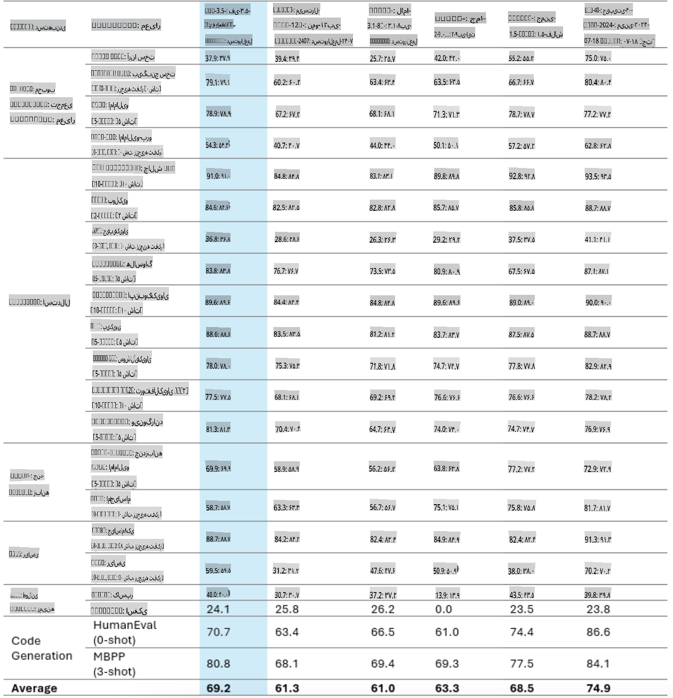
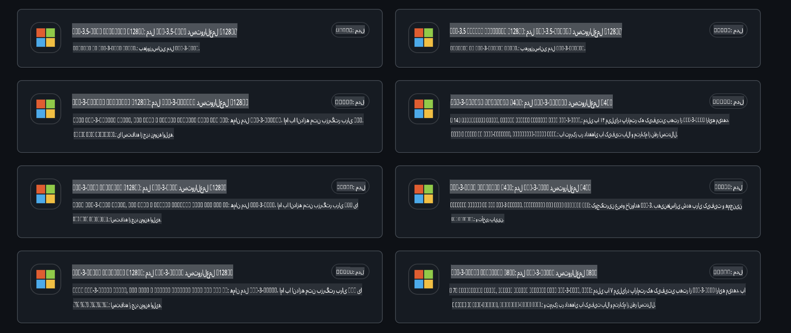
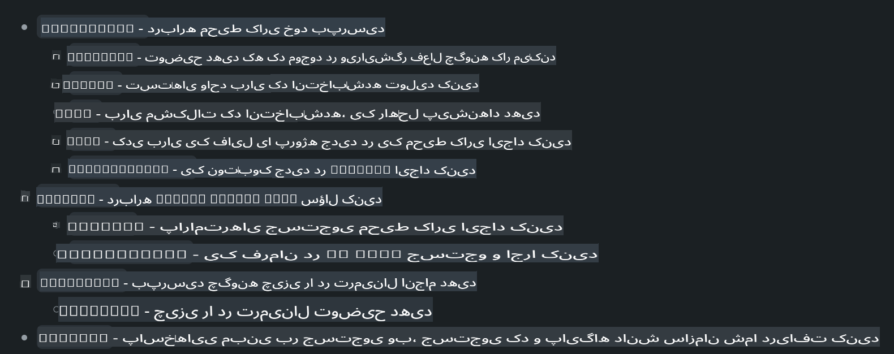
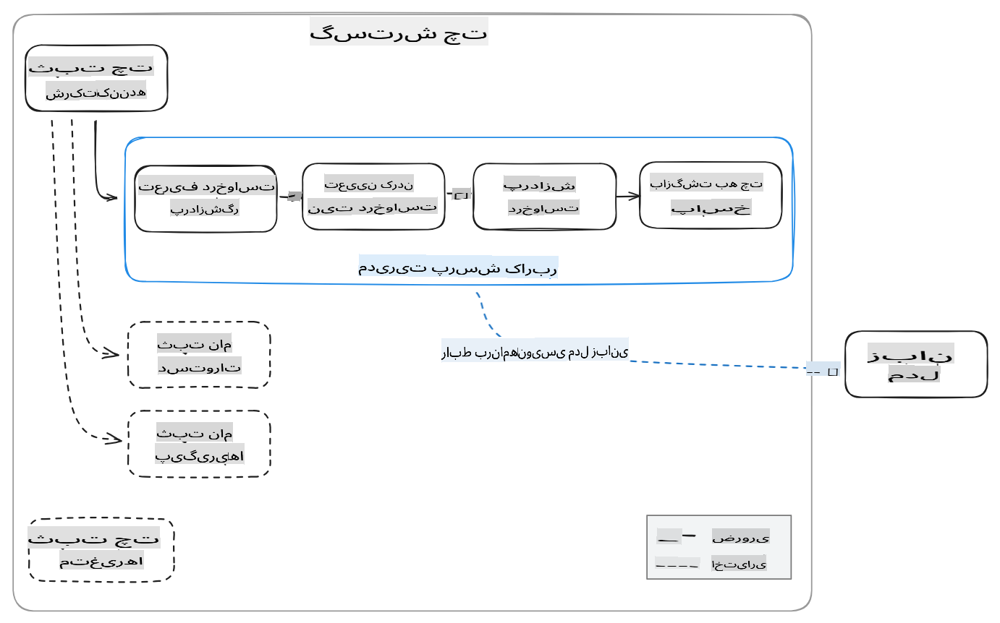
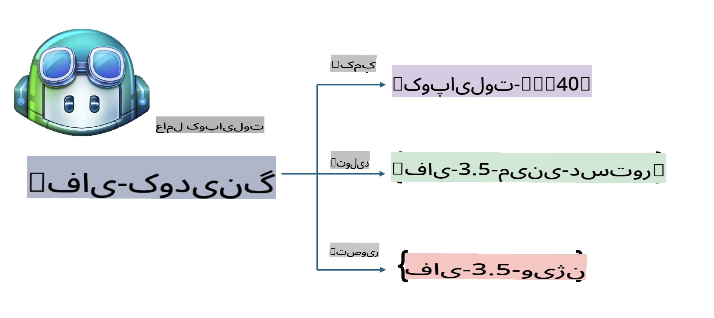
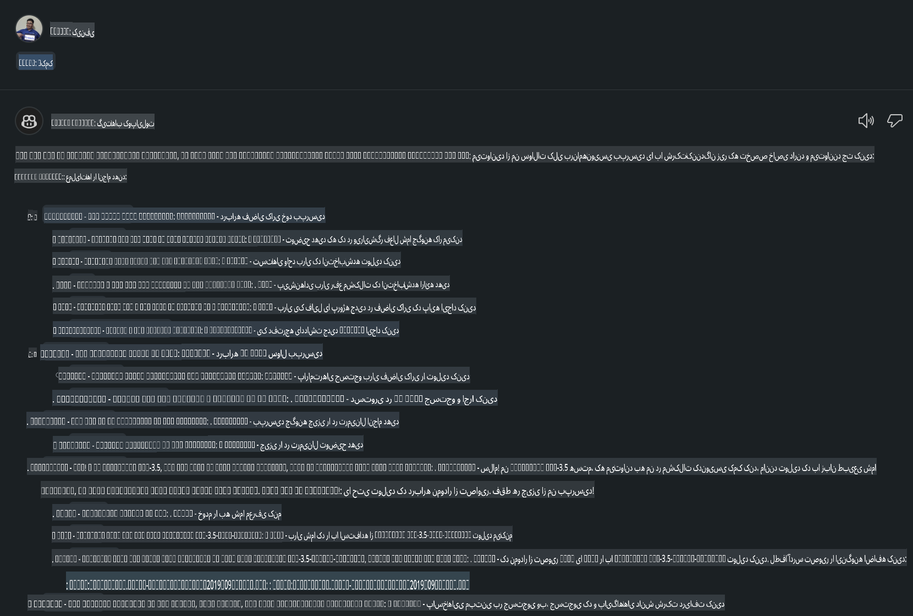
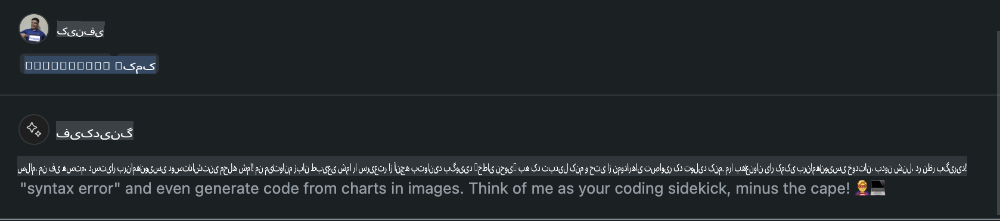
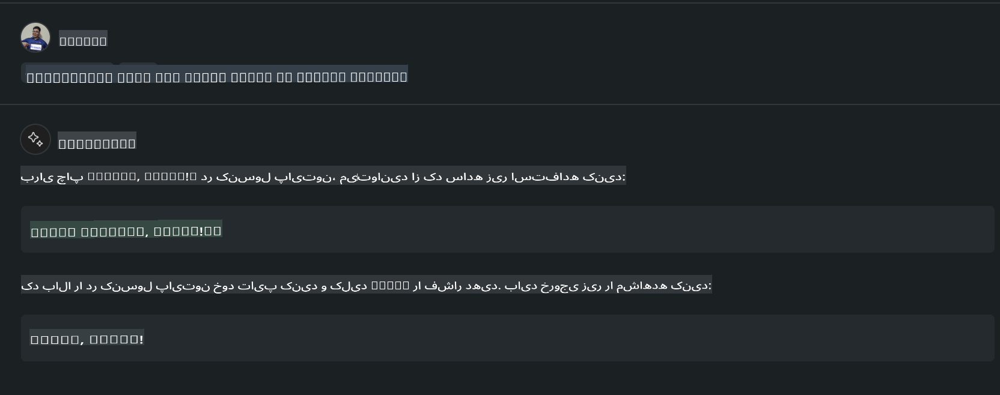
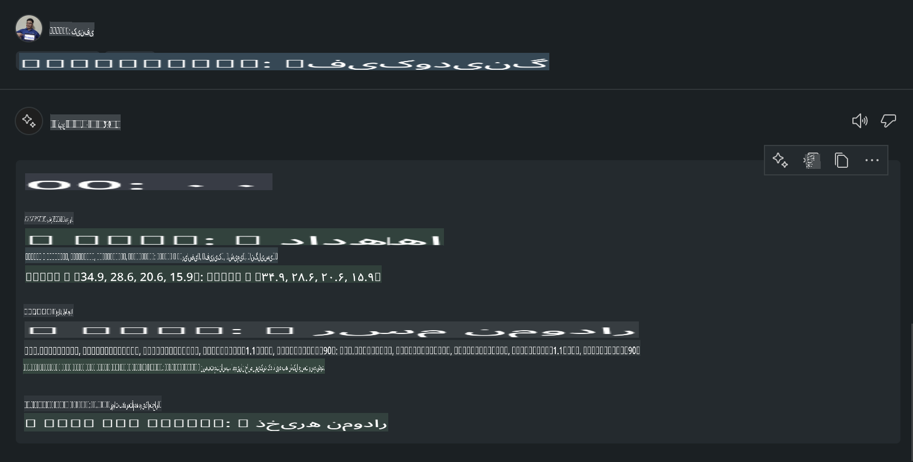

# **ایجاد یک عامل Chat Copilot در Visual Studio Code با استفاده از Phi-3.5 از مدل‌های GitHub**

آیا از Visual Studio Code Copilot استفاده می‌کنید؟ به خصوص در بخش چت، شما می‌توانید از عوامل مختلفی برای بهبود توانایی ایجاد، نوشتن و مدیریت پروژه‌ها در Visual Studio Code استفاده کنید. Visual Studio Code یک API ارائه می‌دهد که به شرکت‌ها و افراد اجازه می‌دهد عوامل مختلفی را بر اساس نیازهای کسب‌وکار خود ایجاد کنند تا قابلیت‌های خود را در زمینه‌های اختصاصی گسترش دهند. در این مقاله، ما بر روی **Phi-3.5-mini-instruct (128k)** و **Phi-3.5-vision-instruct (128k)** از مدل‌های GitHub تمرکز خواهیم کرد تا عامل اختصاصی Visual Studio Code خود را ایجاد کنیم.

## **درباره Phi-3.5 در مدل‌های GitHub**

می‌دانیم که Phi-3/3.5-mini-instruct در خانواده Phi-3/3.5 دارای توانایی‌های قوی در درک و تولید کد است و در مقایسه با Gemma-2-9b و Mistral-Nemo-12B-instruct-2407 مزایایی دارد.



مدل‌های جدید GitHub دسترسی به مدل‌های Phi-3.5-mini-instruct (128k) و Phi-3.5-vision-instruct (128k) را فراهم کرده‌اند. توسعه‌دهندگان می‌توانند از طریق OpenAI SDK، Azure AI Inference SDK و REST API به این مدل‌ها دسترسی پیدا کنند.



***توجه:*** پیشنهاد می‌شود از Azure AI Inference SDK استفاده کنید، زیرا این ابزار می‌تواند در محیط تولید به طور بهتری با Azure Model Catalog جابه‌جا شود.

نتایج زیر مربوط به **Phi-3.5-mini-instruct (128k)** و **Phi-3.5-vision-instruct (128k)** در سناریوی تولید کد پس از اتصال به مدل‌های GitHub است و همچنین برای مثال‌های بعدی آماده شده‌اند.

**دمو: مدل‌های GitHub Phi-3.5-mini-instruct (128k) تولید کد از Prompt** ([برای مشاهده کلیک کنید](../../../../../../code/09.UpdateSamples/Aug/ghmodel_phi35_instruct_demo.ipynb))

**دمو: مدل‌های GitHub Phi-3.5-vision-instruct (128k) تولید کد از تصویر** ([برای مشاهده کلیک کنید](../../../../../../code/09.UpdateSamples/Aug/ghmodel_phi35_vision_demo.ipynb))

## **درباره GitHub Copilot Chat Agent**

GitHub Copilot Chat Agent می‌تواند بر اساس کد، وظایف مختلفی را در سناریوهای پروژه‌های مختلف انجام دهد. این سیستم دارای چهار عامل است: workspace، github، terminal، vscode



با اضافه کردن نام عامل با ‘@’ می‌توانید به سرعت کار مربوطه را انجام دهید. برای سازمان‌ها، اگر محتوای مرتبط با کسب‌وکار خود مانند نیازها، کدنویسی، مشخصات تست و انتشار را اضافه کنید، می‌توانید قابلیت‌های قدرتمندتری برای عملکردهای خصوصی سازمانی بر اساس GitHub Copilot داشته باشید.

عامل Chat در Visual Studio Code اکنون API خود را به طور رسمی منتشر کرده است و به شرکت‌ها یا توسعه‌دهندگان سازمانی امکان می‌دهد عوامل مختلفی را بر اساس اکوسیستم‌های نرم‌افزاری خود توسعه دهند. بر اساس روش توسعه افزونه Visual Studio Code، شما می‌توانید به راحتی به رابط API عامل Chat در Visual Studio Code دسترسی پیدا کنید. ما می‌توانیم بر اساس این فرآیند توسعه دهیم.



سناریوی توسعه می‌تواند دسترسی به API مدل‌های شخص ثالث (مانند مدل‌های GitHub، Azure Model Catalog و خدمات خودساخته بر اساس مدل‌های متن‌باز) را پشتیبانی کند و همچنین می‌تواند از مدل‌های gpt-35-turbo، gpt-4 و gpt-4o ارائه شده توسط GitHub Copilot استفاده کند.

## **افزودن یک عامل @phicoding بر اساس Phi-3.5**

ما تلاش می‌کنیم توانایی‌های برنامه‌نویسی Phi-3.5 را برای انجام وظایف نوشتن کد، تولید کد از تصاویر و سایر وظایف ادغام کنیم. عاملی که حول محور Phi-3.5 ساخته شده است - @PHI، شامل قابلیت‌های زیر است:

1. تولید یک معرفی خودکار بر اساس GPT-4o ارائه شده توسط GitHub Copilot از طریق دستور **@phicoding /help**

2. تولید کد برای زبان‌های برنامه‌نویسی مختلف بر اساس **Phi-3.5-mini-instruct (128k)** از طریق دستور **@phicoding /gen**

3. تولید کد بر اساس **Phi-3.5-vision-instruct (128k)** و تکمیل تصویر از طریق دستور **@phicoding /image**



## **مراحل مرتبط**

1. نصب پشتیبانی توسعه افزونه Visual Studio Code با استفاده از npm

```bash

npm install --global yo generator-code 

```

2. ایجاد یک افزونه Visual Studio Code (با استفاده از حالت توسعه Typescript، با نام phiext)

```bash

yo code 

```

3. باز کردن پروژه ایجاد شده و اصلاح package.json. اینجا شامل دستورالعمل‌ها و تنظیمات مرتبط و همچنین پیکربندی مدل‌های GitHub است. توجه داشته باشید که باید توکن GitHub Models خود را اینجا اضافه کنید.

```json

{
  "name": "phiext",
  "displayName": "phiext",
  "description": "",
  "version": "0.0.1",
  "engines": {
    "vscode": "^1.93.0"
  },
  "categories": [
    "AI",
    "Chat"
  ],
  "activationEvents": [],
  "enabledApiProposals": [
      "chatVariableResolver"
  ],
  "main": "./dist/extension.js",
  "contributes": {
    "chatParticipants": [
        {
            "id": "chat.phicoding",
            "name": "phicoding",
            "description": "Hey! I am Microsoft Phi-3.5, She can help me with coding problems, such as generation code with your natural language, or even generation code about chart from images. Just ask me anything!",
            "isSticky": true,
            "commands": [
                {
                    "name": "help",
                    "description": "Introduce myself to you"
                },
                {
                    "name": "gen",
                    "description": "Generate code for you with Microsoft Phi-3.5-mini-instruct"
                },
                {
                    "name": "image",
                    "description": "Generate code for chart from image(png or jpg) with Microsoft Phi-3.5-vision-instruct, please add image url like this : https://ajaytech.co/wp-content/uploads/2019/09/index.png"
                }
            ]
        }
    ],
    "commands": [
        {
            "command": "phicoding.namesInEditor",
            "title": "Use Microsoft Phi 3.5 in Editor"
        }
    ],
    "configuration": {
      "type": "object",
      "title": "githubmodels",
      "properties": {
        "githubmodels.endpoint": {
          "type": "string",
          "default": "https://models.inference.ai.azure.com",
          "description": "Your GitHub Models Endpoint",
          "order": 0
        },
        "githubmodels.api_key": {
          "type": "string",
          "default": "Your GitHub Models Token",
          "description": "Your GitHub Models Token",
          "order": 1
        },
        "githubmodels.phi35instruct": {
          "type": "string",
          "default": "Phi-3.5-mini-instruct",
          "description": "Your Phi-35-Instruct Model",
          "order": 2
        },
        "githubmodels.phi35vision": {
          "type": "string",
          "default": "Phi-3.5-vision-instruct",
          "description": "Your Phi-35-Vision Model",
          "order": 3
        }
      }
    }
  },
  "scripts": {
    "vscode:prepublish": "npm run package",
    "compile": "webpack",
    "watch": "webpack --watch",
    "package": "webpack --mode production --devtool hidden-source-map",
    "compile-tests": "tsc -p . --outDir out",
    "watch-tests": "tsc -p . -w --outDir out",
    "pretest": "npm run compile-tests && npm run compile && npm run lint",
    "lint": "eslint src",
    "test": "vscode-test"
  },
  "devDependencies": {
    "@types/vscode": "^1.93.0",
    "@types/mocha": "^10.0.7",
    "@types/node": "20.x",
    "@typescript-eslint/eslint-plugin": "^8.3.0",
    "@typescript-eslint/parser": "^8.3.0",
    "eslint": "^9.9.1",
    "typescript": "^5.5.4",
    "ts-loader": "^9.5.1",
    "webpack": "^5.94.0",
    "webpack-cli": "^5.1.4",
    "@vscode/test-cli": "^0.0.10",
    "@vscode/test-electron": "^2.4.1"
  },
  "dependencies": {
    "@types/node-fetch": "^2.6.11",
    "node-fetch": "^3.3.2",
    "@azure-rest/ai-inference": "latest",
    "@azure/core-auth": "latest",
    "@azure/core-sse": "latest"
  }
}


```

4. اصلاح src/extension.ts

```typescript

// The module 'vscode' contains the VS Code extensibility API
// Import the module and reference it with the alias vscode in your code below
import * as vscode from 'vscode';
import ModelClient from "@azure-rest/ai-inference";
import { AzureKeyCredential } from "@azure/core-auth";


interface IPhiChatResult extends vscode.ChatResult {
    metadata: {
        command: string;
    };
}


const MODEL_SELECTOR: vscode.LanguageModelChatSelector = { vendor: 'copilot', family: 'gpt-4o' };

function isValidImageUrl(url: string): boolean {
    const regex = /^(https?:\/\/.*\.(?:png|jpg))$/i;
    return regex.test(url);
}
  

// This method is called when your extension is activated
// Your extension is activated the very first time the command is executed
export function activate(context: vscode.ExtensionContext) {

    const codinghandler: vscode.ChatRequestHandler = async (request: vscode.ChatRequest, context: vscode.ChatContext, stream: vscode.ChatResponseStream, token: vscode.CancellationToken): Promise<IPhiChatResult> => {


        const config : any = vscode.workspace.getConfiguration('githubmodels');
        const endPoint: string = config.get('endpoint');
        const apiKey: string = config.get('api_key');
        const phi35instruct: string = config.get('phi35instruct');
        const phi35vision: string = config.get('phi35vision');
        
        if (request.command === 'help') {

            const content = "Welcome to Coding assistant with Microsoft Phi-3.5"; 
            stream.progress(content);


            try {
                const [model] = await vscode.lm.selectChatModels(MODEL_SELECTOR);
                if (model) {
                    const messages = [
                        vscode.LanguageModelChatMessage.User("Please help me express this content in a humorous way: I am a programming assistant who can help you convert natural language into code and generate code based on the charts in the images. output format like this : Hey I am Phi ......")
                    ];
                    const chatResponse = await model.sendRequest(messages, {}, token);
                    for await (const fragment of chatResponse.text) {
                        stream.markdown(fragment);
                    }
                }
            } catch(err) {
                console.log(err);
            }


            return { metadata: { command: 'help' } };

        }

        
        if (request.command === 'gen') {

            const content = "Welcome to use phi-3.5 to generate code";

            stream.progress(content);

            const client = new ModelClient(endPoint, new AzureKeyCredential(apiKey));

            const response = await client.path("/chat/completions").post({
              body: {
                messages: [
                  { role:"system", content: "You are a coding assistant.Help answer all code generation questions." },
                  { role:"user", content: request.prompt }
                ],
                model: phi35instruct,
                temperature: 0.4,
                max_tokens: 1000,
                top_p: 1.
              }
            });

            stream.markdown(response.body.choices[0].message.content);

            return { metadata: { command: 'gen' } };

        }


        
        if (request.command === 'image') {


            const content = "Welcome to use phi-3.5 to generate code from image(png or jpg),image url like this:https://ajaytech.co/wp-content/uploads/2019/09/index.png";

            stream.progress(content);

            if (!isValidImageUrl(request.prompt)) {
                stream.markdown('Please provide a valid image URL');
                return { metadata: { command: 'image' } };
            }
            else
            {

                const client = new ModelClient(endPoint, new AzureKeyCredential(apiKey));
    
                const response = await client.path("/chat/completions").post({
                    body: {
                      messages: [
                        { role: "system", content: "You are a helpful assistant that describes images in details." },
                        { role: "user", content: [
                            { type: "text", text: "Please generate code according to the chart in the picture according to the following requirements\n1. Keep all information in the chart, including data and text\n2. Do not generate additional information that is not included in the chart\n3. Please extract data from the picture, do not generate it from csv\n4. Please save the regenerated chart as a chart and save it to ./output/demo.png"},
                            { type: "image_url", image_url: {url: request.prompt}
                            }
                          ]
                        }
                      ],
                      model: phi35vision,
                      temperature: 0.4,
                      max_tokens: 2048,
                      top_p: 1.
                    }
                  });
    
                
                stream.markdown(response.body.choices[0].message.content);
    
                return { metadata: { command: 'image' } };
            }


        }


        return { metadata: { command: '' } };
    };


    const phi_ext = vscode.chat.createChatParticipant("chat.phicoding", codinghandler);

    phi_ext.iconPath = new vscode.ThemeIcon('sparkle');


    phi_ext.followupProvider = {
        provideFollowups(result: IPhiChatResult, context: vscode.ChatContext, token: vscode.CancellationToken) {
            return [{
                prompt: 'Let us coding with Phi-3.5 😋😋😋😋',
                label: vscode.l10n.t('Enjoy coding with Phi-3.5'),
                command: 'help'
            } satisfies vscode.ChatFollowup];
        }
    };

    context.subscriptions.push(phi_ext);
}

// This method is called when your extension is deactivated
export function deactivate() {}


```

6. اجرا

***/help***



***@phicoding /help***



***@phicoding /gen***



***@phicoding /image***



شما می‌توانید کد نمونه را دانلود کنید: [برای مشاهده کلیک کنید](../../../../../../code/09.UpdateSamples/Aug/vscode)

## **منابع**

1. ثبت‌نام در GitHub Models [https://gh.io/models](https://gh.io/models)

2. یادگیری توسعه افزونه Visual Studio Code [https://code.visualstudio.com/api/get-started/your-first-extension](https://code.visualstudio.com/api/get-started/your-first-extension)

3. آشنایی با API چت Visual Studio Code Copilot [https://code.visualstudio.com/api/extension-guides/chat](https://code.visualstudio.com/api/extension-guides/chat)

**سلب مسئولیت**:  
این سند با استفاده از خدمات ترجمه ماشینی مبتنی بر هوش مصنوعی ترجمه شده است. در حالی که ما تلاش می‌کنیم دقت را حفظ کنیم، لطفاً توجه داشته باشید که ترجمه‌های خودکار ممکن است حاوی خطاها یا نادرستی‌هایی باشند. سند اصلی به زبان اصلی آن باید به عنوان منبع معتبر در نظر گرفته شود. برای اطلاعات حیاتی، ترجمه حرفه‌ای انسانی توصیه می‌شود. ما هیچ مسئولیتی در قبال سوءتفاهم‌ها یا تفسیرهای نادرست ناشی از استفاده از این ترجمه نمی‌پذیریم.