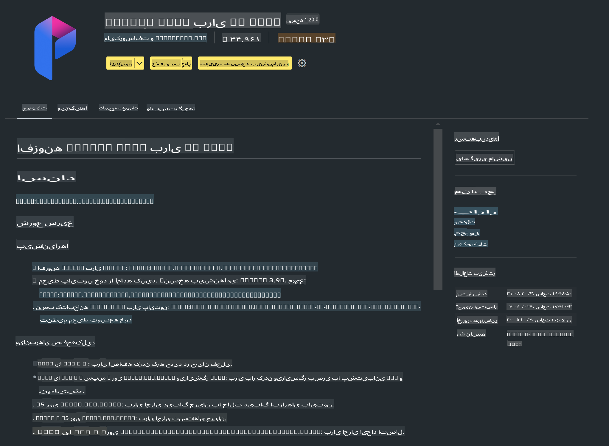

# **آزمایش ۰ - نصب**

وقتی وارد آزمایشگاه می‌شویم، باید محیط مرتبط را پیکربندی کنیم:


### **۱. پایتون ۳.۱۱+**

توصیه می‌شود از Miniforge برای پیکربندی محیط پایتون خود استفاده کنید.

برای پیکربندی Miniforge، به این لینک مراجعه کنید: [https://github.com/conda-forge/miniforge](https://github.com/conda-forge/miniforge)

بعد از پیکربندی Miniforge، دستور زیر را در Power Shell اجرا کنید:

```bash

conda create -n pyenv python==3.11.8 -y

conda activate pyenv

```


### **۲. نصب Prompt flow SDK**

در آزمایش ۱ از Prompt flow استفاده می‌کنیم، بنابراین باید Prompt flow SDK را پیکربندی کنید.

```bash

pip install promptflow --upgrade

```

می‌توانید SDK مربوط به Prompt flow را با این دستور بررسی کنید:

```bash

pf --version

```


### **۳. نصب افزونه Prompt flow برای Visual Studio Code**




### **۴. کتابخانه شتاب‌دهنده NPU اینتل**

پردازنده‌های نسل جدید اینتل از NPU پشتیبانی می‌کنند. اگر می‌خواهید مدل‌های LLM / SLM را به صورت محلی با استفاده از NPU اجرا کنید، می‌توانید از ***کتابخانه شتاب‌دهنده NPU اینتل*** استفاده کنید. برای اطلاعات بیشتر، می‌توانید این لینک را مطالعه کنید: [https://github.com/microsoft/PhiCookBook/blob/main/md/01.Introduction/03/AIPC_Inference.md](https://github.com/microsoft/PhiCookBook/blob/main/md/01.Introduction/03/AIPC_Inference.md).

برای نصب کتابخانه شتاب‌دهنده NPU اینتل در bash از دستور زیر استفاده کنید:

```bash

pip install intel-npu-acceleration-library

```

***توجه***: لطفاً توجه داشته باشید که این کتابخانه از نسخه ***۴.۴۰.۲*** ترنسفورمرها پشتیبانی می‌کند، لطفاً نسخه را تأیید کنید.


### **۵. سایر کتابخانه‌های پایتون**

یک فایل requirements.txt ایجاد کنید و محتوای زیر را به آن اضافه کنید:

```txt

notebook
numpy 
scipy 
scikit-learn 
matplotlib 
pandas 
pillow 
graphviz

```


### **۶. نصب NVM**

NVM را در Power Shell نصب کنید:

```bash

winget install -e --id CoreyButler.NVMforWindows

```

سپس Node.js نسخه ۱۸.۲۰ را نصب کنید:

```bash

nvm install 18.20.0

nvm use 18.20.0

```


### **۷. نصب پشتیبانی توسعه در Visual Studio Code**

```bash

npm install --global yo generator-code

```

تبریک می‌گوییم! شما با موفقیت SDK را پیکربندی کردید. حالا به مراحل عملی بپردازید.

**سلب مسئولیت**:  
این سند با استفاده از خدمات ترجمه ماشینی مبتنی بر هوش مصنوعی ترجمه شده است. در حالی که ما برای دقت تلاش می‌کنیم، لطفاً توجه داشته باشید که ترجمه‌های خودکار ممکن است شامل اشتباهات یا نادقتی‌ها باشند. سند اصلی به زبان اصلی آن باید به عنوان منبع معتبر در نظر گرفته شود. برای اطلاعات حیاتی، ترجمه حرفه‌ای انسانی توصیه می‌شود. ما هیچ مسئولیتی در قبال سوءتفاهم‌ها یا تفسیرهای نادرست ناشی از استفاده از این ترجمه نداریم.