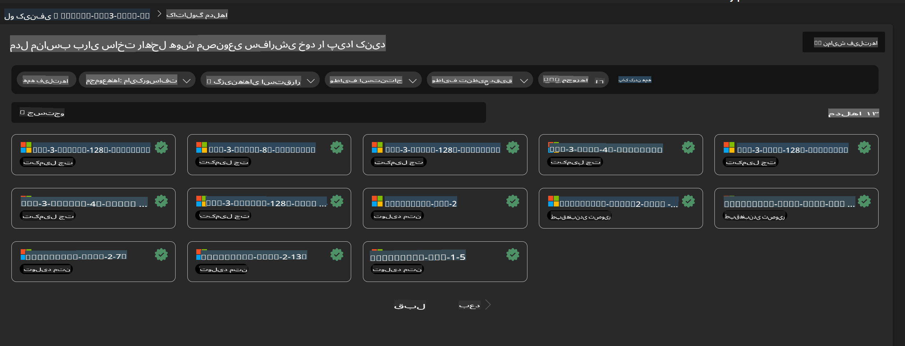
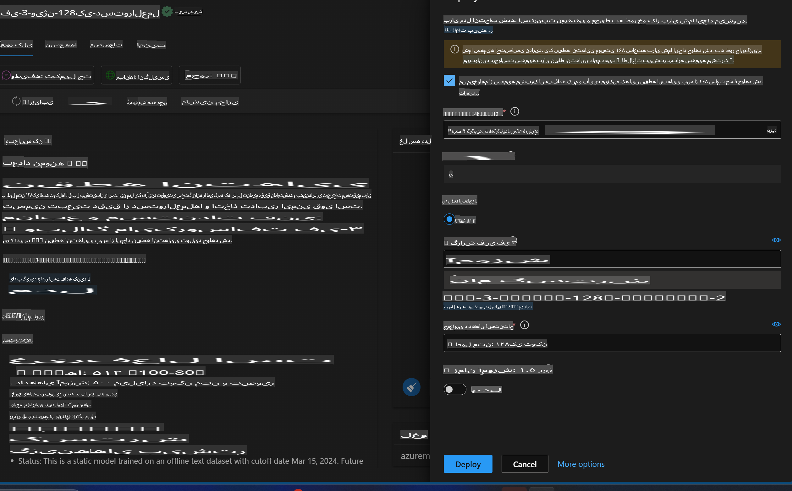
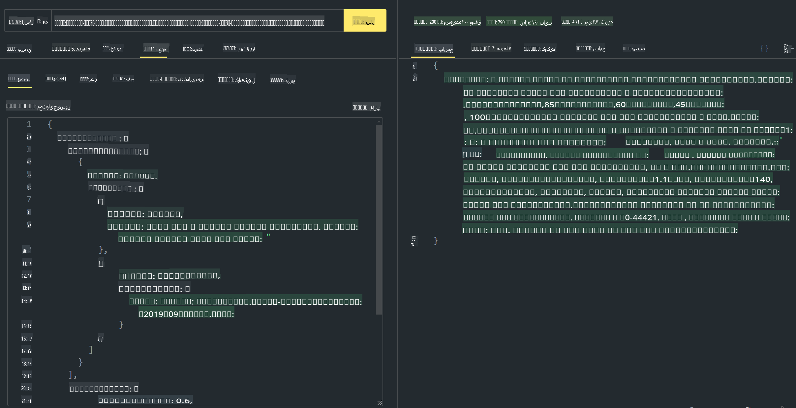

# **آزمایشگاه ۳ - استقرار Phi-3-Vision روی سرویس Azure Machine Learning**

ما از NPU برای تکمیل استقرار تولیدی کد محلی استفاده می‌کنیم و سپس می‌خواهیم قابلیت معرفی PHI-3-VISION را از طریق آن اضافه کنیم تا بتوانیم از تصاویر برای تولید کد استفاده کنیم.

در این معرفی، می‌توانیم به سرعت یک سرویس Model As Service به نام Phi-3 Vision را در سرویس Azure Machine Learning بسازیم.

***توجه***: Phi-3 Vision برای تولید محتوا با سرعت بیشتر به قدرت محاسباتی نیاز دارد. ما به قدرت محاسبات ابری نیاز داریم تا به ما در این امر کمک کند.

### **۱. ایجاد سرویس Azure Machine Learning**

ما باید یک سرویس Azure Machine Learning را در پورتال Azure ایجاد کنیم. اگر می‌خواهید یاد بگیرید چگونه این کار را انجام دهید، لطفاً به این لینک مراجعه کنید: [https://learn.microsoft.com/azure/machine-learning/quickstart-create-resources?view=azureml-api-2](https://learn.microsoft.com/azure/machine-learning/quickstart-create-resources?view=azureml-api-2)

### **۲. انتخاب Phi-3 Vision در سرویس Azure Machine Learning**



### **۳. استقرار Phi-3-Vision در Azure**



### **۴. تست نقطه پایانی در Postman**



***توجه***

۱. پارامترهایی که باید ارسال شوند شامل Authorization، azureml-model-deployment و Content-Type هستند. شما باید اطلاعات استقرار را بررسی کنید تا این مقادیر را بدست آورید.

۲. برای ارسال پارامترها، Phi-3-Vision نیاز به ارسال لینک تصویر دارد. لطفاً به روش GPT-4-Vision برای ارسال پارامترها مراجعه کنید، مانند:

```json

{
  "input_data":{
    "input_string":[
      {
        "role":"user",
        "content":[ 
          {
            "type": "text",
            "text": "You are a Python coding assistant.Please create Python code for image "
          },
          {
              "type": "image_url",
              "image_url": {
                "url": "https://ajaytech.co/wp-content/uploads/2019/09/index.png"
              }
          }
        ]
      }
    ],
    "parameters":{
          "temperature": 0.6,
          "top_p": 0.9,
          "do_sample": false,
          "max_new_tokens": 2048
    }
  }
}

```

۳. از روش Post برای فراخوانی **/score** استفاده کنید.

**تبریک می‌گوییم**! شما استقرار سریع PHI-3-VISION را تکمیل کردید و امتحان کردید که چگونه می‌توان از تصاویر برای تولید کد استفاده کرد. در مرحله بعد، می‌توانیم برنامه‌هایی را با ترکیب NPU و فضای ابری بسازیم.

**سلب مسئولیت**:  
این سند با استفاده از خدمات ترجمه ماشینی مبتنی بر هوش مصنوعی ترجمه شده است. در حالی که ما تلاش می‌کنیم تا دقت را رعایت کنیم، لطفاً توجه داشته باشید که ترجمه‌های خودکار ممکن است حاوی خطاها یا نادرستی‌هایی باشند. سند اصلی به زبان اصلی آن باید به عنوان منبع معتبر در نظر گرفته شود. برای اطلاعات حیاتی، ترجمه حرفه‌ای انسانی توصیه می‌شود. ما هیچ مسئولیتی در قبال سوءتفاهم‌ها یا برداشت‌های نادرست ناشی از استفاده از این ترجمه نداریم.