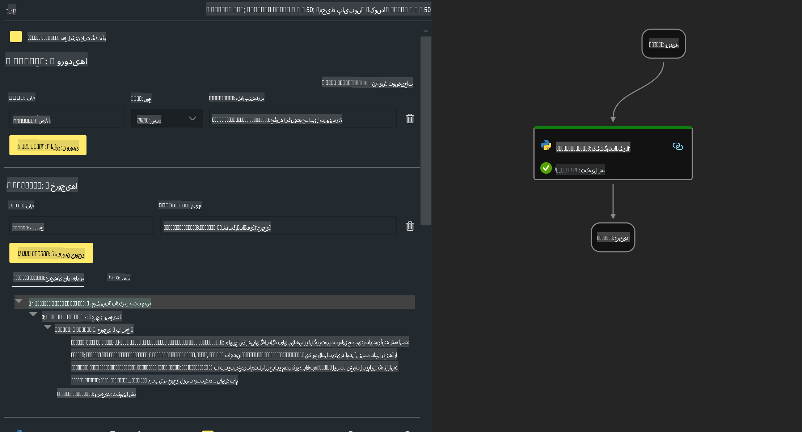

# **آزمایش ۲ - اجرای Prompt flow با Phi-3-mini در AIPC**

## **Prompt flow چیست؟**

Prompt flow مجموعه‌ای از ابزارهای توسعه است که به منظور ساده‌سازی چرخه توسعه کامل برنامه‌های هوش مصنوعی مبتنی بر مدل‌های زبانی بزرگ (LLM) طراحی شده است. این ابزار از ایده‌پردازی، نمونه‌سازی، آزمایش، ارزیابی تا استقرار در محیط تولید و نظارت را پوشش می‌دهد. با استفاده از Prompt flow، مهندسی پرامپت بسیار آسان‌تر شده و می‌توانید برنامه‌های LLM با کیفیت تولید بسازید.

با Prompt flow می‌توانید:

- جریان‌هایی ایجاد کنید که مدل‌های زبانی، پرامپت‌ها، کد پایتون و ابزارهای دیگر را در یک جریان کاری قابل اجرا به هم متصل کند.

- جریان‌های خود را به راحتی اشکال‌زدایی و تکرار کنید، به ویژه تعامل با مدل‌های زبانی.

- جریان‌های خود را ارزیابی کرده و با استفاده از مجموعه داده‌های بزرگ، معیارهای کیفیت و عملکرد را محاسبه کنید.

- آزمایش و ارزیابی را در سیستم CI/CD خود ادغام کنید تا کیفیت جریان‌های شما تضمین شود.

- جریان‌های خود را به پلتفرم ارائه‌ای که انتخاب کرده‌اید استقرار دهید یا به راحتی در کد برنامه خود ادغام کنید.

- (اختیاری ولی بسیار توصیه‌شده) با استفاده از نسخه ابری Prompt flow در Azure AI با تیم خود همکاری کنید.


## **ساخت جریان‌های تولید کد بر روی Apple Silicon**

***توجه***: اگر نصب محیط را تکمیل نکرده‌اید، لطفاً به [آزمایش ۰ - نصب‌ها](./01.Installations.md) مراجعه کنید.

1. افزونه Prompt flow را در Visual Studio Code باز کرده و یک پروژه جریان خالی ایجاد کنید.


2. پارامترهای ورودی و خروجی اضافه کنید و کد پایتون را به عنوان جریان جدید اضافه کنید.



می‌توانید برای ساختاردهی جریان خود به این ساختار (flow.dag.yaml) مراجعه کنید:

```yaml

inputs:
  prompt:
    type: string
    default: Write python code for Fibonacci serie. Please use markdown as output
outputs:
  result:
    type: string
    reference: ${gen_code_by_phi3.output}
nodes:
- name: gen_code_by_phi3
  type: python
  source:
    type: code
    path: gen_code_by_phi3.py
  inputs:
    prompt: ${inputs.prompt}


```

3. کمینه‌سازی phi-3-mini

ما امیدواریم که SLM را بهتر روی دستگاه‌های محلی اجرا کنیم. به طور کلی، مدل را کمینه‌سازی می‌کنیم (INT4، FP16، FP32).

```bash

python -m mlx_lm.convert --hf-path microsoft/Phi-3-mini-4k-instruct

```

**توجه:** پوشه پیش‌فرض mlx_model است.

4. کد را در فایل ***Chat_With_Phi3.py*** اضافه کنید.

```python


from promptflow import tool

from mlx_lm import load, generate


# The inputs section will change based on the arguments of the tool function, after you save the code
# Adding type to arguments and return value will help the system show the types properly
# Please update the function name/signature per need
@tool
def my_python_tool(prompt: str) -> str:

    model_id = './mlx_model_phi3_mini'

    model, tokenizer = load(model_id)

    # <|user|>\nWrite python code for Fibonacci serie. Please use markdown as output<|end|>\n<|assistant|>

    response = generate(model, tokenizer, prompt="<|user|>\n" + prompt  + "<|end|>\n<|assistant|>", max_tokens=2048, verbose=True)

    return response


```

5. می‌توانید از Debug یا Run برای آزمایش جریان و بررسی صحت تولید کد استفاده کنید.


6. جریان را به عنوان یک API توسعه‌ای در ترمینال اجرا کنید.

```

pf flow serve --source ./ --port 8080 --host localhost   

```

می‌توانید آن را در Postman / Thunder Client آزمایش کنید.


### **توجه**

1. اجرای اولیه زمان زیادی می‌برد. توصیه می‌شود مدل phi-3 را از طریق Hugging Face CLI دانلود کنید.

2. با توجه به توان محاسباتی محدود Intel NPU، توصیه می‌شود از Phi-3-mini-4k-instruct استفاده کنید.

3. ما از شتاب‌دهنده Intel NPU برای تبدیل کمینه‌سازی INT4 استفاده می‌کنیم، اما اگر سرویس را مجدداً اجرا کنید، باید پوشه‌های cache و nc_workshop را حذف کنید.


## **منابع**

1. یادگیری Prompt flow [https://microsoft.github.io/promptflow/](https://microsoft.github.io/promptflow/)

2. یادگیری شتاب‌دهنده Intel NPU [https://github.com/intel/intel-npu-acceleration-library](https://github.com/intel/intel-npu-acceleration-library)

3. کد نمونه، دانلود [کد نمونه عامل محلی NPU](../../../../../../../../../code/07.Lab/01/AIPC/local-npu-agent)

**سلب مسئولیت**:  
این سند با استفاده از خدمات ترجمه ماشینی مبتنی بر هوش مصنوعی ترجمه شده است. در حالی که ما تلاش می‌کنیم دقت را رعایت کنیم، لطفاً توجه داشته باشید که ترجمه‌های خودکار ممکن است شامل اشتباهات یا نادرستی‌هایی باشند. سند اصلی به زبان اصلی آن باید به‌عنوان منبع معتبر در نظر گرفته شود. برای اطلاعات حیاتی، ترجمه حرفه‌ای انسانی توصیه می‌شود. ما هیچ مسئولیتی در قبال سوءتفاهم‌ها یا تفسیرهای نادرست ناشی از استفاده از این ترجمه نداریم.